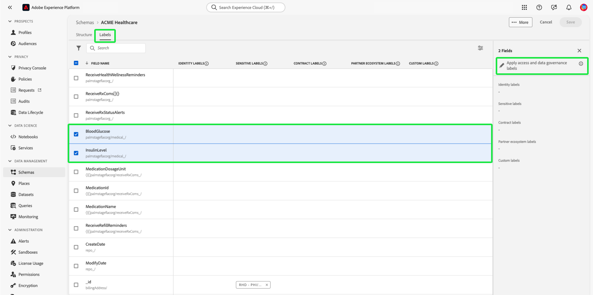

# Guide de bout en bout du contrôle d’accès basé sur les attributs

Utilisez le contrôle d’accès basé sur les attributs sur Adobe Experience Platform pour offrir à vous-même et à d’autres clients soucieux de la confidentialité multimarque une plus grande flexibilité pour gérer l’accès des utilisateurs. L’accès à des objets individuels, tels que les champs de schéma et les segments, peut être accordé avec des stratégies basées sur les attributs et le rôle de l’objet. Cette fonctionnalité vous permet d’accorder ou de révoquer l’accès à des objets individuels pour des utilisateurs Platform spécifiques au sein de votre organisation.

Cette fonctionnalité vous permet de classer les champs de schéma, les segments, etc. avec des libellés qui définissent les portées d’utilisation des données ou de l’organisation. Vous pouvez appliquer ces mêmes étiquettes aux parcours, aux offres et aux autres objets de Adobe Journey Optimizer. En parallèle, les administrateurs peuvent définir des stratégies d’accès concernant les champs de schéma du modèle de données d’expérience (XDM) et mieux gérer les utilisateurs ou les groupes (utilisateurs internes, externes ou tiers) pouvant accéder à ces champs.

>[!NOTE]
>
>Ce document se concentre sur le cas d’utilisation des stratégies de contrôle d’accès. Si vous essayez de configurer des stratégies pour régir l’ **utilisation** des données plutôt que de déterminer les utilisateurs de Platform qui y ont accès, reportez-vous au guide de bout en bout sur la [gouvernance des données](../../data-governance/e2e.md) à la place.

## Prise en main

Ce tutoriel nécessite une connaissance pratique des composants Platform suivants :

* [[!DNL Experience Data Model (XDM)] Système](../../xdm/home.md) : Cadre normalisé selon lequel Experience Platform organise les données d’expérience client. 
   * [Principes de base de la composition des schémas](../../xdm/schema/composition.md) : découvrez les blocs de création de base des schémas XDM, y compris les principes clés et les bonnes pratiques en matière de composition de schémas.
   * [Tutoriel sur l’éditeur de schémas](../../xdm/tutorials/create-schema-ui.md) : découvrez comment créer des schémas personnalisés à l’aide de l’interface utilisateur de l’éditeur de schémas.
* [Service de segmentation Adobe Experience Platform](../../segmentation/home.md) : moteur de segmentation de [!DNL Platform] utilisé pour créer des segments d’audience à partir de vos profils clients en fonction du comportement et des attributs des clients.

### Présentation du cas d’utilisation

Vous accédez à un exemple de workflow de contrôle d’accès basé sur les attributs dans lequel vous allez créer et affecter des rôles, des libellés et des stratégies afin de configurer si vos utilisateurs peuvent ou non accéder à des ressources spécifiques de votre organisation. Ce guide utilise un exemple de limitation de l’accès aux données sensibles pour démontrer le workflow. Ce cas pratique est décrit ci-dessous :

Vous êtes un prestataire de santé et souhaitez configurer l’accès aux ressources de votre entreprise.

* Votre équipe marketing interne doit pouvoir accéder aux données **[!UICONTROL PHI/ données d’intégrité réglementées]**.
* Votre agence externe ne doit pas pouvoir accéder aux données **[!UICONTROL PHI/ données d’intégrité réglementées]**.

Pour ce faire, vous devez configurer les rôles, les ressources et les stratégies.

Vous allez :

* [Étiqueter les rôles de vos utilisateurs](#label-roles) : utilisez l’exemple d’un prestataire de services de santé (ACME Business Group) dont le groupe marketing travaille avec des agences externes.
* [Étiqueter vos ressources (champs de schéma et segments)](#label-resources) : Attribuez l’étiquette **[!UICONTROL PHI/données d’intégrité réglementées]** aux ressources de schéma et aux segments.
* [Activez la stratégie qui les reliera ](#policy) : activez la stratégie par défaut pour empêcher l’accès aux champs de schéma et aux segments en connectant les libellés de vos ressources aux libellés de votre rôle. Les utilisateurs disposant de libellés correspondants auront alors accès au champ de schéma et au segment dans tous les environnements de test.

## Autorisations

[!UICONTROL Autorisations] est la zone de l’Experience Cloud dans laquelle les administrateurs peuvent définir des rôles utilisateur et des stratégies afin de gérer les autorisations pour les fonctionnalités et les objets dans une application de produit.

Grâce aux [!UICONTROL autorisations], vous pouvez créer et gérer des rôles et attribuer les autorisations de ressources souhaitées pour ces rôles. [!UICONTROL Autorisations] vous permet également de gérer les étiquettes, les environnements de test et les utilisateurs associés à un rôle spécifique.

Contactez votre administrateur système pour obtenir un accès si vous ne disposez pas de droits d’administrateur.

Une fois que vous disposez des droits d’administrateur, accédez à [Adobe Experience Cloud](https://experience.adobe.com/) et connectez-vous à l’aide de vos informations d’identification d’Adobe. Une fois connecté, la page **[!UICONTROL Overview]** s’affiche pour votre organisation pour laquelle vous disposez des droits d’administrateur. Cette page présente les produits auxquels votre organisation est abonnée, ainsi que d’autres contrôles permettant d’ajouter des utilisateurs et des administrateurs à l’organisation. Sélectionnez **[!UICONTROL Autorisations]** pour ouvrir l’espace de travail de votre intégration Platform.

L’espace de travail Autorisations de l’interface utilisateur de Platform s’affiche, s’ouvrant sur la page **[!UICONTROL Rôles]** .

## Appliquer des libellés à un rôle {#label-roles}

>[!CONTEXTUALHELP]
>id="platform_permissions_labels_about"
>title="Que sont les libellés ?"
>abstract="Les libellés vous permettent de classer les jeux de données et les champs en fonction des politiques d’utilisation qui s’appliquent à ces données. Platform fournit plusieurs libellés d&#39;utilisation des données « de base » définis par Adobe, qui couvrent un large éventail de restrictions courantes applicables à la gouvernance des données. Par exemple, les libellés « S » (Sensibles) tels que DSR (données réglementées en matière de santé) servent à catégoriser les données qui font référence aux informations de santé protégées (ISP). Vous pouvez également définir vos propres libellés personnalisés en fonction des besoins de votre entreprise."
>additional-url="https://experienceleague.adobe.com/docs/experience-platform/data-governance/labels/overview.html?lang=fr#understanding-data-usage-labels" text="Présentation des libellés d’utilisation des données"

>[!CONTEXTUALHELP]
>id="platform_permissions_labels_about_create"
>title="Créer un libellé"
>abstract="Vous pouvez créer vos propres libellés personnalisés selon les besoins de votre entreprise. Les libellés personnalisés peuvent être utilisés pour appliquer à vos données à la fois des configurations de gouvernance des données et de contrôle d&#39;accès."
>additional-url="https://experienceleague.adobe.com/docs/experience-platform/data-governance/labels/overview.html?lang=fr#manage-labels" text="Gérer les libellés personnalisés"

>[!CONTEXTUALHELP]
>id="platform_permissions_roles_about"
>title="Que sont les rôles ?"
>abstract="Les rôles sont des moyens de classer les types d’utilisateurs qui interagissent avec votre instance Platform et constituent des blocs élémentaires des politiques de contrôle d’accès. Un rôle possède un jeu d’autorisations déterminé et les membres de votre organisation peuvent être affectés à un ou plusieurs rôles, selon la portée de l’accès en lecture ou en écriture dont ils ont besoin."
>additional-url="https://experienceleague.adobe.com/docs/experience-platform/access-control/abac/permissions-ui/roles.html?lang=fr" text="Gérer les rôles"

>[!CONTEXTUALHELP]
>id="platform_permissions_roles_about_create"
>title="Créer un rôle"
>abstract="Vous pouvez créer un rôle pour mieux classer les utilisateurs qui ont accès à votre instance Platform. Par exemple, vous pouvez créer un rôle pour une équipe marketing interne et lui appliquer le libellé RHD. Cela permettra à l&#39;équipe d&#39;accéder aux informations de santé protégées (ISP). Vous pouvez également créer un rôle pour une agence externe et refuser l&#39;accès à ce rôle aux données ISP en vous abstenant d&#39;appliquer le libellé RHD à ce rôle."
>additional-url="https://experienceleague.adobe.com/docs/experience-platform/access-control/abac/permissions-ui/roles.html?lang=fr#create-a-new-role" text="Créer un rôle"

>[!CONTEXTUALHELP]
>id="platform_permissions_roles_details"
>title="Présentation des rôles"
>abstract="La boîte de dialogue de présentation des rôles affiche les ressources et les sandbox auxquelles un rôle donné peut accéder."

Les rôles sont des moyens de catégoriser les types d’utilisateurs qui interagissent avec votre instance Platform et sont des blocs élémentaires des stratégies de contrôle d’accès. Un rôle possède un ensemble donné d’autorisations et les membres de votre organisation peuvent être affectés à un ou plusieurs rôles, selon la portée de l’accès dont ils ont besoin.

Pour commencer, sélectionnez **[!UICONTROL ACME Business Group]** sur la page **[!UICONTROL Rôles]** .

Ensuite, sélectionnez **[!UICONTROL Étiquettes]**, puis **[!UICONTROL Ajouter des étiquettes]**.

Une liste de tous les libellés de votre organisation s’affiche. Sélectionnez **[!UICONTROL RHD]** pour ajouter le libellé de **[!UICONTROL PHI/Definated Health Data]**. Laissez passer quelques instants pour qu’une coche bleue apparaisse en regard du libellé, puis sélectionnez **[!UICONTROL Enregistrer]**.

>[!NOTE]
>
>Lors de l’ajout d’un groupe d’organisation à un rôle, tous les utilisateurs de ce groupe sont ajoutés au rôle . Toute modification apportée au groupe d’organisations (utilisateurs supprimés ou ajoutés) sera automatiquement mise à jour dans le rôle .

## Application de libellés aux champs de schéma {#label-resources}

Maintenant que vous avez configuré un rôle utilisateur avec l’étiquette [!UICONTROL RHD], l’étape suivante consiste à ajouter le même libellé aux ressources que vous souhaitez contrôler pour ce rôle.

Sélectionnez **[!UICONTROL Schémas]** dans le volet de navigation de gauche, puis **[!UICONTROL ACME Healthcare]** dans la liste des schémas qui s’affichent.

Sélectionnez ensuite **[!UICONTROL Étiquettes]** pour afficher une liste qui affiche les champs associés à votre schéma. À partir de là, vous pouvez attribuer des étiquettes à un ou plusieurs champs à la fois. Sélectionnez les champs **[!UICONTROL BloodGluglucose]** et **[!UICONTROL InsulinLevel]**, puis sélectionnez **[!UICONTROL Appliquer les étiquettes d’accès et de gouvernance des données]**.

La boîte de dialogue **[!UICONTROL Modifier les libellés]** s’affiche, vous permettant de choisir les libellés que vous souhaitez appliquer aux champs du schéma. Pour ce cas d’utilisation, sélectionnez l’étiquette **[!UICONTROL PHI/Definated Health Data]** , puis sélectionnez **[!UICONTROL Save]**.

>[!NOTE]
>
>Lorsqu’un libellé est ajouté à un champ, il est appliqué à la ressource parent de ce champ (une classe ou un groupe de champs). Si la classe ou le groupe de champs parent est utilisé par d’autres schémas, ces derniers hériteront du même libellé.

## Application d’étiquettes aux segments

>[!NOTE]
>
>Tout segment qui utilise un attribut étiqueté doit également être étiqueté si vous souhaitez que les mêmes restrictions d’accès s’y appliquent.

Une fois les champs de schéma libellés, vous pouvez commencer à les libeller.

Sélectionnez **[!UICONTROL Segments]** dans le volet de navigation de gauche. Une liste des segments disponibles dans votre organisation s’affiche. Dans cet exemple, les deux segments suivants doivent être étiquetés, car ils contiennent des données d’intégrité sensibles :

* Glucide sanguin > 100
* Insuline &lt;50

Sélectionnez **[!UICONTROL Glucide sanguin >100]** pour commencer à étiqueter le segment.

L’écran **[!UICONTROL Détails]** du segment s’affiche. Sélectionnez **[!UICONTROL Gérer l’accès]**.

La boîte de dialogue **[!UICONTROL Modifier les étiquettes]** s’affiche, vous permettant de choisir les étiquettes à appliquer au segment. Pour ce cas d’utilisation, sélectionnez l’étiquette **[!UICONTROL PHI/Definated Health Data]** , puis sélectionnez **[!UICONTROL Save]**.

Répétez les étapes ci-dessus avec **[!UICONTROL Insuline &lt;50]**.

>[!NOTE]
>
> Affectez des étiquettes créées dans l’espace de travail [!UICONTROL Autorisations] (comme les étiquettes de segment ci-dessus) à divers objets dans Adobe Journey Optimizer à l’aide du [ contrôle d’accès au niveau de l’objet](https://experienceleague.adobe.com/en/docs/journey-optimizer/using/access-control/object-based-access).&quot;

## Activer la politique de contrôle d’accès {#policy}

La stratégie de contrôle d’accès par défaut utilise des libellés pour définir les rôles utilisateur ayant accès à des ressources Platform spécifiques. Dans cet exemple, l’accès aux champs de schéma et aux segments sera refusé dans tous les environnements de test pour les utilisateurs qui ne sont pas dans un rôle dont les libellés correspondants sont dans le champ de schéma.

Pour activer la stratégie de contrôle d’accès, sélectionnez [!UICONTROL Autorisations] dans le volet de navigation de gauche, puis sélectionnez **[!UICONTROL Stratégies]**.

Sélectionnez ensuite les points de suspension (`...`) en regard du nom des stratégies et une liste déroulante affiche les commandes permettant de modifier, activer, supprimer ou dupliquer le rôle. Sélectionnez **[!UICONTROL Activer]** dans la liste déroulante.

La boîte de dialogue Activer la stratégie s’affiche et vous invite à confirmer l’activation. Sélectionnez **[!UICONTROL Confirmer]**.

La confirmation de l’activation de la stratégie est reçue et vous êtes renvoyé à la page [!UICONTROL Stratégies] .

<!-- ## Create an access control policy {#policy}

>[!CONTEXTUALHELP]
>id="platform_permissions_policies_about"
>title="What are policies?"
>abstract="Policies are statements that bring attributes together to establish permissible and impermissible actions. Every organization comes with a default policy that you must activate to define rules for resources like segments and schema fields. Default policies can neither be edited nor deleted. However, default policies can be activated or deactivated."
>additional-url="https://experienceleague.adobe.com/docs/experience-platform/access-control/abac/permissions-ui/policies.html" text="Manage policies"

>[!CONTEXTUALHELP]
>id="platform_permissions_policies_about_create"
>title="Create a policy"
>abstract="Create a policy to define the actions that your users can and cannot take against your segments and schema fields."
>additional-url="https://experienceleague.adobe.com/docs/experience-platform/access-control/abac/permissions-ui/policies.html#create-a-new-policy" text="Create a policy"

>[!CONTEXTUALHELP]
>id="platform_permissions_policies_edit_permitdeny"
>title="Configure permissible and impermissible actions for a policy"
>abstract="A <b>deny access to</b> policy will deny users access when the criteria is met. Combined with <b>The following being false</b> - all users will be denied access unless they meet the matching criteria set. This type of policy allows you to protect a sensitive resource and only allow access to users with matching labels.  A <b>permit access to</b> policy will permit users access when the criteria are met. When combined with <b>The following being true</b> - users will be given access if they meet the matching criteria set. This does not explicitly deny access to users, but adds a permit access. This type of policy allows you to give additional access to resource and in addition to those users who might already have access through role permissions."
>additional-url="https://experienceleague.adobe.com/docs/experience-platform/access-control/abac/permissions-ui/policies.html#edit-a-policy" text="Edit a policy"

>[!CONTEXTUALHELP]
>id="platform_permissions_policies_edit_resource"
>title="Configure permissions for a resource"
>abstract="A resource is the asset or object that a user can or cannot access. Resources can be segments or schemas fields. You can configure write, read, or delete permissions for segments and schema fields."

>[!CONTEXTUALHELP]
>id="platform_permissions_policies_edit_condition"
>title="Edit conditions"
>abstract="Apply conditional statements to your policy to configure user access to certain resources. Select match all to require users to have roles with the same labels as a resource to be permitted access. Select match any to require users to have a role with just one label matching a label on a resource. Labels can either be defined as core or custom labels, with core labels representing labels created and provided by Adobe and custom labels representing labels that you created for your organization."

Access control policies leverage labels to define which user roles have access to specific Platform resources. Policies can either be local or global and can override other policies. In this example, access to schema fields and segments will be denied in all sandboxes for users who don't have the corresponding labels in the schema field.

>[!NOTE]
>
>A "deny policy" is created to grant access to sensitive resources because the role grants permission to the subjects. The written policy in this example **denies** you access if you are missing the required labels.

To create an access control policy, select **[!UICONTROL Permissions]** from the left navigation and then select **[!UICONTROL Policies]**. Next, select **[!UICONTROL Create policy]**.

The **[!UICONTROL Create new policy]** dialog appears, prompting you to enter a name and an optional description. Select **[!UICONTROL Confirm]** when finished.

To deny access to the schema fields, use the dropdown arrow and select **[!UICONTROL Deny access to]** and then select **[!UICONTROL No resource selected]**. Next, select **[!UICONTROL Schema Field]** and then select **[!UICONTROL All]**.

The table below shows the conditions available when creating a policy:

| Conditions | Description |
| --- | --- |
| The following being false| When 'Deny access to' is set, access will be restricted if the user does not meet the criteria selected. |
| The following being true| When 'Permit access to' is set, access will be permitted if the user meets the selected criteria. |
| Matches any| The user has a label that matches any label applied to a resource. |
| Matches all| The user has all labels that matches all labels applied to a resource. |
| Core label| A core label is an Adobe-defined label that is available in all Platform instances.|
| Custom label| A custom label is a label that has been created by your organization.|

Select **[!UICONTROL The following being false]** and then select **[!UICONTROL No attribute selected]**. Next, select the user **[!UICONTROL Core label]**, then select **[!UICONTROL Matches all]**. Select the resource **[!UICONTROL Core label]** and finally select **[!UICONTROL Add resource]**.

>[!TIP]
>
>A resource is the asset or object that a subject can or cannot access. Resources can be segments or schemas.

To deny access to the segments, use the dropdown arrow and select **[!UICONTROL Deny access to]** and then select **[!UICONTROL No resource selected]**. Next, select **[!UICONTROL Segment]** and then select **[!UICONTROL All]**.

Select **[!UICONTROL The following being false]** and then select **[!UICONTROL No attribute selected]**. Next, select the user **[!UICONTROL Core label]**, then select **[!UICONTROL Matches all]**. Select the resource **[!UICONTROL Core label]** and finally select **[!UICONTROL Save]**.

Select **[!UICONTROL Activate]** to activate the policy, and a dialog appears which prompts you to confirm activation. Select **[!UICONTROL Confirm]** and then select **[!UICONTROL Close]**.

 -->

## Étapes suivantes

Vous avez terminé l’application des libellés à un rôle, à des champs de schéma et à des segments. L’agence externe affectée à ces rôles ne peut pas afficher ces libellés et leurs valeurs dans le schéma, le jeu de données et la vue de profil. Ces champs ne peuvent pas non plus être utilisés dans la définition de segment lors de l’utilisation du créateur de segments.

Pour plus d’informations sur le contrôle d’accès basé sur les attributs, consultez la [présentation du contrôle d’accès basé sur les attributs](./overview.md).

La vidéo suivante est destinée à vous aider à comprendre le contrôle d’accès basé sur les attributs et explique comment configurer les rôles, les ressources et les stratégies.

>[!VIDEO](https://video.tv.adobe.com/v/345641?learn=on)
