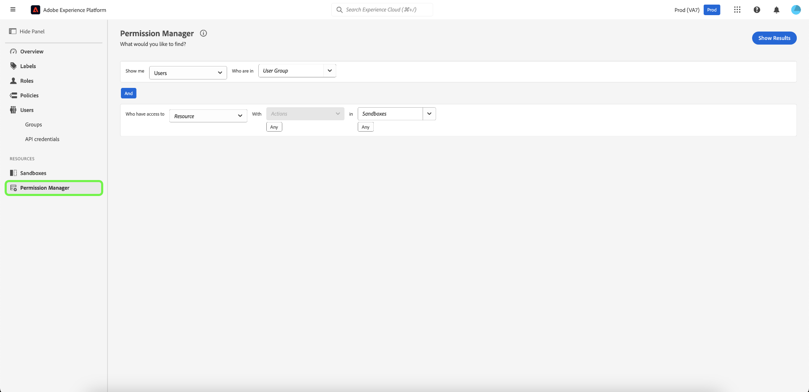

# Présentation du gestionnaire d’autorisations {#attribute-based-access-control-overview}

>[!NOTE]
>
>Pour accéder à [!UICONTROL Permission Manager], vous devez être un administrateur de produit. Si vous ne disposez pas de droits d’administrateur, contactez votre administrateur système pour obtenir l’accès.

La fonctionnalité [!UICONTROL Permission Manager] fournit des rapports et vous permet d’afficher l’environnement de contrôle d’accès complet. Grâce aux requêtes simples, vous pouvez générer des rapports clairs qui vous aideront à comprendre la gestion des accès et à passer moins de temps à vérifier les autorisations d’accès sur de nombreux workflows et niveaux de granularité.

Avec [!UICONTROL Permission Manager], vous pouvez effectuer une recherche en fonction des éléments suivants :

* [Utilisateurs et groupe d’utilisateurs](./permissions.md)
* [Rôles et libellés](./permissions.md)

Vous pouvez affiner votre recherche en sélectionnant des ressources, des actions et des sandbox spécifiques.

Pour accéder à [!UICONTROL Permission Manager] for [!DNL Experience Platform], vous devez être administrateur d’une organisation ayant accès à Experience Platform. Bien qu’Adobe permette des hiérarchies d’administrateurs personnalisables au sein de votre organisation, vous devez être un administrateur de produit pour l’[!DNL Adobe Experience Platform]. Pour plus d’informations, reportez-vous à l’article du Centre d’aide Adobe sur les [ rôles d’administration ](https://helpx.adobe.com/fr/enterprise/using/admin-roles.html).

Connectez-vous à  à l&#39;aide de vos informations d&#39;identification [!DNL Adobe].  Une fois connecté, la page **[!UICONTROL Overview]** de votre organisation s’affiche. Cette page affiche les produits auxquels votre organisation est abonnée. Pour lancer l’espace de travail du contrôle d’accès basé sur les attributs pour l’intégration de Platform, sélectionnez **[!UICONTROL Permissions]**.

Présentation de 

L’espace de travail du contrôle d’accès basé sur les attributs pour Experience Platform s’affiche, s’ouvrant sur la page **[!UICONTROL Overview]**. Cette page vous permet d’afficher tous les rôles et de gérer divers paramètres comme indiqué dans ce document.

Sélectionnez **[!UICONTROL Permission Manager]** dans le volet de navigation de gauche.

## Étapes suivantes

Une fois que vous avez accédé à l’espace de travail [!UICONTROL Permission Manager], passez à l’étape suivante pour en savoir plus sur la manière dont vous pouvez [rechercher des utilisateurs et des rôles](./permissions.md).
