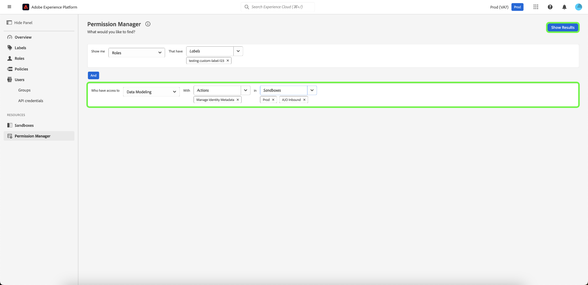

# Gestionnaire d’autorisations

>[!NOTE]
>
>Pour accéder à [!UICONTROL Permission Manager], vous devez être un administrateur de produit. Si vous ne disposez pas de droits d’administrateur, contactez votre administrateur système pour obtenir l’accès.

Utilisez des requêtes simples dans le [!UICONTROL Gestionnaire d’autorisations] pour créer des rapports concis qui vous aideront à comprendre la gestion des accès et à gagner du temps en validant les autorisations d’accès sur de nombreux workflows et niveaux de granularité. Vous pouvez utiliser [!UICONTROL Permission Manager] pour rechercher des utilisateurs appartenant à un groupe d’utilisateurs et disposant de privilèges d’accès spécifiés, ainsi que des rôles possédant des libellés spécifiques.

## Rechercher des utilisateurs et utilisatrices au sein d’un groupe de personnes spécifique {#search-users}

>[!CONTEXTUALHELP]
>id="platform_permission_manager"
>title="Gestionnaire d’autorisations"
>abstract="Utilisez les sélecteurs de liste déroulante sur la page pour obtenir des rapports de niveau d’accès de différents niveaux de granularité pour les utilisateurs et utilisatrices et les rôles."
<!-- >additional-url="https://experienceleague.adobe.com/docs/experience-platform/access-control/abac/permissions-manager/permissions.html" text="Permission manager" -->

Dans la liste déroulante, sélectionnez l’attribut **[!UICONTROL Users]**.

Sélectionnez ensuite le **[!UICONTROL groupe d’utilisateurs]** que vous souhaitez rechercher à l’aide de la liste déroulante.

>[!INFO]
>
>[!UICONTROL User Group] n’est pas un champ obligatoire. Vous ne pouvez sélectionner qu’un seul groupe d’utilisateurs pour chaque rapport.

Pour un rapport plus granulaire, vous pouvez spécifier la ressource avec des actions dans un environnement de test spécifique. Sélectionnez les **[!UICONTROL ressources]**, **[!UICONTROL actions]** et **[!UICONTROL Sandbox]** à l’aide de la liste déroulante, puis sélectionnez **[!UICONTROL Afficher les résultats]**.

>[!INFO]
>
>[!UICONTROL Resource], [!UICONTROL Actions] et [!UICONTROL Sandbox] ne sont pas des champs obligatoires. Une fois ajoutée, une action ou un environnement de test peut être supprimé en sélectionnant le **&#39;x&#39;** en regard de la sélection que vous souhaitez supprimer.

Une liste d’utilisateurs et leur adresse électronique sont signalés en fonction des critères sélectionnés. Utilisez le menu de filtrage sur la gauche pour mettre à jour les attributs et les résultats. Pour plus d’informations sur un utilisateur spécifique, sélectionnez le nom d’utilisateur dans la liste.

## Recherche de rôles avec des libellés spécifiques {#search-roles}

Dans la liste déroulante, sélectionnez l’attribut **[!UICONTROL Roles]**.

>[!INFO]
>
>[!UICONTROL Étiquettes] n’est pas un champ obligatoire. Vous pouvez sélectionner plusieurs libellés qui seront répertoriés sous cette liste déroulante une fois sélectionnés. Vous pouvez supprimer un libellé une fois ajouté en sélectionnant le **&#39;x&#39;** en regard de l’action.

Sélectionnez ensuite les **[!UICONTROL libellés]** que vous souhaitez rechercher à l’aide de la liste déroulante.

Pour un rapport plus granulaire, vous pouvez spécifier la ressource avec des actions dans un environnement de test spécifique. Sélectionnez les **[!UICONTROL ressources]**, **[!UICONTROL actions]** et **[!UICONTROL Sandbox]** à l’aide de la liste déroulante, puis sélectionnez **[!UICONTROL Afficher les résultats]**.

>[!INFO]
>
>[!UICONTROL Resource], [!UICONTROL Actions] et [!UICONTROL Sandbox] ne sont pas des champs obligatoires. Un seul [!UICONTROL Resource] peut être sélectionné pour chaque rapport. Une fois ajoutée, une action ou un environnement de test peut être supprimé en sélectionnant le **&#39;x&#39;** en regard de la sélection que vous souhaitez supprimer.

Une liste de rôles est signalée en fonction des critères sélectionnés. Utilisez le menu de filtrage sur la gauche pour mettre à jour les attributs et les résultats. Pour plus d’informations sur un rôle spécifique, sélectionnez le rôle dans la liste.

Les informations suivantes s’affichent pour chaque rôle correspondant à vos critères :

| Attribut | Description |
| --- | --- |
| Description | Brève description du rôle. |
| Libellés | Liste des libellés associés au rôle. |
| Sandbox | Liste des environnements de test contenant ce rôle. |
| Modifié à | Date et horodatage de la dernière mise à jour du rôle. |
| Date de création | Date et horodatage de la création du rôle. |
| Créé par | Détails du créateur du rôle. |

## Étapes suivantes

Vous avez maintenant appris à générer des rapports pour les utilisateurs et les rôles. Pour en savoir plus sur le contrôle d’accès basé sur les attributs, consultez la [présentation du contrôle d’accès basé sur les attributs](../overview.md).
