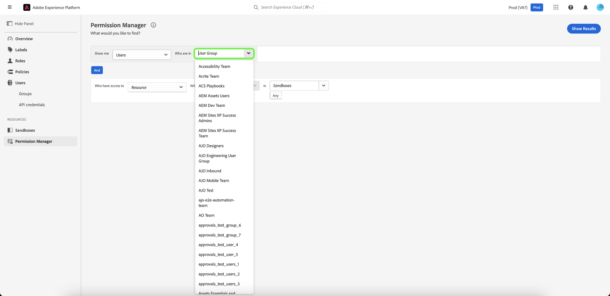
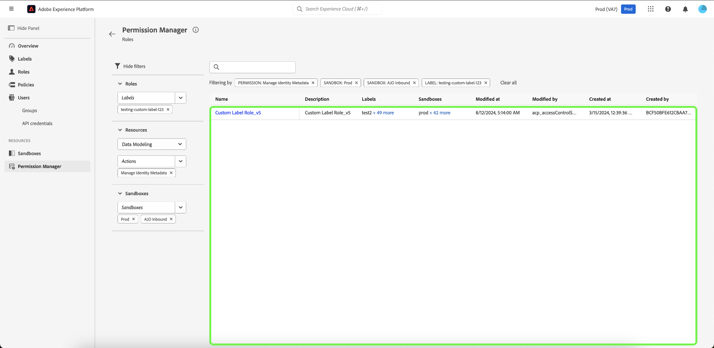

# Gestionnaire d’autorisations

>[!NOTE]
>
>Pour accéder à [!UICONTROL Permission Manager], vous devez être un administrateur de produit. Si vous ne disposez pas de droits d’administrateur, contactez votre administrateur système pour obtenir l’accès.

Utilisez des requêtes simples dans le [!UICONTROL Permission Manager] pour créer des rapports concis qui vous aideront à comprendre la gestion des accès et à gagner du temps lors de la validation des autorisations d’accès sur de nombreux workflows et niveaux de granularité. Vous pouvez utiliser [!UICONTROL Permission Manager] pour rechercher des utilisateurs qui appartiennent à un groupe d’utilisateurs et qui disposent de droits d’accès spécifiés, ainsi que des rôles dotés de libellés spécifiques.

## Rechercher des utilisateurs et utilisatrices au sein d’un groupe de personnes spécifique {#search-users}

>[!CONTEXTUALHELP]
>id="platform_permission_manager"
>title="Gestionnaire d’autorisations"
>abstract="Utilisez les sélecteurs de liste déroulante sur la page pour obtenir des rapports de niveau d’accès de différents niveaux de granularité pour les utilisateurs et utilisatrices et les rôles."
<!-- >additional-url="https://experienceleague.adobe.com/docs/experience-platform/access-control/abac/permissions-manager/permissions.html?lang=fr" text="Permission manager" -->

Dans la liste déroulante, sélectionnez l’attribut **[!UICONTROL Users]**.

Sélectionnez ensuite le **[!UICONTROL User Group]** à rechercher à l’aide de la liste déroulante.

>[!INFO]
>
>[!UICONTROL User Group] n&#39;est pas un champ obligatoire. Vous ne pouvez sélectionner qu’un seul groupe d’utilisateurs pour chaque rapport.

Pour obtenir un rapport plus granulaire, vous pouvez spécifier la ressource avec des actions dans un sandbox spécifique. Sélectionnez les **[!UICONTROL Resource]**, **[!UICONTROL Actions]** et **[!UICONTROL Sandboxes]** à l’aide de la liste déroulante, puis sélectionnez **[!UICONTROL Show Results]**.

>[!INFO]
>
>[!UICONTROL Resource], [!UICONTROL Actions] et [!UICONTROL Sandboxes] ne sont pas des champs obligatoires. Une action ou un sandbox peut être supprimé(e) une fois ajouté(e) en sélectionnant l’**du** en regard de la sélection que vous souhaitez supprimer.

Une liste d’utilisateurs et leur adresse e-mail sont signalés en fonction des critères sélectionnés. Utilisez le menu de filtre à gauche pour mettre à jour les attributs et les résultats. Pour plus d’informations sur un utilisateur spécifique, sélectionnez-le dans la liste.

## Rechercher des rôles avec des libellés spécifiques {#search-roles}

Dans la liste déroulante, sélectionnez l’attribut **[!UICONTROL Roles]**.

>[!INFO]
>
>[!UICONTROL Labels] n&#39;est pas un champ obligatoire. Vous pouvez sélectionner plusieurs libellés qui seront répertoriés sous cette liste déroulante une fois sélectionnés. Vous pouvez supprimer un libellé une fois qu’il a été ajouté en sélectionnant le **’x’** en regard de l’action.

Sélectionnez ensuite le **[!UICONTROL Labels]** à rechercher à l’aide de la liste déroulante.

Pour obtenir un rapport plus granulaire, vous pouvez spécifier la ressource avec des actions dans un sandbox spécifique. Sélectionnez les **[!UICONTROL Resource]**, **[!UICONTROL Actions]** et **[!UICONTROL Sandboxes]** à l’aide de la liste déroulante, puis sélectionnez **[!UICONTROL Show Results]**.

>[!INFO]
>
>[!UICONTROL Resource], [!UICONTROL Actions] et [!UICONTROL Sandboxes] ne sont pas des champs obligatoires. Un seul [!UICONTROL Resource] peut être sélectionné pour chaque rapport. Une action ou un sandbox peut être supprimé(e) une fois ajouté(e) en sélectionnant l’**du** en regard de la sélection que vous souhaitez supprimer.

Une liste de rôles est générée en fonction des critères sélectionnés. Utilisez le menu de filtre à gauche pour mettre à jour les attributs et les résultats. Pour plus d’informations sur un rôle spécifique, sélectionnez-le dans la liste.

Les informations suivantes s’affichent pour chaque rôle correspondant à vos critères :

| Attribut | Description |
| --- | --- |
| Description | Brève description du rôle. |
| Libellés | Liste des libellés associés au rôle. |
| Sandbox | Liste des sandbox contenant ce rôle. |
| Modifié le | Date et heure de la dernière mise à jour du rôle. |
| Date de création | Date et heure de la création du rôle. |
| Créé par | Détails du créateur du rôle. |

## Étapes suivantes

Vous savez maintenant comment générer des rapports pour les utilisateurs et les rôles. Pour en savoir plus sur le contrôle d’accès basé sur les attributs, consultez la [présentation du contrôle d’accès basé sur les attributs](../overview.md).
