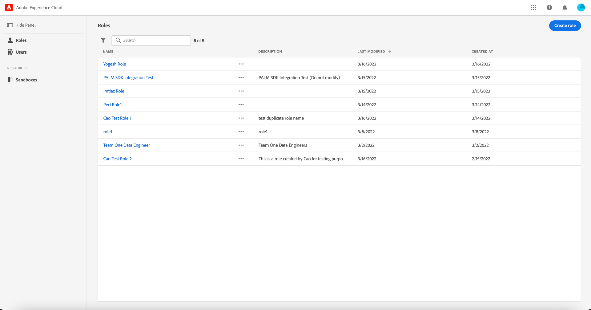

# Guide des autorisations

[!UICONTROL Autorisations] est la zone de Adobe Experience Platform dans laquelle les administrateurs peuvent définir des rôles utilisateur et des stratégies d’accès pour gérer les autorisations d’accès aux fonctionnalités et aux objets dans une application de produit.

Avec [!UICONTROL Permissions], vous pouvez configurer :

* [Stratégies d’accès](./policies.md)
* [Libellés](./labels.md)
* [Autorisations](./permissions.md)
* [Rôles](./roles.md)
* [Sandbox](./sandboxes.md)
* [Utilisateurs](./users.md)

Pour accéder aux autorisations de contrôle d’accès basées sur des attributs pour [!DNL Adobe Experience Platform], vous devez être un administrateur de votre organisation qui a un abonnement à [!DNL Adobe Experience Platform]. Bien qu’Adobe prenne en charge des hiérarchies d’administrateurs flexibles pour vos organisations, vous devez être un administrateur de produit pour [!DNL Adobe Experience Platform] afin de configurer des autorisations. Pour en savoir plus, consultez l’article du Centre d’aide Adobe sur les [rôles administratifs](https://helpx.adobe.com/fr/enterprise/using/admin-roles.html).

Si vous ne disposez pas de droits d’administrateur, contactez votre administrateur système pour obtenir l’accès.

Une fois que vous disposez des droits d’administrateur, accédez à [Adobe Experience Platform](https://experience.adobe.com/) et connectez-vous à l’aide de vos informations d’identification [!DNL Adobe]. Une fois connecté, la page **[!UICONTROL Overview]** s’affiche pour votre organisation pour laquelle vous disposez des droits d’administrateur. Cette page présente les produits auxquels votre organisation est abonnée, ainsi que d’autres contrôles permettant d’ajouter des utilisateurs et des administrateurs à l’organisation dans son ensemble. Sélectionnez **[!UICONTROL Autorisations]** pour ouvrir l’espace de travail du contrôle d’accès basé sur les attributs pour votre intégration Platform.

L’espace de travail du contrôle d’accès basé sur les attributs pour Platform s’affiche, s’ouvrant sur la page **[!UICONTROL Rôles]** . Cette page vous permet d’afficher tous les rôles et de gérer divers paramètres comme indiqué dans ce document.

>[!IMPORTANT]
>
>Pour gérer les autorisations pour les utilisateurs, les fonctionnalités, les étiquettes et d’autres ressources de votre organisation, vous devez désormais utiliser les autorisations sur [!DNL Adobe Experience Platform] plutôt que les rôles dans [!DNL Adobe Admin Console].

Vous devez maintenant utiliser les autorisations sur [!DNL Adobe Experience Platform], au lieu des rôles dans Adobe Admin Console, pour gérer les autorisations pour les utilisateurs, les fonctionnalités, les étiquettes et d’autres ressources de votre organisation.

Ce guide d’utilisation détaille la marche à suivre pour utiliser [!DNL Adobe Experience Platform] afin d’attribuer des autorisations d’accès à Platform. Pour obtenir des informations plus générales sur la façon de parcourir [!DNL Admin Console], consultez le [guide dʼutilisation dʼAdmin Console](https://helpx.adobe.com/fr/enterprise/using/admin-console.html).

## Étapes suivantes

Une fois que vous avez navigué dans l’espace de travail des autorisations, passez à l’étape suivante : [créer un nouveau rôle](roles.md).
