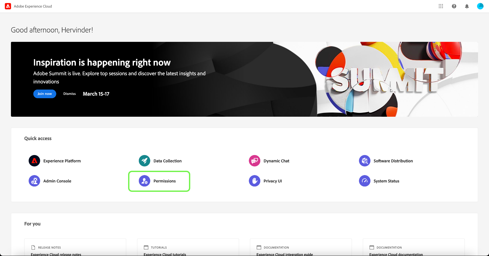
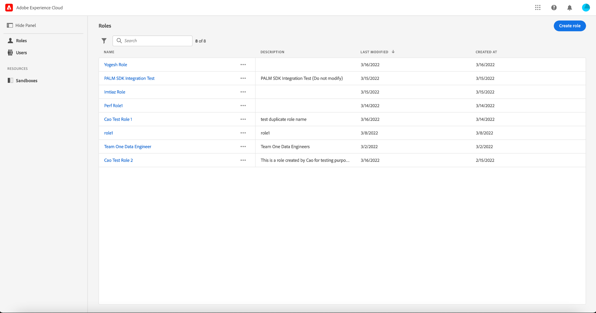

# Guide des autorisations

[!UICONTROL Permissions] est la zone de Adobe Experience Platform dans laquelle les administrateurs peuvent définir des rôles d’utilisateur et des politiques d’accès pour gérer les autorisations d’accès aux fonctionnalités et objets d’une application de produit.

Avec [!UICONTROL Permissions], vous pouvez configurer les éléments suivants :

* [Politiques d’accès](./policies.md)
* [Étiquettes](./labels.md)
* [Autorisations](./permissions.md)
* [Rôles](./roles.md)
* [Sandbox](./sandboxes.md)
* [Utilisateurs et utilisatrices](./users.md)

Pour accéder aux autorisations de contrôle d’accès basé sur les attributs pour [!DNL Adobe Experience Platform], vous devez être administrateur ou administratrice de votre organisation abonnée à [!DNL Adobe Experience Platform]. Bien qu’Adobe prenne en charge des hiérarchies d’administration flexibles pour vos organisations, vous devez être un administrateur de produit pour [!DNL Adobe Experience Platform] de configurer des autorisations. Pour en savoir plus, consultez l’article du Centre d’aide Adobe sur les [rôles administratifs](https://helpx.adobe.com/fr/enterprise/using/admin-roles.html).

Si vous ne disposez pas de droits d’administrateur, contactez votre administrateur système pour obtenir l’accès.

Une fois que vous disposez des privilèges d&#39;administrateur, accédez à [&#128279;](https://experience.adobe.com/) et connectez-vous à l&#39;aide de vos informations d&#39;identification [!DNL Adobe]. Une fois la connexion effectuée, la page **[!UICONTROL Overview]** s’affiche pour l’organisation pour laquelle vous disposez de droits d’administrateur. Cette page affiche les produits auxquels votre organisation est abonnée, ainsi que d’autres contrôles permettant d’ajouter des utilisateurs et des administrateurs à l’ensemble de l’organisation. Sélectionnez **[!UICONTROL Permissions]** pour ouvrir l’espace de travail du contrôle d’accès basé sur les attributs en vue de votre intégration Experience Platform.

L’espace de travail du contrôle d’accès basé sur les attributs pour Experience Platform s’affiche, s’ouvrant sur la page **[!UICONTROL Roles]**. Cette page vous permet d’afficher tous les rôles et de gérer divers paramètres comme indiqué dans ce document.

>[!IMPORTANT]
>
>Pour gérer les autorisations des utilisateurs, des fonctionnalités, des libellés et d’autres ressources dans votre organisation, vous devez maintenant utiliser Autorisations sur les [!DNL Adobe Experience Platform] plutôt que Rôles dans le [!DNL Adobe Admin Console].

Vous devez maintenant utiliser Autorisations sur les [!DNL Adobe Experience Platform], au lieu de Rôles dans le Adobe Admin Console, pour gérer les autorisations des utilisateurs, des fonctionnalités, des libellés et d’autres ressources dans votre organisation.

Ce guide d’utilisation détaille la marche à suivre pour utiliser l’[!DNL Adobe Experience Platform] afin d’attribuer des autorisations d’accès à Experience Platform. Pour obtenir des informations plus générales sur la façon de parcourir [!DNL Admin Console], consultez le [guide dʼutilisation dʼAdmin Console](https://helpx.adobe.com/fr/enterprise/using/admin-console.html).

## Étapes suivantes

Une fois que vous avez navigué dans l’espace de travail des autorisations, passez à l’étape suivante pour [créer un nouveau rôle](roles.md).
