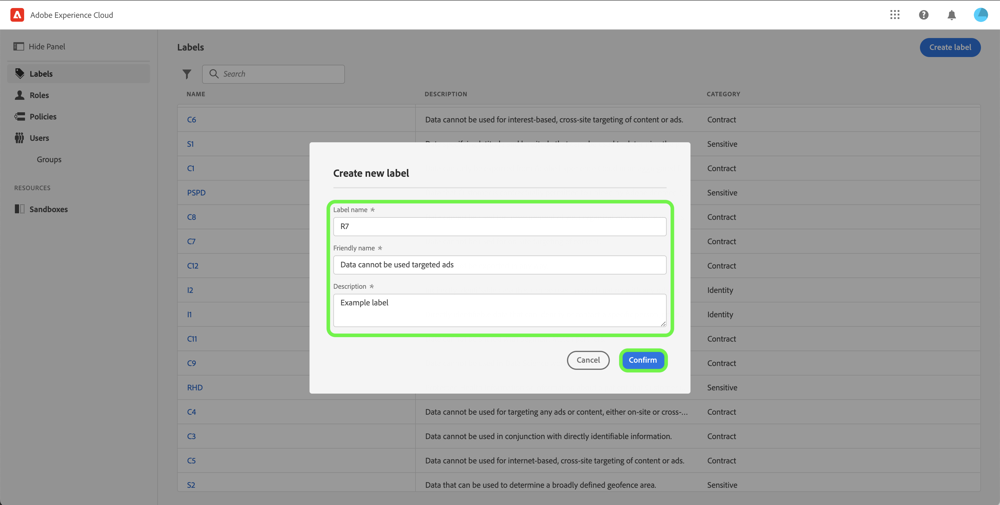

# Gérer les libellés

>[!NOTE]
>
>Pour créer ou afficher des attributs calculés avec des champs contenant un libellé donné, vous devez avoir accès à ce libellé.

Les libellés vous permettent de classer les jeux de données et les champs en fonction de l’utilisation et des politiques d’accès qui s’appliquent à ces données. Vous pouvez appliquer les libellés à tout moment, ce qui vous offre une certaine flexibilité quant à la manière dont vous choisissez de gérer les données. Les bonnes pratiques recommandent de libeller les données dès qu’elles sont ingérées dans Experience Platform, ou dès que les données sont disponibles pour une utilisation dans Experience Platform.

## Créer un nouveau libellé {#create-new-label}

>[!CONTEXTUALHELP]
>id="platform_abac_labelusage"
>title="Utilisation des libellés"
>abstract="Vous pouvez utiliser des libellés personnalisés pour appliquer à vos données des configurations de gouvernance des données et de contrôle d&#39;accès."

>[!CONTEXTUALHELP]
>id="platform_permissions_labels_about_create"
>title="Créer un libellé"
>abstract="Vous pouvez créer vos propres libellés personnalisés selon les besoins de votre entreprise. Les libellés personnalisés peuvent être utilisés pour appliquer à vos données à la fois des configurations de gouvernance des données et de contrôle d&#39;accès."
>additional-url="https://experienceleague.adobe.com/docs/experience-platform/data-governance/labels/overview.html?lang=fr#manage-labels" text="Gérer les libellés personnalisés"

>[!NOTE]
>
>Il n’existe qu’une seule liste de libellés pour l’ensemble de l’organisation. Pour créer un libellé personnalisé, vous aurez besoin d’autorisations **[!UICONTROL Manage Usage Labels]** sur le sandbox de production. La suppression d’étiquettes n’est actuellement pas prise en charge.

Pour créer un nouveau libellé, sélectionnez l’onglet **[!UICONTROL Labels]** dans la barre latérale et sélectionnez **[!UICONTROL Create Label]**.

La boîte de dialogue **[!UICONTROL Create a new label]** s’affiche, vous invitant à saisir un nom, un nom convivial facultatif et une description facultative.

Lorsque vous avez terminé, sélectionnez **[!UICONTROL Confirm]**.
