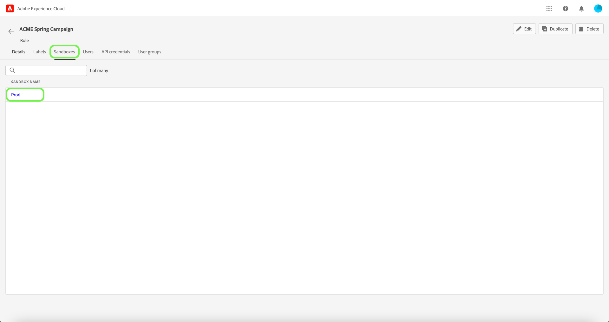
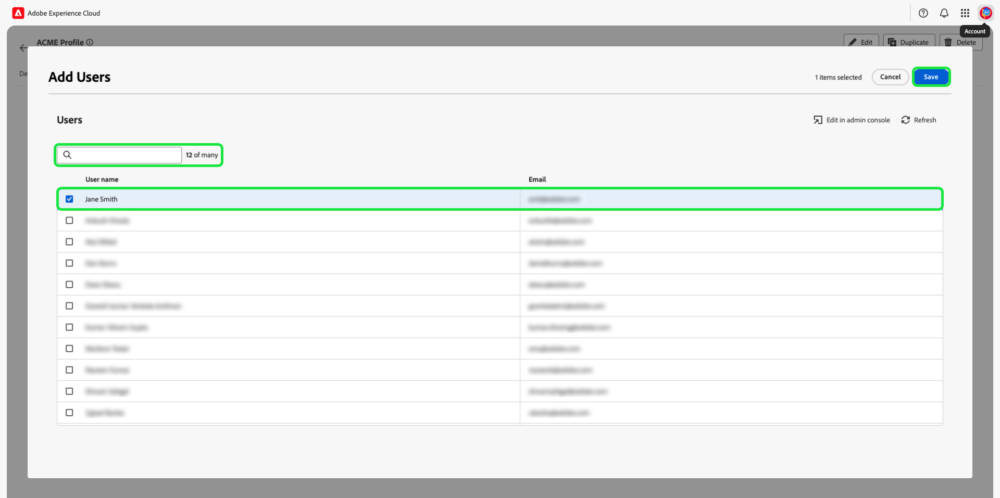
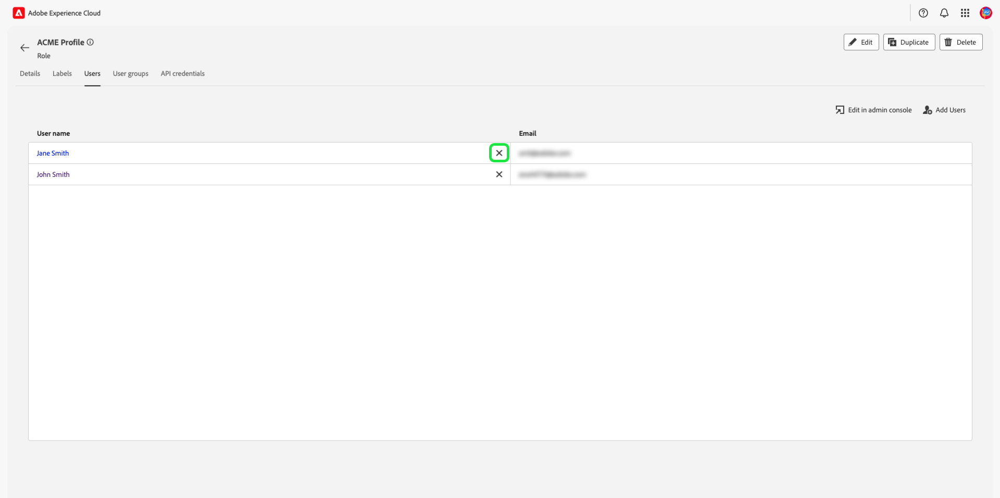

# Gestion des autorisations pour un rôle

>[!IMPORTANT]
>
>Le contrôle d’accès utilise un identifiant d’utilisateur (un identifiant unique interne attribué à un utilisateur) pour accorder des autorisations. Lorsqu’une organisation est migrée d’Adobe ID vers Business ID, toutes les autorisations définies pour ses utilisateurs seront perdues car l’identifiant d’utilisateur change et le contrôle d’accès utilisera l’identifiant d’utilisateur nouvellement généré. Si votre entreprise est migrée vers un Business ID, contactez votre représentant Adobe pour migrer votre identifiant d’utilisateur d’Adobe ID vers un Business ID.

La zone dédiée aux autorisations dans Experience Cloud permet aux administrateurs de définir des rôles d’utilisateur et des politiques d’accès. Ils peuvent ainsi gérer les autorisations d’accès aux fonctionnalités et objets dans une application de produit.

Grâce aux autorisations, vous pouvez créer et gérer des rôles, ainsi qu’attribuer les autorisations de ressource souhaitées pour ces rôles. Les autorisations vous permettent également de gérer les libellés, les sandbox et les utilisateurs associés à un rôle spécifique.

Immédiatement après la [création d’un nouveau rôle](#create-a-new-role), vous retournez sur l’onglet **[!UICONTROL Rôles]**. Si vous modifiez les autorisations d’un rôle existant, sélectionnez le rôle dans l’onglet **[!UICONTROL Rôles]**. Vous pouvez également utiliser l’option de filtrage pour filtrer les résultats afin de trouver un rôle.

## Filtrer les rôles

Sélectionnez l’icône en forme d’entonnoir () pour afficher une liste de contrôles de filtre afin de limiter les résultats.

Les filtres suivants sont disponibles pour les rôles dans l’interface utilisateur :

| Filtre | Description |
| --- | --- |
| [!UICONTROL Créé entre] | Sélectionnez une date de début et/ou une date de fin pour définir une période en fonction de laquelle filtrer les résultats. |
| [!UICONTROL Créé par] | Filtrez par créateur de rôle en sélectionnant un utilisateur dans le menu déroulant. |
| [!UICONTROL Modifié entre] | Sélectionnez une date de début et/ou une date de fin pour définir une période en fonction de laquelle filtrer les résultats. |
| [!UICONTROL Modifié par] | Vous pouvez filtrer par modificateur de rôle en sélectionnant un utilisateur dans le menu déroulant. |

Pour supprimer un filtre, sélectionnez « X » sur l’icône de pilule du filtre en question, ou sélectionnez **[!UICONTROL Effacer tout]** pour supprimer tous les filtres.

## Détails du rôle

Sélectionnez le rôle dans l’onglet **[!UICONTROL Rôles]** qui ouvre la page des détails du rôle.

L’onglet Détails présente un aperçu du rôle. La présentation affiche le nom du rôle, la description du rôle, le nom de l’utilisateur qui a créé et modifié le rôle, la date de création et de modification du rôle et les autorisations associées au rôle. Le nom du rôle et sa description peuvent être modifiés si nécessaire.

## Gérer les libellés d’un rôle

Sélectionnez l’onglet **[!UICONTROL Libellés]** pour ouvrir la page des libellés des rôles, puis sélectionnez **[!UICONTROL Ajouter des libellés]** pour affecter des libellés au rôle.

Les libellés sont répertoriés sur cette page. La liste affiche le nom du libellé, le nom convivial, la catégorie et sa description.

Sélectionnez les libellés de la liste que vous souhaitez ajouter au rôle, puis sélectionnez **[!UICONTROL Enregistrer]**

Les libellés ajoutés apparaissent sous l’onglet **[!UICONTROL Libellés]**.

Pour supprimer un libellé d’un rôle, sélectionnez l’icône **X** à côté du nom du libellé.

## Gestion des sandbox pour le rôle

Sélectionnez l’onglet **[!UICONTROL Sandbox]** pour ouvrir la page sandbox des rôles. Vous trouverez ici une liste des sandbox qui ont été ajoutés au rôle.

Pour ajouter d’autres sandbox à un rôle, sélectionnez **[!UICONTROL Modifier]**.

L’écran suivant vous invite à choisir les autorisations de ressources qui existent dans les sandbox à inclure dans le rôle à l’aide du menu déroulant. Lorsque vous avez terminé, sélectionnez **[!UICONTROL Enregistrer et quitter]**.

## Gestion des utilisateurs pour le rôle

Sélectionnez l’onglet **[!UICONTROL Utilisateurs]** pour ouvrir la page des rôles utilisateurs, puis sélectionnez **[!UICONTROL Ajouter des utilisateurs]** pour affecter des utilisateurs au rôle.

Sélectionnez dans la liste les utilisateurs que vous souhaitez ajouter au rôle. Vous pouvez également utiliser la barre de recherche pour rechercher un utilisateur en saisissant son nom ou son adresse électronique, puis sélectionner **[!UICONTROL Enregistrer]**.

Les utilisateurs ajoutés apparaissent sous l’onglet **[!UICONTROL Utilisateurs]**.

Pour supprimer un utilisateur d’un rôle, sélectionnez l’icône **X** à côté du nom de l’utilisateur.

La vidéo suivante est destinée à vous aider à comprendre comment créer un nouveau rôle et gérer les utilisateurs pour ce rôle.

>[!VIDEO](https://video.tv.adobe.com/v/336081/?learn=on)

## Gestion des informations d’identification d’API pour le rôle {#manage-api-credentials-for-role}

Sélectionnez l’onglet **[!UICONTROL Informations d’identification d’API]** pour ouvrir la page des informations d’identification d’API des rôles, puis sélectionnez **[!UICONTROL Ajouter des informations d’identification d’API]** pour attribuer des informations d’identification d’API au rôle.

Sélectionnez dans la liste les informations d’identification d’API que vous souhaitez ajouter au rôle, puis sélectionnez **[!UICONTROL Enregistrer]**.

Les informations d’identification d’API ajoutées apparaissent sous l’onglet **[!UICONTROL Informations d’identification d’API]**.

Pour supprimer des informations d’identification d’API d’un rôle, sélectionnez l’icône **X** à côté du nom des informations d’identification d’API.

La boîte de dialogue de **[!UICONTROL Suppression des informations d’identification d’API]** s’affiche, vous invitant à confirmer la suppression.

Vous revenez sur l’onglet **[!UICONTROL Informations d’identification d’API]**.

## Gestion des groupes d’utilisateurs pour les rôles

Les groupes d’utilisateurs consistent en plusieurs utilisateurs qui ont été regroupés et qui disposent des accès pour exécuter les mêmes fonctions.

Sélectionnez l’onglet **[!UICONTROL Groupes d’utilisateurs]** pour ouvrir la page de groupes d’utilisateurs des rôles, puis sélectionnez **[!UICONTROL Ajouter des groupes]** pour affecter des groupes d’utilisateurs au rôle.

Sélectionnez dans la liste les groupes d’utilisateurs que vous souhaitez ajouter au rôle. Vous pouvez également utiliser la barre de recherche pour rechercher le groupe d’utilisateurs en saisissant le nom du groupe, puis sélectionner **[!UICONTROL Enregistrer]**.

Le groupe d’utilisateurs ajouté apparaît sous l’onglet **[!UICONTROL Groupes d’utilisateurs]**.

Pour supprimer un groupe d’utilisateurs d’un rôle, sélectionnez l’icône **X** à côté du nom du groupe d’utilisateurs.

Le boîte de dialogue de **[!UICONTROL Suppression d’un groupe d’utilisateurs]** s’affiche, vous invitant à confirmer la suppression.

Vous revenez sur l’onglet **[!UICONTROL Groupes d’utilisateurs]**.

## Ajout d’utilisateurs à un Experience Platform par le biais d’un rôle

Pour ajouter un utilisateur à un rôle, connectez-vous à l’Admin Console et sélectionnez **[!UICONTROL Ajouter des utilisateurs]**

La boîte de dialogue **[!UICONTROL Ajouter des utilisateurs à votre équipe]** s’affiche. Saisissez l’adresse e-mail, le prénom (facultatif) et le nom des utilisateurs (facultatif).

Sélectionnez l’icône en forme de crayon pour sélectionner les produits et les groupes d’utilisateurs, sélectionnez **[!UICONTROL Adobe Experience Platform]**, puis **[!UICONTROL AEP-Default-All-Users]**, puis **[!UICONTROL Enregistrer]**.

## Étapes suivantes

Une fois les autorisations établies, vous pouvez passer à l’étape suivante de [gestion des utilisateurs](users.md).
