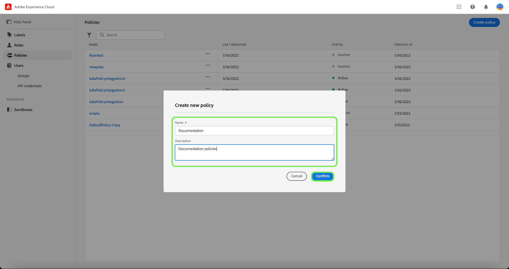
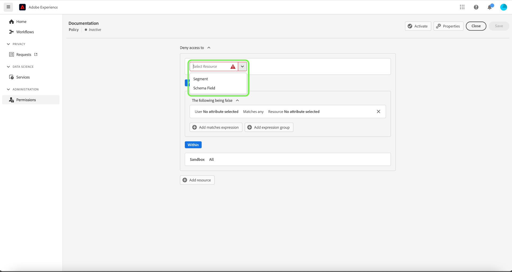
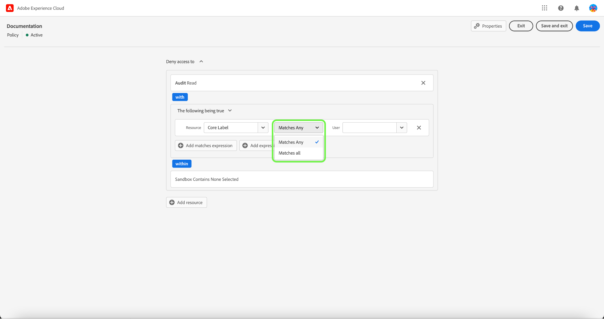
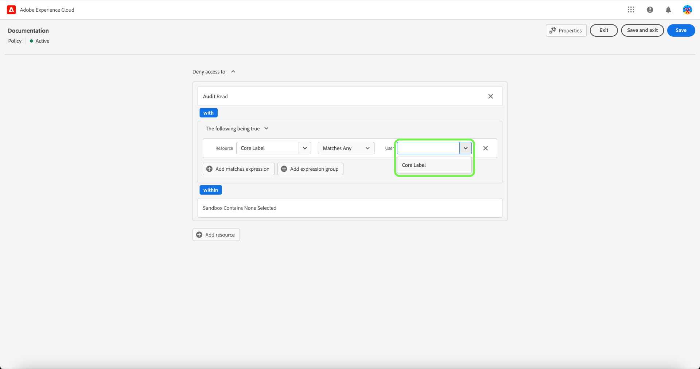

# Gestion des politiques de contrôle d’accès

Les politiques de contrôle d’accès sont des instructions qui rassemblent des attributs pour établir des actions admissibles et non admissibles. Les politiques d’accès peuvent être locales ou globales et peuvent remplacer d’autres politiques. Adobe fournit une politique par défaut qui peut être activée immédiatement ou dès que votre organisation est prête à commencer à contrôler l’accès à des objets spécifiques en fonction de libellés. La politique par défaut utilise les libellés appliqués aux ressources pour refuser l’accès à moins que les utilisateurs et utilisatrices ne soient dans un rôle avec un libellé correspondant.

>[!IMPORTANT]
>
>Les politiques d’accès ne doivent pas être confondues avec les politiques d’utilisation des données, qui contrôlent la manière dont les données sont utilisées dans Adobe Experience Platform au lieu de déterminer quels utilisateurs et utilisatrices de votre organisation y ont accès. Pour plus d’informations, consultez le guide sur la création de [politiques d’utilisation des données](../../../data-governance/policies/create.md).

<!-- ## Create a new policy

To create a new policy, select the **[!UICONTROL Policies]** tab in the sidebar and select **[!UICONTROL Create Policy]**.

The **[!UICONTROL Create a new policy]** dialog appears, prompting you to enter a name, and an optional description. When finished, select **[!UICONTROL Confirm]**.

Using the dropdown arrow select if you would like to **Permit access to** () a resource or **Deny access to** () a resource.

Next, select the resource that you would like to include in the policy using the dropdown menu and search access type, read or write.

Next, using the dropdown arrow select the condition you would like to apply to this policy, **The following being true** () or **The following being false** ().

Select the plus icon to **Add matches expression** or **Add expression group** for the resource. 

Using the dropdown, select the **Resource**.

Next, using the dropdown select the **Matches**.

Next, using the dropdown, select the type of label (**[!UICONTROL Core label]** or **[!UICONTROL Custom label]**) to match the label assigned to the User in roles.

Finally, select the **Sandbox** that you would like the policy conditions to apply to, using the dropdown menu.

Select **Add resource** to add more resources. Once finished, select **[!UICONTROL Save and exit]**.

The new policy is successfully created, and you are redirected to the **[!UICONTROL Policies]** tab, where you will see the newly created policy appear in the list. 

## Edit a policy

To edit an existing policy, select the policy from the **[!UICONTROL Policies]** tab. Alternatively, use the filter option to filter the results to find the policy you want to edit.

Next, select the ellipsis (`…`) next to the policies name, and a dropdown displays controls to edit, deactivate, delete, or duplicate the role. Select edit from the dropdown.

The policy permissions screen appears. Make the updates then select **[!UICONTROL Save and exit]**.

The policy is successfully updated, and you are redirected to the **[!UICONTROL Policies]** tab.

## Duplicate a policy

To duplicate an existing policy, select the policy from the **[!UICONTROL Policies]** tab. Alternatively, use the filter option to filter the results to find the policy you want to edit.

Next, select the ellipsis (`…`) next to a policies name, and a dropdown displays controls to edit, deactivate, delete, or duplicate the role. Select duplicate from the dropdown.

The **[!UICONTROL Duplicate policy]** dialog appears, prompting you to confirm the duplication. 

The new policy appears in the list as a copy of the original on the **[!UICONTROL Policies]** tab.

## Delete a policy

To delete an existing policy, select the policy from the **[!UICONTROL Policies]** tab. Alternatively, use the filter option to filter the results to find the policy you want to delete.

Next, select the ellipsis (`…`) next to a policies name, and a dropdown displays controls to edit, deactivate, delete, or duplicate the role. Select delete from the dropdown.

The **[!UICONTROL Delete user policy]** dialog appears, prompting you to confirm the deletion. 

You are returned to the **[!UICONTROL policies]** tab and a confirmation of deletion pop over appears.

 -->

## Configuration de la politique d’un sandbox

>[!IMPORTANT]
>
>Par défaut, la fonction [!UICONTROL Inclusion automatique] est activée pour tous les clients, ce qui signifie que tous les sandbox sont ajoutés à la politique.

>[!NOTE]
>
>La politique **[!UICONTROL Default-Label-Based-Access-Control-Policy]** est actuellement la seule disponible pour configuration.

Pour afficher les sandbox associés à une politique, sélectionnez la politique dans l’onglet **[!UICONTROL Politiques]**.

Sélectionnez ensuite la politique, puis sélectionnez l’onglet **[!UICONTROL Sandbox]**. Une liste des sandbox associés à la politique s’affiche.

### Ajouter une politique à tous les sandbox

Utilisez le bouton (bascule) **[!UICONTROL Inclusion automatique]** de l’onglet **[!UICONTROL Sandbox]** pour activer la politique pour tous les sandbox.

![Onglet [!UICONTROL Sandbox] affichant le bouton bascule [!UICONTROL Inclusion automatique].](../../images/flac-ui/abac-policies-auto-include.png)

La boîte de dialogue **[!UICONTROL Activer l’inclusion automatique]** s’affiche et vous invite à confirmer votre sélection. Sélectionnez **[!UICONTROL Activer]** pour terminer le paramètre de configuration.

![&#x200B; Boîte de dialogue [!UICONTROL Activer l’inclusion automatique] mettant en surbrillance [!UICONTROL Activer].](../../images/flac-ui/abac-policies-auto-include-enable.png)

>[!SUCCESS]
>
>La politique est activée pour tous les sandbox existants et sera automatiquement ajoutée à tous les nouveaux sandbox lorsqu’ils seront disponibles.

### Ajouter une politique pour sélectionner des sandbox

>[!IMPORTANT]
>
>Les futurs sandbox ne seront pas inclus dans la politique par défaut si le bouton (bascule) [!UICONTROL Inclusion automatique] est désactivé. Vous devez gérer et ajouter manuellement des sandbox à la politique.

Utilisez le bouton (bascule) **[!UICONTROL Inclusion automatique]** de l’onglet **[!UICONTROL Sandbox]** pour désactiver la stratégie pour tous les sandbox.

![Onglet [!UICONTROL Sandbox] affichant le bouton bascule [!UICONTROL Inclusion automatique].](../../images/flac-ui/abac-policies-auto-include.png)

Dans l’onglet **[!UICONTROL Sandbox]**, sélectionnez **[!UICONTROL Ajouter des sandbox]** pour sélectionner les sandbox auxquels cette politique s’appliquera.

![Onglet [!UICONTROL Sandbox] affichant la liste des sandbox ajoutés à la politique.](../../images/flac-ui/abac-policies-sandboxes-tab-add.png)

Une liste de sandbox s’affiche. Sélectionnez le sandbox à ajouter dans la liste. Vous pouvez également utiliser la barre de recherche pour rechercher le sandbox. Sélectionnez **[!UICONTROL Enregistrer]**.

![Page [!UICONTROL Ajouter des sandbox] présentant une liste des sandbox existants disponibles pour l’ajout à la politique.](../../images/flac-ui/abac-policies-sandboxes-list.png)

>[!SUCCESS]
>
>Les sandbox sélectionnés ont été ajoutés à la politique.

### Supprimer des sandbox d’une politique

Pour supprimer un sandbox, sélectionnez l’icône **X** en regard du nom du sandbox.

![Onglet [!UICONTROL Sandbox] affichant une liste de sandbox, en mettant en surbrillance le [!UICONTROL X] à supprimer.](../../images/flac-ui/abac-policies-remove-sandbox-x.png)

La boîte de dialogue **[!UICONTROL Supprimer]** s’affiche et vous invite à confirmer votre sélection. Sélectionnez **[!UICONTROL Confirmer]** pour terminer la suppression.

![Boîte de dialogue [!UICONTROL Supprimer] mise en surbrillance [!UICONTROL Confirmer].](../../images/flac-ui/abac-policies-remove-sandbox.png)

>[!SUCCESS]
>
>Le sandbox sélectionné a été supprimé de la politique.

## Activer une politique {#activate-policy}

>[!CONTEXTUALHELP]
>id="platform_permissions_policies_about"
>title="Que sont les politiques ?"
>abstract="Les politiques sont des déclarations qui réunissent des attributs pour établir des actions autorisées et non autorisées. Chaque organisation s’accompagne d’une politique par défaut que vous devez activer pour commencer à contrôler l’accès à des objets spécifiques en fonction de libellés. Les libellés appliqués aux ressources refusent l’accès à moins qu’un rôle avec un libellé correspondant ne soient affecté aux utilisateurs et utilisatrices. Les politiques par défaut ne peuvent pas être modifiées ni supprimées, mais elles peuvent être activées ou désactivées."
>additional-url="https://experienceleague.adobe.com/fr/docs/experience-platform/access-control/abac/permissions-ui/labels" text="Gérer les libellés"

Pour activer une politique existante, sélectionnez-la dans l’onglet **[!UICONTROL Politiques]**.

Sélectionnez ensuite les points de suspension (`…`) à côté du nom des politiques, et une liste déroulante affiche les contrôles permettant de modifier, désactiver, supprimer ou dupliquer le rôle. Sélectionnez Activer dans la liste déroulante.

La boîte de dialogue **[!UICONTROL Activer la politique]** s’affiche et vous invite à confirmer l’activation.

Vous revenez alors à l’onglet **[!UICONTROL Politiques]** et une fenêtre contextuelle de confirmation de l’activation s’affiche. Le statut de la politique s’affiche comme actif.

## Étapes suivantes

Une fois la politique activée, vous pouvez passer à l’étape suivante pour [gérer les autorisations pour un rôle](permissions.md).
