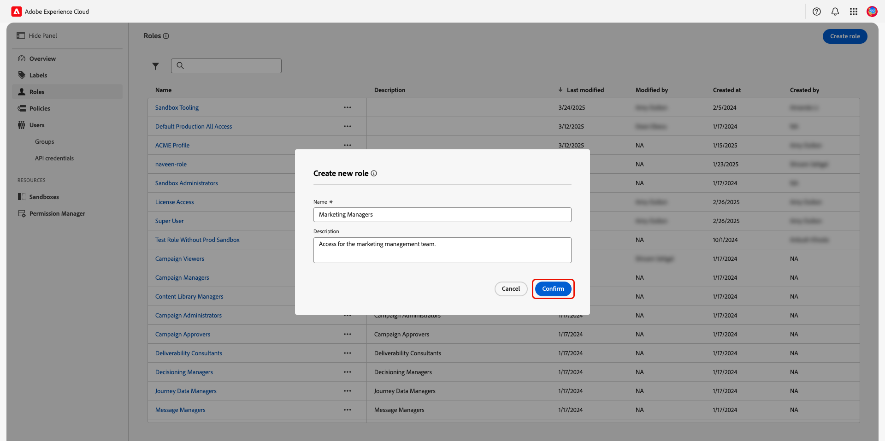
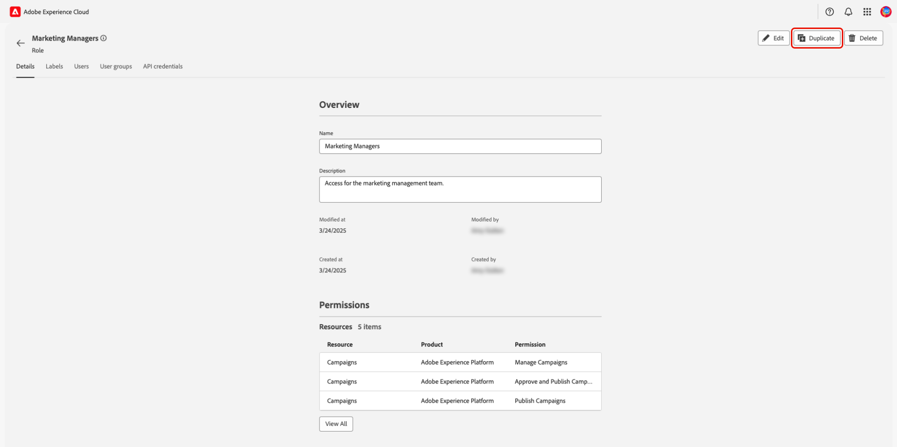
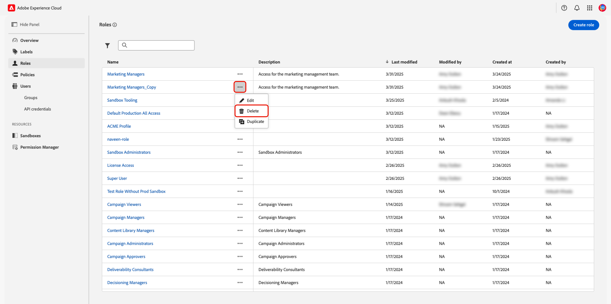
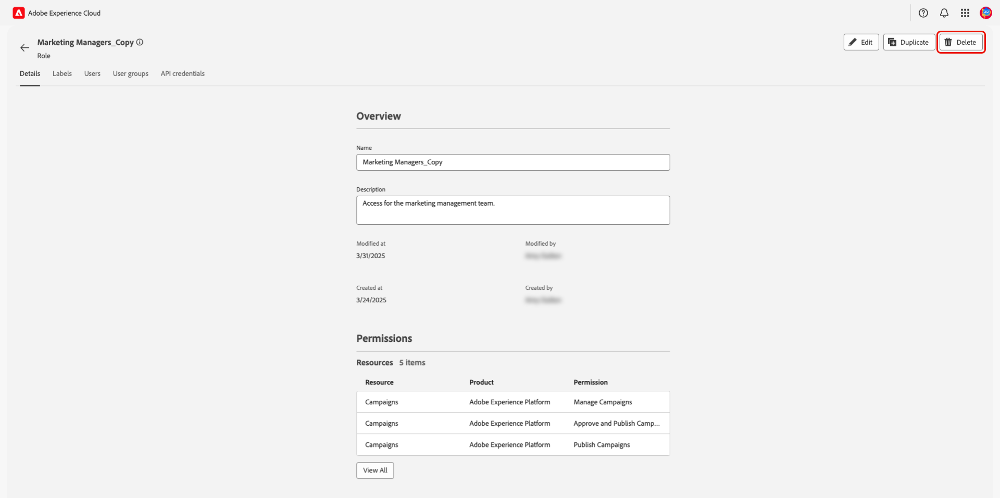

# Gérer les rôles

<!-- UPDATE ROLES WITH A MORE COMPREHENSIVE EXPLANATION -->

Pour commencer à gérer les rôles, accédez à **[!UICONTROL Autorisations]** dans [Adobe Experience Cloud](https://experience.adobe.com/){target="_blank"} et sélectionnez **[!UICONTROL Rôles]** dans le panneau de gauche.

## Créer un rôle {#create-new-role}

>[!CONTEXTUALHELP]
>id="platform_permissions_roles_about_create"
>title="Créer un rôle"
>abstract="Créez de nouveaux rôles pour mieux classer les personnes interagissant avec votre instance Experience Platform. Par exemple, vous pouvez créer un rôle pour une équipe marketing interne et lui appliquer le libellé RHD. Cela permettra à l’équipe d’accéder aux informations de santé protégées (ISP). Vous pouvez également créer un rôle pour une agence externe et refuser l’accès à ce rôle aux données ISP en vous abstenant d’appliquer le libellé RHD à ce rôle."
>additional-url="https://experienceleague.adobe.com/docs/experience-platform/access-control/abac/permissions-ui/roles.html?lang=fr" text="Gérer un rôle"
>additional-url="https://experienceleague.adobe.com/fr/docs/experience-platform/access-control/abac/end-to-end-guide#label-roles" text="Appliquer des libellés à un rôle"

Pour créer un nouveau rôle, sélectionnez **[!UICONTROL Créer un rôle]**.

>[!TIP]
>
>Les rôles en lecture seule sont disponibles par défaut. Un rôle en lecture seule est un rôle qui permet à un utilisateur d’afficher les données, la configuration et les fonctionnalités de l’interface utilisateur sans avoir à modifier l’état du système. Les administrateurs ne peuvent pas modifier ces rôles, mais peuvent associer des utilisateurs aux rôles.

La boîte de dialogue **[!UICONTROL Créer un rôle]** s’affiche. Saisissez un **[!UICONTROL Nom]** pour le rôle et, éventuellement, un **[!UICONTROL Description]**, puis sélectionnez **[!UICONTROL Confirmer]**.

L’espace de travail **[!UICONTROL Ressources]** s’affiche. Recherchez la ressource dont vous avez besoin en faisant défiler l’écran ou en saisissant le nom de la ressource dans la barre de recherche du panneau de gauche. Ajoutez des ressources en sélectionnant l’icône  en regard du nom de la ressource.

<!-- ADD IN NOTE ABOUT THE DEFAULT SANDBOX - THIS SHOULD BE MENTIONED IN THE HIGHER LEVEL DOCS, WE MAY BE ABLE TO LINK TO IT -->

La ressource est ajoutée à l’espace de travail principal. Sélectionnez la liste déroulante à côté du nom de la ressource, puis sélectionnez les autorisations que vous souhaitez ajouter au rôle. Vous pouvez les choisir individuellement, sélectionner **[!UICONTROL Ajouter tout]** ou rechercher des autorisations spécifiques en saisissant le nom de l’autorisation dans la barre de recherche.

Continuez à sélectionner toutes les ressources et les autorisations que vous souhaitez ajouter au rôle. Lorsque vous avez terminé, sélectionnez **[!UICONTROL Enregistrer]**.

Vous recevrez une alerte indiquant que le rôle a été enregistré avec succès. Sélectionnez **[!UICONTROL Fermer]** pour revenir à l’espace de travail **[!UICONTROL Rôles]**.

Le nouveau rôle a été créé avec succès et vous êtes redirigé vers la page **[!UICONTROL Rôles]**, où le nouveau rôle apparaît dans la liste.

<!-- 
The following video is intended to support your understanding of creating a new role and managing users for that role.

>[!VIDEO](https://video.tv.adobe.com/v/336081/?learn=on) 
-->

## Dupliquer un rôle

La duplication d’un rôle entraîne la copie sur les détails, les autorisations, les libellés et les sandbox. Les utilisateurs, les groupes d’utilisateurs et d’utilisatrices et les informations d’identification d’API **ne sont pas** copiés et devront être ajoutés manuellement au rôle.

Pour dupliquer un rôle existant, recherchez le rôle que vous souhaitez dupliquer dans l’onglet **[!UICONTROL Rôles]**. Sélectionnez l’icône  à côté du nom du rôle, puis sélectionnez **[!UICONTROL Dupliquer]** dans le menu déroulant.

La boîte de dialogue de confirmation de duplication s’affiche. Sélectionnez **[!UICONTROL Confirmer]** pour terminer la duplication du rôle. Le nouveau rôle sera enregistré sous le même nom avec `_Copy` ajouté comme suffixe.

Vous pouvez également dupliquer un rôle depuis l’espace de travail d’un rôle individuel. Sélectionnez le rôle que vous souhaitez dupliquer dans l’espace de travail **[!UICONTROL Rôles]** puis sélectionnez **[!UICONTROL Dupliquer]**.

La boîte de dialogue de confirmation de duplication s’affiche. Sélectionnez **[!UICONTROL Confirmer]** pour terminer la duplication du rôle. Vous serez redirigé vers le nouveau rôle.

## Supprimer un rôle

Pour supprimer un rôle, recherchez le rôle que vous souhaitez supprimer dans l’onglet **[!UICONTROL Rôles]**. Sélectionnez l’icône  à côté du nom du rôle, puis sélectionnez **[!UICONTROL Supprimer]** dans le menu déroulant.

La boîte de dialogue de confirmation de suppression s’affiche. Sélectionnez **[!UICONTROL Confirmer]** pour terminer la suppression du rôle.

Vous pouvez également supprimer un rôle dans l’espace de travail d’un rôle individuel. Sélectionnez le rôle que vous souhaitez supprimer de l’espace de travail **[!UICONTROL Rôles]** puis sélectionnez **[!UICONTROL Supprimer]**.

La boîte de dialogue de confirmation de suppression s’affiche. Sélectionnez **[!UICONTROL Confirmer]** pour terminer la suppression du rôle.

<!-- ADD PERMISSIONS TO THIS PAGE -->

## Étapes suivantes

Après avoir créé un nouveau rôle, vous pouvez passer à l’étape suivante pour [gérer les autorisations pour un rôle](permissions.md).
