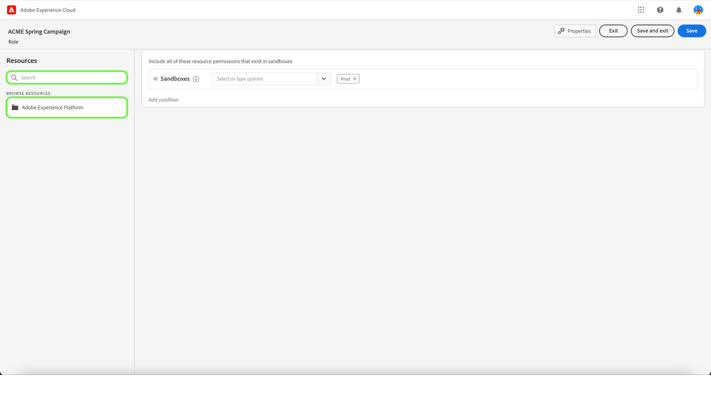

# Gestion des rôles

>[!IMPORTANT]
>
>Le contrôle d’accès basé sur les attributs est actuellement disponible dans une version limitée pour les clients de santé basés aux États-Unis. Cette fonctionnalité sera disponible pour tous les clients Real-time Customer Data Platform une fois qu’elle sera entièrement publiée.

Les rôles définissent l’accès dont dispose un administrateur, un spécialiste ou un utilisateur final aux ressources de votre entreprise. Dans un environnement de contrôle d’accès basé sur les rôles, la configuration de l’accès des utilisateurs est regroupée par le biais de responsabilités et de besoins communs. Un rôle possède un ensemble donné d’autorisations et les membres de votre organisation peuvent être affectés à un ou plusieurs rôles, selon la portée de l’accès en lecture ou en écriture dont ils ont besoin.

## Création d’un rôle

Pour créer un nouveau rôle, sélectionnez le **[!UICONTROL Rôles]** dans la barre latérale et sélectionnez **[!UICONTROL Créer un rôle]**.

Le **[!UICONTROL Création d’un rôle]** s’affiche, vous invitant à saisir un nom et une description facultative.

Lorsque vous avez terminé, sélectionnez **[!UICONTROL Confirmer]**.

Sélectionnez ensuite les autorisations de ressources que vous souhaitez inclure dans le rôle à l’aide du menu déroulant.

Pour ajouter des ressources supplémentaires, sélectionnez **[!UICONTROL Adobe Experience Platform]** dans le panneau de navigation de gauche, qui affiche une liste des ressources. Vous pouvez également saisir le nom de la ressource dans la barre de recherche du panneau de navigation de gauche.

Cliquez et faites glisser la ressource concernée et déposez-la dans le panneau principal.

Sélectionnez les autorisations de ressources que vous souhaitez inclure dans le rôle à l’aide du menu déroulant. Répétez cette opération pour toutes les ressources que vous souhaitez inclure pour le rôle . Lorsque vous avez terminé, sélectionnez **[!UICONTROL Enregistrer et quitter]**.

Le nouveau rôle a été créé avec succès et vous êtes redirigé vers la fonction **[!UICONTROL Rôles]** , où le nouveau rôle apparaît dans la liste.

Reportez-vous aux sections de la section [gestion des autorisations pour un rôle](#manage-permissions-for-a-role) pour plus d’informations sur la gestion des autorisations de rôle une fois qu’elles ont été créées.

## Dupliquer un rôle

Pour dupliquer un rôle existant, sélectionnez le rôle dans la **[!UICONTROL Rôles]** . Vous pouvez également utiliser l’option de filtrage pour filtrer les résultats afin de trouver le rôle que vous souhaitez dupliquer.

Ensuite, sélectionnez **[!UICONTROL Dupliquer]** en haut à droite de l’écran.

Le **[!UICONTROL Duplication du rôle]** s’affiche, vous invitant à confirmer la duplication.

Ensuite, vous accédez à la page des détails du rôle dans laquelle vous pouvez modifier le nom et les autorisations du rôle. Les environnements Détails, Étiquettes et Sandbox sont dupliqués à partir du rôle précédent. Les utilisateurs doivent être ajoutés depuis l&#39;onglet Utilisateurs . Vous pouvez afficher la variable [gestion des autorisations pour un rôle](permissions.md) document pour en savoir plus sur l’ajout de détails, de libellés, d’environnements de test et d’utilisateurs à un rôle.

Cliquez sur la flèche gauche pour revenir au **[!UICONTROL Rôles]** .

Le nouveau rôle apparaîtra dans la liste de la fonction **[!UICONTROL Rôles]** page.

## Suppression d’un rôle

Sélectionnez les points de suspension (`…`) en regard du nom d’un rôle et une liste déroulante affiche les commandes permettant de modifier, supprimer ou dupliquer le rôle. Sélectionnez Supprimer dans la liste déroulante.

Le **[!UICONTROL Suppression d’un rôle utilisateur]** s’affiche, vous invitant à confirmer la suppression.

Vous revenez alors à la variable **[!UICONTROL Rôles]** .

## Étapes suivantes

Une fois un nouveau rôle créé, vous pouvez passer à l’étape suivante [gestion des autorisations pour un rôle](permissions.md).
