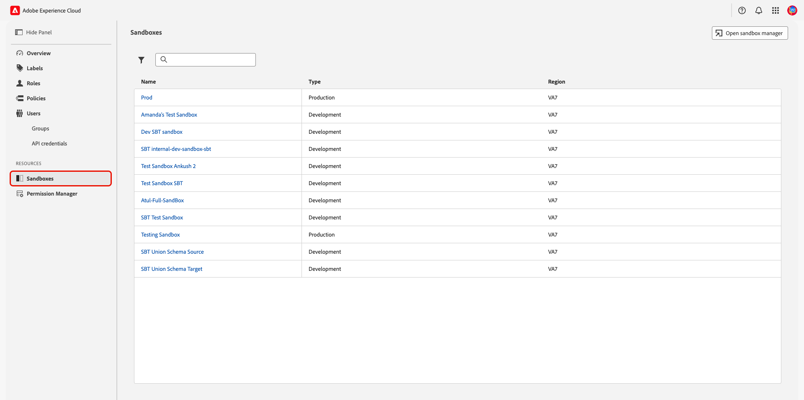
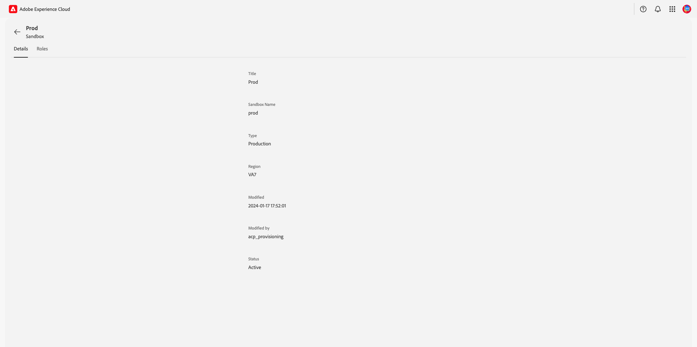
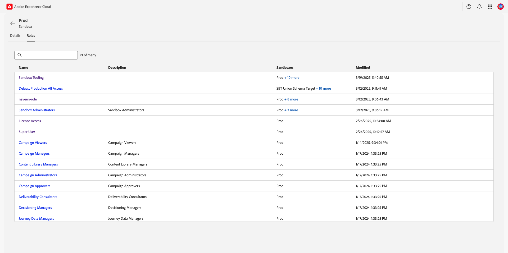

# Gestion des sandbox {#mange-sandboxes}

>[!CONTEXTUALHELP]
>id="platform_permissions_sandboxes_about"
>title="Que sont les sandbox ?"
>abstract="Les sandbox sont des partitions virtuelles au sein d’une instance unique d’Experience Platform. Tout le contenu et les actions réalisés dans un sandbox sont limités à celui-ci et n’en affectent aucun autre. L’accès aux sandbox est géré par l’intermédiaire des rôles."
>additional-url="https://experienceleague.adobe.com/en/docs/experience-platform/sandbox/home" text="Présentation des sandbox"

Les sandbox sont des partitions virtuelles au sein d’une seule instance de Adobe Experience Platform qui intègrent de manière transparente le processus de développement de vos applications d’expérience digitale. Tout le contenu et les actions réalisés dans un sandbox sont limités à celui-ci et n’en affectent aucun autre. Pour plus d’informations sur les sandbox, consultez la [présentation des sandbox](../../../sandboxes/home.md).

## Explorer les sandbox {#explore-sandboxes}

Pour afficher les détails d’un sandbox et les rôles associés, accédez à **[!UICONTROL Autorisations]** dans [Adobe Experience Cloud](https://experience.adobe.com/){target="_blank"}. Sélectionnez **[!UICONTROL Sandbox]** dans la section **[!UICONTROL Ressources]** du panneau de gauche.

Une liste des sandbox de votre organisation s’affiche. Sélectionnez le sandbox à afficher dans la liste. Vous pouvez également rechercher un sandbox en saisissant son nom dans la barre de recherche ou le filtrer par type en sélectionnant l’icône de filtre () et en utilisant le menu déroulant **[!UICONTROL Type de sandbox]**.

{zoomable="yes"}

>[!NOTE]
>
>L’espace de travail Sandbox dans Autorisations n’autorise aucune action de gestion des sandbox. Pour gérer les sandbox, sélectionnez l’option **[!UICONTROL Ouvrir le gestionnaire de sandbox]** dans le coin supérieur droit de l’espace de travail.

L’onglet **[!UICONTROL Détails]** donne un aperçu du sandbox. La présentation affiche les **[!UICONTROL Titre]**, **[!UICONTROL Nom du sandbox]**, **[!UICONTROL Type]**, **[!UICONTROL Région]**, **[!UICONTROL Modifié]** date, **[!UICONTROL Modifié par]** et **[!UICONTROL Status]** du sandbox.

{zoomable="yes"}

Sélectionnez l’onglet **[!UICONTROL Rôles]** pour afficher les rôles auxquels le sandbox est affecté. Sélectionner un rôle vous amènera à l’espace de travail du rôle.

<!-- To manage the role's sandboxes, follow the  guide. -->

{zoomable="yes"}

## Étapes suivantes

Vous savez maintenant comment afficher les détails et les rôles d’un sandbox. Pour en savoir plus sur le contrôle d’accès basé sur les attributs, consultez la [présentation du contrôle d’accès basé sur les attributs](../overview.md).
