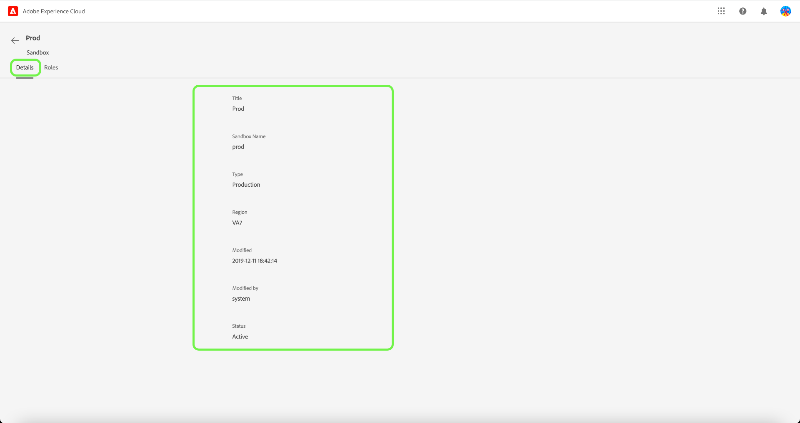

# Gestion des sandbox

Les sandbox constituent des partitions virtuelles au sein d’une instance d’Experience Platform unique, ce qui permet une intégration transparente au processus de développement de vos applications d’expérience digitale. Tout le contenu et les actions réalisés dans un sandbox sont limités à celui-ci et n’en affectent aucun autre. Pour plus d’informations sur les environnements de test, consultez la [présentation des environnements de test](../../../sandboxes/home.md).

## Configuration des environnements de test

Pour afficher les détails et les rôles attribués à un environnement de test, sélectionnez l’onglet **[!UICONTROL Sandbox]** .

Une liste des environnements de test s’affiche. Sélectionnez l’environnement de test à afficher dans la liste. Vous pouvez également utiliser la barre de recherche pour rechercher l’environnement de test en saisissant son nom.

L’onglet Détails fournit un aperçu de l’environnement de test. L’aperçu affiche le nom, le type, la région, la date de modification de l’environnement de test, les personnes ayant modifié l’environnement de test et l’état de l’environnement de test.

Sélectionnez l’onglet **[!UICONTROL Rôles]** pour afficher les rôles auxquels l’environnement de test est affecté.

## Étapes suivantes

Vous avez maintenant appris à afficher les détails de l’environnement de test et les rôles auxquels il est actuellement affecté. Pour un aperçu général des environnements de test en Experience Platform, reportez-vous à la [documentation de présentation des environnements de test](../../sanboxes/../ui/overview.md).
