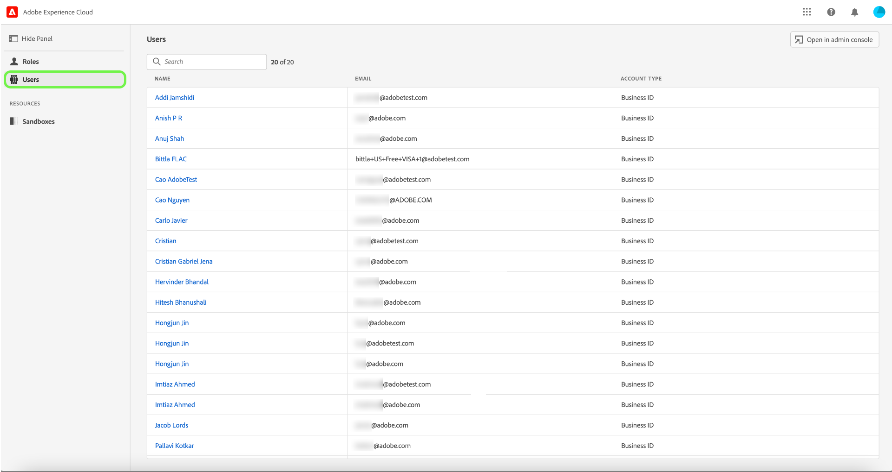

# Gérer les utilisateurs

>[!IMPORTANT]
>
>Le contrôle d’accès basé sur les attributs est actuellement disponible pour un nombre restreint d’utilisateurs, qui sont actifs dans le secteur de la santé et basés aux États-Unis. Cette fonctionnalité sera disponible pour tous les clients Real-time Customer Data Platform dès son déploiement à grande échelle.

Si vous souhaitez afficher les détails et les rôles des utilisateurs auxquels ils sont affectés, sélectionnez la variable **[!UICONTROL Utilisateurs]** .

Une liste d’utilisateurs s’affiche. Sélectionnez l’utilisateur que vous souhaitez afficher dans la liste. Vous pouvez également utiliser la barre de recherche pour rechercher l’utilisateur en saisissant son nom ou son adresse électronique.

L’onglet Détails présente un aperçu de l’utilisateur. La présentation affiche le nom des utilisateurs, le type de compte, l’adresse électronique, l’ID d’authentification, les coordonnées et les détails de l’emplacement.

Sélectionnez la **[!UICONTROL Rôles]** pour afficher les rôles auxquels l’utilisateur est affecté.

## Étapes suivantes

Vous avez maintenant appris à afficher les détails des utilisateurs et les rôles auxquels ils sont actuellement ajoutés. Pour en savoir plus sur le contrôle d’accès basé sur les attributs, voir [contrôle d’accès basé sur les attributs - Aperçu](../overview.md).
