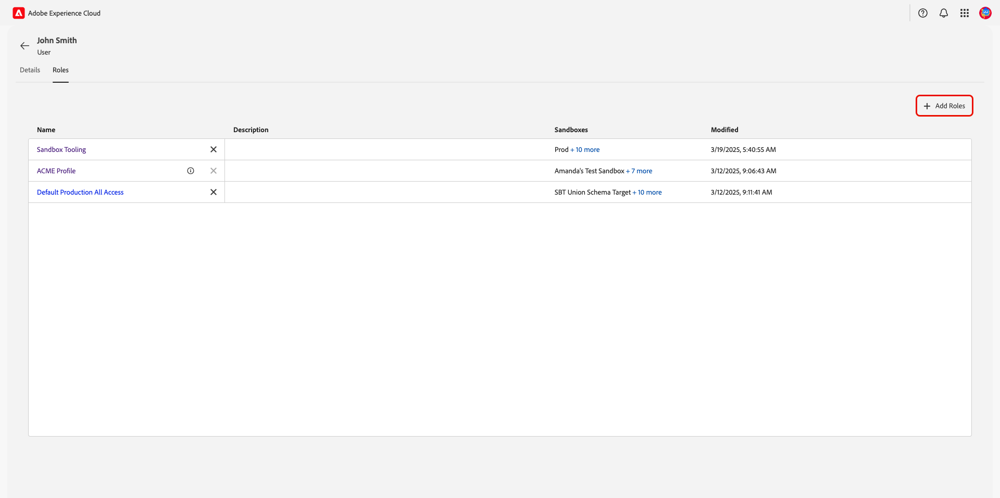
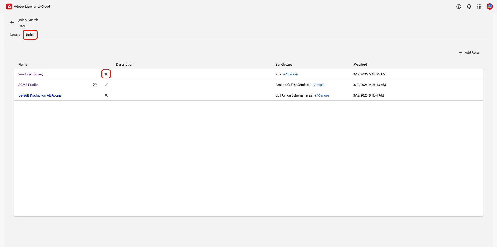
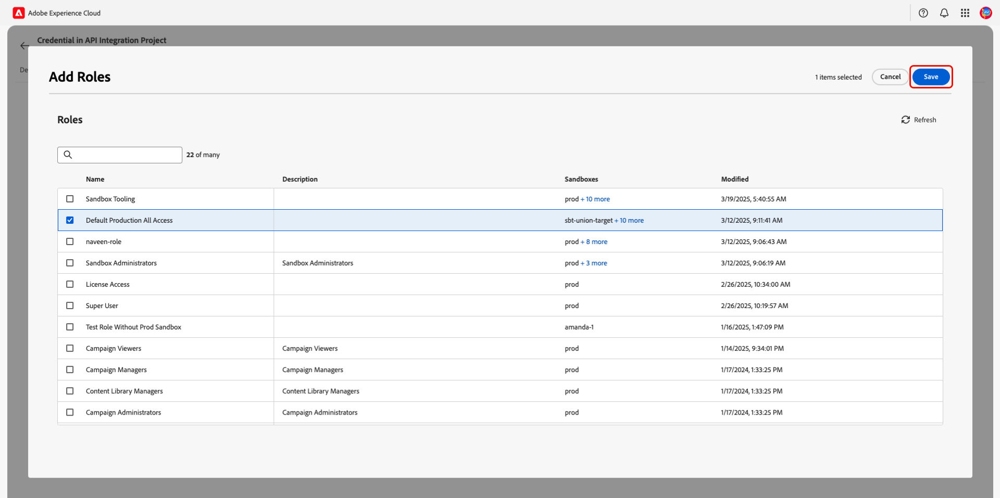

# Gérer les utilisateurs et utilisatrices et ajouter des groupes d’utilisateurs et d’utilisatrices {#manage-users}

>[!CONTEXTUALHELP]
>id="platform_permissions_users_about"
>title="Que sont les utilisateurs et utilisatrices ?"
>abstract="Il s’agit de personnes qui ont accès à Experience Platform. Leur accès aux ressources d’une organisation est géré par l’intermédiaire de rôles."
>additional-url="https://experienceleague.adobe.com/fr/docs/experience-platform/access-control/abac/permissions-ui/roles" text="Gérer les rôles"

Les utilisateurs sont les personnes qui ont accès à Adobe Experience Platform. L’accès d’un utilisateur individuel aux ressources d’une organisation est géré au moyen de [rôles](./roles.md){target="_blank"}. Une entreprise peut également créer des [groupes d’utilisateurs](#user-groups) pour offrir un accès transparent à plusieurs utilisateurs et utilisatrices en même temps. Les utilisateurs sont gérés dans Admin Console et les utilisateurs associés à la carte de produit Adobe Experience Platform apparaissent dans la liste des utilisateurs d’Experience Platform.

## Gérer les utilisateurs et les utilisatrices

<!-- 
ADD LINKS INTO IMPORTANT NOTE BELOW
>[!IMPORTANT]
>
>[!UICONTROL Permissions] manages access control for existing Experience Platform users. To add users to Experience Platform, navigate to Adobe Admin Console through the **[!UICONTROL Edit in admin console]** option. To learn how to add users through the Admin Console, follow the [adding users to Experience Platform](...){#target="_blank"} guide.
-->

Pour afficher les utilisateurs de votre organisation, accédez à **[!UICONTROL Autorisations]** dans [Adobe Experience Cloud](https://experience.adobe.com/){target="_blank"}. Sélectionnez **[!UICONTROL Utilisateurs]** dans le panneau de gauche.

{zoomable="yes"}

Une liste d’utilisateurs s’affiche. Sélectionnez l’utilisateur que vous souhaitez afficher dans la liste. Vous pouvez également utiliser la barre de recherche pour rechercher un utilisateur en saisissant son nom ou son adresse e-mail.

L’onglet **[!UICONTROL Détails]** donne un aperçu de l’utilisateur. La vue d’ensemble affiche le **[!UICONTROL Nom]**, **[!UICONTROL Langues préférées]**, **[!UICONTROL Type de compte]**, **[!UICONTROL ID d’authentification]**, **[!UICONTROL E-mail]**, **[!UICONTROL E-mail vérifié]** statut, **[!UICONTROL Code de pays]** et **[!UICONTROL Numéro de téléphone]** de l’utilisateur.

{zoomable="yes"}

Sélectionnez l’onglet **[!UICONTROL Rôles]** pour afficher les rôles auxquels l’utilisateur est affecté.

{zoomable="yes"}

### Ajouter un rôle à un utilisateur {#add-user-role}

Pour ajouter un rôle à l’utilisateur, sélectionnez **[!UICONTROL Ajouter des rôles]**.

{zoomable="yes"}

La boîte de dialogue **[!UICONTROL Ajouter des rôles]** s’affiche. Sélectionnez le ou les rôles que vous souhaitez ajouter à l’utilisateur ou à l’utilisatrice, puis sélectionnez **[!UICONTROL Enregistrer]**.

{zoomable="yes"}

### Supprimer un rôle d’un utilisateur {#remove-user-role}

Pour supprimer un rôle de l’utilisateur ou de l’utilisatrice, sélectionnez le **X** en regard du nom du rôle.

<!-- 
ADD LINKS INTO IMPORTANT NOTE BELOW

>[!NOTE]
>
>Role's that have been added to a user through a user group cannot be removed through the user's role workspace. Role's that have been added through a user group will have an [!Info icon](/help/images/icons/info.png) beside the **X** containing information about the associated user group. To remove the role, the role would need to be [removed from the user group](#remove-user-group-role).
-->

{zoomable="yes"}

Une boîte de dialogue de confirmation s’affiche. Sélectionnez **[!UICONTROL Confirmer]** pour terminer la suppression du rôle.

{zoomable="yes"}

## Gestion des groupes d’utilisateurs {#user-groups}

Les groupes d’utilisateurs consistent en plusieurs utilisateurs qui ont été regroupés et qui disposent des accès pour exécuter les mêmes fonctions.

<!-- 
ADD LINKS INTO IMPORTANT NOTE BELOW
>[!IMPORTANT]
>
>[!UICONTROL Permissions] manages access control for existing Experience Platform user groups. To add user groups to Experience Platform, navigate to Admin Console through the **[!UICONTROL Edit in admin console]** option. To learn how to add user groups in the Admin Console, follow the [adding user groups to Experience Platform](...){#target="_blank"} guide.
-->

Pour afficher les utilisateurs de votre organisation, accédez à **[!UICONTROL Autorisations]** dans [Adobe Experience Cloud](https://experience.adobe.com/){target="_blank"}.Sélectionnez **[!UICONTROL Groupes]** dans la section **[!UICONTROL Utilisateurs]** du panneau de gauche.

{zoomable="yes"}

Une liste de groupes d’utilisateurs s’affiche. Sélectionnez le groupe que vous souhaitez afficher dans la liste.

L’onglet **[!UICONTROL Détails]** donne un aperçu du groupe d’utilisateurs. La présentation affiche le **[!UICONTROL nom]**, le **[!UICONTROL description]**, le **[!UICONTROL nombre d’utilisateurs]** et le **[!UICONTROL nombre d’administrateurs]** des groupes.

{zoomable="yes"}

Sélectionnez l’onglet **[!UICONTROL Utilisateurs]** pour afficher la liste des utilisateurs affectés au groupe.

{zoomable="yes"}

Sélectionnez l’onglet **[!UICONTROL Rôles]** pour afficher la liste des rôles actuellement affectés au groupe.

{zoomable="yes"}

### Ajouter des rôles à un groupe d’utilisateurs {#add-user-group-role}

Pour ajouter un nouveau rôle au groupe, sélectionnez **[!UICONTROL Ajouter des rôles]**.

{zoomable="yes"}

La boîte de dialogue **[!UICONTROL Ajouter des rôles]** s’affiche. Sélectionnez le ou les rôles à ajouter, puis sélectionnez **[!UICONTROL Enregistrer]**. Les rôles seront ajoutés pour tous les utilisateurs appartenant au groupe d’utilisateurs.

{zoomable="yes"}

### Supprimer des rôles d’un groupe d’utilisateurs {#remove-user-group-role}

Pour supprimer un rôle du groupe d’utilisateurs, sélectionnez le **X** en regard du nom du rôle.

{zoomable="yes"}

Une boîte de dialogue de confirmation s’affiche. Sélectionnez **[!UICONTROL Confirmer]** pour terminer la suppression du rôle.

{zoomable="yes"}

## Informations d’identification de l’API

>[!IMPORTANT]
>
>Seuls les administrateurs système ont la possibilité d’afficher et de gérer les informations d’identification d’API dans les autorisations.

Pour utiliser les API d’Experience Platform en tant qu’utilisateur ou développeur, un administrateur système doit ajouter des informations d’identification d’API en plus du jeu d’autorisations donné à un rôle. Les autorisations vous permettent d’affecter aux rôles des informations d’identification d’API créées précédemment et affectées au produit Experience Platform. Pour obtenir un guide complet sur la création et l’attribution des informations d’identification d’API, ainsi que les autorisations nécessaires, reportez-vous au tutoriel détaillé dans [Authentification et accès aux API Experience Platform](/help/landing/api-authentication.md){target="_blank"}.

Pour afficher les informations d’identification d’API de votre organisation associées à Experience Platform, accédez à **[!UICONTROL Autorisations]** dans [Adobe Experience Cloud](https://experience.adobe.com/){target="_blank"}. Sélectionnez **[!UICONTROL Informations d’identification de l’API]** dans la section **[!UICONTROL Utilisateurs]** du panneau de gauche.

{zoomable="yes"}

>[!NOTE]
>
> Pour afficher les informations d’identification de l’API de votre organisation pour tous les produits de votre organisation ou pour plus d’informations sur les informations d’identification, sélectionnez **[!UICONTROL Modifier dans Admin Console]**.

Une liste des informations d’identification d’API s’affiche. Sélectionnez les informations d’identification d’API à afficher dans la liste.

L’onglet **[!UICONTROL Détails]** donne un aperçu des informations d’identification de l’API. La vue d’ensemble affiche l’attribut **[!UICONTROL Nom]**, **[!UICONTROL Modifié]** date, **[!UICONTROL Modifié par]**, **[!UICONTROL Créé]** date, **[!UICONTROL Créé par]** attribut, **[!UICONTROL API key]**, **[!UICONTROL Technical ID]** et **[!UICONTROL Email]** des informations d’identification.

{zoomable="yes"}

Sélectionnez l’onglet **[!UICONTROL Rôles]**. Une liste des rôles associés aux informations d’identification d’API s’affiche.

{zoomable="yes"}

### Ajouter un rôle à des informations d’identification d’API {#add-api-credential-role}

Pour ajouter un rôle aux informations d’identification d’API, sélectionnez **[!UICONTROL Ajouter des rôles]**.

{zoomable="yes"}

La boîte de dialogue **[!UICONTROL Ajouter des rôles]** s’affiche. Sélectionnez le ou les rôles que vous souhaitez ajouter à l’utilisateur ou à l’utilisatrice, puis sélectionnez **[!UICONTROL Enregistrer]**.

{zoomable="yes"}

### Supprimer un rôle d’informations d’identification d’API {#remove-api-credential-role}

Pour supprimer un rôle des informations d’identification de l’API, sélectionnez le **X** en regard du nom des informations d’identification de l’API.

{zoomable="yes"}

Une boîte de dialogue de confirmation s’affiche. Sélectionnez **[!UICONTROL Confirmer]** pour terminer la suppression du rôle.

{zoomable="yes"}

## Étapes suivantes

Vous savez maintenant comment afficher les détails et les rôles d’un utilisateur, d’un groupe d’utilisateurs et d’informations d’identification d’API. Pour en savoir plus sur le contrôle d’accès basé sur les attributs, consultez la [présentation du contrôle d’accès basé sur les attributs](../overview.md).

<!--
The following video is intended to support your understanding of developer and API credentials.

>[!VIDEO](https://video.tv.adobe.com/v/3446400/?captions=fre_fr&learn=on)
-->