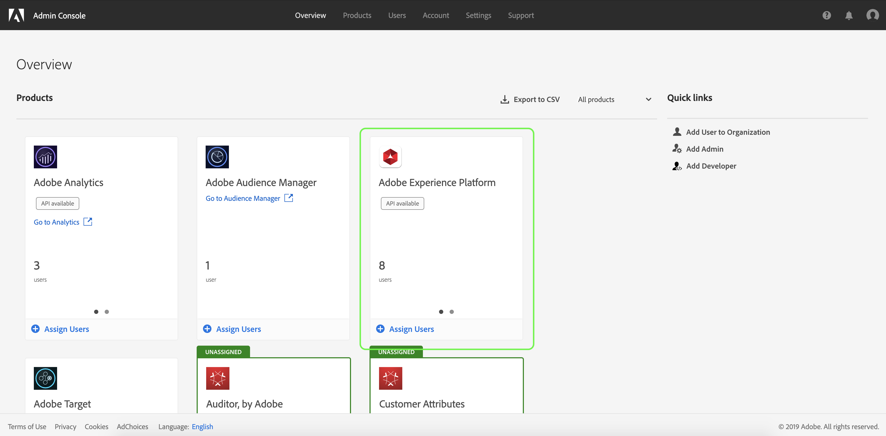

# Parcourir l’espace de travail 

Pour configurer le de la plateforme d’expérience via la console d’administration Adobe, vous devez être administrateur d’une organisation IMS disposant d’un  à la plateforme d’expérience. Bien qu’Adobe prenne en charge des hiérarchies d’administrateurs flexibles pour les organisations IMS, vous devez disposer de droits d’administrateur **** système, d’administrateur **de** produit ou d’administrateur **de de** produits pour configurer les  de. Pour plus d’informations, reportez-vous à l’article du Centre d’aide d’Adobe sur les rôles [d’](https://helpx.adobe.com/enterprise/using/admin-roles.html) administration.

Si vous ne disposez pas des droits d’administrateur, contactez votre administrateur système pour y accéder.

Une fois que vous disposez des droits d’administrateur, accédez à [Adobe Admin Console](https://adminconsole.adobe.com) et connectez-vous à l’aide de vos informations d’identification Adobe. Une fois connecté, la page *Aperçu* s’affiche pour l’organisation IMS pour laquelle vous disposez des droits d’administrateur. Cette page présente les produits auxquels votre organisation IMS est abonnée, ainsi que d&#39;autres contrôles permettant d&#39;ajouter des utilisateurs et des administrateurs à l&#39;organisation IMS dans son ensemble. Cliquez sur **Adobe Experience Platform** pour ouvrir l’espace de travail  pour l’intégration de votre plateforme.

L’espace de travail  pour Adobe Experience Platform s’affiche, s’ouvrant sur l’onglet ** dude produits. Cet onglet vous permet de  tous les de produits et de gérer divers paramètres comme indiqué dans ce.

Ce guide de l’utilisateur se concentre sur l’utilisation de la Console d’administration pour attribuer des autorisations d’accès à la plateforme. Pour plus d&#39;informations sur la navigation dans la Console d&#39;administration, consultez le guide [d&#39;utilisation de la Console d&#39;](https://helpx.adobe.com/enterprise/using/admin-console.html)administration.

## Étapes suivantes

Une fois que vous avez accédé à l’espace de travail , passez à l’étape suivante pour [créer un nouveau de produits](create-profile.md)