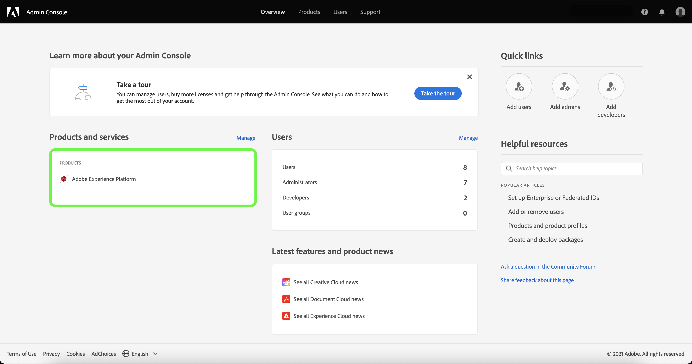
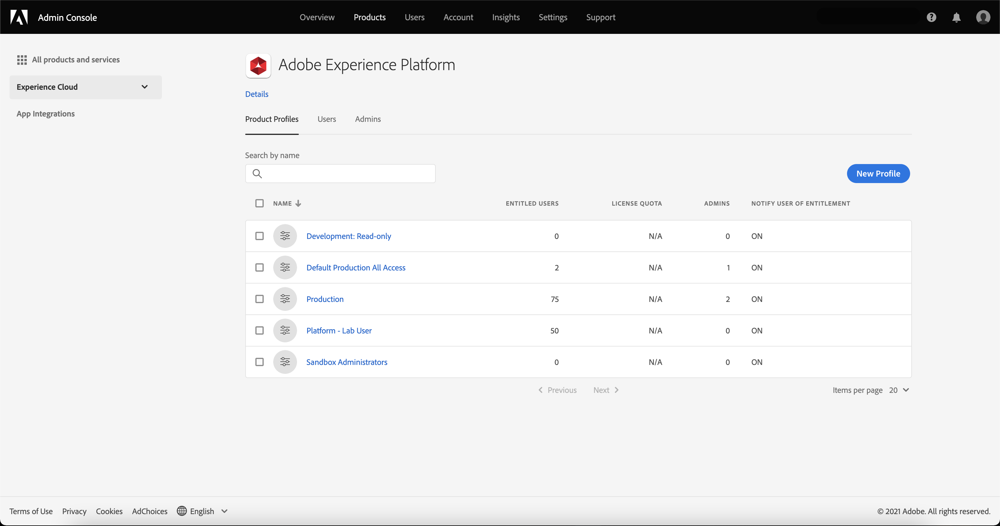

# Sélection dʼun profil de produit pour gérer ses autorisations de contrôle dʼaccès

Pour configurer le contrôle d’accès de [!DNL Experience Platform] via Adobe Admin Console, vous devez être administrateur d’une organisation abonnée à [!DNL Experience Platform]. Bien qu’Adobe prenne en charge des hiérarchies d’administration flexibles pour les organisations, vous devez disposer des privilèges d’administrateur système, d’administrateur de produit ou d’administrateur de profil de produit pour configurer le contrôle d’accès. Pour en savoir plus, consultez l’article du Centre d’aide Adobe sur les [rôles administratifs](https://helpx.adobe.com/fr/enterprise/using/admin-roles.html).

Si vous ne disposez pas de droits d’administrateur, contactez votre administrateur système pour obtenir l’accès.

Une fois que vous disposez des droits d’administrateur, accédez à [Adobe Admin Console](https://adminconsole.adobe.com) et connectez-vous à l’aide de vos informations d’identification Adobe. Une fois la connexion effectuée, la page **[!UICONTROL Overview]** s’affiche pour l’organisation pour laquelle vous disposez de droits d’administrateur. Cette page affiche les produits auxquels votre organisation est abonnée, ainsi que d’autres contrôles permettant d’ajouter des utilisateurs et des administrateurs à l’ensemble de l’organisation. Sélectionnez **[!UICONTROL Adobe Experience Platform]** pour ouvrir l’espace de travail du contrôle d’accès en vue de votre intégration Experience Platform.

L’espace de travail du contrôle d’accès de Adobe Experience Platform s’affiche, s’ouvrant sur l’onglet **[!UICONTROL Product Profiles]** . Cet onglet vous permet d’afficher tous les profils de produits et de gérer divers paramètres comme indiqué dans le présent document.

Ce guide d’utilisation détaille la marche à suivre pour utiliser l’[!DNL Admin Console] afin d’attribuer des autorisations d’accès à Experience Platform. Pour obtenir des informations plus générales sur la façon de parcourir [!DNL Admin Console], consultez le [guide dʼutilisation dʼAdmin Console](https://helpx.adobe.com/fr/enterprise/using/admin-console.html).

## Étapes suivantes

Une fois que vous avez parcouru l’espace de travail du contrôle d’accès, passez à l’étape suivante pour [créer un nouveau profil de produit](create-profile.md).

