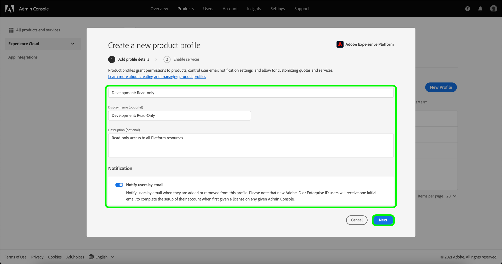

# Création d’un profil produit dans Adobe Admin Console

Pour commencer la création d’un profil, accédez à l’onglet **[!UICONTROL Profils de produit]** et sélectionnez **[!UICONTROL Nouveau profil]**.

La boîte de dialogue **[!UICONTROL Créer un profil de produit]** apparaît et vous invite à saisir un profil, un nom d’affichage facultatif et une description facultative. Sous **[!UICONTROL Notifications utilisateur]**, vous pouvez activer ou désactiver la notification par courrier électronique des utilisateurs lorsqu’ils sont ajoutés ou supprimés du profil.

Lorsque vous avez terminé, sélectionnez **[!UICONTROL Suivant]**.

L’écran suivant vous invite à choisir les services Experience Platform à inclure dans le profil. Cliquez sur le bouton de bascule près d’un service pour le désactiver. Si un service est désactivé, toutes les fonctionnalités qui y sont associées ne seront pas disponibles pour les utilisateurs affectés à ce profil de produit. Lorsque vous avez terminé, sélectionnez **[!UICONTROL Enregistrer]**.

Les clients éligibles à l’édition B2B ou B2P ont accès à l’interface utilisateur B2B. L’interface utilisateur B2B peut être fournie aux utilisateurs par le biais du menu [!UICONTROL Activer les services]. Sélectionnez le bouton bascule à côté de [!UICONTROL IU B2B] pour activer le service pour un profil de produit spécifique, puis sélectionnez **[!UICONTROL Enregistrer]**.

L’option Activer/Désactiver de l’interface utilisateur B2B permet aux utilisateurs d’afficher les workflows B2B relatifs à la gestion des comptes et des opportunités, ainsi que de créer des segments liés au B2B. Pour plus d’informations, consultez la documentation sur [[!DNL Adobe Real-Time Customer Data Platform B2B Edition]](../../rtcdp/b2b-overview.md).

Le nouveau profil de produits a été créé avec succès, et vous êtes redirigé vers la [page de modification des autorisations](#edit-permissions) du profil. Pour plus d’informations sur la gestion des profils de produits après leur création, reportez-vous aux sections relatives à la [gestion des autorisations](#manage-permissions-for-a-product-profile) et à la [gestion des utilisateurs](#manage-users-for-a-product-profile).

## Étapes suivantes

Après avoir créé un nouveau profil de produits, vous pouvez passer à l’étape suivante pour [gérer les autorisations d’un profil de produits](permissions.md)
