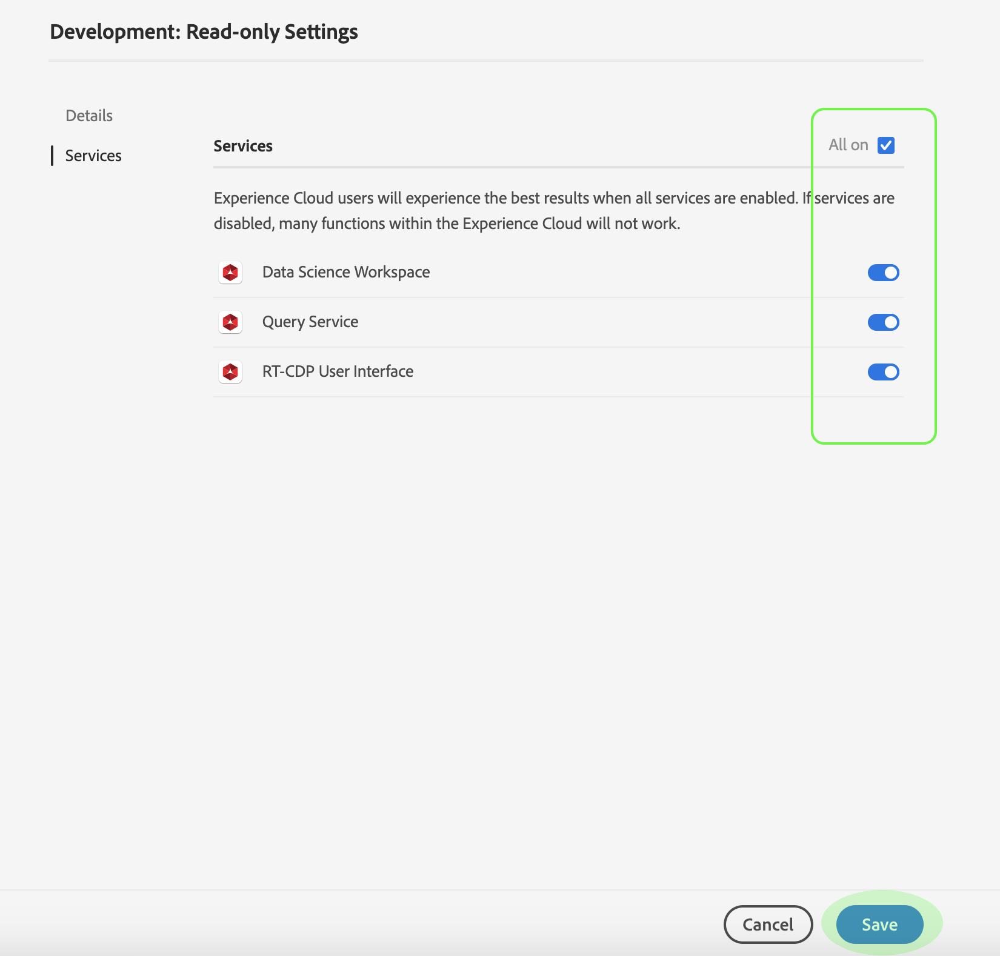

# Gestion des détails et des services supplémentaires pour un de produits 

Vous pouvez configurer les détails d’un et accéder à d’autres services à partir du menu Paramètres *de l’ du* . Pour accéder au menu, cliquez sur **Paramètres** dans la page *du de* produits.

Le menu Paramètres *de* s’affiche, à partir de l’onglet *Détails* . Cet onglet vous permet de saisir et de modifier le nom **de votre****et la** description. Vous pouvez également modifier le nom **d’** affichage ainsi que les paramètres de notification par courrier électronique de votre compte.

Cliquez sur **Services** pour accéder à la page *Services* .

Le menu *Services* vous permet de modifier un accès de  à d’autres services de plateforme qui ont été configurés au moment de la création du  de. Selon votre  de plateformes , ces services peuvent inclure :

- Espace de travail Data Science
- Service 
- Interface utilisateur de la plateforme de données clientes en temps réel (pour CDP en temps réel uniquement)

Cliquez sur le bouton bascule sur le côté droit d’un service donné pour l’activer ou le désactiver. Vous pouvez également cocher la case **Tout sur** pour activer ou désactiver tous les services répertoriés.

Lorsque vous avez terminé, cliquez sur **Enregistrer**.

