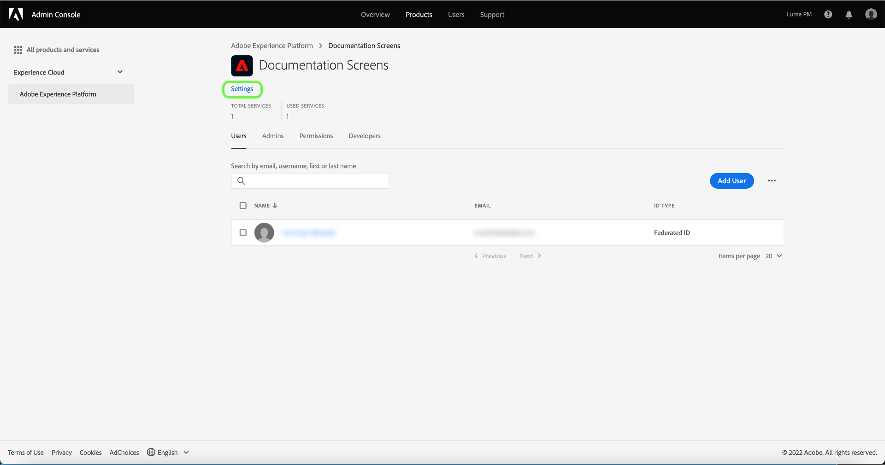
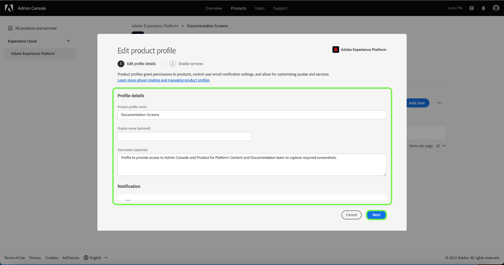

# Gestion des détails et des services supplémentaires pour un profil de produit

Vous pouvez configurer les détails d’un profil et accéder aux services supplémentaires à partir du menu **[!UICONTROL Paramètres du profil]**. Pour accéder au menu, sélectionnez **[!UICONTROL Paramètres]** dans la page **[!UICONTROL Profil de produit]**.

Le menu **[!UICONTROL Modifier le profil du produit]** s’affiche et démarre sur l’onglet **[!UICONTROL Modifier les détails du produit]**. Cet onglet vous permet de saisir et de modifier le nom du profil et sa description. Vous pouvez également modifier le nom d’affichage ainsi que les paramètres de notification par e-mail de votre compte.

Sélectionnez **[!UICONTROL Suivant]** pour accéder à la page **[!UICONTROL Activer les services]**.

Le menu **[!UICONTROL Activer les services]** vous permet de modifier l’accès d’un profil aux services [!DNL Experience Platform] supplémentaires qui ont été initialement configurés lors de la création du profil. En fonction de votre abonnement [!DNL Experience Platform], ces services peuvent inclure :

- [!DNL Data Science Workspace]
- [!DNL Query Service]
- Interface utilisateur de [!DNL Adobe Real-Time Customer Data Platform] (pour Real-Time CDP uniquement)
- Interface utilisateur B2B

Cliquez sur le bouton à droite d’un service particulier pour l’activer ou le désactiver. Vous pouvez également cocher la case **[!UICONTROL Tout activer]** pour activer ou désactiver tous les services répertoriés.

Lorsque vous avez terminé, sélectionnez **[!UICONTROL Enregistrer]**.

Les clients éligibles à l’édition B2B ou B2P ont accès à l’interface utilisateur B2B. L’interface utilisateur B2B peut être fournie aux utilisateurs par le biais du menu [!UICONTROL  Activer les services ]. Sélectionnez le bouton bascule à côté de [!UICONTROL IU B2B] pour activer le service pour un profil de produit spécifique, puis sélectionnez **[!UICONTROL Enregistrer]**.

L’option Activer/Désactiver de l’interface utilisateur B2B permet d’afficher les workflows B2B relatifs à la gestion des comptes et des opportunités, ainsi que de créer des segments liés au B2B. Pour plus d’informations, consultez la documentation sur [[!DNL Adobe Real-Time Customer Data Platform B2B Edition]](../../rtcdp/b2b-overview.md).

