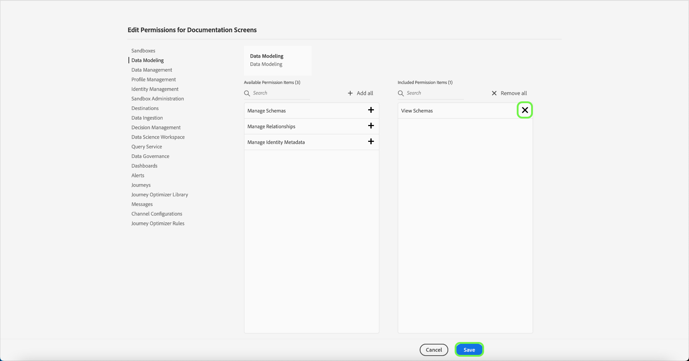

# Gestion des autorisations d’un profil de produit

Immédiatement après la [création d’un nouveau profil de produit](#create-a-new-product-profile), vous êtes invité à configurer les autorisations du profil. Si vous modifiez les autorisations d’un profil existant, sélectionnez le profil depuis l’onglet **[!UICONTROL Profils de produit]** pour ouvrir la page de détails du profil, puis sélectionnez **[!UICONTROL Autorisations]**.

Les autorisations sont divisées en catégories et répertoriées sur cette page. La liste affiche le nom de la catégorie, le nombre d’autorisations qu’elle contient (et le nombre d’autorisations actives) et sa description. Reportez-vous au tableau de [Autorisations des ressources](/help/access-control/home.md#permissions) pour obtenir une répartition des autorisations disponibles pour chaque rôle.

Sélectionnez nʼimporte quelle catégorie de la liste pour ouvrir la page **[!UICONTROL Modifier les autorisations]**.

La page **[!UICONTROL Modifier les autorisations]** fournit un espace de travail servant à ajouter et à supprimer des autorisations pour le profil de produit sélectionné. Le côté gauche de l’écran affiche une liste de catégories d’autorisation. Sélectionner une catégorie modifie les autorisations affichées sous **[!UICONTROL Éléments dʼautorisation disponibles]**.

Par exemple, pour mettre à jour les autorisations pour la modélisation des données, sélectionnez **[!UICONTROL Modélisation des données]**.

Pour ajouter une autorisation, sélectionnez l’icône plus **(+)** en regard du nom de l’autorisation. Vous pouvez également sélectionner **[!UICONTROL Ajouter tout]** pour ajouter au profil toutes les autorisations sous la catégorie actuelle. Les autorisations ajoutées s’affichent sous **[!UICONTROL Éléments d’autorisation inclus]**.

>[!NOTE]
>
>La liste des **[!UICONTROL Éléments d’autorisations inclus]** n’affiche que les autorisations ajoutées à partir de la catégorie actuellement sélectionnée.

Pour supprimer une autorisation, sélectionnez lʼicône **X** à côté du nom de lʼautorisation ou sélectionnez **[!UICONTROL Supprimer tout]** pour supprimer toutes les autorisations sous la catégorie actuelle. Les autorisations supprimées réapparaissent sous **[!UICONTROL Éléments d’autorisation disponibles]**.

Continuez à parcourir les catégories disponibles et ajoutez toutes les autorisations souhaitées. Lorsque vous avez terminé, sélectionnez **[!UICONTROL Enregistrer]**.

L’onglet **[!UICONTROL Autorisations]** du profil de produit réapparaît et indique que les autorisations sélectionnées sont désormais actives.

## Étapes suivantes

Une fois les autorisations établies, vous pouvez passer à l’étape suivante pour [gérer les détails et les services pour un profil de produit](details-and-services.md)
