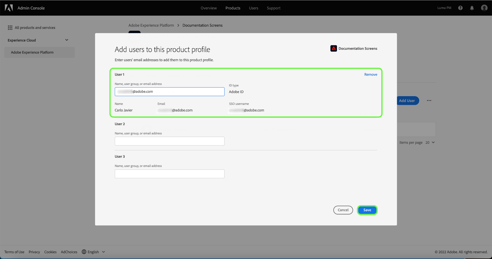

# Gestion des utilisateurs pour un profil de produit

Pour affecter ou supprimer des utilisateurs d’un profil de produit, ouvrez la page de détails du profil et accédez à l’onglet **[!UICONTROL Users]** . À partir de là, sélectionnez **[!UICONTROL Add User]**.

![Page de détails du profil de produit présentant les utilisateurs répertoriés dans l’onglet [!UICONTROL Users].](../images/add-user.png)

La boîte de dialogue **[!UICONTROL Add User]** s’affiche. Le champ de recherche vous permet de rechercher des utilisateurs à ajouter par nom ou par adresse e-mail. Lorsque vous tapez, les utilisateurs correspondants s’affichent dans une fenêtre de saisie semi-automatique sous la zone de texte.

>[!NOTE]
>
>Si un utilisateur n’apparaît pas dans la fenêtre de saisie semi-automatique, saisissez son adresse e-mail complète dans la barre de recherche. Une invitation sera envoyée à l’adresse électronique avec des instructions sur la configuration d’un compte Adobe ID.

Une fois que vous avez sélectionné un utilisateur, sélectionnez **[!UICONTROL Save]** pour l’ajouter au profil de produit.

La vidéo suivante est destinée à vous aider à comprendre la gestion des administrateurs pour un profil de produit.

>[!VIDEO](https://video.tv.adobe.com/v/333860/?learn=on)

## Étapes suivantes

Maintenant que vous avez appris à contrôler l’accès aux fonctionnalités d’Experience Platform à l’aide de la [!DNL Admin Console], consultez la section de l’annexe de la [présentation du contrôle d’accès](../home.md) pour en savoir plus sur chaque autorisation individuelle et sur les fonctionnalités d’Experience Platform auxquelles elles donnent accès.
