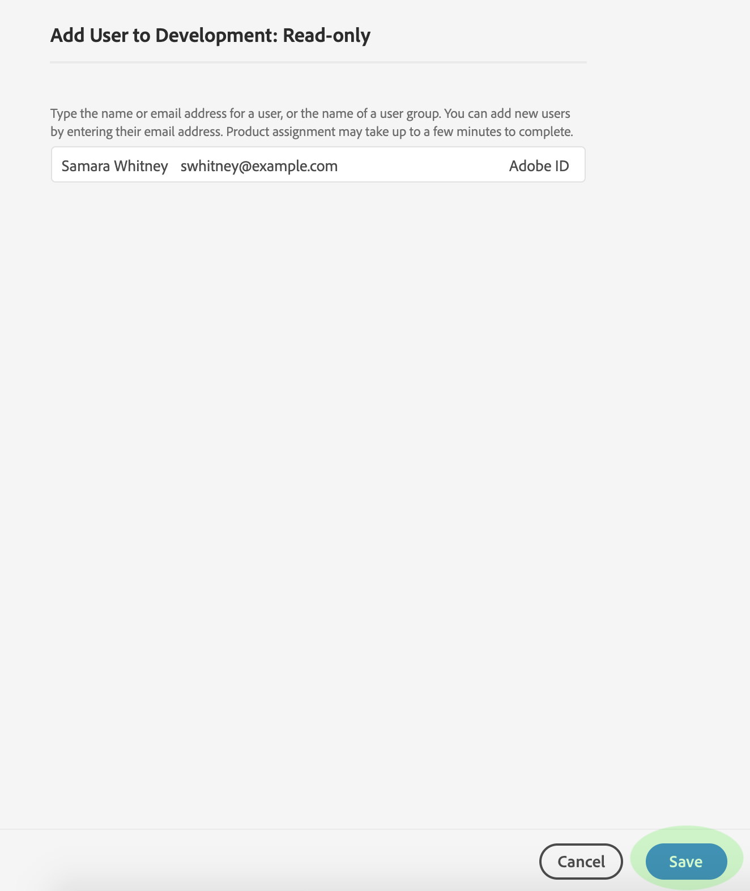

# Gestion des utilisateurs pour un de produits

Pour affecter ou supprimer des utilisateurs d’un de produits, ouvrez la page de détails des  de et accédez à l’onglet *Utilisateurs* . A partir de là, cliquez sur Utilisateur **Ajouter**.

La boîte de dialogue Utilisateur ** Ajouter s’affiche. Le champ de recherche vous permet de rechercher des utilisateurs à ajouter par nom ou par courrier électronique. Lorsque vous tapez, les utilisateurs correspondants s’affichent dans une fenêtre de saisie automatique sous la zone de texte.

>[!NOTE] Si un utilisateur n’apparaît pas dans la fenêtre de saisie automatique, entrez son adresse électronique complète dans la barre de recherche. Une invitation sera envoyée au courrier électronique avec des instructions sur la configuration d’un compte d’ID Adobe.

Une fois que vous avez sélectionné un utilisateur, cliquez sur **Enregistrer** pour l’ajouter au de produits.

L’onglet *Utilisateurs* du de produits réapparaît, où l’utilisateur ajouté est désormais répertorié.

## Étapes suivantes

Maintenant que vous avez appris à contrôler l&#39;accès aux fonctionnalités de la plateforme par le biais de la Console d&#39;administration, reportez-vous à la section de l&#39;annexe du [d&#39;aperçu](../home.md) du pour en savoir plus sur chaque autorisation individuelle et les fonctionnalités de la plateforme auxquelles ils donnent accès.