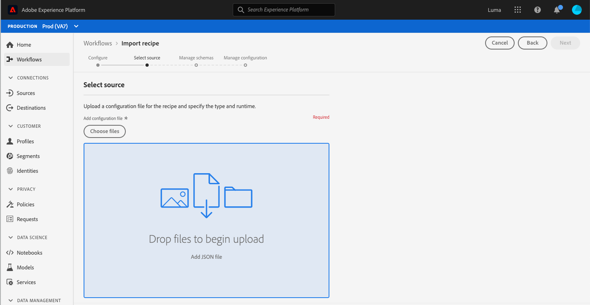

# Solutions d’accessibilité personnalisées pour Experience Platform

Adobe Experience Platform est continuellement amélioré pour répondre aux besoins de tous les types d’utilisateurs et appliquer les normes internationales afin d’inclure les personnes atteintes d’une déficience visuelle ou auditive, souffrant de mobilité réduite ou autre. Ce document décrit les solutions d’accessibilité personnalisées dans l’interface utilisateur d’Experience Platform.

## Présentation de la page d’accueil et de l’interface utilisateur

L’interface utilisateur d’Experience Platform applique les rapports de contraste requis pour le texte normal, les graphiques et les composants de l’interface utilisateur. Les couleurs de l’interface utilisateur ont également été choisies pour prendre en charge l’accessibilité de tous les utilisateurs, y compris ceux présentant un handicap visuel.

Dans , les éléments de l’interface utilisateur sur lesquels l’utilisateur peut cliquer ou agir à l’aide d’un pointeur peuvent également utiliser un clavier. Cela inclut le volet de navigation de gauche, les lecteurs vidéo, les tableaux, etc.

Experience Platform s’efforce de respecter les normes internationales en matière d’accessibilité. Cela inclut les règles pour l’accessibilité des contenus web 2.1 aux niveaux A et AA, ainsi que les normes web WAI-ARIA (Web Accessibility Initiative - Accessible Rich Internet Applications).

## Volet de navigation de gauche

Le volet de navigation de gauche de l’interface utilisateur d’Experience Platform est accessible à partir du clavier et fournit un contraste des couleurs dans les états Normal, De survol et De sélection, conformément aux normes d’accessibilité.

Sur l’écran d’accueil, les utilisateurs peuvent utiliser la touche de tabulation pour accéder au volet de navigation de gauche. En sélectionnant **Maj + touche de tabulation** l’utilisateur est renvoyé à l’écran d’accueil.

Lorsque le focus se trouve sur le volet de navigation de gauche, la touche de **tabulation** permet aux utilisateurs de développer et de réduire l’interaction. La possibilité de développer ou réduire le volet de navigation de gauche est activée avec **Entrée (Retour)**.

Lorsque le focus se trouve sur le volet de navigation de gauche, les touches fléchées vers le haut et vers le bas permettent d’accéder à chaque élément de la navigation dans un cycle continu (en d’autres termes, le focus reste sur le volet de navigation de gauche tant que l’utilisateur ne le quitte pas à l’aide de la touche de tabulation). Le focus apparaît pour les éléments de navigation sélectionnés. La sélection en cours s’affiche avec un texte en surbrillance et en gras. Lorsqu’un élément du volet de navigation de gauche est sélectionné, la touche **Entrée (Retour)** ouvre l’élément d’interface utilisateur sélectionné dans le panneau de droite. Toutefois, le focus reste sur le volet de navigation de gauche jusqu’à ce que l’utilisateur le quitte à l’aide de la touche de tabulation.

Certaines fonctionnalités d’Experience Platform ne sont pas activées pour tous les utilisateurs. Ces éléments apparaissent dans la navigation, mais ne peuvent pas être sélectionnés. Lorsque vous naviguez à l’aide du clavier, ces éléments sont ignorés lors de la navigation par flèche et ne peuvent pas être sélectionnés à l’aide de la touche **Entrée (Retour)**.

## Boîte de dialogue de la vidéo intégrée

Vous pouvez visionner des vidéos dans Experience Platform à l’aide de la navigation au clavier, qui permet de mettre en surbrillance et de sélectionner un lien vidéo disponible. Une boîte de dialogue de vidéo intégrée s’ouvre alors dans l’interface utilisateur d’Experience Platform.

## Accessibilité de la boîte de dialogue de la vidéo à l’aide du clavier

Vous pouvez également naviguer dans la boîte de dialogue de la vidéo intégrée à l’aide du clavier. Le tableau suivant décrit la navigation au clavier complète disponible pour la boîte de dialogue de la vidéo intégrée.

| Élément de la boîte de dialogue | Accessibilité à l’aide du clavier | Description |
|---|---|---|
| Lecture et pause | Touche de tabulation Barre d’espacement | Utilisez la touche de **tabulation** pour définir le focus sur le bouton de lecture. La **barre d’espacement** permet de démarrer la lecture de la vidéo ou de la mettre en pause. |
| Barre de défilement | Touche de tabulation Flèche à gauche Flèche à droite | Lorsque la vidéo est en cours de lecture, utilisez la touche de **tabulation** pour placer le focus sur la barre de défilement. Lorsque le focus se trouve sur la barre de défilement, les **touches fléchées à gauche et à droite** font respectivement avancer et reculer la lecture vidéo de 5 secondes. |
| Mode muet | Touche de tabulation Barre d’espacement | Utilisez la touche de **tabulation** pour placer le focus sur l’élément de volume muet. Utilisez la **barre d’espacement** pour couper ou remettre le son de la lecture vidéo. |
| Volume | Touche de tabulation Flèche à gauche Flèche à droite | Utilisez la touche de **tabulation** pour placer le focus sur l’élément de volume. Les **touches fléchées à gauche et à droite** augmentent ou diminuent respectivement le volume. |
| [!UICONTROL Sous-titres] (« cc ») | Touche de tabulation Entrée Flèche vers le haut Flèche vers le bas | Utilisez la touche de **tabulation** pour atteindre l’élément [!UICONTROL Sous-titres] (« cc »). Utilisez la touche **Entrée** pour ouvrir le menu, puis les **touches fléchées vers le haut et vers le bas** pour sélectionner la langue des sous-titres. Appuyez sur **Entrée** pour confirmer votre sélection. |
| [!UICONTROL Qualité] | Touche de tabulation Entrée Flèche vers le haut Flèche vers le bas | Utilisez la touche de **tabulation** pour placer le focus sur l’élément [!UICONTROL Qualité]. Utilisez la touche **Entrée** pour ouvrir le menu, puis les **touches fléchées vers le haut et vers le bas** pour sélectionner la qualité de la vidéo. Appuyez sur **Entrée** pour confirmer votre sélection. |
| Plein écran | Touche de tabulation Barre d’espacement ou Entrée Échap | Utilisez la touche de **tabulation** pour placer le focus sur l’élément Plein écran. Utilisez la **barre d’espacement ou la touche Entrée** pour activer l’affichage plein écran. Appuyez sur **Échap** (« esc ») pour quitter le mode plein écran. |
| Fermer | Touche de tabulation Barre d’espacement ou Entrée | Utilisez la touche de **tabulation** pour placer le focus sur le bouton Fermer. Utilisez la **barre d’espacement ou la touche Entrée** pour quitter la boîte de dialogue de la vidéo. |

>[!NOTE]
>
>À tout moment pendant la lecture, la touche Échap (« esc ») peut être utilisée pour fermer la boîte de dialogue de la vidéo intégrée.

## Glisser-déposer un fichier

Dans Experience Platform, toutes les zones de glisser-déposer de sélection de fichier sont accessibles à l’aide du clavier. L’utilisation de la touche de **tabulation** pour mettre en surbrillance le bouton **[!UICONTROL Choisir des fichiers]** ainsi que l’utilisation de la touche **Entrée ou de la barre d’espacement** afin de le sélectionner invoquent l’interface utilisateur de sélection de fichier du système d’exploitation.

Une fois le fichier chargé, une icône de suppression devient accessible à l’aide du clavier. Cela permet de supprimer le fichier sélectionné et d’en charger un nouveau. Les utilisateurs peuvent utiliser la touche de **tabulation** pour placer le focus sur l’icône de suppression, puis appuyer sur **Entrée ou la barre d’espacement** pour la sélectionner. Une fois le fichier supprimé, le focus se trouve automatiquement sur le bouton **[!UICONTROL Choisir des fichiers]**, qui peut être sélectionné.

Si le fichier chargé n’est pas au bon format, une icône d’erreur apparaît accompagnée d’un message d’erreur. Le focus se trouve alors sur le bouton **[!UICONTROL Choisir des fichiers]**, qui peut être sélectionné.

Sélectionner une zone de glisser-déposer à l’aide de la souris invoque également l’interface utilisateur de sélection de fichier. Par ailleurs, l’utilisateur peut sélectionner un fichier et le faire glisser sur la zone pour démarrer le chargement.

## Navigation dans un tableau

Tous les tableaux de l’interface utilisateur d’Experience Platform sont accessibles à l’aide du clavier. La navigation et l’interaction avec les lignes et les colonnes d’un tableau sont possibles grâce à une série de raccourcis clavier :

* Dans l’en-tête du tableau, utilisez la **flèche vers le bas** pour parcourir le tableau. Les en-têtes de tableau peuvent être sélectionnés lors de la navigation à l’aide de la touche de **tabulation**. Vous pouvez modifier l’ordre de tri à l’aide de la **barre d’espacement**.
* Les **touches fléchées vers le haut et vers le bas** permettent de se déplacer vers le haut et vers le bas parmi les lignes du tableau.
* Lorsqu’une ligne est sélectionnée ou fait l’objet du focus, l’utilisation de la touche **Entrée** permet d’obtenir des détails dans le rail de droite.
* Lorsqu’une ligne est sélectionnée ou fait l’objet du focus, utilisez les **touches fléchées** pour vous déplacer parmi tous les éléments de la ligne.
* Appuyez sur **Entrée** pour sélectionner un élément de la ligne. Les utilisateurs disposant de lecteurs d’écran sont avertis si une nouvelle fenêtre doit s’ouvrir.
* Lorsque vous effectuez un zoom sur 200 % ou plus, l’icône **inspecteur de rail** s’affiche lorsque le rail droit se réduit afin d’offrir plus d’espace de visualisation pour le tableau.

### Accessibilité de la navigation dans un tableau à l’aide du clavier

| Accessibilité à l’aide du clavier | Description |
|---|---|
| DÉBUT (fonction + flèche à gauche) | Redirige les utilisateurs vers le premier élément de la ligne qui fait l’objet du focus |
| FIN (fonction + flèche à droite) | Redirige les utilisateurs vers le dernier élément de la ligne qui fait l’objet du focus |
| Page vers le haut | Remonte 10 lignes dans le tableau (par page) |
| Page vers le bas | Descend 10 lignes dans le tableau (par page) |
| Contrôle + DÉBUT | Atteint la première ligne du tableau |
| Contrôle + FIN | Atteint la première ligne du tableau par page |

## Interface utilisateur de l’éditeur de schéma

L’interface utilisateur de l’éditeur de schéma est accessible à l’aide de la fonctionnalité suivante :

* L’éditeur de schéma prend en charge la navigation au clavier, y compris l’utilisation de la touche de **tabulation** pour naviguer parmi les éléments de l’interface utilisateur.
* La touche de **tabulation** permet d’accéder au champ de recherche, puis à l’arborescence du schéma.
* L’arborescence du schéma prend en charge l’utilisation de touches fléchées pour naviguer au sein de son interface utilisateur.
   * Les **flèches vers le haut et vers le bas** peuvent être utilisées pour parcourir l’arborescence.
   * Les **flèches à gauche et à droite** peuvent être utilisées pour développer et réduire les nœuds ou passer d’une action en ligne à l’autre dans l’arborescence du schéma.
* La touche **Entrée (Retour)** active les détails des nœuds individuels dans le panneau des détails à droite.
* La touche **Début** renvoie au haut de l’arborescence.
* La touche **Fin** permet d’accéder au bas de l’arborescence.
* L’arborescence du schéma comprend également des libellés ARIA pour les lecteurs d’écran.

## Interface utilisateur du créateur de segments

Lors de l’utilisation de l’interface utilisateur du créateur de segments pour créer, modifier et interagir avec des segments dans Experience Platform, les fonctionnalités suivantes améliorent l’accessibilité :

* L’interface utilisateur du créateur de segments est accessible par le biais de la navigation au clavier.
* Les lecteurs d’écran doivent reconnaître le balisage des titres et peuvent annoncer le titre ainsi que son niveau.
* D’autres technologies d’assistance peuvent modifier l’affichage visuel d’une page à l’aide de titres codés de manière adéquate pour afficher un aperçu ou une autre vue.

Vous pouvez maintenant réduire ou développer les rails gauche et droit de la zone de travail du créateur de segments pour gagner de l’espace à l’écran. Cette fonctionnalité est particulièrement utile, car elle offre des fonctionnalités complètes avec un zoom de 200 %.

## Éditeur de Query Service

Les fonctionnalités d’accessibilité suivantes sont disponibles dans l’éditeur de Query Service :

* Le contraste des couleurs dans l’interface utilisateur de l’éditeur de Query Service respecte la conformité en matière d’accessibilité.
* La navigation au clavier est prise en charge en dehors de l’interface utilisateur de l’éditeur. L’interface utilisateur de l’éditeur est un miroir de code incorporé.

>[!NOTE]
>
>Par défaut, le requêteur ne gère pas la clé **Tab**. Pour appeler la fonctionnalité **Tab** dans l’éditeur, vous devez appuyer sur la touche **Échap**, puis sur **Tab** directement après. Appuyez à nouveau sur **Tab** pour déplacer le focus au-delà de l’éditeur.

## Onglet Vue du système dans Sources et Destinations

Lorsque vous parcourez la **[!UICONTROL Vue du système]** dans Sources et Destinations, la fonctionnalité suivante améliore l’accessibilité :

* La touche de **tabulation** définit le focus sur la première carte de connexion source.
   * Appuyez à nouveau sur la touche de **tabulation** pour déplacer le focus sur le bouton à l’intérieur de la carte.
   * Appuyez sur **Entrée** pour activer le bouton d’appel à l’action dans la carte.
* Appuyer sur **Entrée** sur la carte de connexion active également l’affichage de plus de détails dans le rail de droite.
   * Lorsque le rail de droite est activé, le focus est défini sur cette zone. La touche de **tabulation** place le focus sur le bouton **Fermer** du volet du rail de droite. Appuyer à nouveau sur la touche de **tabulation** déplace le focus sur le volet du rail de droite.
   * S’il existe plusieurs cartes de connexion source, la touche de **tabulation** permet de se déplacer parmi les connexions.
   * Utilisez les **touches fléchées (vers le haut, le bas, à gauche et à droite)** pour vous déplacer dans la liste des sources.
   * Appuyez sur la touche de **tabulation** pour définir le focus sur le volet du rail de droite.
