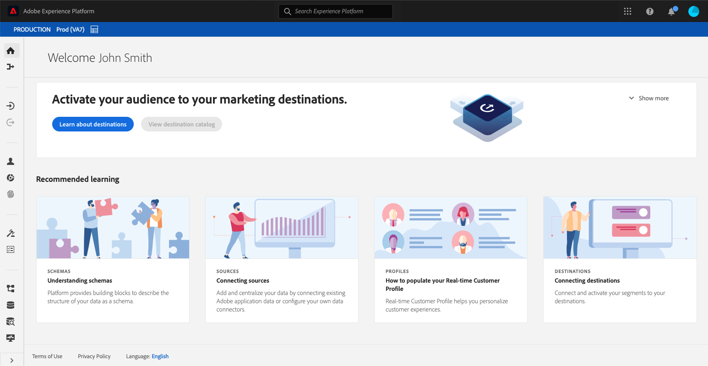

# Fonctionnalités d’accessibilité dans Experience Platform

Adobe Experience Platform s’engage à fournir des fonctionnalités accessibles et inclusives à toutes les personnes, y compris les utilisateurs utilisant des dispositifs d’assistance tels que des logiciels de reconnaissance vocale et des lecteurs d’écran. Ce document décrit les fonctionnalités d’accessibilité générales prises en charge par Platform, notamment la navigation au clavier, la structure sémantique, un contraste suffisant entre les éléments de premier plan et les éléments d’arrière-plan, ainsi que la prise en charge des technologies d’assistance.

## Technologies d’assistance

Les utilisateurs présentant un handicap dépendent fréquemment du matériel et des logiciels, appelés technologies d’assistance, pour accéder au contenu numérique et utiliser des produits logiciels. Adobe Experience Platform prend en charge plusieurs types de technologies d’assistance (AT), telles que les lecteurs d’écran, les logiciels de zoom et de reconnaissance vocale, en suivant les bonnes pratiques d’accessibilité, telles que l’utilisation de code sémantique, d’équivalents textuels, d’étiquettes et d’ARIA si nécessaire. Les éléments interactifs de l’interface utilisateur de l’Experience Platform utilisent des libellés, des noms accessibles et des rôles correspondants qui identifient à la fois leur objectif et leur état actuel. Ainsi, les technologies d’assistance, telles que les lecteurs d’écran, peuvent lire les étiquettes et d’autres informations aux utilisateurs afin qu’ils puissent facilement interagir avec les commandes de l’application.

## Accessibilité au clavier

Experience Platform s’efforce de prendre en charge l’accessibilité complète du clavier.

Les éléments de navigation suivants facilitent l’accessibilité :
* La touche de tabulation se déplace entre les éléments de l’interface utilisateur, les sections et les groupes de menus.
* Les touches fléchées se déplacent dans les groupes de menus pour définir la cible d’action sur des éléments principaux individuels.
* Maj + tabulation fait marche arrière dans l’ordre de tabulation.
* Les touches Retour (Entrée) et Barre d’espacement activent les éléments sélectionnés.
* La touche Échap (ESC) fait office de bouton d’annulation pour fermer une boîte de dialogue lorsqu’elle est présente.
* Experience Platform affiche une bordure bleue autour d’un élément sélectionné afin d’indiquer clairement quel élément de l’interface utilisateur a actuellement le focus.

## Palettes et contraste des couleurs

Experience Platform s’efforce de respecter la norme [WCAG 2.1 AA](https://www.w3.org/TR/WCAG/), y compris les exigences en matière de contraste des couleurs. L’interface utilisateur de l’Experience Platform offre un contraste suffisant dans l’application pour garantir une expérience d’affichage accessible aux utilisateurs présentant une faible vision ou des défauts de vision des couleurs.

## Validation des champs requise

Lors de l’ajout de données, de la création de schémas ou de la définition de segments, les champs obligatoires sont indiqués visuellement, à l’aide d’un astérisque en regard du libellé de texte d’un champ, et par programmation. Ces champs déclenchent la validation lorsque vous saisissez des données non valides dans les champs et lors de l’enregistrement. Si un champ obligatoire n’est pas validé, il est signalé en rouge avec une icône d’erreur et une description écrite du problème qui doit être corrigé s’affiche également.

