# Guide de gestion des balises

Les balises vous permettent de gérer des taxonomies de métadonnées afin de classer les objets métier pour une découverte et une catégorisation plus simples. Les balises peuvent aider à identifier des attributs taxonomiques importants pour les audiences avec lesquelles vos équipes travailleront, afin qu’elles puissent les trouver plus rapidement et également regrouper des audiences communes dans un descripteur. Vous devez identifier les catégories de balises courantes, telles que les régions géographiques, les unités opérationnelles, les lignes de produits, les projets, les équipes, les périodes (trimestres, mois, années) ou toute autre catégorie qui peut aider à donner du sens à votre équipe et à faciliter la découverte d’audiences. 

## Création d&#39;une balise {#create-tag}

Pour créer une balise, sélectionnez **[!UICONTROL tags]** dans le volet de navigation de gauche, sélectionnez la catégorie de balise de votre choix.

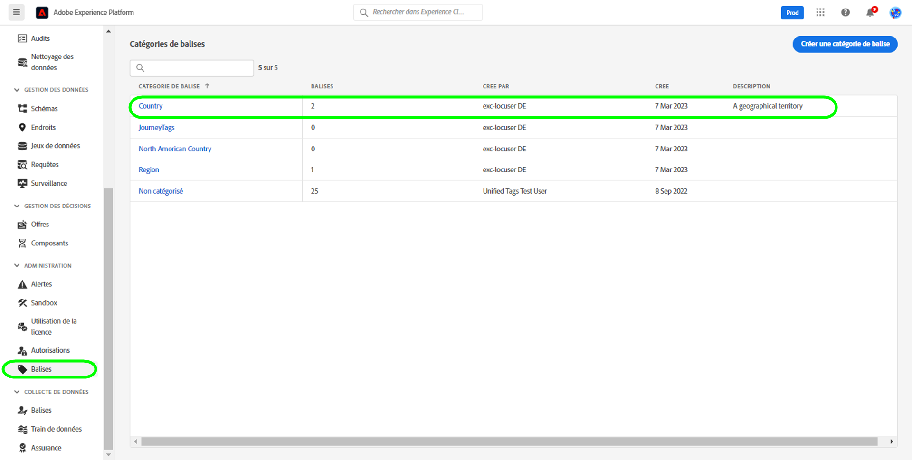

Sélectionner **[!UICONTROL Créer une balise]** pour créer une balise.

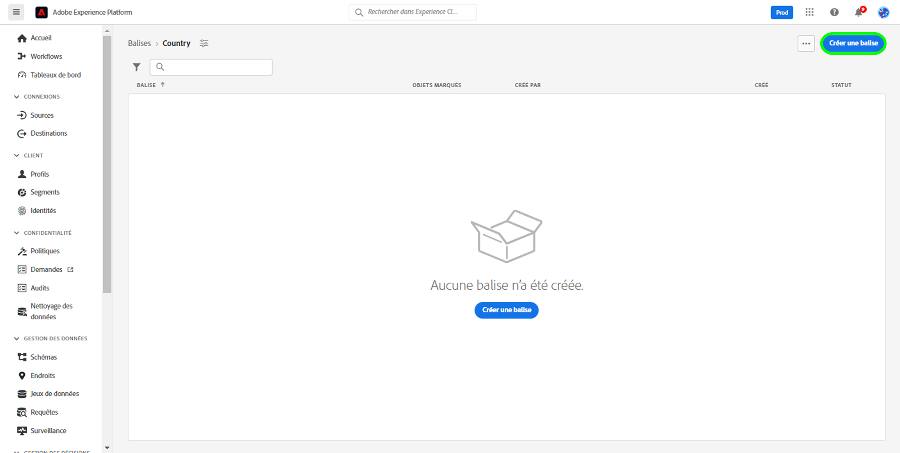

Le **[!UICONTROL Créer une balise]** s’affiche, vous invitant à saisir un nom de balise unique. Lorsque vous avez terminé, sélectionnez **[!UICONTROL Enregistrer]**.

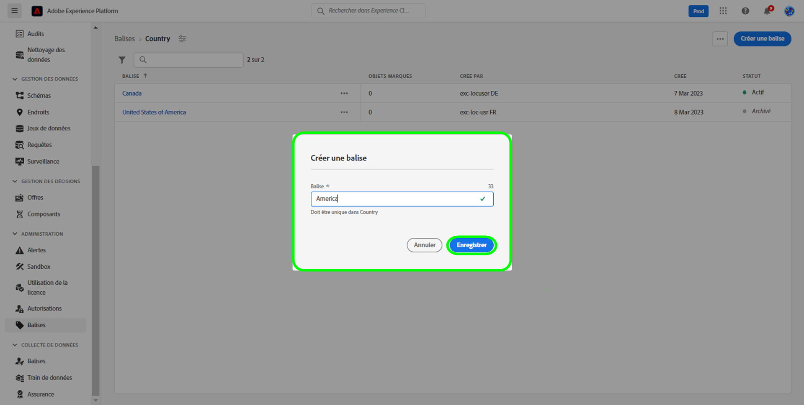

La nouvelle balise a été créée avec succès et vous êtes redirigé vers l’écran des balises où la balise nouvellement créée apparaît dans la liste.

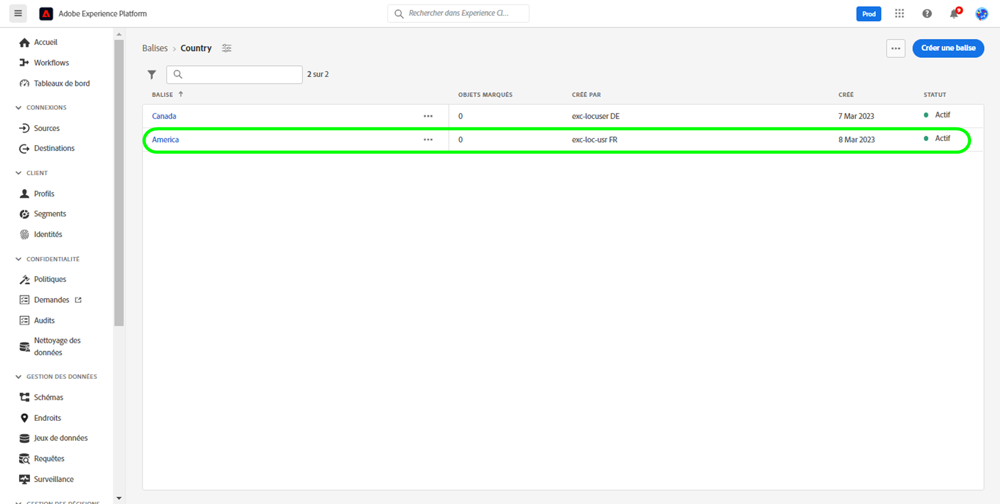

## Modification d’une balise {#edit-tag}

La modification d’une balise permet de corriger des fautes d’orthographe, de nommer des mises à jour de convention ou de terminologie. La modification d’une balise permet de conserver son association avec les objets dans lesquels elle est actuellement appliquée.

Pour modifier une balise existante, sélectionnez les points de suspension (`...`) en regard du nom de la balise que vous souhaitez modifier. Une liste déroulante affiche des commandes permettant de modifier, de déplacer ou d’archiver la balise. Sélectionner **[!UICONTROL Modifier]** dans la liste déroulante.

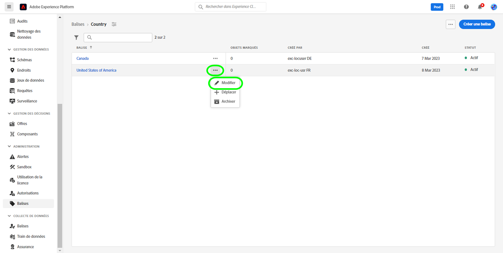

Le **[!UICONTROL Modifier la balise]** s’affiche, vous invitant à modifier le nom de la balise. Lorsque vous avez terminé, sélectionnez **[!UICONTROL Enregistrer]**.

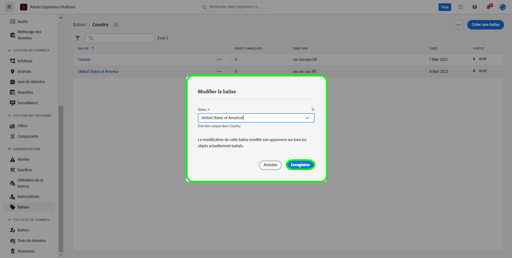

Le nom de la balise a été mis à jour. Vous êtes redirigé vers l’écran des balises où la balise mise à jour apparaît dans la liste.

## Déplacer une balise entre des catégories {#move-tag}

Les balises peuvent être déplacées vers d’autres catégories de balises. Le déplacement d’une balise conserve son association avec les objets dans lesquels elle est actuellement appliquée.

Pour déplacer une balise existante, sélectionnez les points de suspension (`...`) en regard du nom de la balise que vous souhaitez déplacer. Une liste déroulante affiche des commandes permettant de modifier, de déplacer ou d’archiver la balise. Sélectionner **[!UICONTROL Modifier]** dans la liste déroulante.

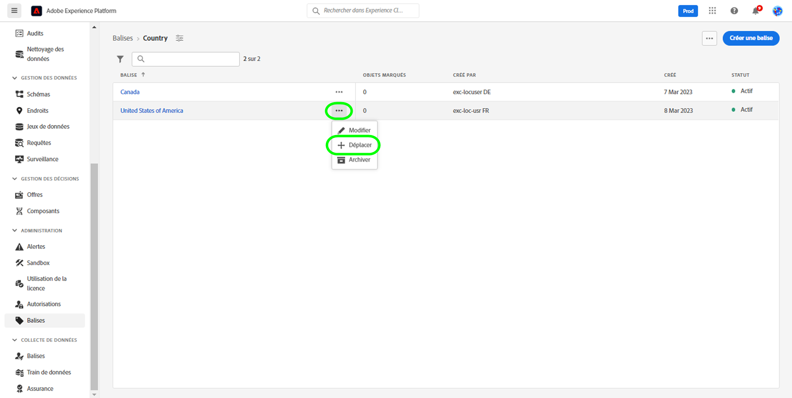

Le **[!UICONTROL Balise de déplacement]** s’affiche, vous invitant à sélectionner la catégorie de balises dans laquelle la balise sélectionnée doit être déplacée.

Vous pouvez faire défiler la liste et la sélectionner dans la liste, ou utiliser la fonction de recherche pour saisir le nom de la catégorie. Lorsque vous avez terminé, sélectionnez **[!UICONTROL Déplacer]**.

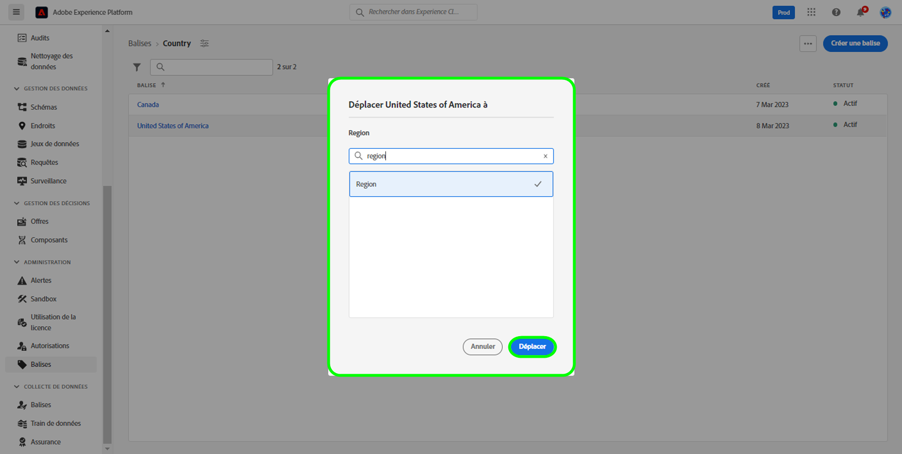

La balise a été déplacée avec succès et vous êtes redirigé vers l’écran des balises où la liste des balises mise à jour s’affiche et où la balise n’apparaît plus.

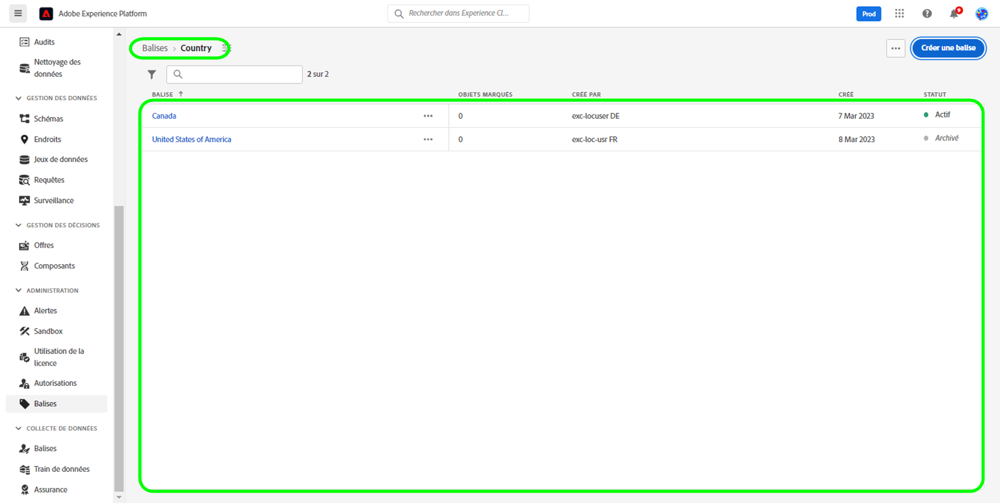

La balise apparaît désormais dans la catégorie de balise précédemment sélectionnée.

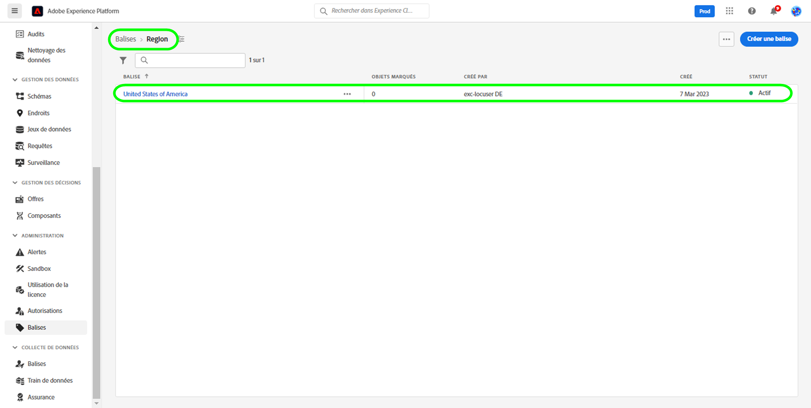

## Archivage d’une balise {#archive-tag}

L’état d’une balise peut être basculé entre principal et archivé. Les balises archivées ne sont pas supprimées des objets où elles ont déjà été appliquées, mais elles ne peuvent plus être appliquées aux nouveaux objets. Pour chaque balise, le même état est reflété dans tous les objets. Ceci s’avère particulièrement utile lorsque vous souhaitez conserver les associations actuelles d’objets de balise, mais que vous ne souhaitez pas que la balise soit utilisée à l’avenir.

Pour archiver une balise existante, sélectionnez les points de suspension (`...`) en regard du nom de la balise que vous souhaitez archiver. Une liste déroulante affiche des commandes permettant de modifier, de déplacer ou d’archiver la balise. Sélectionner **[!UICONTROL Archiver]** dans la liste déroulante.

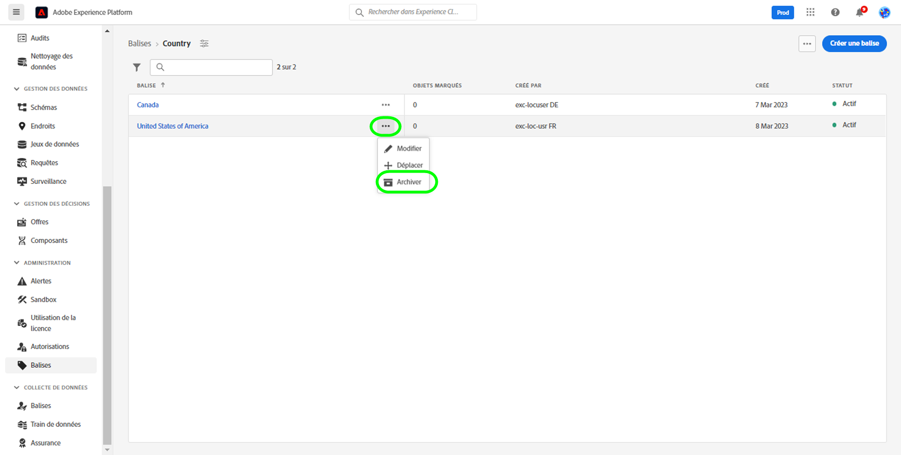

Le **[!UICONTROL Balise d’archivage]** s’affiche, vous invitant à confirmer l’archive de balise. Sélectionner **[!UICONTROL Archiver]**.

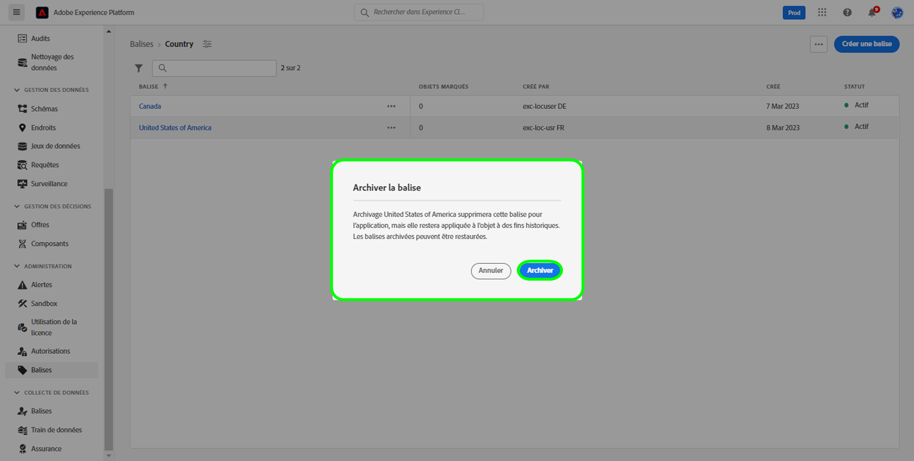

La balise est archivée avec succès et vous êtes redirigé vers l’écran des balises. La liste des balises mise à jour affiche désormais l’état de la balise sous la forme `Archived`.

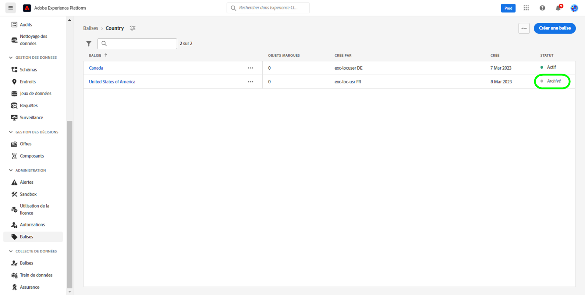

## Restaurer une balise archivée {#restore-archived-tag}

Si vous souhaitez appliquer une `Archived` pour créer des objets, la balise doit se trouver dans une balise `Active` état. La restauration d’une balise archivée renvoie une balise à l’adresse `Active` état.

Pour restaurer une balise archivée, sélectionnez les points de suspension (`...`) en regard du nom de la balise à restaurer. Une liste déroulante affiche les commandes permettant de restaurer ou de supprimer la balise. Sélectionner **[!UICONTROL Restaurer]** dans la liste déroulante.

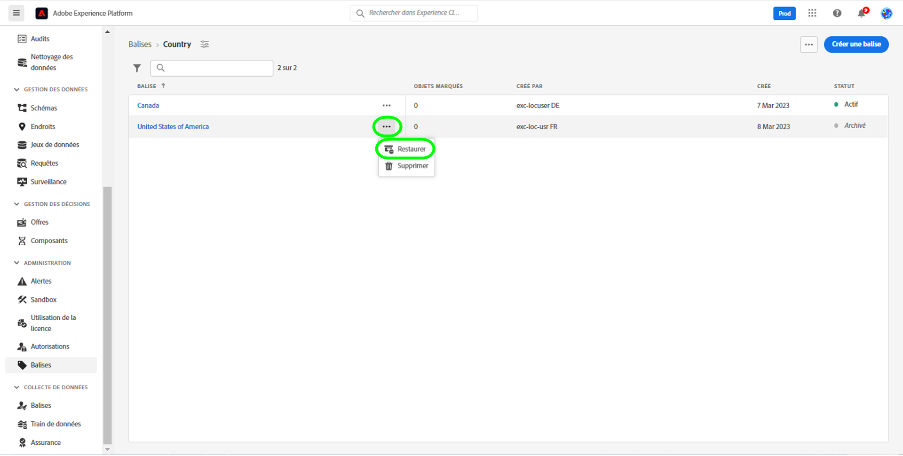

Le **[!UICONTROL Restaurer la balise]** s’affiche, vous invitant à confirmer la restauration de la balise. Sélectionner **[!UICONTROL Restaurer]**.

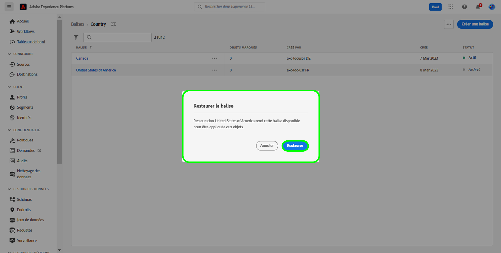

La balise est restaurée avec succès et vous êtes redirigé vers l’écran des balises. La liste des balises mise à jour affiche désormais l’état de la balise sous la forme `Active`.

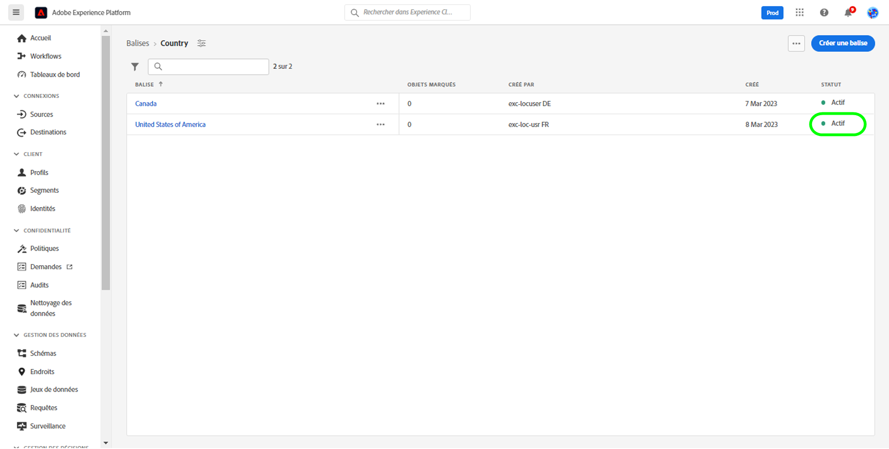

## Suppression d’une balise {#delete-tag}

>[!NOTE]
>
>Seules les balises qui se trouvent dans un `Archived` et ne sont associés à aucun objet peuvent être supprimés.

La suppression d’une balise la supprime complètement du système.

Pour supprimer une balise archivée, sélectionnez les points de suspension (`...`) en regard du nom de la balise que vous souhaitez supprimer. Une liste déroulante affiche les commandes permettant de restaurer ou de supprimer la balise. Sélectionner **[!UICONTROL Supprimer]** dans la liste déroulante.

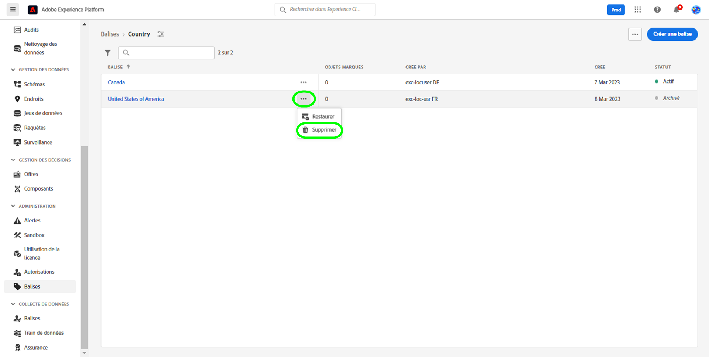

Le **[!UICONTROL Supprimer la balise]** s’affiche, vous invitant à confirmer la suppression de la balise. Sélectionnez **[!UICONTROL Supprimer]**.

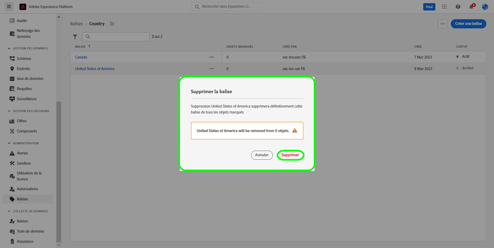

La balise a été supprimée avec succès et vous êtes redirigé vers l’écran des balises. La balise n’apparaît plus dans la liste et a été complètement supprimée.

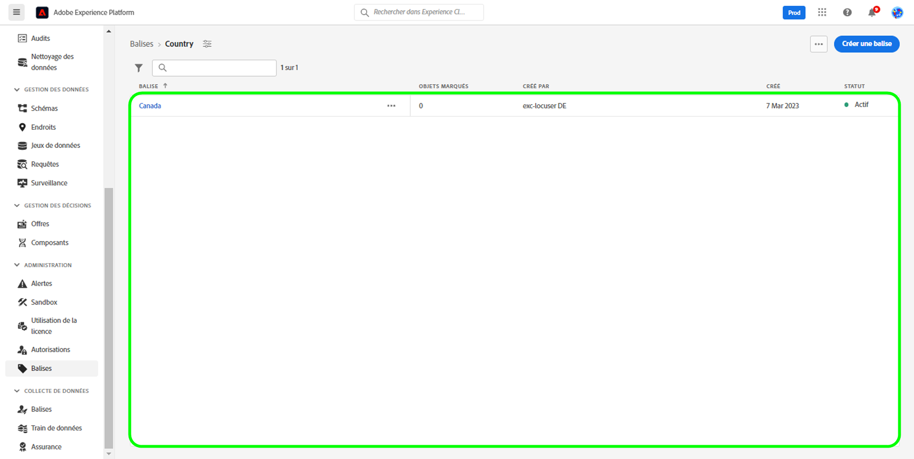

## Affichage des objets balisés {#view-tagged}

Chaque balise comporte une page de détails accessible à partir de l’inventaire des balises. Cette page répertorie tous les objets auxquels cette balise est actuellement appliquée, ce qui permet aux utilisateurs d’afficher en une seule vue les objets associés provenant de différentes applications et fonctionnalités.

Pour afficher la liste des objets balisés, recherchez la balise dans une catégorie de balise, puis sélectionnez la balise.

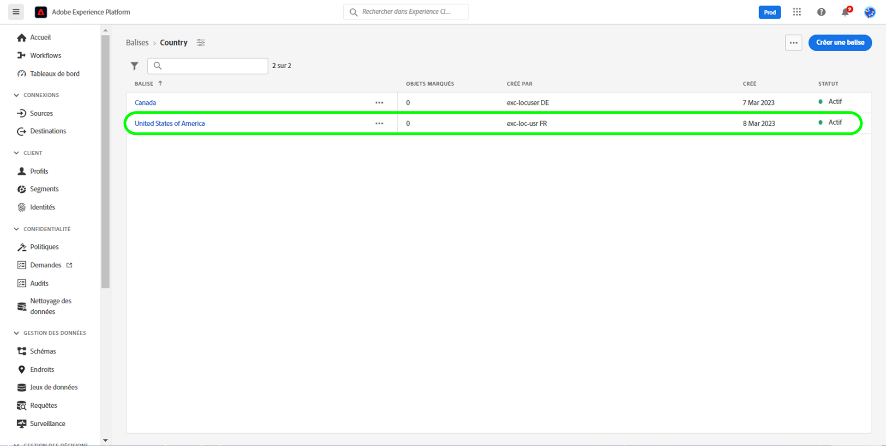

Le [!UICONTROL Objets balisés] s’affiche, indiquant un inventaire des objets balisés.

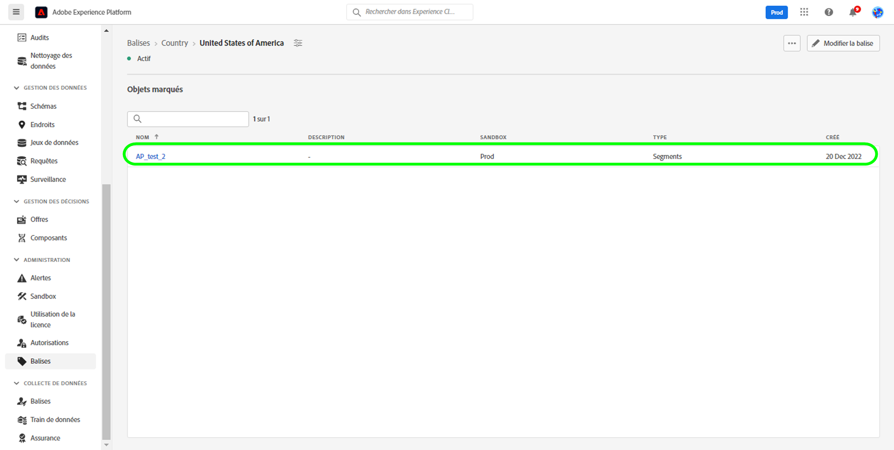

## Étapes suivantes

Vous avez maintenant appris à gérer les balises. Pour un aperçu général des balises dans Experience Platform, reportez-vous à la section [documentation sur les balises](../overview.md).
