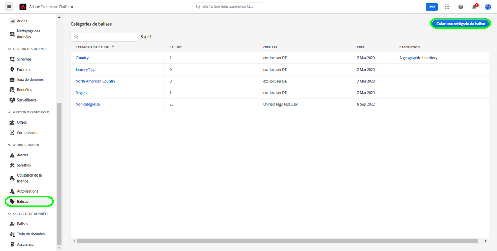
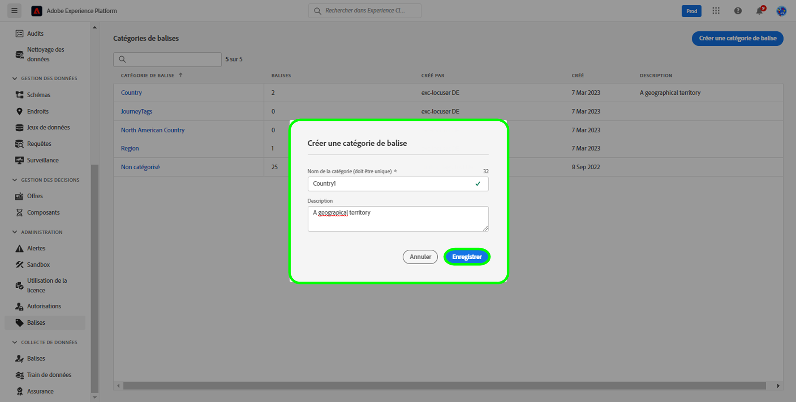
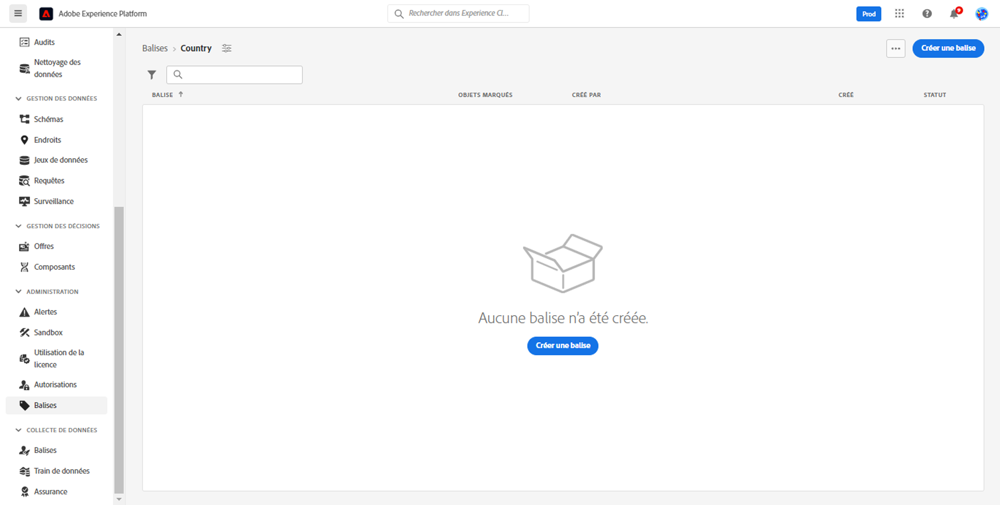
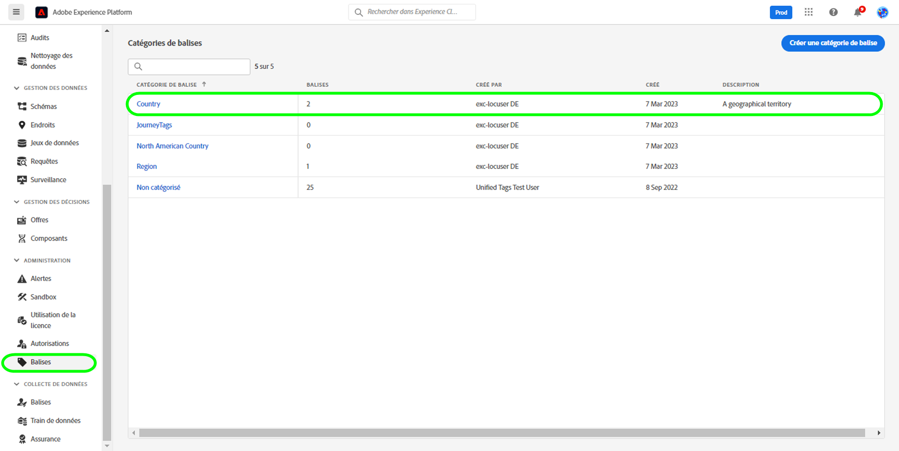
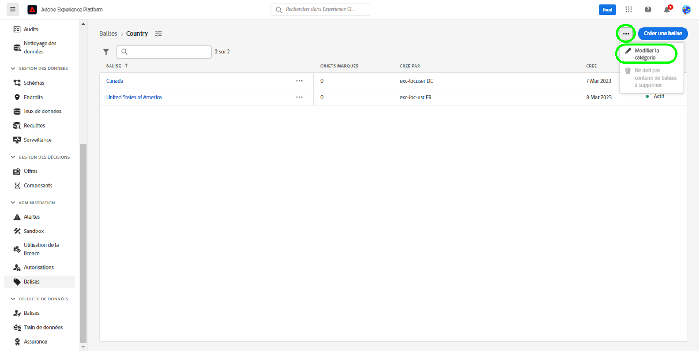
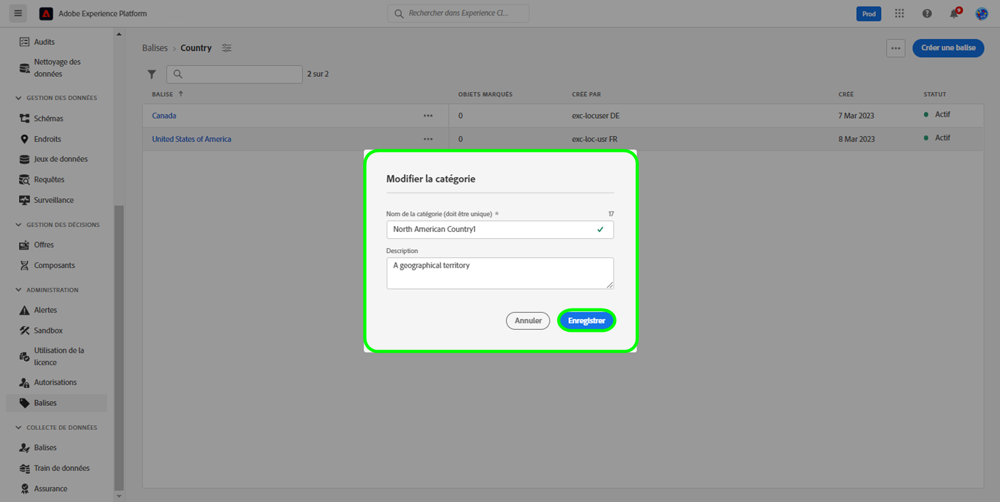
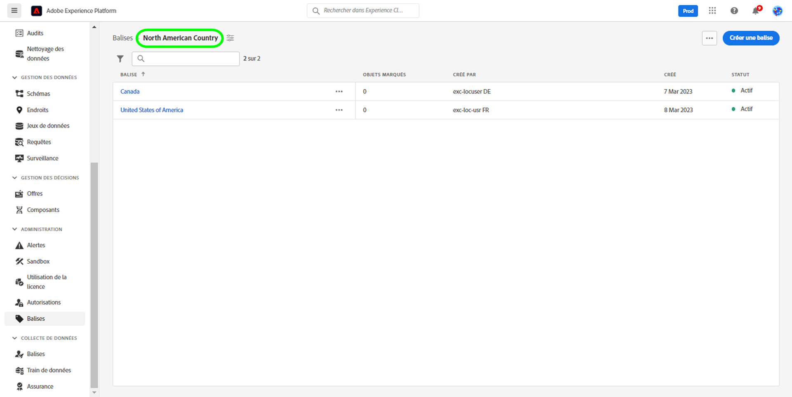
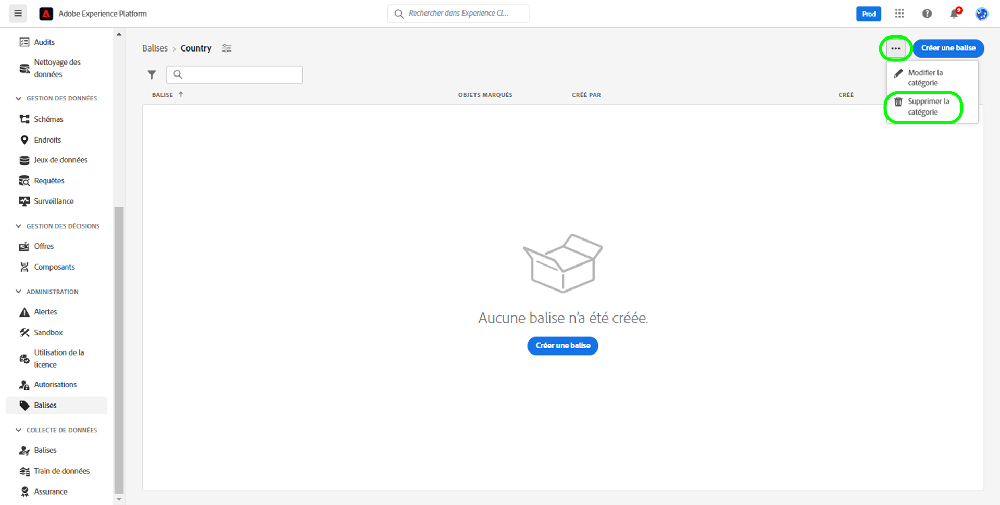
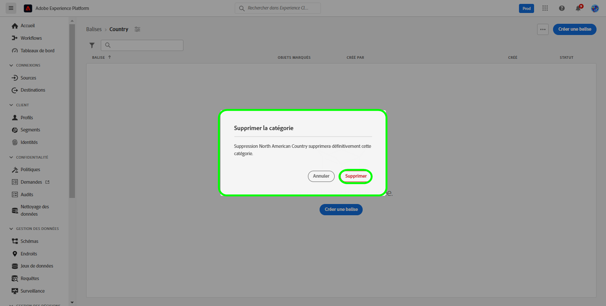

# Guide des catégories de balises

Les catégories de balises regroupent les balises dans des ensembles significatifs afin de fournir plus de contexte et de mieux clarifier l’objectif de la balise. Pour toute balise appartenant à une catégorie, le nom de la balise est précédé du nom de la catégorie, puis d’un signe deux-points.

## Créer une catégorie de balises {#create-tag-category}

Pour créer une catégorie, sélectionnez **[!UICONTROL balises]** dans le volet de navigation de gauche, puis sélectionnez [!UICONTROL Créer une catégorie de balises].

La boîte de dialogue **[!UICONTROL Créer une catégorie de balises]** s’affiche, vous invitant à saisir un nom de catégorie et une description facultative. Lorsque vous avez terminé, sélectionnez **[!UICONTROL Enregistrer]**.

La nouvelle catégorie de balises a été créée avec succès et nous vous redirigeons vers la page de création de balise, où vous pouvez attribuer de nouvelles balises. Pour plus d’informations sur la création de balises, reportez-vous au document de [gestion des balises](./managing-tags.md#create-a-tag-create-tag).

## Modifier la catégorie de balises {#edit-tag-category}

>[!NOTE]
>
>La modification ou le changement de nom d’une catégorie de balises conserve l’association de la balise à tous les objets où elle est actuellement appliquée.

Pour modifier une catégorie de balises, sélectionnez **[!UICONTROL balises]** dans le volet de navigation de gauche, puis sélectionnez la catégorie de balises à modifier.

Dans la catégorie de balises, sélectionnez les points de suspension (`...`) en regard de [!UICONTROL Créer une balise]. Une liste déroulante affiche les commandes permettant de modifier ou de supprimer une catégorie, sélectionnez **[!UICONTROL Modifier la catégorie]**.

La boîte de dialogue **[!UICONTROL Modifier la catégorie]** s’affiche, vous invitant à mettre à jour le nom de la catégorie et la description facultative. Lorsque vous avez terminé, sélectionnez **[!UICONTROL Enregistrer]**.

La catégorie de balises a été mise à jour avec succès et nous vous redirigeons vers la catégorie de balises.

## Supprimer une catégorie de balises {#delete-tag-category}

>[!NOTE]
>
>Pour qu’une catégorie de balises puisse être supprimée, elle doit être vide et ne comporter aucune balise.

Pour supprimer une catégorie de balises, sélectionnez **[!UICONTROL balises]** dans le volet de navigation de gauche, puis sélectionnez la catégorie de balises à supprimer.

Dans la catégorie de balises, sélectionnez les points de suspension (`...`) en regard de [!UICONTROL Créer une balise]. Une liste déroulante affiche les commandes permettant de modifier ou de supprimer une catégorie, sélectionnez **[!UICONTROL Supprimer une catégorie]**.

La boîte de dialogue **[!UICONTROL Supprimer une catégorie]** s’affiche, vous invitant à confirmer la suppression de la catégorie de balises. Sélectionnez **[!UICONTROL Supprimer]** pour confirmer.

La catégorie de balises a été supprimée avec succès et nous vous redirigeons vers la page d’inventaire des catégories de balises. La catégorie de balises n’apparaît plus dans la liste et a été complètement supprimée.

## Étapes suivantes

Vous savez désormais comment gérer les catégories de balises. Vous pouvez passer à l’étape suivante pour [gérer les balises](./managing-tags.md).
