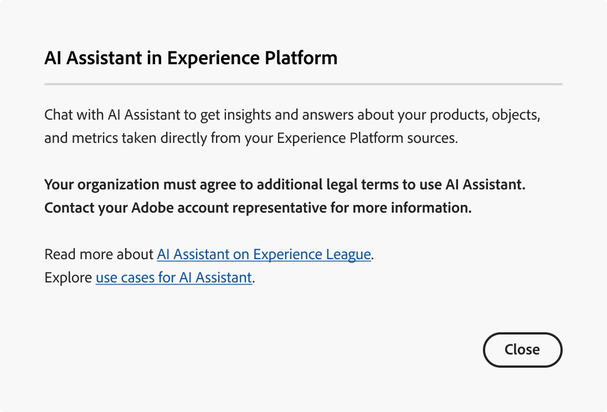

# Accéder à l’assistant d’IA dans Experience Platform

Vous pouvez accéder à l’assistant AI dans plusieurs applications de Adobe Experience Cloud.

>[!IMPORTANT]
>
>Si vous recevez un message contextuel dans l’interface utilisateur des autorisations qui vous informe que votre entreprise doit d’abord accepter des conditions juridiques supplémentaires pour pouvoir accéder à l’assistant AI, contactez votre équipe de compte Adobe pour obtenir des conseils sur ces conditions.

## Commencer {#get-started}

Vous devez effectuer deux étapes préalables avant de pouvoir accéder à l’assistant AI.

1. Votre entreprise doit d’abord accepter les conditions juridiques. Pour plus d’informations, contactez l’équipe chargée de votre compte Adobe.
2. Vos administrateurs doivent vous accorder les autorisations suffisantes pour accéder à l’assistant AI.

Si l’une de ces deux étapes préalables n’est pas terminée, les messages ci-dessous s’affichent lorsque vous sélectionnez l’icône de conversation de l’assistant AI dans l’interface utilisateur d’Experience Platform.

>[!BEGINTABS]

>[!TAB Votre entreprise ne peut pas utiliser l’assistant AI]

Le message suivant s’affiche si vous utilisez une organisation qui n’est pas légalement autorisée à utiliser l’assistant AI. Dans ce scénario, vous devez contacter l’équipe de votre compte Adobe pour résoudre les problèmes d’accès.

>[!TAB Vous ne disposez pas des autorisations appropriées]

Si votre entreprise est légalement autorisée à utiliser l’assistant AI et que vous ne pouvez toujours pas accéder à la fonctionnalité, le message suivant s’affiche dans l’interface utilisateur d’Experience Platform. Ce scénario signifie que vous ne disposez pas des autorisations suffisantes pour accéder à la fonctionnalité et que vous devez contacter vos administrateurs ou administratrices pour résoudre les problèmes liés aux autorisations.

>[!ENDTABS]

## Accéder à l’assistant d’IA

L’accès à l’assistant d’IA est régi par les paramètres suivants :

* **Accéder à l’application :** vous pouvez accéder à l’assistant AI dans Adobe Experience Platform, Adobe Real-Time CDP, Adobe Journey Optimizer et [Customer Journey Analytics](https://experienceleague.adobe.com/fr/docs/analytics-platform/using/ai-assistant).
<!-- * **Contractual access:** Your company must agree to certain [!DNL GenAI]-related legal terms before your organization can use AI Assistant. Contact your organization's administrator or your Adobe Account Team if you are not able to access AI Assistant.  -->
* **Autorisations :** utilisez l’[interface utilisateur des autorisations](../access-control/abac/ui/permissions.md) pour accorder ou révoquer l’accès à l’assistant AI dans votre entreprise. Pour utiliser l’assistant AI, un utilisateur donné doit appartenir à un rôle disposant des autorisations **Activer l’assistant AI** et **Afficher les informations opérationnelles**.
   * En tant qu’administrateur ou administratrice, vous pouvez ajouter l’**Activer l’assistant AI** à un rôle donné et ajouter un utilisateur ou une utilisatrice à ce rôle, pour lui permettre d’accéder à l’assistant AI dans votre entreprise. **Remarque** : cette autorisation permet audit utilisateur d&#39;accéder à AI Assistant, elle ne lui accorde aucune capacité administrative pour donner ensuite accès à AI Assistant à d&#39;autres utilisateurs.
   * En tant qu’administrateur, vous pouvez ajouter l’**Afficher les informations opérationnelles** à un rôle donné et ajouter un utilisateur à ce rôle, pour lui permettre d’utiliser les fonctionnalités d’informations opérationnelles de l’assistant AI. Les informations opérationnelles sont actuellement en version bêta.

Utilisez l’[interface utilisateur des autorisations](../access-control/abac/ui/roles.md) pour accorder des autorisations d’utilisation de l’assistant AI dans Experience Platform et Journey Optimizer. Pour plus d’informations sur l’accès à l’assistant AI dans Customer Journey Analytics. Lisez la documentation dans [Customer Journey Analytics](https://experienceleague.adobe.com/fr/docs/analytics-platform/using/ai-assistant).

Une fois que vous disposez des autorisations nécessaires, vous pouvez accéder à l’assistant AI en sélectionnant l’icône de l’assistant AI dans l’en-tête supérieur de l’application que vous utilisez.

Regardez la vidéo suivante pour savoir comment configurer l’accès à l’assistant d’IA pour vos organisations et utilisateurs.

>[!VIDEO](https://video.tv.adobe.com/v/3475921/?captions=fre_fr&learn=on)

## Étapes suivantes

Une fois que vous disposez d’un accès complet à l’assistant AI, vous pouvez passer à l’utilisation de la fonctionnalité au cours de vos workflows. Pour plus d’informations, consultez le guide de l’interface utilisateur de l’assistant [AI](./ui-guide.md).
