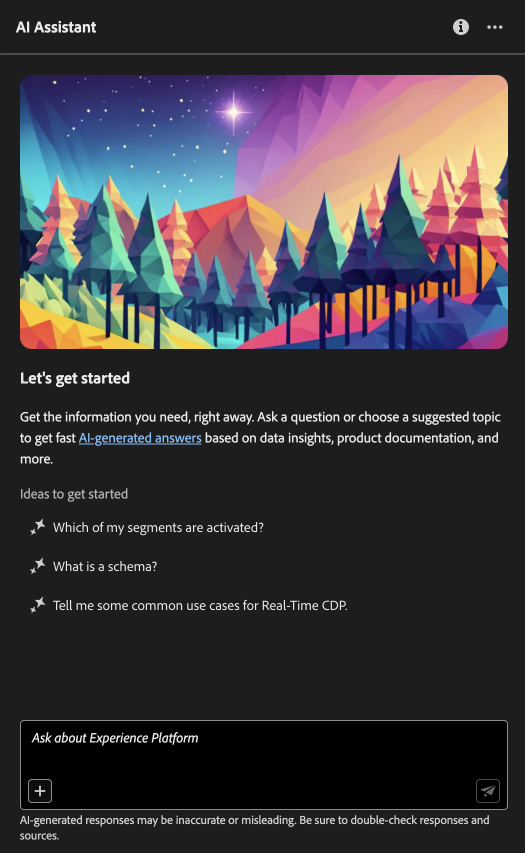

# Assistant IA dans Adobe Experience Platform

Lisez ce document pour en savoir plus sur l’assistant d’IA dans Adobe Experience Platform.

L’assistant d’IA dans Adobe Experience Platform est une expérience conversationnelle que vous pouvez utiliser pour accélérer vos workflows dans les applications Adobe. Vous pouvez utiliser l’assistant d’IA pour mieux comprendre les connaissances sur les produits, résoudre les problèmes ou rechercher des informations et trouver des informations opérationnelles. L’assistant d’IA prend en charge Experience Platform, Real-time Customer Data Platform, Adobe Journey Optimizer et Customer Journey Analytics.

>[!IMPORTANT]
>
>* Vous devez accepter [un contrat d’utilisation](https://adobe.sharepoint.com/:w:/s/ExCUserExperience/EVzJv1jFBiZGnaFEufsfIqwBC_9ehv3KaXTkEMTGpQFRpg?e=qzwOo8) avant de pouvoir utiliser l’assistant d’IA. Le contrat d’utilisation contient également le contrat bêta public. Vous pouvez ainsi utiliser d’autres fonctions d’assistant d’IA au fur et à mesure qu’elles se déploient en version bêta.

## Présentation de l’assistant d’IA {#understanding-ai-assistant}

L’assistant d’IA répond aux questions que vous avez envoyées en interrogeant une base de données, puis en traduisant les données de la base de données en une réponse lisible.

Cette représentation interne des données sous-jacentes est également appelée **[!DNL Knowledge Graph]** - un réseau complet de concepts, de données et de métadonnées pour une réponse donnée.

La variable [!DNL Knowledge Graph] se compose de sous-graphiques qui sont référencés chaque fois que des requêtes sont envoyées :

* Informations sur les opérations du client.
* Informations sur les opérations des clients dans divers méta-magasins.
* Documentation Experience League.

Il existe deux types de questions à prendre en compte avant d’interroger l’assistant d’IA :

### Connaissances produit {#product-knowledge}

Les connaissances sur les produits se rapportent aux concepts et aux sujets basés sur la documentation Experience League. Les questions relatives aux connaissances sur les produits peuvent être spécifiées plus en détail dans les sous-groupes suivants :

| Connaissances produit | Exemples |
| --- | --- |
| Apprentissage pointé | <ul><li>Quelle est la différence entre une identité et une clé primaire ou étrangère ?</li><li>Comment est calculé la richesse des profils ?</li></ul> |
| Découverte ouverte | <ul><li>Comment exporter ce jeu de données ?</li><li>Y a-t-il des schémas pour les clients du secteur de la santé ?</li></ul> |
| Dépannage | <ul><li>Pourquoi ne puis-je pas activer un schéma détenu par Adobe pour Profile ?</li><li>Pourquoi ne puis-je pas supprimer un segment ?</li></ul> |

{style="table-layout:auto"}

### Connaissances opérationnelles {#operational-insights}

>[!IMPORTANT]
>
>Les réponses sur les informations opérationnelles sont en version bêta. Toute personne ayant accès à la variable **Affichage des informations opérationnelles** La permission aura accès aux réponses sur les informations opérationnelles.

Les informations opérationnelles se rapportent aux réponses générées par l’assistant d’IA au sujet de vos objets de métadonnées (attributs, audiences, flux de données, jeux de données, destinations, parcours, schémas et sources), y compris les décomptes, les recherches et l’impact sur la traçabilité. Il ne tient compte d’aucune donnée dans l’environnement de test.

* Combien de jeux de données ai-je ?
* Combien d’attributs de schéma n’ont jamais été utilisés ?
* Quelles audiences ont été activées ?

Vous pouvez poser des questions à l’assistant d’IA sur vos informations opérationnelles dans les domaines suivants :

* Attributs
* Audiences
* Flux de données
* Jeux de données
* Destinations _(Pour l’instant, il n’est pas possible de répondre aux questions concernant les comptes et à certaines questions concernant le flux de données.)_
* Parcours
* Schémas _(Pour l’instant, il n’est pas possible de répondre aux questions concernant les groupes de champs.)_
* Sources _(Pour l’instant, il n’est pas possible de répondre aux questions concernant les comptes.)_

Pour les questions d’informations opérationnelles, les réponses peuvent ne pas refléter l’état actuel de l’interface utilisateur. Les données qui appuient ces questions sont mises à jour toutes les 24 heures. Par exemple, les modifications apportées par les utilisateurs dans Real-Time CDP pendant la journée sont synchronisées avec les entrepôts de données la nuit, puis elles deviennent disponibles pour les questions des utilisateurs le matin. Vous devrez vous connecter à un environnement de test pour obtenir des informations sur des données spécifiques liées aux objets.

## Accès aux fonctionnalités {#feature-access}

L’accès à l’assistant d’IA est régi par les paramètres suivants :

* **Accédez à l’application :** Vous pouvez accéder à l’assistant d’IA dans Adobe Experience Platform, Adobe Real-Time CDP, Adobe Journey Optimizer et [Customer Journey Analytics](https://experienceleague.adobe.com/en/docs/analytics-platform/using/ai-assistant).
* **Accès contractuel :** Votre entreprise doit accepter certains [!DNL GenAI]Conditions légales relatives à l’utilisation de l’assistant d’IA pour que votre entreprise puisse l’utiliser. Contactez l’administrateur de votre entreprise ou votre équipe de compte d’Adobe si vous ne pouvez pas accéder à l’assistant d’IA.
* **Autorisations :** Utilisez la variable [Interface utilisateur des autorisations](../access-control/abac/ui/permissions.md) pour accorder ou révoquer l’accès à l’assistant AI de votre entreprise. Pour utiliser l’assistant d’IA, un utilisateur donné doit appartenir à un rôle fourni avec la fonction **Activation de l’assistant AI** et **Affichage des informations opérationnelles** autorisations.
   * En tant qu’administrateur, vous pouvez ajouter la variable **Activation de l’assistant AI** à un rôle donné et ajoutez un utilisateur à ce rôle pour lui permettre d’accéder à l’assistant d’IA de votre entreprise.
   * En tant qu’administrateur, vous pouvez ajouter la variable **Affichage des informations opérationnelles** à un rôle donné et ajoutez un utilisateur à ce rôle, afin de lui permettre d’utiliser les fonctionnalités d’informations opérationnelles de l’assistant d’IA. Les informations opérationnelles sont actuellement en version bêta.

## Exemples de questions {#example-questions}

Cette section présente des exemples de questions auxquelles vous pouvez vous référer pendant vos workflows. Les questions sont regroupées en trois sections : connaissances opérationnelles, objectifs et objets.

### Exemples de questions regroupées par insights opérationnels {#operational-insights-questions}

+++Sélectionnez cette option pour afficher des exemples de questions d’informations opérationnelles et leurs cas d’utilisation respectifs :

| Type de question | Cas d’utilisation | Exemples |
| --- | --- | --- | 
| Parenté des données | Suivi de l’utilisation d’un ou de plusieurs objets sur d’autres objets Experience Platform | <ul><li>Quels jeux de données utilisent le schéma &quot;ACME&quot; ?</li><li>Combien de jeux de données ont été ingérés à l’aide du même schéma ?</li><li>Quels jeux de données ont été utilisés dans les audiences activées ?</li><li>Liste des schémas dont les attributs sont utilisés dans les audiences activées.</li><li>Montrez-moi les audiences qui sont activées sur les &quot;destinations ACME&quot; et qui ont plus de 1 000 profils.</li><li>Afficher les attributs utilisés dans les audiences activées qui ont été modifiées après janvier 2023.</li><li>Quels sont les jeux de données ingérés via la source &quot;ACME Amazon S3&quot; ?</li><li>Quels flux de données sont associés à &quot;Flux de données de fidélité ACME&quot; ?</li><li>Liste des schémas relatifs aux audiences activées et créés au cours de l’année écoulée.</li></ul> |
| Distribution et agrégations | Questions récapitulatives sur l’utilisation des objets Experience Platform | <ul><li>Quel est le pourcentage des audiences activées ?</li><li>Combien de champs sont utilisés dans la segmentation ?</li><li>Quelles audiences sont activées pour le plus grand nombre de destinations ?</li><li>Répertorier les audiences en double</li><li>Montrez-moi les audiences activées sur les &quot;destinations ACME&quot; et classez-les par taille de profil.</li><li>Quel est le pourcentage des audiences qui n’ont pas été activées mais comportent plus de 100 profils. Montrez-moi leurs noms.</li><li>Liste des 3 connecteurs source qui ingèrent des données dans mes jeux de données.</li><li>Listez-moi les 5 premiers attributs utilisés dans les audiences activées en fonction de leur occurrence.</li></ul> |
| Recherche d’objet | Récupérez ou accédez à un objet Experience Platform ou à ses propriétés. | <ul><li>Les jeux de données auxquels aucun schéma n’est associé</li><li>Répertorier les attributs utilisés pour &quot;Audience ACME&quot; ?</li><li>Indiquez-moi la liste des schémas dont le profil est activé mais qui n’ont pas été modifiés depuis leur création.</li><li>Quelles audiences ont été modifiées la semaine dernière ?</li><li>Listez-moi les audiences qui ont les mêmes définitions de segment avec leur date de création.</li><li>Les jeux de données activés par le profil et incluant le nombre d’audiences créées à partir de chaque jeu de données.</li><li>Quels comptes sources sont associés au jeu de données XYZ ?</li><li>Montrez-moi la définition de segment et la date de modification de &quot;l’audience ACME&quot;.</li></ul> |
| Comparaison des objets | Identifiez les audiences en double. | <ul><li>En fonction de leur définition de segment, répertorie les audiences qui sont des doublons.</li><li>Les audiences en double qui sont activées vers les &quot;destinations ACME&quot;.</li></ul> |

{style="table-layout:auto"}

+++

### Exemples de questions regroupées par objectifs {#objectives-questions}

+++Sélectionnez cette option pour afficher la liste des objectifs que vous pouvez réaliser avec l’assistant d’IA.

| Objectif | Description | Exemple |
| --- | --- | --- |
| Concepts d’apprentissage et workflows continus | <ul><li>En tant qu’utilisateur novice, vous pouvez utiliser l’assistant d’IA pour découvrir les concepts de Real-Time CDP et de Adobe Journey Optimizer et vous inscrire à des produits et fonctionnalités que vous ne connaissez pas.</li><li>En tant qu’utilisateur expérimenté, vous pouvez utiliser l’assistant d’IA pour résoudre un cas de périphérique qui bloque peut-être votre workflow. | <ul><li>Comment configurer un tableau de bord dans Parcours Analytics ?</li><li>Indiquez-moi quelques cas d’utilisation pour Real-Time CDP.</li></ul> |
| Dépannage | Utilisez l’assistant d’IA pour découvrir comment déboguer les erreurs de base que vous pouvez rencontrer dans votre workflow. | <ul><li>Que fait cette erreur ? {ERROR_MESSAGE} vous voulez dire ?</li><li>Pourquoi ne puis-je pas supprimer l’audience nommée &quot;Luma : Email Audience&quot; ?</li></ul> |
| hygiène des environnements de test | Utilisez l’assistant d’IA pour identifier les doublons ou les objets inutilisés afin de gérer efficacement votre environnement de test. | <ul><li>Pouvez-vous me montrer des audiences qui sont similaires ?</li><li>Existe-t-il des schémas qui n’ont pas de jeu de données associé ?</li></ul> |
| Analyse de valeur | Utilisez l’assistant d’IA pour identifier les objets de données les plus utilisés et évaluer les indicateurs de performances ou rechercher les objets de données les plus précieux. | <ul><li>Combien de profils se trouvent dans notre définition de segment &quot;Luma: Email Audience&quot; ?</li><li>Quand les audiences ont-elles été activées vers la destination Audiences Experience Cloud ?</li></ul> |
| Recherche | Utilisez l’assistant d’IA pour rechercher les objets Experience Platform pris en charge tels que les audiences, les jeux de données, les destinations, les schémas et les sources. | <ul><li>Répertorier les audiences contenant &quot;Luma&quot; dans le nom qui ont été créées au cours du dernier trimestre.</li><li>Quels attributs se trouvent dans le schéma XDM &quot;Luma: Custom Actions&quot; ?</li></ul> |
| Analyse de l’impact | Utilisez l’assistant d’IA pour identifier les objets de données qui ont été utilisés dans certains workflows afin que vous puissiez évaluer l’impact de toute modification. | <ul><li>Quelles audiences utilisent `homeAddress.city` dans le schéma &quot;Luma: PersonProfiles&quot; ?</li><li>Quels jeux de données sont les `consents.marketing.push.val` attribut de profil stocké dans ?</li></ul> |

{style="table-layout:auto"}

+++

### Exemples de questions regroupées par objet {#objects-questions}

+++Sélectionnez cette option pour afficher la liste des exemples de questions que l’assistant d’IA peut vous aider à résoudre :

| Objet | Description |
| --- | --- |
| Audiences - Aperçu opérationnel | <ul><li>Quelles audiences utilisent d’autres audiences ?</li><li>Quelle est la distribution du nombre de profils entre les audiences ?</li><li>Me montrer les audiences qui ont été modifiées pour la dernière fois avant {RELATIVE_DATE}.</li><li>Quelles audiences ont 0 profil ?</li><li>Is {USE_AUTOCOMPLETE_TO_FILL_AUDIENCE_NAME} utilisé dans d’autres audiences ?</li></ul> |
| Attributs - insights opérationnels | <ul><li>Quelles audiences ont un attribut XDM ? {ATTRIBUTE_PATH} dans leur définition de segment ?</li><li>Combien d’attributs de schéma XDM ne sont pas utilisés dans les audiences ?</li><li>Quels schémas ont un attribut XDM ? {ATTRIBUTE_PATH} en eux ?</li><li>Quels attributs XDM sont activés ?</li><li>Les attributs XDM utilisés dans les audiences ayant plus de 10 profils</li></ul> |
| Flux de données - Informations opérationnelles | <ul><li>Quels flux de données contribuent à {DATASET_NAME} jeu de données ?</li><li>Quels flux de données sources ne sont pas utilisés ou ne contiennent plus de données ?</li><li> |
| Jeux de données - insights opérationnels | <ul><li>Combien de jeux de données ont été ingérés à l’aide du même schéma ?</li><li>Quel connecteur source est associé à {DATASET_NAME} dataset></li><li>Quels jeux de données sont utilisés dans chaque audience ?</li><li>Quels schémas ne sont utilisés dans aucun jeu de données ?</li><li>Combien de jeux de données ai-je ?</li></ul> |
| Destinations - insights opérationnels | <ul><li>Quelles destinations sont à l’état actif ?</li><li>Quels comptes de destination ont 0 audience activée ?</li><li> |
| Parcours - insights opérationnels | <ul><li>Combien de parcours ai-je ?</li><li>Les parcours créés dans {RELATIVE_DATE} (par exemple, la semaine dernière) ou {RELATIVE_DATE} (par exemple, avant/après/à une date spécifique) ?</li><li>Afficher la liste des parcours qui ont été modifiés dans {RELATIVE_DATE} (par exemple, la semaine dernière) ou {RELATIVE_DATE} (par exemple, avant/après/à une date spécifique) ?</li><li>Liste les parcours que j&#39;ai.</li><li>Répertorier les audiences utilisées dans les parcours en direct.</li></ul> |
| Schémas - insights opérationnels | <ul><li>Quels champs du schéma ont contribué au plus grand nombre d’audiences ?</li><li>Combien de schémas le profil est-il activé ?</li><li>Liste de tous les schémas modifiés la semaine dernière.</li><li>Quels schémas ne sont utilisés dans aucun jeu de données ?</li><li>Liste de tous les schémas créés la semaine dernière.</li></ul> |
| Sources - insights opérationnels | <ul><li>Quelles sont les sources actives ?</li><li>Quel connecteur source est associé à un jeu de données ? {DATASET_NAME}?</li><li>Quel est le connecteur source qui a le plus grand nombre de comptes associés ?</li><li>Montrez-moi les flux de données et leurs connecteurs source associés.</li></ul> |
| Apprentissage en points - Connaissances produit (Real-Time CDP et Journey Optimizer) | <ul><li>Avec quoi l’assistant d’IA peut-il vous aider ?</li><li>Que sont les audiences semblables ?</li><li>Comment les groupes d’utilisateurs sont-ils liés aux rôles ?</li><li>Quand dois-je utiliser un type de données par rapport à un groupe de champs ?</li><li>Quelle est la différence entre une identité et une clé primaire ou étrangère ?</li><li>Comment est calculé la richesse des profils ?</li></ul> |
| Dépannage - Connaissances produit (Real-Time CDP et Journey Optimizer) | <ul><li>Avec quoi l’assistant d’IA peut-il vous aider ?</li><li>Puis-je supprimer un schéma activé par le profil une fois les données ingérées ?</li><li>Pourquoi ne puis-je pas supprimer une audience ?</li><li>Combien de temps faut-il pour que les audiences soient évaluées et que les résultats soient disponibles pour le ciblage ?</li></ul> |

{style="table-layout:auto"}

+++

## Expression de vos questions {#phrasing-your-questions}

Vous devez envoyer vos questions à l’assistant d’IA avec clarté et contexte afin d’obtenir une réponse aussi précise que possible. Reportez-vous à la liste suivante de conseils pour savoir comment poser une question claire avec contexte :

* Exposez votre tâche et/ou votre question de manière concise.
* Évitez d’utiliser un langage ambigu ou une syntaxe trop complexe pour faciliter la compréhension.
* Fournissez un contexte pertinent concernant votre tâche et/ou votre question, car le contexte peut aider l’assistant d’IA à générer des réponses plus pertinentes.

Lisez les tableaux ci-dessous pour plus d’informations sur les bonnes pratiques à suivre lorsque vous posez des questions à l’assistant d’IA.

+++Cliquez pour afficher des exemples de bonnes pratiques à suivre lors de la formulation de vos questions.

| Do | Exemple |
| --- | --- |
| <ul><li>Soyez précis sur l’objet ou les informations que vous souhaitez récupérer ou analyser.</li><li>Essayez de placer les noms des objets de données entre guillemets. Si vous ne connaissez qu’une partie du nom de l’objet, vous pouvez également l’indiquer dans la question.</li><li>Utilisation [saisie automatique d’objet](./ui-guide.md#use-auto-complete) pour aider l’assistant d’IA à mieux comprendre le contexte de votre requête.</li></ul> | <ul><li>Quels jeux de données utilisent le schéma &quot;Luma - Loyalty&quot; ?</li><li>Montrez-moi les segments activés dont le nom contient &quot;Luma&quot;. Classement par nombre de profils.</li></ul> |
| <ul><li>Éviter l’ambiguïté et utiliser un langage clair</li><li>Utilisez une terminologie précise pour une meilleure clarté dans votre requête.</li><li>Lorsque vous posez des questions concernant Adobe Experience Platform, essayez d’utiliser une terminologie spécifique à Experience Platform afin d’améliorer la pertinence des réponses.</li></ul> | <ul><li>Combien de profils ai-je dans &quot;Audience ACME&quot; ?</li><li>Montrez-moi les 5 premiers attributs XDM utilisés dans les audiences activées.</li></ul> |
| <ul><li>Précisez un contexte ou spécifiez un critère pour filtrer vos résultats.</li><li>Utilisez un critère de filtrage dans les questions pour limiter le volume de données dans la réponse.</li></ul> | <ul><li>Montrez-moi les audiences qui n’ont pas été activées et qui ont été créées il y a plus de 6 mois et n’ont jamais été modifiées.</li><li>Affichez-moi les audiences activées vers &quot;destination ACME&quot; et qui ont plus de 10 000 profils.</li></ul> |

{style="table-layout:auto"}

| Ne le faites pas | Exemple |
| --- | --- |
| Utilisez un langage vague ou ambigu. | <ul><li>Donnez-moi des informations sur les jeux de données.</li><li>Combien d’utilisateurs ai-je dans &quot;Audience ACME&quot; ?</li><li>Afficher les segments.</li><li>Attributs de liste.</li></ul> |
| Effectuez des requêtes incomplètes. | &quot;Luma - Jeu de données de fidélité&quot; |
| Prenons le savoir sans contextes. | <ul><li>Audiences des 6 derniers mois.</li><li>Construisez une requête pour moi.</li></ul> |
| Formuler des requêtes trop complexes. | Fournissez une analyse complète de la liaison des données entre tous les objets et leurs dépendances. |
| Omission des critères ou des paramètres. | Montrez-moi des jeux de données. |

{style="table-layout:auto"}

+++

## Étapes suivantes

Maintenant que vous connaissez tous l’assistant d’IA, vous pouvez continuer et utiliser cet assistant pendant vos workflows. Pour plus d’informations, reportez-vous à la documentation suivante :

* [Guide de l’interface utilisateur de l’assistant IA](./ui-guide.md)
* [Confidentialité, sécurité et gouvernance dans l’assistant d’IA](./privacy.md)
* [FAQ](./faq.md)