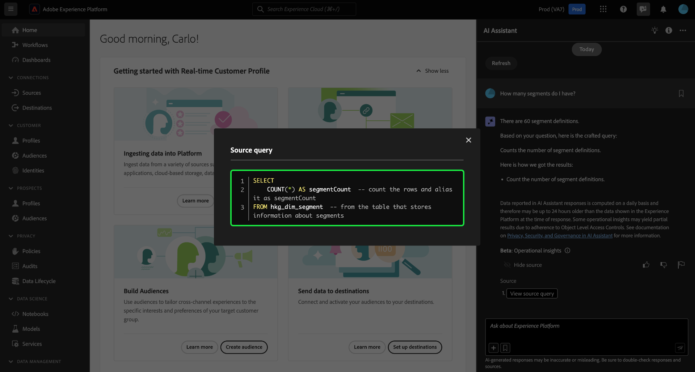

# Guide de l’interface utilisateur de l’assistant AI

Lisez ce guide pour savoir comment utiliser l’assistant AI dans l’interface utilisateur de Adobe Experience Platform.

## Accéder à l’assistant AI dans l’interface utilisateur d’Experience Platform

Pour lancer l’assistant AI, sélectionnez l’icône **[!UICONTROL Assistant AI]** dans l’en-tête supérieur de l’interface utilisateur d’Experience Platform.

L’interface de l’assistant d’IA s’affiche et vous fournit immédiatement des informations pour commencer. Vous pouvez utiliser les options fournies sous [!UICONTROL Idées pour commencer] afin de répondre à des questions et à des commandes telles que :

* [!UICONTROL Laquelle de mes audiences est activée ?]
* [!UICONTROL Qu’est-ce qu’un schéma ?]
* [!UICONTROL Dites-moi quelques cas pratiques courants pour Real-Time CDP]

## Guide de l’interface utilisateur de l’assistant AI

>[!NOTE]
>
>Le workflow suivant est un exemple qui utilise le processus de création de schéma d’événement d’expérience pour illustrer comment vous pouvez utiliser l’assistant AI lors de l’utilisation de l’interface utilisateur d’Experience Platform.

Supposons que vous créiez un **schéma d’échange d’appareils sous forme d’événement**. Lors du processus de création du schéma d’événement d’expérience, vous tombez sur le champ `eventType` . « À ce stade, vous avez la possibilité de quitter votre workflow et de vous reporter aux [principes de base d’une composition de schémas](../xdm/schema/composition.md) de la documentation, ou vous pouvez utiliser l’assistant AI pour récupérer les réponses à vos questions et trouver des ressources supplémentaires via les liens de documentation recommandés par l’assistant AI. »

Pour commencer, entrez votre question dans la zone de texte fournie à cet effet. Dans l’exemple ci-dessous, l’assistant AI reçoit la question « **Quel est le champ eventType dans un schéma ExperienceEvent ?** »

L’assistant AI interroge ensuite sa base de connaissances et calcule une réponse. Après quelques instants, l’assistant AI renvoie une réponse et des suggestions associées que vous pouvez utiliser comme invites de suivi.

Après avoir reçu une réponse de l’assistant d’IA, vous pouvez choisir parmi de nombreuses options pour décider comment vous souhaitez procéder.

### Fonctionnalités de l’assistant AI {#features}

Cette section décrit les différentes fonctionnalités de l’assistant AI que vous pouvez utiliser pendant vos workflows sur Experience Platform.

### Affichage des objets de données opérationnelles {#view-operational-data-objects}

Selon votre requête, l’assistant AI fournit des informations supplémentaires relatives aux données de votre sandbox. Pour voir comment la réponse à votre requête s’applique à votre sandbox spécifique, sélectionnez **[!UICONTROL Dans votre sandbox].**

Lors de l’affichage des données relatives à votre sandbox, l’assistant AI peut fournir des liens directs vers des pages d’interface utilisateur spécifiques qui affichent les données interrogées.

+++Sélectionner pour afficher l’exemple

Dans cet exemple, l’assistant AI renvoie des informations supplémentaires concernant les schémas XDM existants de votre sandbox, y compris leur nombre total et les cinq champs les plus couramment utilisés.

+++

### Afficher les citations {#view-citations}

Vous pouvez vérifier les réponses qui vous sont renvoyées par l’assistant AI en examinant les citations disponibles avec chaque réponse de la connaissance du produit.

+++Sélectionner pour afficher un exemple d’affichage des sources

Pour afficher les citations et valider la réponse de l’assistant AI, sélectionnez **[!UICONTROL Afficher les sources]**.

L’assistant AI met à jour l’interface et vous fournit des liens vers la documentation qui corrobore la réponse initiale. En outre, lorsque les citations sont activées, l’assistant AI met à jour la réponse pour inclure des notes de bas de page afin d’indiquer les parties spécifiques de la réponse qui font référence à la documentation fournie.

+++

### Informations opérationnelles {#operational-insights}

Vous devez être dans un sandbox actif pour que l’assistant AI puisse répondre de manière suffisante à une question sur vos informations opérationnelles.

+++Sélectionner pour afficher un exemple de question d’informations opérationnelles

Dans l’exemple ci-dessous, l’assistant AI est invité à répondre à la requête suivante : **« Afficher les flux de données créés à l’aide de la source Amazon S3 »**.

L’assistant AI répond ensuite avec un tableau répertoriant vos flux de données et leurs identifiants correspondants. Sélectionnez l’icône de téléchargement () pour télécharger le tableau au format CSV. Pour afficher le tableau entier, sélectionnez l’icône Développer ().

Une vue développée du tableau s’affiche, vous fournissant une liste plus complète des flux de données en fonction des paramètres de votre requête.

Lorsqu’une question sur les informations opérationnelles lui est posée, l’assistant AI fournit une explication de la manière dont il a calculé la réponse. Dans l’exemple ci-dessous, l’assistant AI décrit les étapes effectuées pour identifier les flux de données créés à l’aide de la source [!DNL Amazon S3].

Vous pouvez également fournir des filtres et des modifications à vos questions, et demander à l’assistant AI de rendre ses résultats en fonction des filtres que vous incluez. Par exemple, vous pouvez demander à l’assistant AI de vous montrer une tendance du nombre de définitions de segment dans l’ordre de leur date de création, de supprimer des définitions de segment avec zéro profil total et d’utiliser des noms de mois au lieu de nombres entiers lors de l’affichage des données.

+++

### Vérifier les réponses des informations opérationnelles {#verify-responses}

Vous pouvez vérifier chaque réponse liée aux questions d’informations opérationnelles à l’aide d’une requête SQL fournie par l’assistant AI.

+++Sélectionner pour afficher un exemple de vérification des réponses des informations opérationnelles

Après avoir reçu une réponse à une question sur les informations opérationnelles, sélectionnez **[!UICONTROL Afficher les sources]** puis sélectionnez **[!UICONTROL Afficher la requête source]**.

Lorsqu’il est interrogé avec une question d’informations opérationnelles, l’assistant AI fournit une requête SQL que vous pouvez utiliser pour vérifier le processus nécessaire au calcul de sa réponse. Cette requête source est fournie à des fins de vérification uniquement et n’est pas prise en charge sur Query Service.

+++

### Utiliser la saisie automatique d’entité {#use-entity-auto-complete}

Vous pouvez utiliser la fonction de saisie semi-automatique pour recevoir une liste d’objets de données qui existent dans votre sandbox. Les recommandations de saisie semi-automatique sont disponibles pour les domaines suivants : audiences, schémas, jeux de données, parcours, sources et destinations.

+++Sélectionner pour afficher un exemple de saisie automatique

Vous pouvez utiliser la saisie automatique en incluant le symbole plus (**`+`**) dans votre requête. Vous pouvez également sélectionner le signe plus (**`+`**) situé au bas de la zone de saisie de texte. Une fenêtre s’affiche avec une liste des objets de données recommandés pour votre sandbox.

+++

### Utiliser multi-tour {#use-multi-turn}

Vous pouvez utiliser les fonctionnalités multi-tours de l&#39;assistant AI pour avoir une conversation plus naturelle au cours de votre expérience. L’assistant d’IA est en mesure de répondre aux questions de suivi, si nécessaire. ce contexte peut être déduit d’une interaction précédente.

+++Sélectionner pour afficher un exemple de tournage multiple

Dans l’exemple ci-dessous, l’assistant AI est d’abord invité à indiquer le nombre total de flux de données, puis à répertorier les 10 flux de données les plus récents.

+++

### Démarrer une nouvelle conversation

Vous pouvez changer de sujet avec l’assistant AI en réinitialisant et en démarrant une nouvelle conversation.

+++Sélectionner pour afficher un exemple de réinitialisation de votre conversation

Pour réinitialiser, sélectionnez les points de suspension (**`...`**) dans l’interface de l’assistant d’IA, puis sélectionnez **[!UICONTROL Démarrer une nouvelle conversation]**. Cela indique à l’assistant AI que vous avez l’intention de changer de rubrique et peut s’avérer particulièrement utile lors de la résolution de problèmes liés à des requêtes qui échouent ou qui référencent des informations incorrectes.

+++

### Utilisation de la visibilité {#use-discoverability}

Vous pouvez utiliser la fonctionnalité de visibilité de l&#39;assistant AI pour afficher une liste des sujets généraux, regroupés en entités, que l&#39;assistant AI prend en charge.

+++Sélectionner pour afficher un exemple de visibilité

Pour afficher la visibilité, sélectionnez l’icône en forme d’ampoule dans l’en-tête supérieur de l’interface de l’assistant AI.

Sélectionnez ensuite une catégorie, puis une invite dans la liste fournie. Vous pouvez utiliser cette fonctionnalité pour avoir une meilleure idée des types de questions auxquelles l’assistant AI peut répondre. Vous pouvez également mettre à jour les invites préexistantes avec des détails spécifiques relatifs à votre sandbox à l’aide de texte libre ou de la [saisie semi-automatique](#use-auto-complete).

+++

### Utiliser la saisie semi-automatique des questions {#use-question-autocomplete}

Vous pouvez utiliser la fonction de saisie automatique des questions de l’assistant AI pour sélectionner une question dans une liste de recommandations de l’assistant AI.

+++Sélectionner pour afficher un exemple de saisie semi-automatique des questions

Pour afficher le panneau des questions suggérées, tapez au moins sept (7) caractères dans la zone de saisie. Sélectionnez ensuite la question qui vous intéresse dans le menu qui s’affiche.

Vous devrez peut-être mettre à jour les espaces réservés dans certains cas où une question suggérée implique des informations opérationnelles. Par exemple, vous pouvez avoir besoin d’ajouter le nom spécifique d’un jeu de données ou d’une audience si la suggestion de l’assistant AI comprend des espaces réservés.

Les espaces réservés sont surlignés en bleu. Sélectionnez l’espace réservé pour commencer à mettre à jour sa valeur. Pour de meilleurs résultats sur les espaces réservés numériques, veillez à utiliser des chiffres au lieu du texte. Vous pouvez également utiliser la fonction de saisie automatique des entités pour mettre à jour les valeurs des espaces réservés. Vous ne pouvez pas envoyer une question qui contient des espaces réservés vides.

**REMARQUE** : les suggestions sont activées par défaut. Sélectionnez le bouton (bascule) **[!UICONTROL Suggérer des idées]** pour désactiver la fonctionnalité.

+++

### Utiliser les suggestions associées {#use-related-suggestions}

Vous pouvez utiliser la section de suggestions associée de chaque réponse de l’assistant d’IA pour poursuivre votre conversation.

+++Sélectionner pour afficher un exemple de suggestions associées

Les suggestions associées sont renvoyées avec chaque réponse de l’assistant AI. Pour poursuivre votre conversation, sélectionnez l’une des suggestions de la section suggestions associée.

Comme pour les espaces réservés en question, vous devez mettre à jour les espaces réservés inclus dans les suggestions associées avant de pouvoir envoyer la requête.

+++

## Fournir des commentaires {#feedback}

Vous pouvez fournir un retour d’expérience avec l’assistant d’IA à l’aide des options fournies avec la réponse.

Pour faire part de vos commentaires, sélectionnez l’une des options suivantes : pouces vers le haut, pouces vers le bas ou indicateur , après avoir reçu une réponse de l’assistant AI, puis saisissez vos commentaires dans la zone de texte fournie.

+++Sélectionner pour afficher d’autres exemples

>[!BEGINTABS]

>[!TAB Pouce vers le haut]

Sélectionnez l’icône pouces vers le haut pour fournir des commentaires sur le bon fonctionnement de votre expérience avec l’assistant d’IA.

>[!TAB Pouces vers le bas]

Sélectionnez l’icône pouces baissés pour fournir des commentaires sur les améliorations qui pourraient être apportées en fonction de votre expérience avec l’assistant d’IA. Au cours de cette étape, vous pouvez également fournir des commentaires spécifiques concernant votre expérience. Les commentaires fournis dans les commentaires sont examinés quotidiennement.

>[!TAB Indicateur]

Sélectionnez l’icône d’indicateur pour fournir d’autres rapports sur votre expérience à l’aide de l’assistant AI.

>[!ENDTABS]

+++
