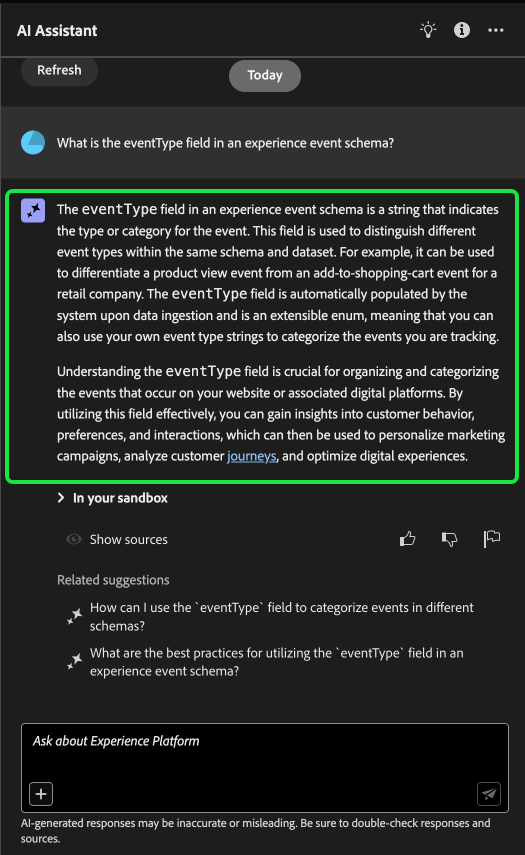

# Guide de l’interface utilisateur de l’assistant IA

Lisez ce guide pour découvrir comment utiliser l’assistant d’IA dans l’interface utilisateur de Adobe Experience Platform.

## Accès à l’assistant d’IA dans l’interface utilisateur d’Experience Platform

Pour lancer l’assistant, sélectionnez la méthode **[!UICONTROL Icône Assistant IA]** dans l’en-tête supérieur de l’interface utilisateur de l’Experience Platform.

L’interface de l’assistant d’IA s’affiche, vous fournissant immédiatement des informations pour commencer. Vous pouvez utiliser les options fournies sous [!UICONTROL Idées de démarrage] pour répondre à des questions et à des commandes telles que :

* [!UICONTROL Laquelle de mes audiences est activée ?]
* [!UICONTROL Qu’est-ce qu’un schéma ?]
* [!UICONTROL Indiquez-moi quelques cas d’utilisation courants pour Real-Time CDP]

## Guide de l’interface utilisateur de l’assistant IA

>[!NOTE]
>
>Le workflow suivant est un exemple qui utilise le processus de création de schémas d’événements d’expérience pour illustrer l’utilisation de l’assistant d’IA lors de l’utilisation de l’interface utilisateur d’Experience Platform.

Prenons un cas d’utilisation où vous créez une **Commerce des périphériques dans le schéma d’événement**. Au cours du processus de création de schéma d’événement d’expérience, vous rencontrez le `eventType` champ . &quot;À ce stade, vous avez la possibilité de quitter votre workflow et de vous reporter à la section [principes de base de la composition d’un schéma](../xdm/schema/composition.md) ou vous pouvez utiliser l’assistant d’IA pour obtenir des réponses à vos questions et trouver des ressources supplémentaires au moyen des liens vers la documentation recommandés par l’assistant d’IA.&quot;

Pour commencer, saisissez votre question dans la zone de texte fournie à cet effet. Dans l’exemple ci-dessous, l’assistant d’IA répond à la question : &quot;**Quel est le champ eventType dans un schéma ExperienceEvent ?**&quot;

L’assistant d’IA interroge ensuite sa base de connaissances et calcule une réponse. Après quelques instants, l’assistant d’IA renvoie une réponse et des suggestions associées que vous pouvez utiliser comme invites de suivi.

Après avoir reçu une réponse de l’assistant d’IA, vous pouvez choisir parmi plusieurs options pour décider comment procéder.

### Fonctionnalités de l’assistant AI {#features}

Cette section décrit les différentes fonctionnalités de l’assistant d’IA que vous pouvez utiliser pendant vos workflows sur Experience Platform.

### Affichage des objets de données opérationnels {#view-operational-data-objects}

Selon votre requête, l’assistant d’IA fournit des informations supplémentaires sur les données de votre environnement de test. Pour voir comment la réponse à votre requête s’applique à votre environnement de test spécifique, sélectionnez **[!UICONTROL Dans votre environnement de test].**

Lors de l’affichage de données relatives à votre environnement de test, l’assistant d’IA peut fournir des liens directs vers des pages d’IU spécifiques qui affichent vos données interrogées.

+++Sélectionner pour afficher l’exemple

Dans cet exemple, l’assistant d’IA renvoie des informations supplémentaires sur les schémas XDM existants dans votre environnement de test, y compris leur nombre total et les cinq champs les plus couramment utilisés.

+++

### Affichage des citations {#view-citations}

Vous pouvez vérifier les réponses qui vous ont été renvoyées par l’assistant d’IA en examinant les citations disponibles avec chaque réponse de connaissance du produit.

+++Sélectionner pour afficher un exemple d’affichage des sources

Pour afficher les citations et valider la réponse de l’assistant d’IA, sélectionnez **[!UICONTROL Afficher les sources]**.

L’assistant d’IA met à jour l’interface et vous fournit des liens vers la documentation qui corroborent la réponse initiale. En outre, lorsque les citations sont activées, l’assistant d’IA met à jour la réponse afin d’inclure des notes de bas de page pour indiquer les parties spécifiques de la réponse qui font référence à la documentation fournie.

Vous pouvez également utiliser les suggestions fournies par l’assistant d’IA sous **[!UICONTROL Suggestions connexes]** pour explorer plus en détail les sujets liés à votre question d’origine.

+++

### Connaissances opérationnelles {#operational-insights}

Vous devez être dans un environnement de test actif pour que l’assistant d’IA puisse répondre suffisamment à une question sur vos informations opérationnelles.

+++Sélectionner pour afficher un exemple d’une question d’informations opérationnelles

Dans l’exemple ci-dessous, la requête suivante est demandée à l’assistant d’IA : **&quot;Afficher les flux de données créés à l’aide de la source Amazon S3&quot;**, l’assistant d’IA répond ensuite avec un tableau répertoriant vos flux de données et leurs identifiants correspondants. Pour afficher l’ensemble du tableau de données, sélectionnez l’icône Développer en haut à droite.

Une vue étendue du tableau s’affiche, vous fournissant une liste plus complète de flux de données en fonction des paramètres de votre requête.

Lorsque vous y êtes invité avec une question d’informations opérationnelles, l’assistant d’IA explique comment il a calculé la réponse. Dans l’exemple ci-dessous, l’assistant d’IA décrit les étapes nécessaires pour identifier les flux de données créés à l’aide de la variable [!DNL Amazon S3] source.

Vous pouvez également fournir des filtres et des modifications à vos questions. Vous pouvez également demander à l’assistant d’IA de rendre ses résultats en fonction des filtres que vous incluez. Par exemple, vous pouvez demander à l’assistant d’IA de vous afficher une tendance du nombre de définitions de segment dans l’ordre de leur date de création, de supprimer les définitions de segment avec zéro total de profils et d’utiliser des noms de mois plutôt que des entiers lors de l’affichage des données.

+++

### Utilisation de la saisie automatique {#use-auto-complete}

Vous pouvez utiliser la fonction de saisie semi-automatique pour recevoir la liste des objets de données qui existent dans votre environnement de test. Les recommandations de saisie semi-automatique sont disponibles pour les domaines suivants : audiences, schémas, jeux de données, sources et destinations.

+++Sélectionner pour afficher un exemple de saisie automatique

Vous pouvez utiliser la saisie automatique en incluant le symbole plus (**`+`**) dans votre requête. Vous pouvez également sélectionner le signe plus (**`+`**) située au bas de la zone de saisie de texte. Une fenêtre s’affiche avec une liste des objets de données recommandés de votre environnement de test.

+++

### Utiliser le multi-tour {#use-multi-turn}

Vous pouvez utiliser les fonctionnalités à plusieurs volets de l’assistant d’IA pour avoir une conversation plus naturelle au cours de votre expérience. Un assistant d’IA est en mesure de répondre aux questions de suivi, selon les besoins. ce contexte peut être déduit d’une interaction antérieure.

+++Sélectionner pour afficher un exemple de multi-tour

Dans l’exemple ci-dessous, l’assistant d’IA est d’abord invité à indiquer le nombre total de flux de données, puis à répertorier les 10 flux de données les plus récents.

+++

## Fournir des commentaires {#feedback}

Vous pouvez fournir des commentaires sur votre expérience avec l’assistant d’IA à l’aide des options fournies avec une réponse.

Pour fournir des commentaires, sélectionnez un bouton de haut, un bouton de bas ou un indicateur après avoir reçu une réponse de l’assistant d’IA, puis saisissez vos commentaires dans la zone de texte fournie.

Pour la réinitialiser, sélectionnez les ellipses (**`...`**) dans l’interface de l’assistant, puis sélectionnez **[!UICONTROL Commencer une nouvelle conversation]**. Cela indique à l’assistant d’IA que vous avez l’intention de modifier les rubriques et peut s’avérer particulièrement utile lors de la résolution des problèmes liés aux requêtes qui échouent ou qui référencent des informations incorrectes.

+++Sélectionner pour afficher d’autres exemples

>[!BEGINTABS]

>[!TAB Pouces vers le haut]

Sélectionnez l’icône de la barre d’outils pour vous faire part de vos commentaires sur les fonctionnalités de l’assistant d’IA.

>[!TAB Menu déroulant]

Sélectionnez l’icône de menu déroulant pour fournir des commentaires sur les améliorations qui pourraient être apportées en fonction de votre expérience avec l’assistant d’IA. Au cours de cette étape, vous pouvez également fournir des commentaires spécifiques sur votre expérience. Les commentaires fournis dans les commentaires sont examinés quotidiennement.

>[!TAB Indicateur]

Sélectionnez l’icône d’indicateur pour fournir d’autres rapports sur votre expérience à l’aide de l’assistant d’IA.

>[!ENDTABS]

+++