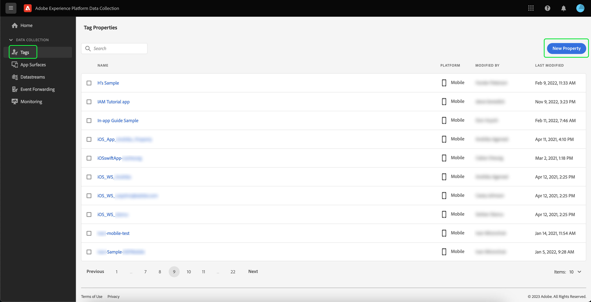

# Mise en oeuvre de l’extension Adobe Experience Platform Assurance

Ce tutoriel explique comment installer et mettre en oeuvre l’extension Platform Assurance dans le SDK Mobile. Pour obtenir des instructions sur l’ajout de l’extension Assurance à votre application, consultez la [présentation de l’extension Adobe Experience Platform Assurance](https://developer.adobe.com/client-sdks/documentation/platform-assurance-sdk/#add-the-aep-assurance-extension-to-your-app).

## Commencer

Pour installer et mettre en oeuvre l’extension Assurance, vous devez accéder aux services suivants :

- [Interface utilisateur de collecte de données Adobe Experience Platform](https://experience.adobe.com/#/data-collection/)
- [Adobe Experience Platform Assurance](https://experience.adobe.com/assurance)

## Création d’une propriété mobile

>[!NOTE]
>
>Si vous disposez déjà d’une propriété mobile, vous pouvez passer à l’étape suivante.

Dans l’interface utilisateur de la collecte de données, sélectionnez **[!UICONTROL Balises]**. Une liste des propriétés mobiles et web s’affiche, avec des informations sur les propriétés qui appartiennent à votre organisation. Sélectionnez **[!UICONTROL Nouvelle propriété]** pour créer une propriété.

La page **[!UICONTROL Créer une propriété]** s’affiche. Saisissez le nom de votre nouvelle propriété et sélectionnez **[!UICONTROL Mobile]** comme plateforme. Après avoir inséré vos détails, sélectionnez **[!UICONTROL Enregistrer]** pour créer la propriété mobile.

>[!NOTE]
>
>Le paramètre **[!UICONTROL Privacy]** de la propriété mobile n’affecte **pas** la collecte de données d’Assurance.

## Installation de l’extension Assurance

Sélectionnez la propriété mobile dans laquelle vous souhaitez installer l’extension Assurance.

La page **détails de propriété mobile** s’affiche. Sélectionnez **[!UICONTROL Extensions]** pour afficher la liste des extensions actuellement associées à votre propriété mobile.

Sélectionnez **[!UICONTROL Catalogue]** pour afficher la liste des extensions que vous pouvez ajouter à la propriété mobile. À l’aide du filtre, recherchez l’extension **[!UICONTROL AEP Assurance]**, puis sélectionnez **[!UICONTROL Installer]**.

## Étapes suivantes

Maintenant que vous avez installé l’extension Assurance dans votre propriété mobile, vous pouvez commencer à utiliser Assurance dans vos applications. Pour savoir comment ajouter l’extension Assurance à votre application, consultez la [présentation de l’extension Adobe Experience Platform Assurance](https://developer.adobe.com/client-sdks/documentation/platform-assurance-sdk/#add-the-aep-assurance-extension-to-your-app). Pour savoir comment utiliser Assurance, consultez le [guide d’assurance](./using-assurance.md).
