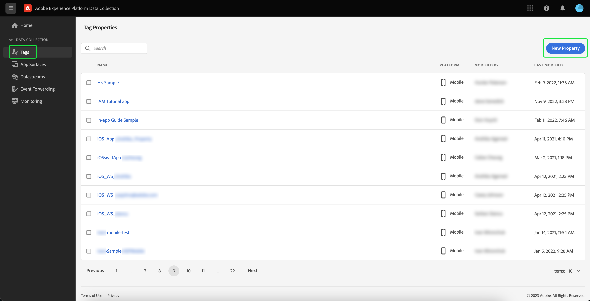
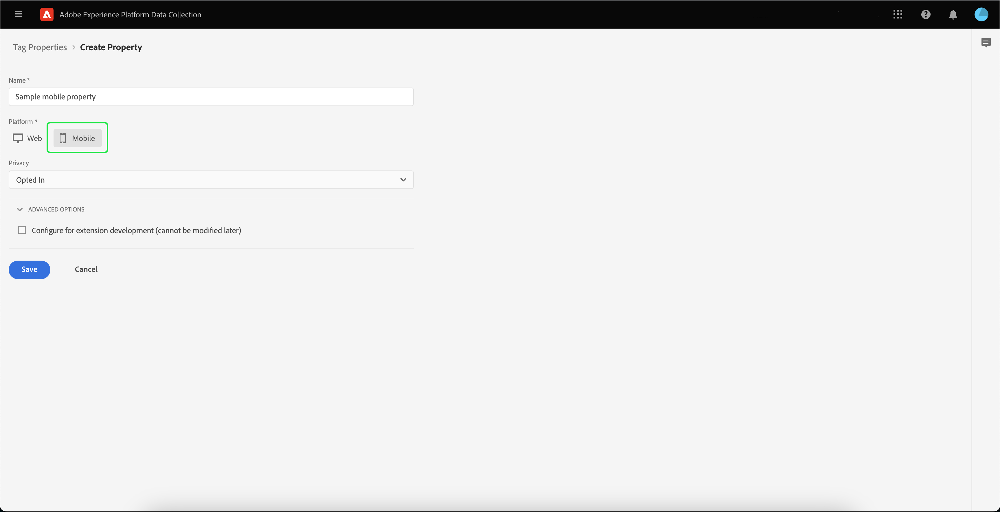
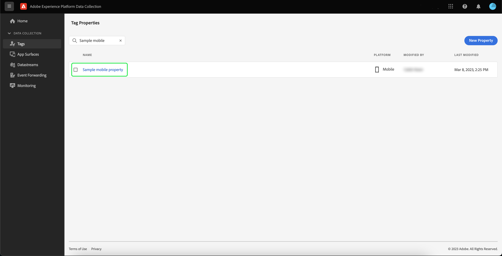
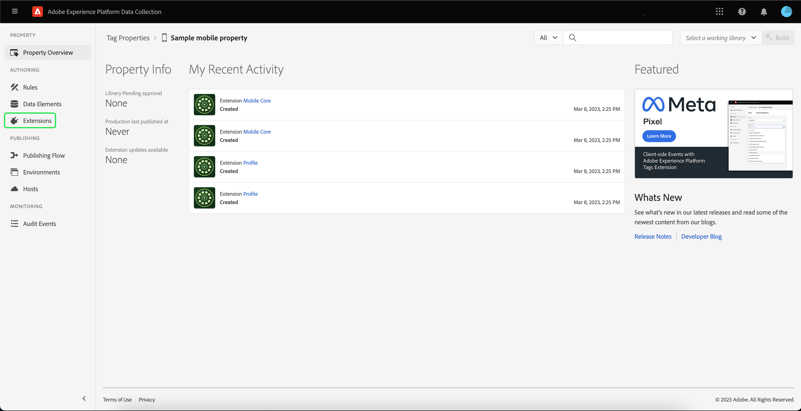
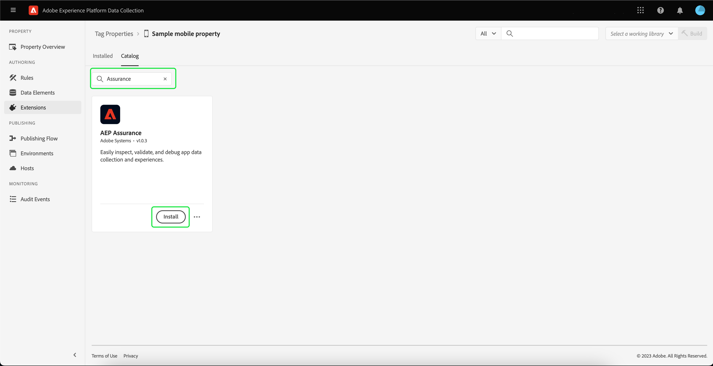

# Mise en œuvre de l’extension Adobe Experience Platform Assurance

Ce tutoriel explique comment installer et implémenter l’extension Experience Platform Assurance dans Mobile SDK. Pour obtenir des instructions sur l’ajout de l’extension Assurance à votre application, veuillez lire la [présentation de l’extension Adobe Experience Platform Assurance](https://developer.adobe.com/client-sdks/documentation/platform-assurance-sdk/#add-the-aep-assurance-extension-to-your-app).

## Prise en main

Pour installer et implémenter l’extension Assurance, vous devez avoir accès aux services suivants :

- Interface utilisateur de la collecte de données de Adobe Experience Platform [&#128279;](https://experience.adobe.com/#/data-collection/)
- [Assurance d’Adobe Experience Platform Assurance](https://experience.adobe.com/assurance)

## Création d’une propriété mobile

>[!NOTE]
>
>Si vous disposez déjà d’une propriété mobile, vous pouvez passer à l’étape suivante.

Dans l’interface utilisateur de collecte de données, sélectionnez **[!UICONTROL Tags]**. Une liste des propriétés mobiles et web s’affiche, avec des informations sur les propriétés appartenant à votre organisation. Sélectionnez **[!UICONTROL New property]** pour créer une propriété.

La page **[!UICONTROL Create Property]** s’affiche. Saisissez le nom de votre nouvelle propriété et sélectionnez **[!UICONTROL Mobile]** comme plateforme. Après avoir inséré vos détails, sélectionnez **[!UICONTROL Save]** pour créer la propriété mobile.

>[!NOTE]
>
>Le paramètre de **[!UICONTROL Privacy]** de la propriété mobile n’affecte **pas** la collecte de données d’Assurance.

## Installation de l’extension Assurance

Sélectionnez la propriété mobile dans laquelle vous souhaitez installer l’extension Assurance.

La page **détails de la propriété mobile** s’affiche. Sélectionnez **[!UICONTROL Extensions]** pour afficher la liste des extensions actuellement associées à votre propriété mobile.

Sélectionnez **[!UICONTROL Catalog]** pour afficher la liste des extensions que vous pouvez ajouter à la propriété mobile. À l’aide du filtre, recherchez l’extension **[!UICONTROL AEP Assurance]**, puis sélectionnez **[!UICONTROL Install]**.

## Étapes suivantes

Maintenant que vous avez installé l’extension Assurance dans votre propriété mobile, vous pouvez commencer à utiliser Assurance dans vos applications. Pour savoir comment ajouter l’extension Assurance à votre application, veuillez lire la présentation de l’extension [Adobe Experience Platform Assurance](https://developer.adobe.com/client-sdks/documentation/platform-assurance-sdk/#add-the-aep-assurance-extension-to-your-app). Pour savoir comment utiliser Assurance, consultez le [guide d’utilisation d’Assurance](./using-assurance.md).
