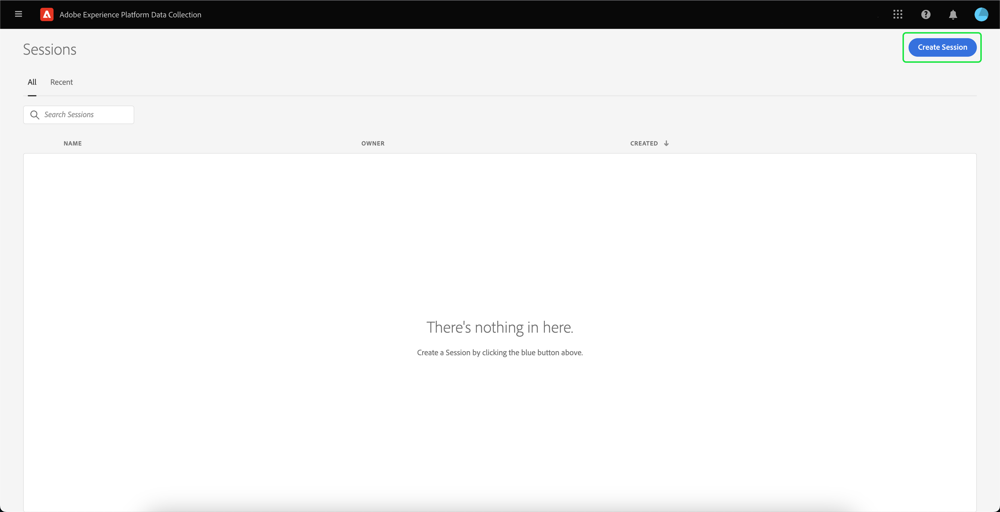
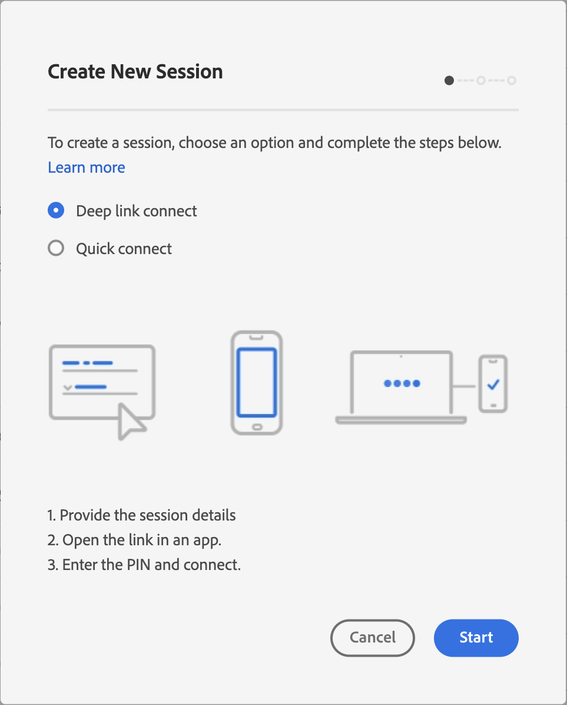
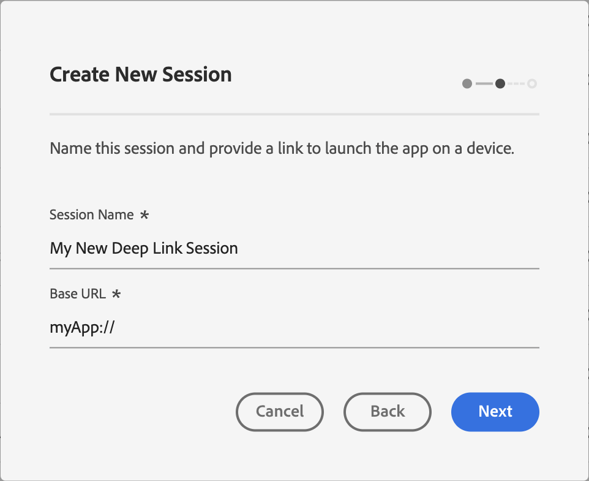
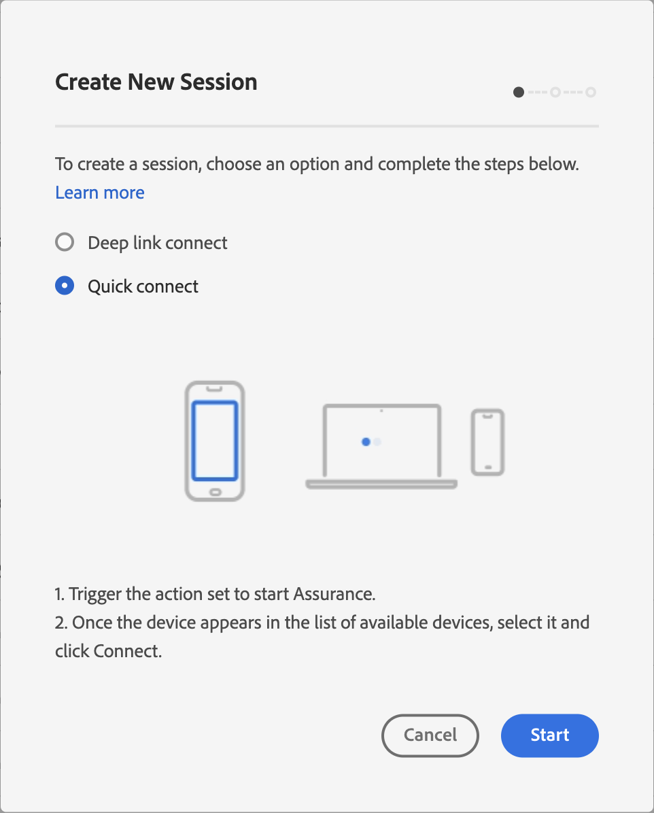
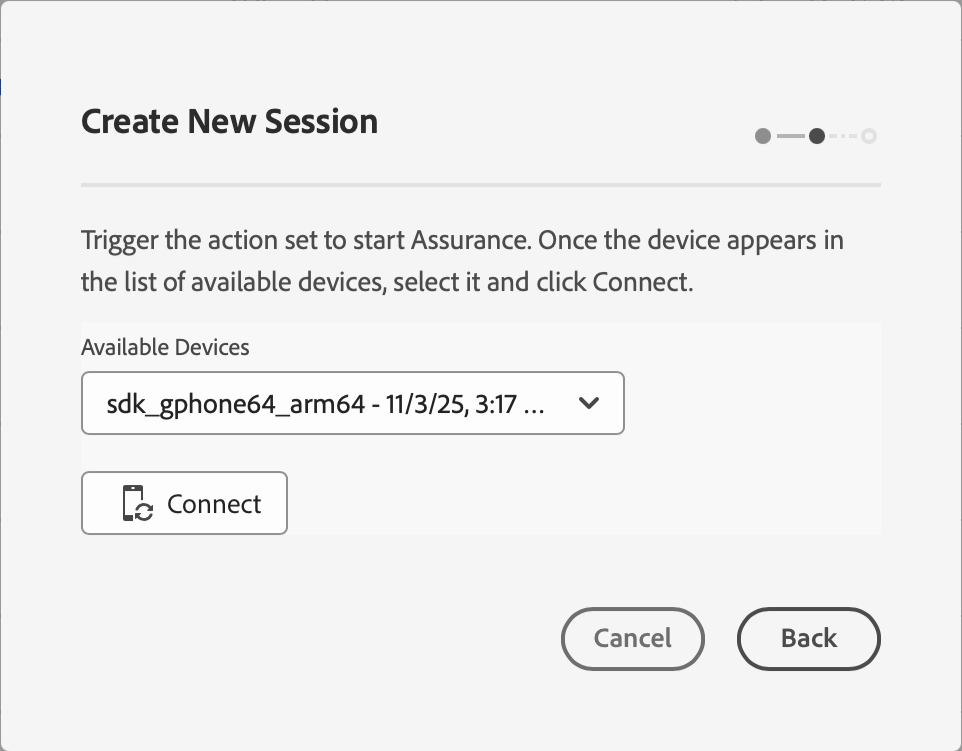
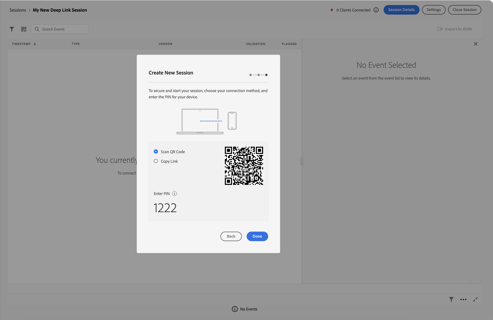
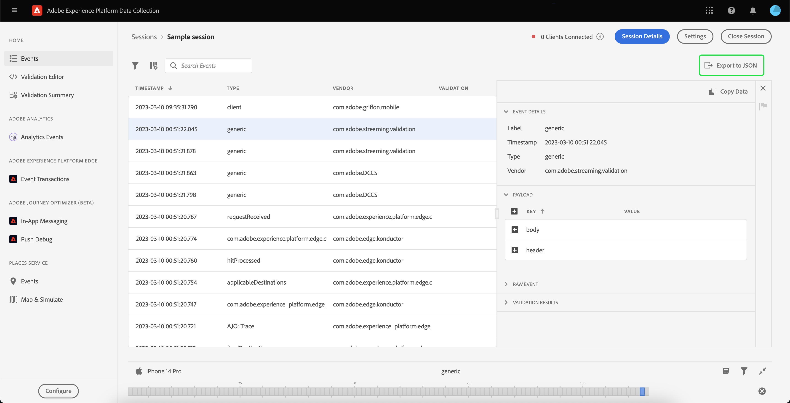

# Utilisation d’Adobe Experience Platform Assurance

Ce tutoriel explique comment utiliser Adobe Experience Platform Assurance. Pour obtenir des instructions sur l’installation et l’implémentation de l’extension Adobe Experience Platform Assurance, consultez le tutoriel sur [l’implémentation de l’extension Assurance](./implement-assurance.md).

## Créer des sessions

Après vous être connecté à l’interface utilisateur [&#128279;](https://experience.adobe.com/assurance), vous pouvez sélectionner **[!UICONTROL Créer une session]** pour commencer à créer une session.

La boîte de dialogue **[!UICONTROL Créer une session]** s’affiche avec deux options pour créer une session :

### Connexion de lien profond

Sélectionnez cette option pour générer une URL de session unique, un code QR et un code PIN. Scannez le code QR ou ouvrez manuellement le lien de session dans votre application, puis saisissez le code confidentiel pour établir la connexion.

Sélectionnez **[!UICONTROL Connexion de lien profond]** et continuez en sélectionnant **[!UICONTROL Démarrer]**.

Vous pouvez maintenant saisir un nom pour identifier la session, puis fournir une **[!UICONTROL URL de base]** (URL de lien profond pour votre application). Après avoir fourni ces détails, sélectionnez **[!UICONTROL Suivant]**.

>[!INFO]
>
>L’URL de base est la définition racine utilisée pour lancer votre application à partir d’une URL. Une URL de session est générée par laquelle vous pouvez lancer la session Assurance. Voici un exemple de valeur : `myapp://default` Dans le champ **[!UICONTROL URL de base]**, saisissez la définition du lien profond de base de votre application.

### Connexion rapide

Déclenchez une connexion à partir de votre application pour que votre appareil apparaisse dans la liste des appareils disponibles. Sélectionnez **[!UICONTROL Connexion rapide]** pour créer la session Assurance.

#### Conditions préalables

Avant d’utiliser Quick Connect, vérifiez que votre application dispose des versions et de l’implémentation SDK requises :

**Conditions requises pour Android SDK :**

- Mobile Core v3.1.0 ou version ultérieure
- Adobe Journey Optimizer v3.1.0 ou version ultérieure
- Adobe Experience Platform Assurance v3.0.4 ou version ultérieure

**Conditions requises pour iOS SDK :**

- Mobile Core v5.2.0 ou version ultérieure
- Adobe Journey Optimizer v5.1.1 ou version ultérieure
- Adobe Experience Platform Assurance v5.0.0 ou version ultérieure

**Implémentation :**

Votre application doit mettre en œuvre l’API [&#128279;](https://developer.adobe.com/client-sdks/home/base/assurance/api-reference/#startsession-quick-connect) pour déclencher la connexion Assurance. `startSession`Cet appel API est généralement inclus dans un jeu d’actions ou déclenché dans votre application.

#### Création d’une session de connexion rapide

Sélectionnez **[!UICONTROL Connexion rapide]** et continuez en sélectionnant **[!UICONTROL Démarrer]**. L’interface du sélecteur d’appareil s’affiche :

1. **Déclencher la connexion Assurance** - Dans votre application mobile ou implémentation, déclenchez l’action qui lance la connexion Assurance à l’aide de l’API `startSession`. Votre appareil sera ainsi détectable.

2. **Sélectionner et connecter votre appareil** - Une fois que votre appareil apparaît dans la liste des appareils disponibles, sélectionnez-le et cliquez sur **[!UICONTROL Connecter]**.

## Connexion à une session

Les étapes de connexion dépendent du type de session utilisé :

### Sessions de connexion profonde

Pour les sessions créées avec **[!UICONTROL Deep Link Connect]** :

1. Accédez à la page des détails de la session (pour les sessions existantes) ou passez à la création de la session pour afficher le lien, le code QR et le code confidentiel
2. Utilisez l’application de caméra de votre appareil pour scanner le code QR, ou copiez le lien et ouvrez-le dans votre application
3. Lors du lancement de votre application, l’écran de saisie du code confidentiel est superposé. Saisissez le code confidentiel et appuyez sur **[!UICONTROL Connect]**

### Sessions de connexion rapide

Pour les sessions créées avec **[!UICONTROL Connexion rapide]** (identifiable par une URL de session qui commence par `adobeassurance://`), la connexion se fait automatiquement via l’interface du sélecteur d’appareil :

1. Accédez à la page des détails de la session (pour les sessions existantes) ou continuez depuis la création de la session
2. Dans la section **[!UICONTROL Connecter l’appareil]**, vous verrez l’interface du sélecteur d’appareil
3. Déclenchez l’action définie dans votre application pour rendre l’appareil détectable
4. Sélectionnez votre appareil dans la liste et cliquez sur **[!UICONTROL Connect]**

### Vérification de la connexion

Vous pouvez vérifier que votre application est connectée à Assurance lorsque l’icône Adobe Experience Platform (Adobe « A » rouge) s’affiche sur l’application.

## Exporter une session

Pour exporter une session Assurance, sur la page de détails des sessions de votre application, sélectionnez **[!UICONTROL Exporter au format JSON]** dans une session :

L’option d’exportation respecte les résultats des filtres de recherche et exporte uniquement les événements affichés dans la vue d’événement. Par exemple, si vous recherchez des événements de « suivi », puis sélectionnez **[!UICONTROL Exporter au format JSON]**, seuls les résultats de l’événement de « suivi » sont exportés.