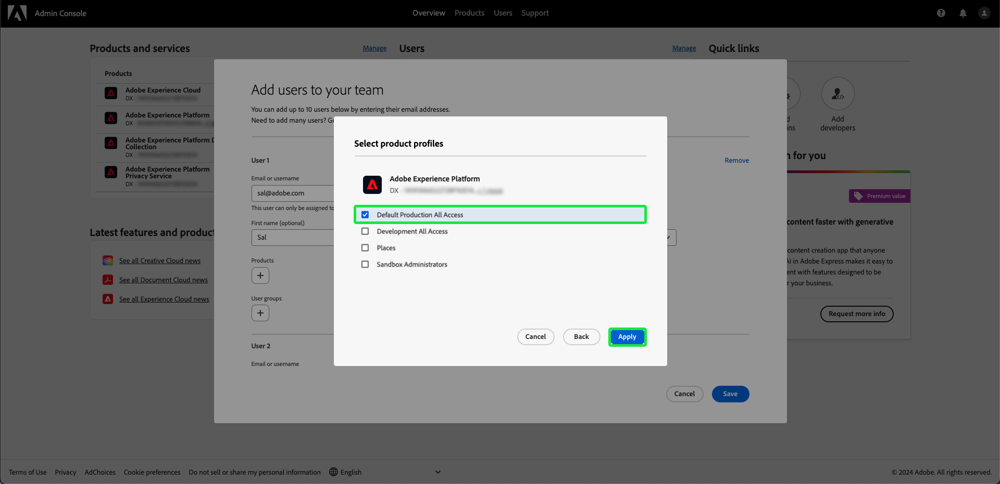

# Accès utilisateur

Donnez aux utilisateurs l’accès à [!UICONTROL Assurance] en les ajoutant à n’importe quel profil de produit dans Adobe Experience Platform en suivant les étapes suivantes dans [Adobe Admin Console](https://adminconsole.adobe.com/) :

## Ajout d’utilisateurs à Adobe Experience Platform via un profil de produit {#adding-product-profile}

Pour ajouter un utilisateur à un profil de produit, connectez-vous au [Adobe Admin Console](https://adminconsole.adobe.com/). Dans l’onglet **[!UICONTROL Overview]** de l’interface utilisateur de l’Admin Console, sélectionnez **[!UICONTROL Add users]**.

La boîte de dialogue **[!UICONTROL Ajouter des utilisateurs à votre équipe]** s’affiche. Entrez l&#39;adresse électronique ou le nom d&#39;utilisateur de la personne que vous souhaitez ajouter, puis sélectionnez **[!UICONTROL Ajouter en tant que nouvel utilisateur]**.

Deux zones de texte s’affichent pour saisir un **[!UICONTROL Prénom]** facultatif et un **[!UICONTROL Nom]** facultatif. Le **[!UICONTROL nom d’utilisateur SSO]** est automatiquement renseigné, ainsi que le **[!UICONTROL pays]** dans la liste déroulante. Assurez-vous que ces deux options sont correctes et effectuez les ajustements nécessaires. Une fois que tout est correct, sélectionnez **[!UICONTROL Produits]**.

La boîte de dialogue **[!UICONTROL Sélectionner un produit]** s’affiche. Sélectionnez le Adobe Experience Platform.

La boîte de dialogue **[!UICONTROL Sélectionner les profils de produit]** s’affiche, avec une liste de profils de produit. Sélectionnez un profil de produit, puis **[!UICONTROL Appliquer]**. Vous pouvez ajouter d’autres produits et profils de produits en répétant ces étapes.

Vérifiez que tout est correct pour l’utilisateur. À partir de là, vous pouvez ajouter d’autres utilisateurs ou enregistrer vos modifications en sélectionnant **[!UICONTROL Enregistrer]**.

