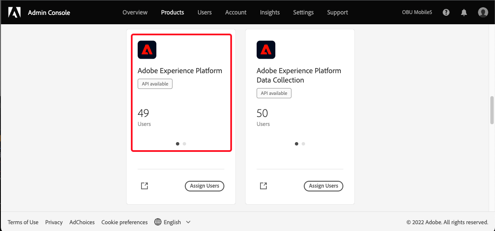
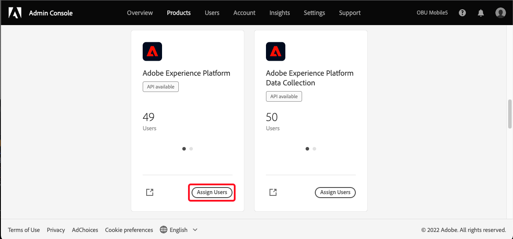

# Accès utilisateur

>[!WARNING]
>
>Notez que l’accès des utilisateurs à Assurance est en train de changer. Comme Assurance laisse la version bêta (Projet Griffon) à la disponibilité générale (en tant qu’assurance) pour tous les clients Adobe Experience Cloud, l’accès à Assurance sera géré par le biais de [Admin Console](https://helpx.adobe.com/fr/enterprise/using/admin-console.html).
>
>Si vous avez besoin d’aide, contactez l’administrateur Adobe Experience Cloud de votre société.

Pour recevoir ou maintenir un accès ininterrompu à Assurance, vérifiez que les étapes suivantes sont effectuées dans le Admin Console :

## Création d’un profil de produits

>[!NOTE]
>
>Si vous utilisez un profil existant, vous pouvez passer à la section suivante.

Connectez-vous au [Admin Console](https://adminconsole.adobe.com/) et créez un profil de produit Adobe Experience Platform.

Sélectionnez la **Produits** , suivie de la carte de produit Adobe Experience Platform.

## Ajout d’utilisateurs au profil de produit

Après avoir accédé à la carte du produit, attribuez un nom et sélectionnez **Enregistrer**.

>[!NOTE]
>
>Le profil de produit que vous prévoyez d’utiliser pour l’accès à Assurance **not** nécessitent des autorisations supplémentaires.

Maintenant que vous avez créé la carte de produit, vous pouvez affecter des utilisateurs au profil de produit Adobe Experience Platform. Sélectionnez la **Produits** , suivie de **Affecter des utilisateurs** sur la carte Adobe Experience Platform.

Ajoutez un ou plusieurs utilisateurs au profil de produit et enregistrez-le.

