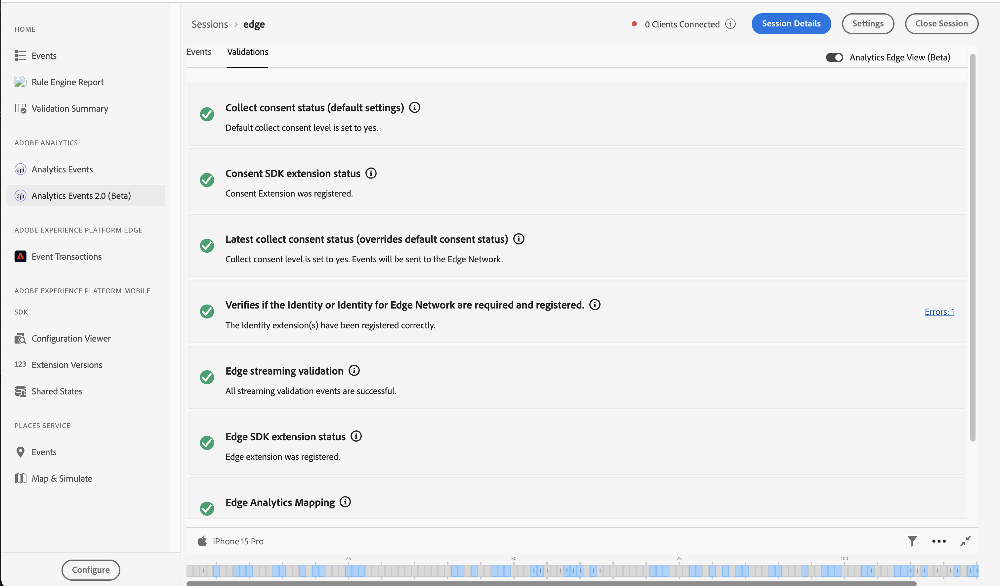

# Événements Analytics 2.0 dans Assurance

Les événements Analytics 2.0 offrent une vue plus riche des événements de SDK aux utilisateurs qui déboguent et valident leur mise en oeuvre Adobe Analytics. La vue affiche les événements envoyés à Adobe Analytics à partir du [SDK Adobe Experience Platform Mobile](https://developer.adobe.com/client-sdks/solution/adobe-analytics/) ainsi que le [SDK Adobe Experience Platform Edge Network](https://developer.adobe.com/client-sdks/edge/edge-network/). La vue comprend également un panneau de détails, qui fournit un contexte sur la manière dont l’événement a été traité par le SDK client, ainsi que par les services en amont une fois qu’il a quitté l’appareil.

## Commencer

Pour utiliser cette vue, procédez comme suit :

1. [Configurez Adobe Experience Platform Assurance](../tutorials/implement-assurance.md).
2. [Créez une session d’assurance et connectez-vous à une session](../tutorials/using-assurance.md).
3. Dans l’interface utilisateur d’assurance du menu de navigation de gauche **Home**, sélectionnez **Analytics Events 2.0 (Beta)**. Si vous ne voyez pas cette option, sélectionnez **Configurer** dans le coin inférieur gauche de la fenêtre, ajoutez les **Événements Analytics 2.0 (Beta)** et sélectionnez **Enregistrer**.

## Vue Événements Analytics

Utilisez la vue d’événement Analytics si vous utilisez l’extension mobile **Adobe Analytics**. Cette vue vous permet d’afficher facilement les événements Analytics envoyés à partir de votre client connecté, y compris les événements d’action de suivi, d’état de suivi et de cycle de vie. Si vous sélectionnez l’un des événements Analytics dans le tableau, vous pouvez afficher les détails sur le traitement de l’événement dans le panneau de droite.

### Statut traité par Post

Une fois que le SDK a effectué une requête réseau avec Adobe Analytics, l’état vous indique si Assurance a été en mesure de récupérer les informations de post-traitement pour la requête Adobe Analytics. La vue Événements Analytics doit rester active pendant que l’état de post-traitement est en cours d’exécution une fois la requête déclenchée.

Pour récupérer les informations de post-traitement, l’utilisateur connecté doit avoir accès à la suite de rapports correspondante.

| État | Description |
| :----- | :---------- |
| `Queued` | La requête réseau récupère les informations de post-traitement. |
| `Processed` | La requête réseau a réussi et les informations de post-traitement sont reçues. |
| `Delayed` | Le nombre maximal de tentatives de récupération des informations de post-traitement a été dépassé. |
| `Error` | Une erreur provoquait l’échec de la requête réseau. Des informations supplémentaires sur l’erreur s’affichent dans la vue des détails de l’événement. |
| `Unauthorized` | L’utilisateur n’a pas accès à la suite de rapports Adobe Analytics. |
| `Unavailable` | La requête Adobe Analytics ne comporte pas d’événement `AnalyticsResponse` correspondant. |
| `No Debug Flag` | La version actuelle du SDK Adobe Analytics ou Assurance peut ne pas prendre en charge la fonctionnalité de débogage Analytics. Pour plus d’informations, consultez le [guide de dépannage](../troubleshooting.md). |
| `Expired` | L’événement `AnalyticsTrack` ou `LifecycleStart` a plus de 24 heures. |

### Affichage des détails de l’événement

Pour un événement de suivi Analytics, la vue détaillée contient les parties suivantes :

- Événement de demande d’Analytics du SDK d’origine.
- Métadonnées et données contextuelles provenant de la requête, telles que l’identifiant de la suite de rapports, les versions de l’extension du SDK et les données contextuelles.
- Informations traitées par Post sur l’événement Analytics qui contient le mappage des variables, evars et props.

### Validation de la vue Analytics

La vue de validation vous permet d’afficher facilement les résultats sur les scripts de validation liés à Analytics. Les erreurs affichées par les validateurs peuvent contenir des liens vers l’emplacement où elles doivent être corrigées ou afficher les événements qui se trouvent dans un état d’erreur.

## Vue Analytics Edge

Utilisez la vue Analytics Edge si vous utilisez des extensions mobiles **Edge Network** ou **Edge Bridge**. Pour activer cette vue, sélectionnez la bascule &quot;Analytics Edge (Beta)&quot; en haut à droite pour afficher les événements Analytics envoyés via le réseau Edge dans la session en cours. Cela inclut tous les événements qui ont été déclenchés par l’extension de cycle de vie, les demandes Edge et/ou les événements Edge Bridge basés sur l’action de suivi et l’état de suivi.

La vue Analytics Edge contient des informations sur les demandes Edge liées à Analytics et les méthodes de cycle de vie distribuées par le client. En choisissant un événement dans la liste, le panneau de droite affiche les événements qui ont été traités par le SDK client, ainsi que par le service en amont après qu’ils aient quitté l’appareil, afin que vous puissiez facilement afficher la chaîne des événements qui ont résulté d’un appel .

### Validation d’Analytics Edge

La vue de validation d’Analytics Edge vous permet d’afficher facilement les résultats sur les scripts de validation liés à Analytics Edge. Les erreurs affichées par les validateurs peuvent contenir des liens vers l’emplacement où elles doivent être corrigées ou afficher les événements qui se trouvent dans un état d’erreur.

