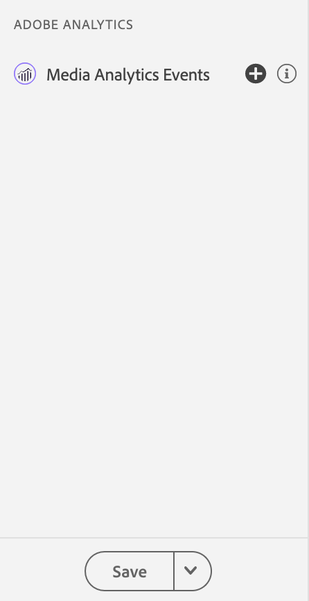
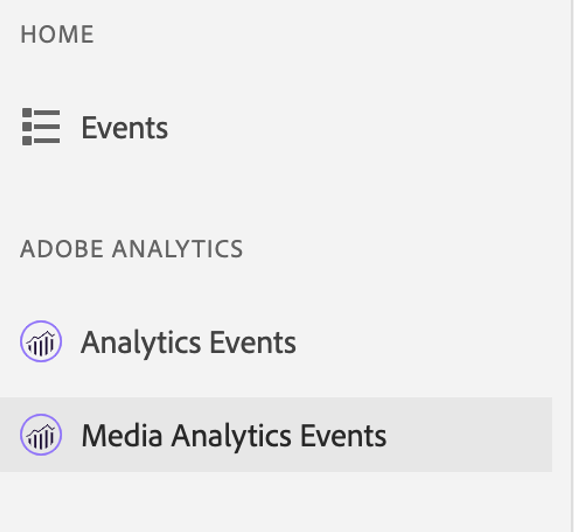
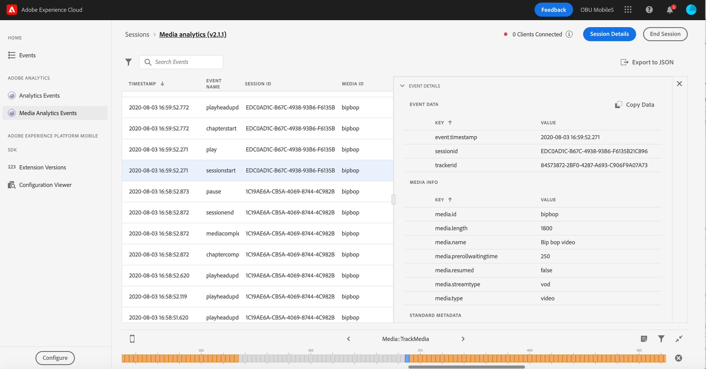
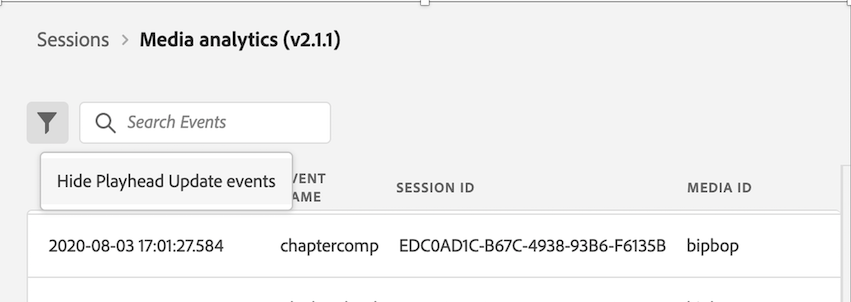
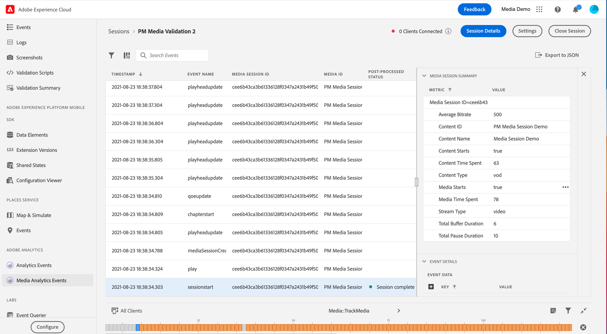

# Vue Adobe Analytics for Streaming Media dans Assurance

Grâce à l’intégration entre Adobe Analytics for Streaming Media et Adobe Experience Platform Assurance, vous pouvez désormais valider l’implémentation de Media Analytics dans votre application mobile. Les vues Media Analytics affichent ce qui est suivi dans la session multimédia, par exemple :

- Événement de début de session contenant toutes les propriétés de métadonnées de base de contenu, standard et personnalisées, ainsi que les événements de fin de session et de fin de session.
- Événements Début de la coupure publicitaire et Début de la publicité avec toutes les propriétés de publicité jointes, ainsi que les événements Ignorer et Terminer pour les deux.
- Le chapitre commence avec toutes les propriétés jointes, ainsi que les événements de saut de chapitre et de fin de chapitre.
- Tous les événements de modification de la lecture (lecture, pause, mémoire tampon, erreurs, modification du débit).
- Tous les événements de suivi des modifications d’état du lecteur (début, fin).

Une fois les données traitées dans Analytics, l’état et les données post-traitées, telles que le temps passé sur le média et la durée totale de pause, sont également disponibles dans la vue détaillée de l’événement.

## Prise en main

Avant de poursuivre, vérifiez que vous disposez des services suivants :

- Interface utilisateur de la collecte de données de Adobe Experience Platform [&#128279;](https://experience.adobe.com/#/data-collection/)
- [Assurance d’Adobe Experience Platform Assurance](https://experience.adobe.com/assurance)

Pour savoir comment installer Assurance dans votre application, veuillez lire le [&#x200B; guide d’implémentation d’Assurance &#x200B;](../tutorials/implement-assurance.md).

## Utilisation d’Assurance avec Adobe Analytics for Streaming Media

Une fois que vous êtes connecté et que vous avez configuré votre application pour Adobe Analytics, vous êtes prêt à la configurer pour Streaming Media Analytics. Dans la partie inférieure du panneau de gauche, sélectionnez **[!UICONTROL Configure]** pour ajouter la vue Événements Media Analytics et **Enregistrer**.

Une fois l’ajout effectué, sélectionnez la vue **[!UICONTROL Media Analytics Events]** dans la section **[!UICONTROL Adobe Analytics]** pour valider le suivi de votre session.

Dans la vue **[!UICONTROL Media Analytics Events]**, vous pouvez rechercher et filtrer par ID de session (VSID) pour afficher une session multimédia spécifique. Pour afficher des détails supplémentaires sur l’événement, sélectionnez un événement spécifique.

Pour une vue plus succincte des appels d’API, vous pouvez également masquer les événements de mise à jour du curseur de lecture en sélectionnant le filtre **[!UICONTROL Hide Playhead Update events]**.

>[!INFO]
>
>L’affichage des données Media Analytics post-traitées nécessite l’utilisation des versions de SDK : Android Media 2.1.2 et iOS AEPMedia 3.0.1 (ou ultérieures)

Pour afficher les données post-traitées, recherchez l’événement de début de session et validez dans la colonne d’état la fin de la session. Une fois l’opération terminée, cliquez sur l’événement pour afficher un résumé de la session multimédia dans la vue des détails de l’événement. Pour plus d’informations, faites défiler la page vers le bas pour rechercher les détails post-traités.

