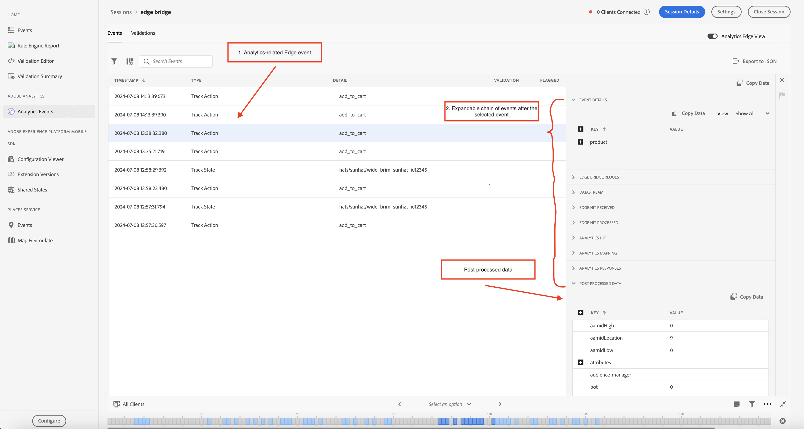
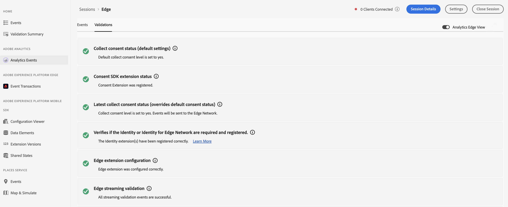
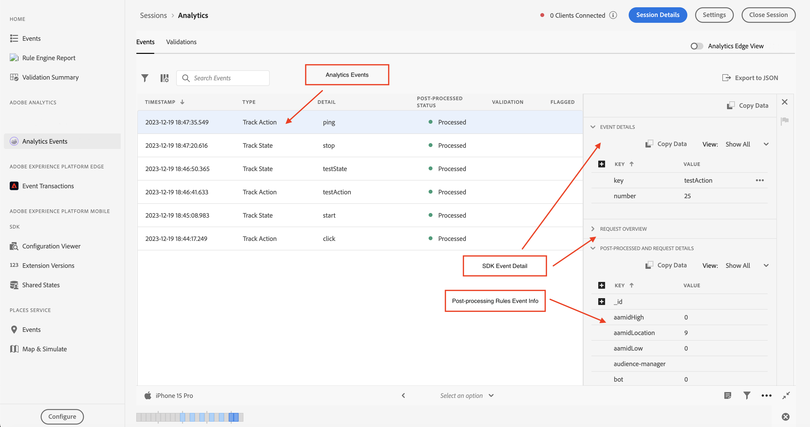
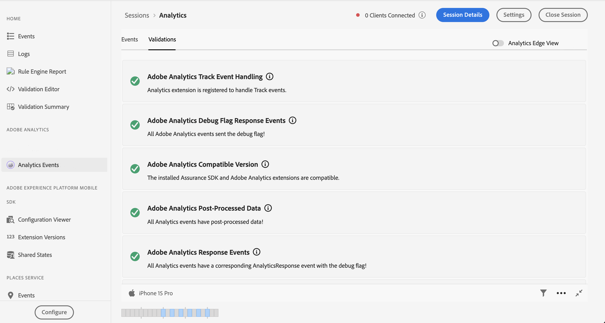

# Vue Événements Adobe Analytics dans Assurance

Les événements Analytics offrent une vue plus riche des événements SDK aux utilisateurs pour le débogage et la validation de leur implémentation d’Adobe Analytics. La vue affiche les événements envoyés à Adobe Analytics à partir de l’[SDK Adobe Experience Platform Edge Network](https://developer.adobe.com/client-sdks/edge/edge-network/) ainsi que du [SDK Mobile Adobe Experience Platform](https://developer.adobe.com/client-sdks/solution/adobe-analytics/). La vue comprend également un panneau de détails, qui fournit un contexte sur la manière dont l’événement a été traité par le SDK client et par les services en amont après sa sortie de l’appareil.

## Prise en main

Pour utiliser cette vue, procédez comme suit :

1. [Configurer Adobe Experience Platform Assurance](../tutorials/implement-assurance.md).
2. [Création et connexion à une session Assurance](../tutorials/using-assurance.md).
3. Dans l’interface utilisateur d’Assurance, dans le menu de navigation de gauche **Accueil**, sélectionnez **Événements Analytics**. Si cette option ne s’affiche pas, sélectionnez **Configurer** en bas à gauche de la fenêtre, ajoutez l’**Événements Analytics**, puis sélectionnez **Enregistrer**.

## Vue Edge Analytics

Utilisez la vue Edge Analytics si vous utilisez des extensions mobiles **Edge Network** ou **Edge Bridge**. Cette vue est activée lorsque le bouton (bascule) « Vue Edge Analytics » dans le coin supérieur droit est activé, affichant les événements Analytics envoyés via le réseau Edge dans votre session en cours. Cela inclut tous les événements qui ont été déclenchés par l’extension de cycle de vie, l’extension Edge et/ou l’extension Edge Bridge.

La vue Analytics Edge contient des informations sur les événements Edge liés à Analytics et les événements de cycle de vie envoyés par le client. En choisissant un événement dans la liste, le panneau d’affichage des détails de l’événement à droite affiche les événements qui ont été traités par le SDK client et par le service en amont après leur sortie de l’appareil. Vous pouvez ainsi afficher facilement la chaîne d’événements qui a résulté d’un appel .

L’événement **Données post-traitées** de la liste confirme que les données ont bien été traitées et envoyées à Adobe Analytics. Si cet événement ou des données traitées sont manquants, les utilisateurs peuvent développer chaque événement de la liste pour afficher des informations de débogage détaillées.

### Vue détaillée des événements Edge Analytics

Pour un événement de requête Edge ou un événement de suivi Analytics, la vue détaillée contient les informations suivantes :

* Détails de l’événement : événement de requête Edge de SDK d’origine.
* Demande Edge Bridge : événement exclusivement réservé au workflow de l’extension Edge Bridge.
* Flux de données : événement représenté pour le flux de données de cette session.
* Accès Edge reçu : représente l’accès reçu d’Edge.
* Accès Edge traité : représente l’accès traité dans Edge.
* Accès Analytics : représente l’accès reçu d’Analytics.
* Mappage Analytics : représente le statut du mappage des données dans Analytics.
* Réponse d’Analytics : statut de réponse d’Analytics.
* Données de post-traitement : informations sur l’événement contenant le mappage de révars, d’evars et de props.

### Validation d’Analytics Edge

La vue de validation Analytics Edge vous permet de voir facilement les résultats des scripts de validation liés à la session Analytics Edge. Les erreurs affichées par les validateurs peuvent contenir des liens vers l’emplacement où elles doivent être corrigées ou afficher des événements qui sont en état d’erreur.

## Vue Événements Analytics

Utilisez la vue Événement Analytics si vous utilisez l’extension mobile **&#x200B;**. Cette vue vous permet d’afficher facilement les événements Analytics envoyés à partir de votre client connecté, y compris les événements Action de suivi, État de suivi et Cycle de vie. Cette vue est active lorsque le bouton « Vue Edge Analytics » en haut à droite est désactivé.

En sélectionnant l’un des événements Analytics dans le tableau d’événement, vous pouvez afficher les détails du traitement de l’événement dans le panneau de droite.

### Statut post-traité

Une fois que le SDK a effectué une requête réseau avec Adobe Analytics, le statut vous indique si Assurance a pu récupérer les informations de post-traitement de la requête Adobe Analytics. La vue Événements Analytics doit rester active pendant que le statut de post-traitement est en cours une fois la requête déclenchée.

Pour récupérer les informations de post-traitement, l’utilisateur connecté doit avoir accès à la suite de rapports correspondante.

| État | Description |
| :----- | :---------- |
| `Queued` | La requête réseau récupère les informations de post-traitement. |
| `Processed` | La requête réseau a réussi et les informations de post-traitement sont reçues. |
| `Delayed` | Le nombre maximal de tentatives de récupération des informations de post-traitement a été dépassé. |
| `Error` | Une erreur a provoqué l’échec de la requête réseau. Plus de détails sur l’erreur s’affichent dans la vue des détails de l’événement. |
| `Unauthorized` | L’utilisateur n’a pas accès à la suite de rapports Adobe Analytics. |
| `Unavailable` | La requête Adobe Analytics n’a pas d’événement `AnalyticsResponse` correspondant. |
| `No Debug Flag` | La version actuelle d’Adobe Analytics ou d’Assurance SDK peut ne pas prendre en charge la fonctionnalité de débogage d’Analytics. Pour plus d’informations, veuillez lire le [Guide de dépannage](../troubleshooting.md). |
| `Expired` | L’événement `AnalyticsTrack` ou `LifecycleStart` a plus de 24 heures. |

### Affichage des détails de l’événement

Pour un événement de suivi Analytics, la vue détaillée contient les parties suivantes :

* Événement de requête SDK Analytics d’origine.
* les données Meta et contextuelles de la requête, telles que l’identifiant de suite de rapports, les versions de l’extension SDK et les données contextuelles.
* Informations post-traitées sur l’événement Analytics contenant le mappage de révars, d’evars et de props.

### Validation de la vue Analytics

La vue de validation vous permet de voir facilement les résultats des scripts de validation liés à Analytics. Les erreurs affichées par les validateurs peuvent contenir des liens vers l’emplacement où elles doivent être corrigées ou afficher des événements qui sont en état d’erreur.

