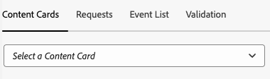
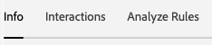

# Vue Cartes de contenu dans Assurance

La vue Messagerie In-App d’Adobe Experience Platform Assurance permet de valider votre application, de surveiller les cartes de contenu diffusées sur votre appareil et de prévisualiser les cartes.

## Cartes de contenu

En haut de l’onglet **[!UICONTROL Cartes de contenu]** se trouve une liste déroulante **[!UICONTROL Carte de contenu]**. Toutes les cartes de contenu reçues au cours de la session Assurance sont répertoriées. Si une carte ne figure pas dans cette liste, cela signifie que l’application ne l’a jamais reçue.

La sélection d’une carte de contenu affiche de nombreuses informations sur cette carte, comme décrit dans les sections ci-dessous.

### Aperçu de la carte

Dans le panneau de droite se trouve un volet **[!UICONTROL Aperçu de la carte]** qui montre le rendu d’une carte dans les modèles courants (petite image, grande image et image uniquement).

Utilisez le bouton (bascule) **[!UICONTROL Thème]** pour afficher la carte en mode clair ou sombre.

### Onglets disponibles

Dans la section de gauche, les onglets disponibles dépendent de la carte sélectionnée. Si la carte comprend des règles, trois onglets s’affichent : **[!UICONTROL Info]**, **[!UICONTROL Interactions]** et **[!UICONTROL Analyser les règles]**.

Si la carte n’inclut pas de règles, deux onglets s’affichent : **[!UICONTROL Info]** et **[!UICONTROL Interactions]**.

### Onglet Infos

L’onglet **[!UICONTROL Info]** affiche la section **[!UICONTROL Propriétés de la carte]** en haut, y compris les badges pour l’**[!UICONTROL État actuel]** (déclenchement, affichage, ignorance, disqualification), ainsi que des méta-détails tels que **[!UICONTROL Modèle]** (image petite, image grande ou image uniquement), **[!UICONTROL Surface]** et toute paire clé-valeur personnalisée.

Ci-dessous, la section **[!UICONTROL Propriétés de la campagne]** affiche les informations chargées depuis Adobe Journey Optimizer (AJO).

Vous pouvez également sélectionner **[!UICONTROL Afficher la campagne]** pour ouvrir la carte dans AJO à des fins d’inspection ou de modification.

### Onglet Interactions

L’onglet **[!UICONTROL Interactions]** résume le cycle de vie de chaque carte sous la forme d’une séquence de badges : il commence toujours par **[!UICONTROL trigger]**, suivi du résultat obtenu par les règles (**[!UICONTROL display]**, **[!UICONTROL dismiss]** ou **[!UICONTROL disqualifier]**.

### Onglet Analyser les règles

L’onglet **[!UICONTROL Analyser]** affiche un tableau d’événements avec jusqu’à trois colonnes de règles (**[!UICONTROL Afficher]**, **[!UICONTROL Ignorer]** et **[!UICONTROL Disqualifier]**, selon les règles de la carte. Si la carte ne définit qu’une seule règle, seule cette colonne s’affiche.

Chaque ligne représente un événement de session, et chaque colonne indique si la règle de la carte correspond aux conditions de cet événement. Un score de 0 % signifie qu’aucune condition ne correspond ; 100 % correspond à l’intégralité (la règle se déclenche).

Si l’événement correspond à une condition, une coche verte s’affiche. Si l’événement ne correspond pas, une icône rouge s’affiche.

Utilisez le curseur **[!UICONTROL Seuil de correspondance]** pour filtrer les événements en fonction du pourcentage de correspondance minimal.

Lorsque vous sélectionnez un événement, un panneau de détails s’ouvre à droite avec un accordéon répertoriant les trois règles : **[!UICONTROL Affichage]**, **[!UICONTROL Ignorer]** et **[!UICONTROL Disqualifier]**.

Développez n’importe quelle section pour afficher les conditions de la règle, les conditions correspondantes et le pourcentage de correspondance calculée pour ce résultat.

## Onglet Demandes

L’onglet **[!UICONTROL Demandes]** indique quelles cartes de contenu ont été demandées et sur quelle surface.

Utilisez le bouton **[!UICONTROL Afficher la carte]** pour revenir à l’onglet Informations d’une carte de contenu spécifique.

## Onglet Liste des événements

L’onglet **[!UICONTROL Liste des événements]** affiche les événements de session relatifs aux cartes de contenu, y compris les requêtes/réponses de proposition AJO, les événements de cycle de vie des cartes et le suivi des interactions. Vous pouvez rechercher, filtrer, trier et personnaliser des colonnes, ainsi qu’exporter des résultats.

La sélection d’un événement ouvre un panneau des détails droit avec la payload brute et les attributs clés ; vous pouvez également marquer les événements pour le suivi. Cette vue est utile pour mettre en corrélation les requêtes, les résultats des règles et les interactions au cours de la session.

## Onglet Validation

L’onglet **[!UICONTROL Validation]** exécute des validations sur la session en cours, en vérifiant si l’application a été configurée correctement pour la messagerie :

