# Vue Edge Delivery dans Assurance

L’affichage **** à l’intérieur d’**[!UICONTROL Adobe Experience Platform Assurance]** permet d’inspecter et de valider la [!UICONTROL diffusion entrante AJO] Edge des messages vers vos applications web et mobiles. Cette vue est particulièrement utile pour résoudre les problèmes de diffusion des campagnes et parcours web] mobiles et entrants [!UICONTROL AJO.

## Prise en main

Avant de poursuivre, vérifiez que vous avez accès aux services suivants :

- Interface utilisateur de la collecte de données de Adobe Experience Platform 
- [Assurance d’Adobe Experience Platform Assurance](https://experience.adobe.com/assurance)

Pour savoir comment installer **** dans votre application, veuillez lire le guide [implémentation d’Assurance](../tutorials/implement-assurance.md).

## Utilisation d’Assurance avec Edge Delivery

Une fois que vous avez ouvert une session ****, vous pouvez ajouter la vue **[!UICONTROL Edge Delivery]** à **[!UICONTROL Assurance]**. Dans la partie inférieure du panneau de gauche, sélectionnez **[!UICONTROL Configurer]** pour ajouter la vue **[!UICONTROL Edge Delivery]** et **Enregistrer**.

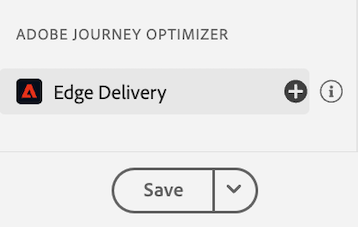

Une fois l’ajout effectué, sélectionnez la vue **** dans la section **[!UICONTROL Adobe Journey Optimizer]** pour valider la diffusion Edge entrante.

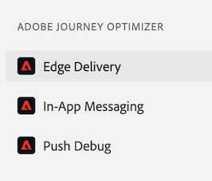

## Liste de demandes

Dans le volet principal de la vue, la liste des demandes de diffusion Edge s’affiche. Cette liste répertorie toutes les demandes AJO entrante] envoyées à Experience Edge et traitées par le **[!UICONTROL service de diffusion entrante]**, y compris les demandes de récupération des décisions de personnalisation, ainsi que de suivi des interactions de proposition de personnalisation (telles que l’affichage, le clic, le déclenchement ou l’ignorance).[!UICONTROL 

Les requêtes sont triées par horodatage, les requêtes les plus récentes se trouvant en haut. Outre la date et l’heure, la liste comprend également une colonne ID de requête, ainsi qu’un Type de requête, qui peut être l’un des suivants :

- **[!UICONTROL Diffusion d’expérience]** : demande permettant de récupérer les décisions de personnalisation
- **[!UICONTROL Interactions Experience]** : demande de suivi des interactions de proposition de personnalisation
- **[!UICONTROL Diffusion d’expérience et interactions]** : requête permettant de récupérer les décisions de personnalisation, y compris les interactions de proposition de personnalisation
- **[!UICONTROL Prévisualiser la diffusion]** : demande de récupération des décisions de personnalisation de prévisualisation

Les requêtes peuvent également être filtrées en saisissant un terme de recherche dans la barre de recherche située en haut de la liste. Cela s’avère utile lors du filtrage par valeurs spécifiques, telles que les identifiants.

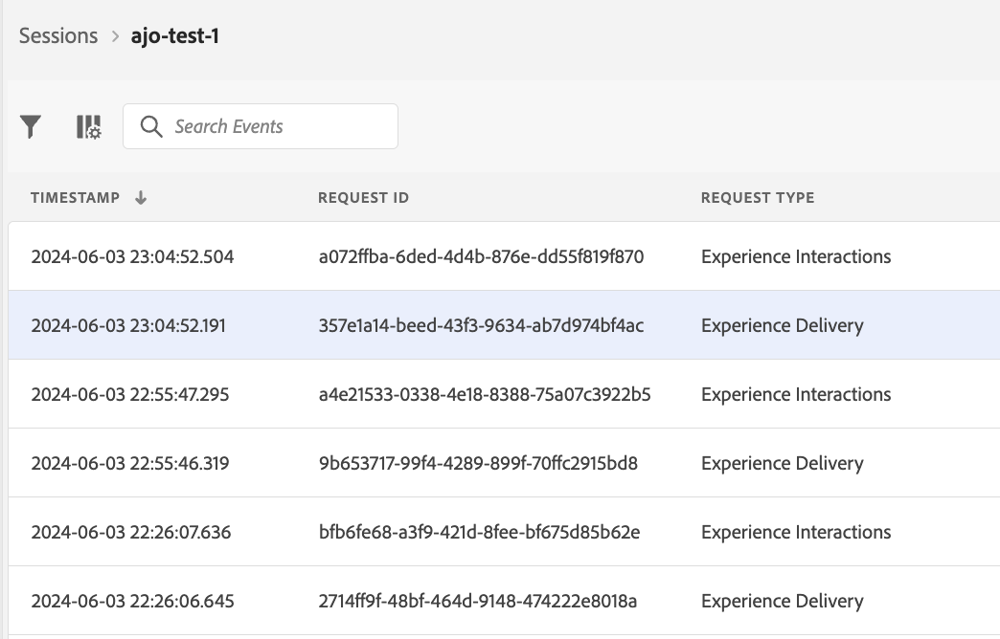

## Vues détaillées des demandes

Une fois qu’une requête est sélectionnée dans la vue principale, des informations détaillées sur la requête sélectionnée s’affichent à droite. Cette vue comprend les sections suivantes :

### Présentation des demandes

Cette section fournit une présentation générale de la requête sélectionnée, y compris [!UICONTROL ID d’organisation], [!UICONTROL cluster Edge], [!UICONTROL ID de requête] et [!UICONTROL Type de requête], [!UICONTROL ID de sandbox], [!UICONTROL Nom de sandbox], [!UICONTROL ID de flux de données], ainsi que la liste des surfaces de requête en cas de requêtes [!UICONTROL ExperienceDelivery].

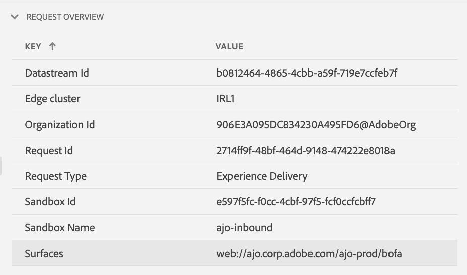

### Profile

Cette section fournit des informations sur les données de profil utilisées lors du traitement de la requête, y compris le mappage d’identité, l’appartenance à l’audience et les paramètres de consentement.\
La section [!UICONTROL Profil] est très utile pour résoudre les problèmes tels que le mauvais fonctionnement de la diffusion en raison d’une appartenance à l’audience manquante ou retardée ou des paramètres de consentement d’opt-out.

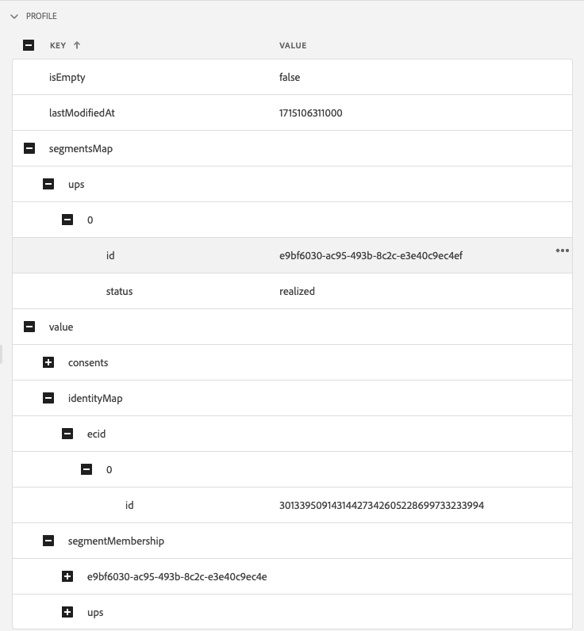

### Activités qualifiées

Cette section fournit une liste des activités qui ont été qualifiées pour la requête sélectionnée, y compris le type d’activité, les identifiants, l’espace de noms d’identité, les surfaces, le planning et les audiences. Vous trouverez des informations plus détaillées sur l’activité dans la section [trace d’exécution brute](#execution).

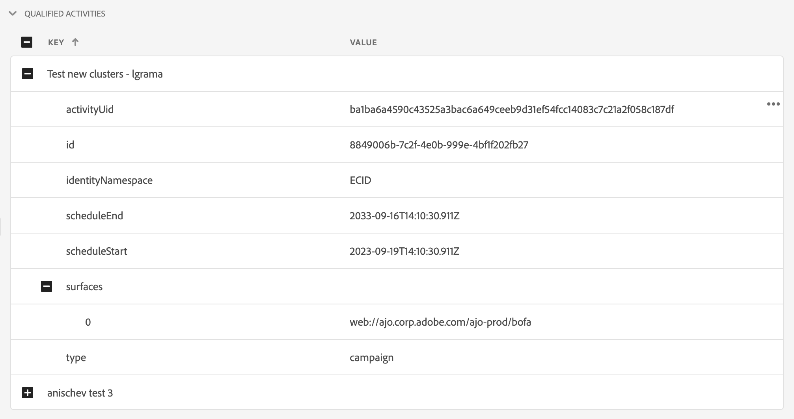

### Activités non qualifiées

Cette section fournit une liste des activités qui ont été exclues de la qualification. Outre le type d’activité, les identifiants, les espaces de noms d’identité, les surfaces, les plannings et les audiences, cette section comprend également une liste des raisons pour lesquelles l’activité n’a pas été qualifiée.

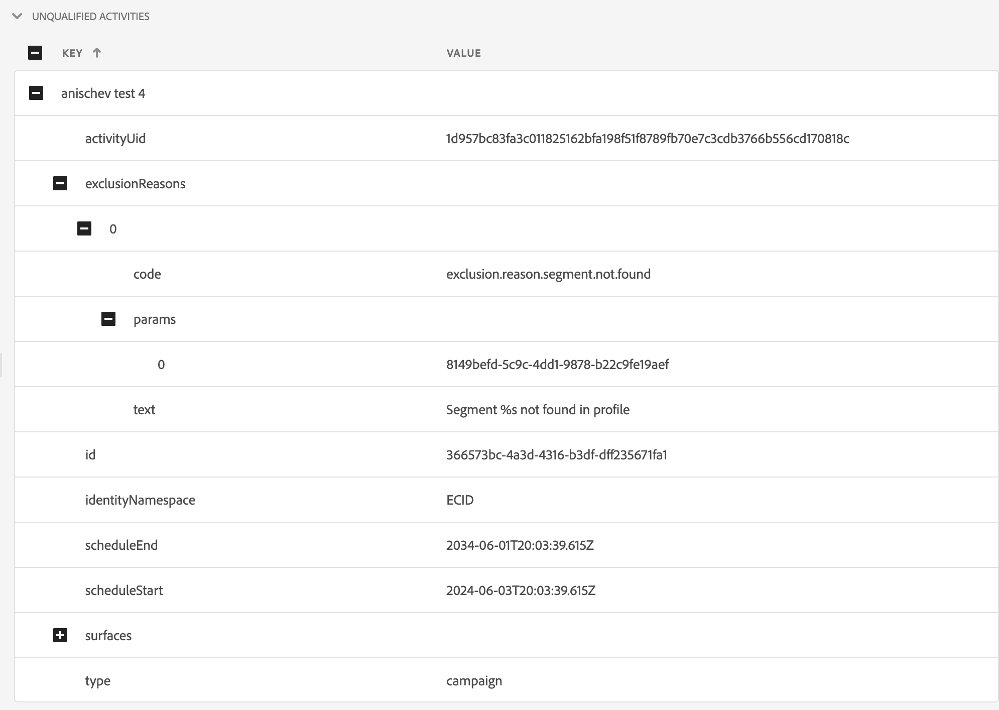

### Détails du message

Cette section fournit des informations détaillées sur les messages qui ont été diffusés pour la requête sélectionnée. Il comprend les identifiants de message, les fragments, les politiques de décision, les paramètres , ainsi que le contexte de sélection du message.

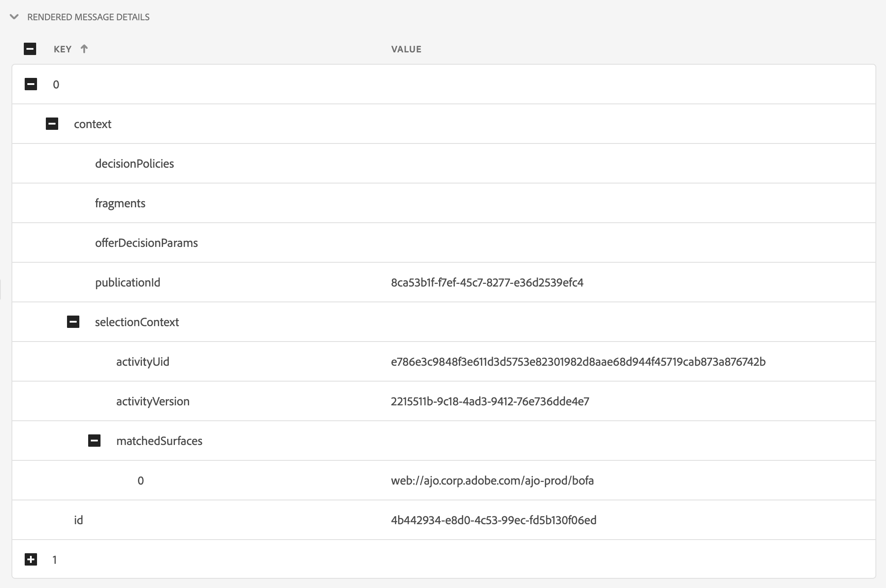

### Interactions

Cette section fournit des informations détaillées sur les interactions qui ont été suivies dans la requête sélectionnée. Il comprend le type d’interaction (sous `propositionEventType`), ainsi que les métadonnées de proposition associées, telles que les métadonnées d’activité (sous `scopeDetails.activity`) et le jeton d’événement de proposition (dans `scopeDetails.characteristics.eventToken`).

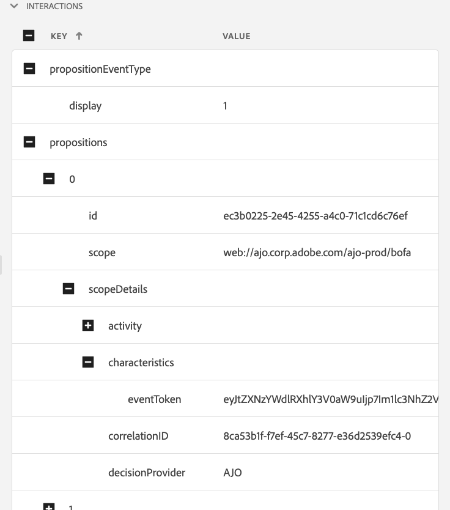

### Traces brute

Cette section fournit les traces brutes de la requête sélectionnée. Il comprend la trace complète de la requête, y compris la requête réelle telle qu’elle a été reçue dans **[!UICONTROL Inbound Delivery Service]**, la trace d’exécution et la trace de la réponse. Cela s’avère utile pour la résolution de problèmes avancés tels que le dysfonctionnement attendu d’une diffusion en raison d’une indisponibilité du service de diffusion, de données manquantes ou incorrectes, ou pour comprendre le flux complet du traitement des requêtes.

#### Requête

Le suivi des demandes inclut la demande complète telle qu’elle a été reçue en amont par le **[!UICONTROL service de diffusion entrante]** **[!UICONTROL Konductor]**. Il comprend les en-têtes de requête, le corps et d’autres métadonnées. Par exemple, la payload XDM de la requête peut être inspectée dans le champ `event.body.xdm` .

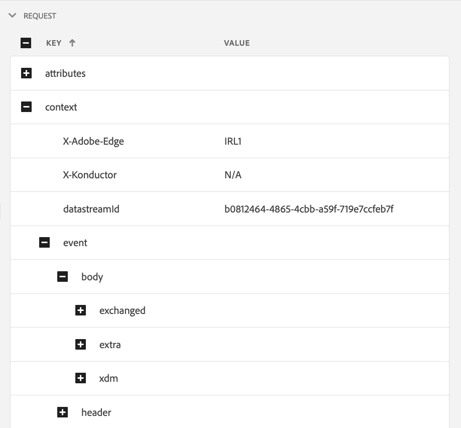

#### Exécution

La trace d&#39;exécution comprend la trace complète de la demande telle qu&#39;elle a été traitée par le **[!UICONTROL service de diffusion entrant]**. Il affiche le contexte d’exécution, la qualification de l’activité, la sélection du message et d’autres étapes de traitement. Les erreurs ou avertissements qui se sont produits lors du traitement de la demande se trouvent dans les champs `context.messages` et `context.exceptions`. Vous trouverez des informations détaillées sur la qualification des activités dans les champs `context.qualifiedActivitiesDetailed` et `context.unqualifiedActivitiesDetailed` .

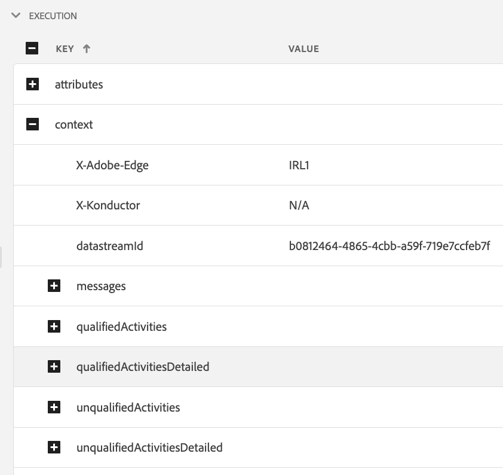

#### Réponse

La trace de réponse inclut la réponse complète telle qu&#39;elle a été renvoyée par **[!UICONTROL Inbound Delivery Service]** en aval de **[!UICONTROL Konductor]**. Il comprend les en-têtes de réponse, le corps et d’autres métadonnées. Le corps complet de la réponse peut être inspecté en copiant le message avec l’identifiant `1` dans le presse-papiers à l’aide du bouton **[!UICONTROL Copier la valeur]** et en le collant dans une visionneuse JSON.

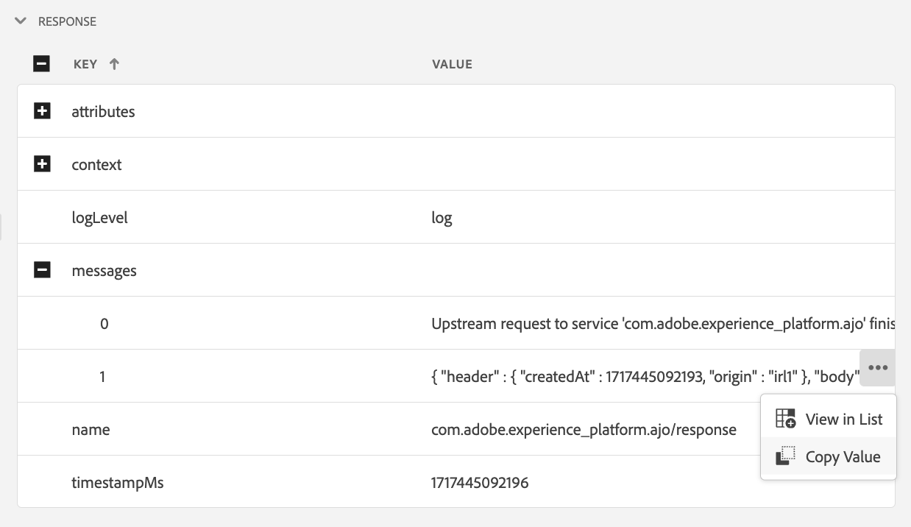
