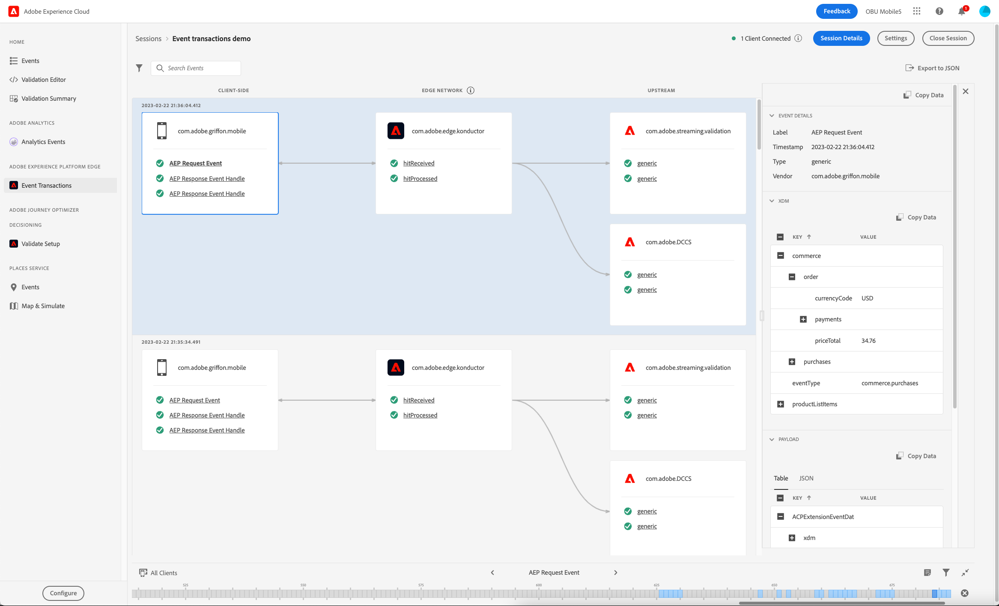
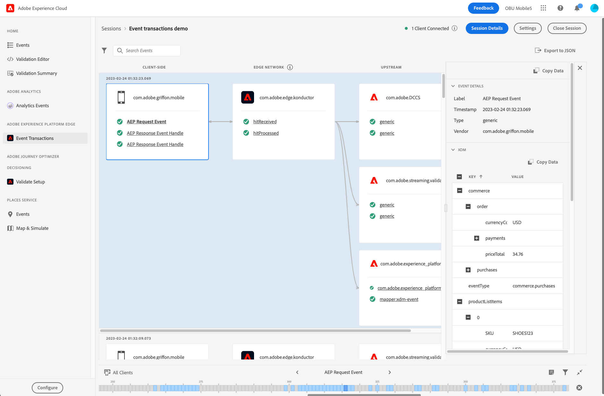
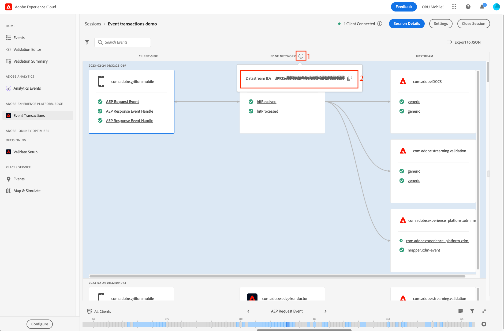

# Vue Transactions d’événement

La vue Transactions d’événement d’Adobe Experience Platform Assurance vous permet de valider et de déboguer l’implémentation de votre client Edge Network, et d’afficher les résultats de la validation en amont en temps quasi réel.

## Configuration d’Assurance pour le workflow Edge Network

Après avoir [configuré Assurance](../tutorials/implement-assurance.md), assurez-vous d’avoir mis en œuvre les dernières versions des extensions Assurance et Edge Network dans votre application.

Pour afficher vos événements, dans le menu de gauche, sélectionnez **[!UICONTROL Event Transactions]** sous la section **[!UICONTROL Adobe Experience Platform Edge]** .

Si cette option n’apparaît pas, sélectionnez **[!UICONTROL Configure]** dans le coin inférieur gauche de la fenêtre, ajoutez la vue **[!UICONTROL Event Transactions]**, puis sélectionnez **[!UICONTROL Save]**.

## Prise en main de la vue Transactions d&#39;événement

Dans cette section, familiarisez-vous avec la vue Transaction d’événement et apprenez à l’utiliser efficacement pour la validation de bout en bout des workflows Edge Network.

### Flux de traitement des événements

La vue Transactions d&#39;événement affiche trois colonnes dans l&#39;ordre du flux de traitement des événements :

- **[!UICONTROL Client-side]** : cette colonne affiche les événements traités ou reçus côté client, accessibles au SDK mobile. Cela inclut les événements créés à l’aide d’un appel API, tels que `Edge.sendEvent`, ainsi que les handles d’événement de réponse reçus par le client du serveur Edge Network, le cas échéant. Exemples d’événements côté client :
   - L’Événement de requête AEP est l’événement envoyé par l’intermédiaire de l’extension Edge et contient le XDM et les données libres facultatives.
   - Le gestionnaire d’événements de réponse AEP est le gestionnaire d’événements reçu d’Edge Network en réponse à un événement de requête AEP. Un événement de requête peut ne recevoir aucun, un ou plusieurs descripteurs d&#39;événement de réponse.
   - La réponse d’erreur d’AEP s’affiche en cas d’erreur, par exemple si la payload XDM n’a pas pu être traitée ou si l’un des services en amont a renvoyé une erreur ou un avertissement.
- **[!UICONTROL Edge Network]** : cette colonne affiche l’événement reçu côté serveur par Edge Network par le biais d’une requête réseau, ainsi que les données et métadonnées contenues dans l’événement.
- **[!UICONTROL Upstream]** : cette colonne affiche les événements reçus par les services en amont configurés, y compris des informations détaillées sur les résultats du traitement et/ou de la validation de l’événement entrant.
Notez que cette colonne est dynamique et peut afficher différents types d’informations en fonction de deux facteurs principaux :
   - La configuration du flux de données et les services activés dessus.
   - Type d’événement envoyé à Edge Network.

### Inspecter les événements

Les événements affichés dans la vue Transactions d’événement fournissent des informations sur le format et le contenu des données en cours de traitement à chaque état, ainsi que des détails pertinents sur les avertissements ou erreurs rencontrés lors du traitement des données en amont. Cette vue permet de préciser les informations de débogage au niveau de l’événement/de la requête et d’identifier les erreurs au début du cycle de développement.

#### Développer les détails de l’événement

Pour inspecter un événement, sélectionnez celui de votre choix dans la vue. Cette action développe la vue **[!UICONTROL Event Details]** dans la partie droite de l’écran.
Les données imbriquées s’affichent dans un format d’arborescence. Vous pouvez examiner les valeurs de clé imbriquées en sélectionnant le bouton **+** (plus) à gauche du nom de la clé.

#### Inspecter les avertissements ou les erreurs

Chaque nom d’événement est précédé d’une icône qui indique le statut général du traitement de cet événement :

- Si l’événement a été traité avec succès, une coche verte s’affiche.
- Si des avertissements ou des erreurs ont été détectés, un signe d&#39;avertissement s&#39;affiche. Sélectionnez l’événement associé pour en savoir plus sur la cause de l’avertissement ou de l’erreur dans la vue **[!UICONTROL Event Details]**.

### Paramètres de configuration

Vous pouvez vérifier l’identifiant de flux de données actuellement utilisé en sélectionnant l’info-bulle en regard de l’en-tête de colonne **[!UICONTROL Edge Network]**.

>[!INFO]
>
>Lorsque plusieurs clients se connectent à la même session Assurance et que différents identifiants de flux de données sont utilisés, ils sont tous affichés ici. Toutefois, cela ne signifie pas que votre implémentation actuelle utilise plusieurs flux de données. Seul l’identifiant du flux de données actuel défini dans la balise (propriété mobile) utilisée par l’application est utilisé pour traiter les nouveaux événements de ce client. Lors du test de cas d’utilisation plus complexes avec différents paramètres de configuration et plusieurs clients connectés, il peut être utile d’utiliser des sessions Assurance distinctes pour simplifier le processus de validation.
