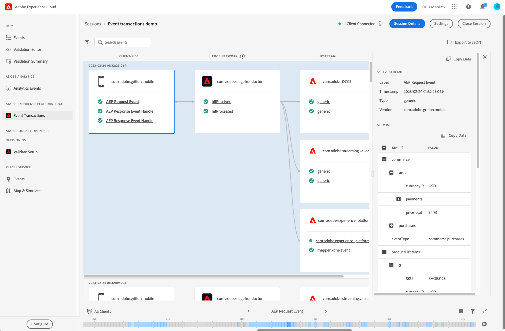
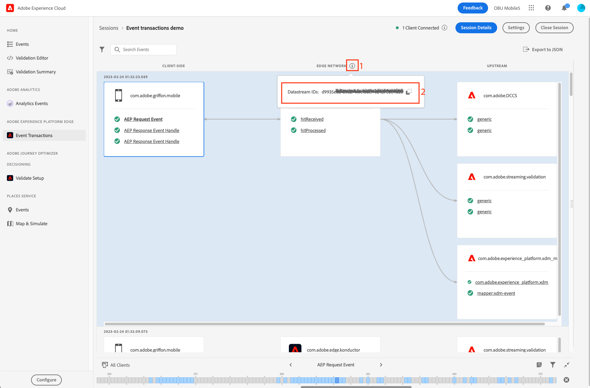

# Affichage des transactions d’événement

La vue Transactions d’événement dans Adobe Experience Platform Assurance vous permet de valider et de déboguer votre implémentation client Edge Network, et de voir les résultats de la validation en amont en temps quasi réel.

## Configuration de l’assurance pour le workflow Edge Network

Après avoir [configuré Assurance](../tutorials/implement-assurance.md), assurez-vous d’avoir mis en oeuvre les dernières versions des extensions Assurance et Edge Network dans votre application.

Pour afficher vos événements, dans le menu de gauche, sélectionnez **[!UICONTROL Event Transactions]** sous la section **[!UICONTROL Adobe Experience Platform Edge]** .

Si vous ne voyez pas cette option, sélectionnez **[!UICONTROL Configurer]** en bas à gauche de la fenêtre, ajoutez la vue **[!UICONTROL Transactions d’événement]** et sélectionnez **[!UICONTROL Enregistrer]**.

## Prise en main de la vue Transactions d’événement

Dans cette section, familiarisez-vous avec la vue Event Transaction et découvrez comment l’utiliser efficacement pour une validation de bout en bout sur les workflows Edge Network.

### Flux de traitement des événements

La vue Transactions d’événement affiche trois colonnes dans l’ordre du flux de traitement des événements :

- **[!UICONTROL Côté client]** : cette colonne affiche les événements traités ou reçus côté client, accessibles au SDK Mobile. Cela inclut les événements qui ont été créés à l’aide d’un appel API, tel que `Edge.sendEvent`, et les gestionnaires d’événements de réponse reçus par le client du serveur Edge Network, le cas échéant. Exemples d’événements côté client :
   - L’événement de requête AEP est l’événement envoyé par le biais de l’extension Edge et contient les données XDM et les données de formulaire libre facultatives.
   - Le gestionnaire d’événement de réponse AEP est le gestionnaire d’événement reçu d’un Edge Network en réponse à un événement de requête AEP. Un événement de requête peut recevoir aucun, un ou plusieurs gestionnaires d’événements de réponse.
   - La réponse d’erreur AEP peut s’afficher en cas d’erreur, par exemple si la charge utile XDM n’a pas pu être traitée ou si l’un des services en amont a renvoyé une erreur ou un avertissement.
- **[!UICONTROL Edge Network]** : cette colonne affiche l’événement reçu côté serveur par l’Edge Network via une requête réseau et les données et métadonnées contenues par l’événement.
- **[!UICONTROL En amont]** : cette colonne affiche les événements reçus par les services en amont configurés, y compris des informations détaillées sur les résultats de traitement et/ou de validation de l’événement entrant.
Cette colonne est dynamique et peut présenter différents types d&#39;informations selon deux facteurs principaux :
   - La configuration de la chaîne de données et les services activés dessus.
   - Type d’événement envoyé à l’Edge Network.

### Événements Inspect

Les événements affichés dans la vue Transactions d’événement fournissent des informations sur le format et le contenu des données en cours de traitement à chaque état, ainsi que des détails pertinents sur les avertissements ou erreurs rencontrés lors du traitement des données en amont. La vue permet de réduire les informations de débogage au niveau de l’événement/de la requête et d’identifier les erreurs tôt dans le cycle de développement.

#### Développer les détails de l’événement

Pour inspecter un événement, sélectionnez-le dans la vue . Cette action étend la vue **[!UICONTROL Event Details]** sur le côté droit de l’écran.
Les données imbriquées s’affichent sous la forme d’une arborescence. Vous pouvez examiner les valeurs de clé imbriquées en sélectionnant le bouton **+** (plus) à gauche du nom de la clé.

#### Avertissements ou erreurs Inspect

Chaque nom d’événement comporte un préfixe qui indique le statut de haut niveau du traitement pour cet événement :

- Si l’événement a été traité avec succès, une coche verte s’affiche.
- Si des avertissements ou des erreurs ont été détectés, un signe d’avertissement s’affiche. Sélectionnez l’événement associé pour en savoir plus sur la cause de l’avertissement ou de l’erreur dans la vue **[!UICONTROL Event Details]**.

### Paramètres de configuration

Vous pouvez vérifier l’identifiant de la chaîne de données actuellement utilisée en sélectionnant l’info-bulle en regard de l’en-tête de colonne **[!UICONTROL Edge Network]** .

>[!INFO]
>
>Lorsque plusieurs clients se connectent à la même session d’assurance et que différents identifiants de flux de données sont utilisés, tous les clients s’affichent ici. Toutefois, cela ne signifie pas que votre mise en oeuvre actuelle utilise plusieurs flux de données. Seul l’identifiant de flux de données actuel défini dans la balise (propriété mobile) utilisée par l’application est utilisé pour traiter de nouveaux événements provenant de ce client. Lors du test de cas d’utilisation plus complexes avec différents paramètres de configuration et plusieurs clients connectés, il peut s’avérer utile d’utiliser des sessions d’assurance distinctes pour simplifier le processus de validation.
