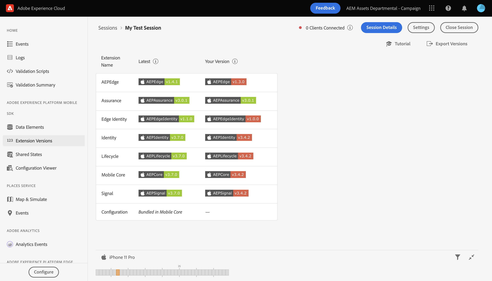
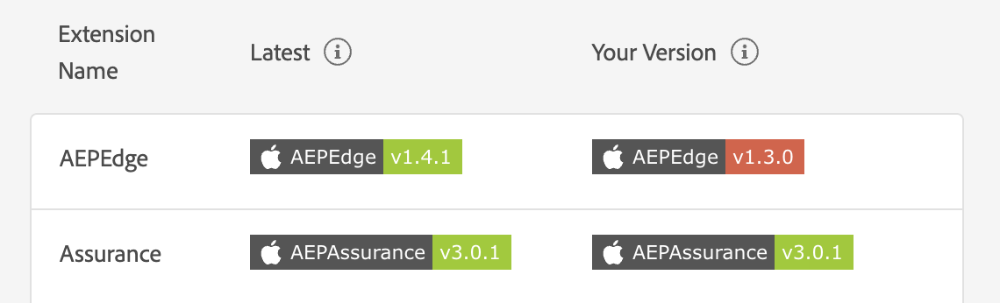
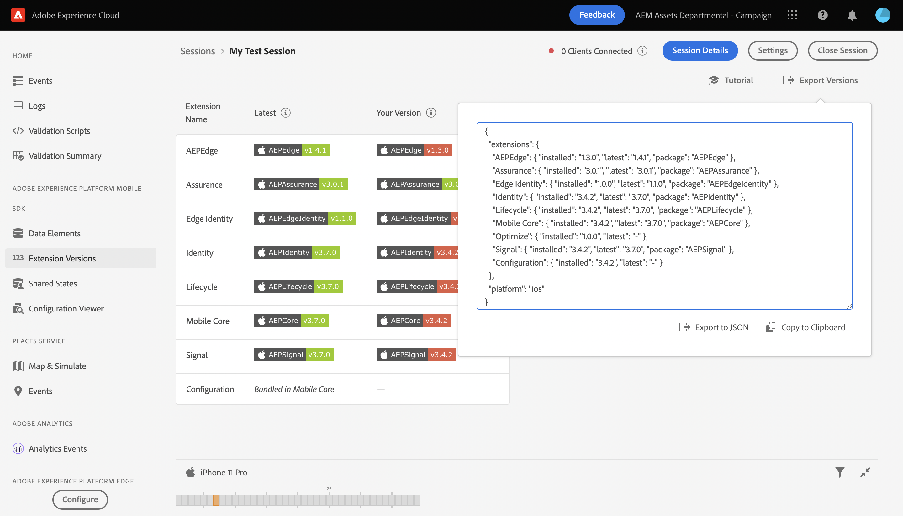

# Vue Versions d’extension

La vue Version des extensions vous permet de classer et de visualiser rapidement les extensions mobiles Adobe Experience Platform que vous avez installées et si elles sont à jour dans un client connecté à une session Assurance.

## Prise en main des vues des versions d’extension

Après avoir [configuré Assurance](../tutorials/implement-assurance.md), dans la vue **Accueil**, sélectionnez **[!UICONTROL Extension Versions]**

## Vérifier si votre version est à jour

Dans cette vue, un tableau affiche la dernière version de chaque Mobile SDK, ainsi que la version actuelle que vous avez installée, le cas échéant. Lorsqu’une version est synchronisée avec la dernière version, la version installée affiche un badge vert. Sinon, le badge sera affiché en rouge.

## Exporter les versions

En haut à droite de la vue, vous pouvez sélectionner **[!UICONTROL Export Versions]** qui vous donne une payload JSON avec toutes les informations d’extensions, ainsi que la plateforme utilisée par le client. Vous pouvez choisir d’exporter ces données vers un fichier JSON ou de les copier dans le presse-papiers.

