# Vue Messagerie In-App dans Assurance

La vue Messagerie In-App d’Adobe Experience Platform Assurance permet de valider votre application, de surveiller les messages in-app diffusés sur votre appareil et de simuler des messages sur votre appareil.

## Messages sur l’appareil

En haut de l’onglet **[!UICONTROL Messages sur l’appareil]** se trouve une liste déroulante **[!UICONTROL Message]**. Cela inclut tous les messages qui ont été reçus dans la session Assurance. Si un message ne figure pas dans cette liste, cela signifie que l’application ne l’a jamais reçu.

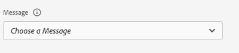

La sélection d’un message affiche une grande quantité d’informations sur ce message, comme décrit dans les sections ci-dessous.

### Aperçu du message

Dans le panneau de droite se trouve un volet **[!UICONTROL Aperçu du message]** qui affiche un aperçu du message. Sélectionner **[!UICONTROL Simuler sur l’appareil]** enverra ce message à tous les appareils actuellement connectés à la session.

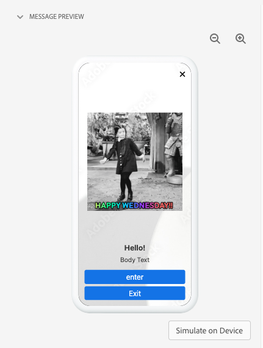

### Comportement des messages

Sous le volet **[!UICONTROL Aperçu du message]** se trouve l’onglet **[!UICONTROL Comportement du message]**. Elle contient tous les détails sur l’affichage du message. Ces informations incluent les informations de positionnement, les animations, les mouvements de glissement et les paramètres d’aspect.

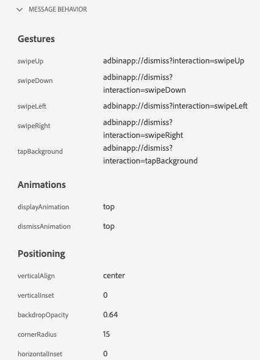

### Onglet Infos

Dans la section de gauche, quatre onglets affichent des détails sur le message. L’onglet **[!UICONTROL Info]** affiche les informations chargées depuis Adobe Journey Optimizer (AJO) au sujet de la campagne par message.

Vous pouvez également sélectionner **[!UICONTROL Afficher la campagne]** pour afficher le message dans AJO à des fins d’inspection ou de modification.

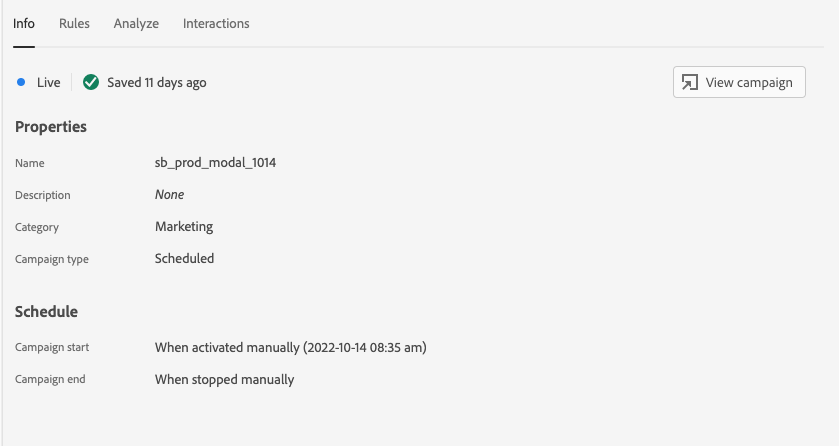

### Onglet Règles

L’onglet **[!UICONTROL Règles]** indique ce qui doit se passer pour que ce message s’affiche. Insight dispose ainsi de ce qui déclenchera l’affichage d’un message. En regardant cet exemple :

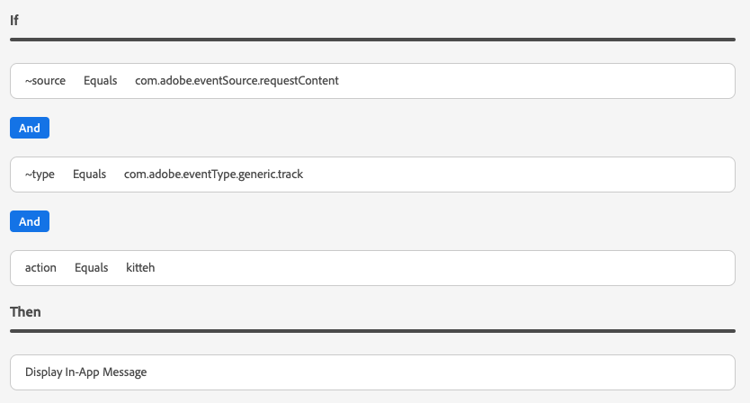

L’exemple montre trois conditions différentes pour la règle. Si vous sélectionnez un événement (dans une liste d’événements, dans l’onglet Analyser ou dans la chronologie), cet événement sera évalué par rapport à ces règles. Si l’événement correspond à une condition, une coche verte s’affiche :

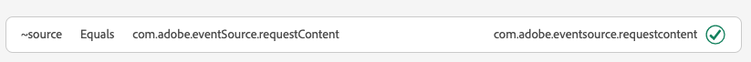

Si l’événement ne correspond pas, une icône rouge s’affiche :

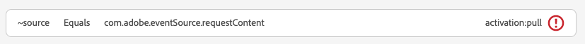

Si les trois conditions correspondent à l’événement actuel, le message s’affiche.

### Onglet Analyser

L’onglet **[!UICONTROL Analyser]** fournit des informations supplémentaires sur les règles. Ici, nous filtrons chaque événement de la session en fonction de la proximité de la règle de message par rapport à l’événement.

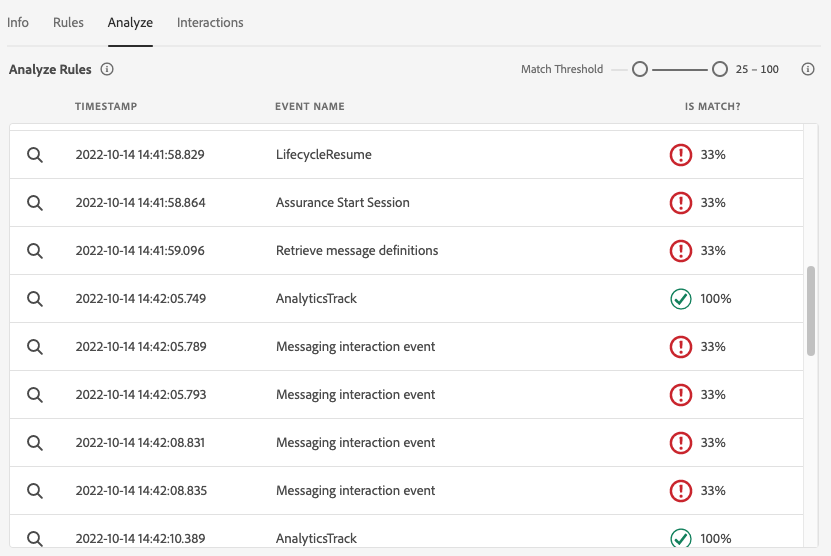

Dans l’exemple de la section **[!UICONTROL Onglet Règles]**, la règle comporte trois conditions. Cet onglet indique le pourcentage de la règle à laquelle correspond chaque événement. La majorité des événements correspondent à 33 % (l’une des trois conditions) et le reste à 100 %.

Par conséquent, vous pouvez trouver des événements qui sont proches de la correspondance, mais qui ne correspondent pas entièrement à la règle.

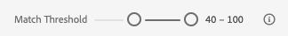

Le curseur **[!UICONTROL Seuil de correspondance]** permet de filtrer les événements à afficher. Par exemple, cette valeur peut être définie sur 50 % à 90 % afin d’obtenir une liste d’événements qui correspondent exactement à deux des trois conditions.

### Onglet Interactions

L’onglet **[!UICONTROL Interactions]** affiche une liste des événements d’interaction qui ont été envoyés à Edge à des fins de suivi.

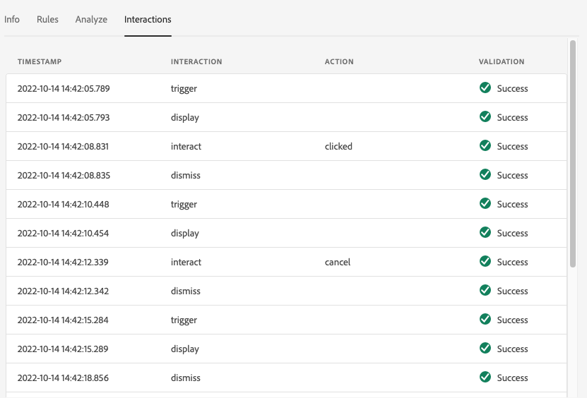

Il existe généralement quatre événements d’interaction lorsqu’un message est affiché :

```
trigger > display > interact > dismiss
```

Une valeur « action » supplémentaire est associée à l’interaction « interaction ». Les valeurs possibles sont « cliqué » ou « annuler ».

La colonne de validation indique si l&#39;événement d&#39;interaction a été correctement reçu et traité par l&#39;Edge.

## Validation

L’onglet **[!UICONTROL Validation]** exécute des validations sur la session en cours, en vérifiant si l’application a été configurée correctement pour la messagerie In-App :

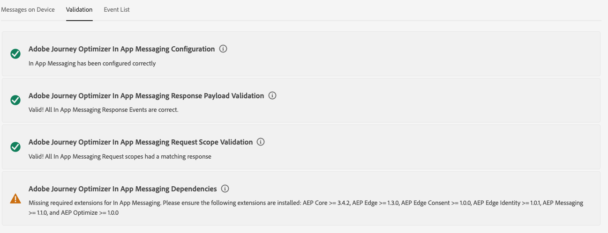

Si des erreurs ont été détectées, des détails sur la manière de les corriger sont fournis.

## Liste des événements

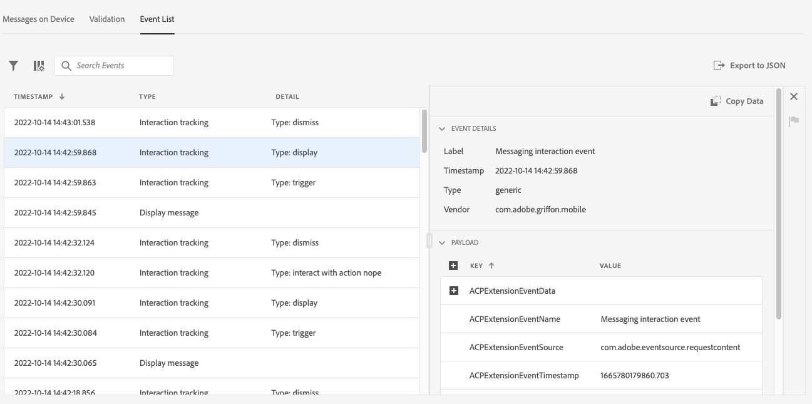

L’onglet **[!UICONTROL Liste des événements]** donne un aperçu rapide de tous les événements de la session Assurance liés à la messagerie In-App. Voici certains des événements que vous pouvez voir ici :

* Demandes et réponses pour récupérer les messages
* Afficher les événements de message
* Événements de tracking des interactions

Dans cette vue, vous pouvez utiliser de nombreuses fonctionnalités de liste d’événements standard, notamment l’application de recherches, l’application de filtres, l’ajout ou la suppression de colonnes et l’exportation de données.

Sélectionnez un événement pour afficher les détails bruts de l’événement dans le panneau de droite.

Dans le panneau de détails de droite, l’événement sélectionné peut être marqué, ce qui est utile pour marquer quelque chose qui doit être examiné par une autre personne.
