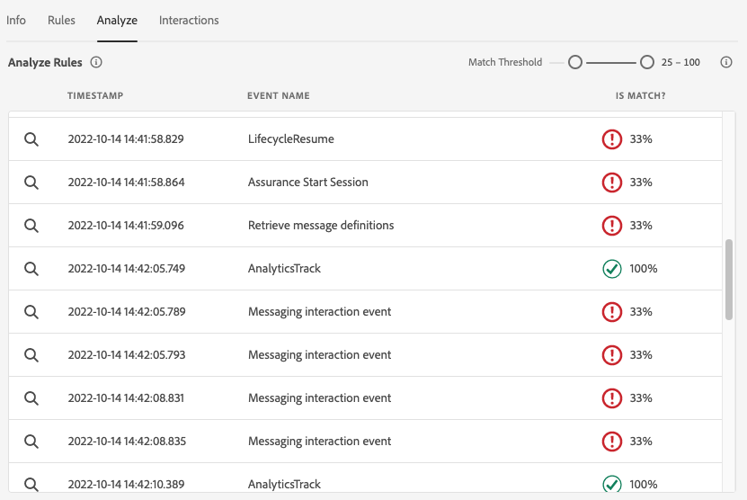
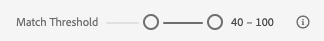

# Vue Messagerie in-app dans Assurance

La vue Messagerie in-app dans Adobe Experience Platform Assurance permet de valider votre application, de surveiller les messages in-app qui sont diffusés sur votre appareil et de simuler les messages sur votre appareil.

## Messages sur le périphérique

En haut de la **[!UICONTROL Messages sur le périphérique]** est un **[!UICONTROL Message]** menu déroulant. Cela inclut tous les messages qui ont été reçus dans la session d’assurance. Si un message ne figure pas dans cette liste, cela signifie que l’application ne l’a jamais reçu.


La sélection d’un message affiche de nombreuses informations sur ce message, comme décrit dans les sections ci-dessous.

### Aperçu du message

Dans le panneau de droite, une **[!UICONTROL Aperçu du message]** qui affiche un aperçu du message. Sélection **[!UICONTROL Simulation sur le périphérique]** enverra ce message à tous les appareils actuellement connectés à la session.


### Comportement du message

Sous la section **[!UICONTROL Aperçu du message]** est la **[!UICONTROL Comportement du message]** . Celui-ci contient tous les détails sur l’affichage du message. Ces informations comprennent des informations de positionnement, des animations, des mouvements de glissement et des paramètres d’aspect.


### Onglet Infos

Dans la section gauche, quatre onglets affichent des détails sur le message. Le **[!UICONTROL Infos]** affiche des informations chargées à partir de Adobe Journey Optimizer (AJO) sur la campagne de messages.

Vous pouvez également sélectionner **[!UICONTROL Afficher la campagne]** pour ouvrir le message dans AJO à des fins d’inspection ou de modification.


### Onglet Règles

Le **[!UICONTROL Règles]** indique ce qui doit se produire pour que ce message s’affiche. Vous obtenez ainsi des informations sur les éléments qui déclencheront l’affichage d’un message. En regardant cet exemple :


L’exemple présente trois conditions différentes pour la règle. Si vous sélectionnez un événement (dans une liste d’événements, dans l’onglet Analyser ou dans la chronologie), celui-ci sera évalué par rapport à ces règles. Si l’événement correspond à une condition, une coche verte s’affiche :


Si l’événement ne correspond pas, une icône rouge s’affiche :


Si les trois conditions correspondent à l’événement en cours, le message s’affiche.

### Onglet Analyser

Le **[!UICONTROL Analyser]** fournit des informations supplémentaires sur les règles. Ici, nous filtrons chaque événement de la session en fonction de la proximité de la règle de message avec l’événement.



Dans l’exemple de la section **[!UICONTROL Onglet Règles]** , la règle comporte trois conditions. Cet onglet indique le pourcentage de la règle correspondant à chaque événement. La majorité des événements correspondent à 33 % (l’une des trois conditions) et le reste à 100 %.

Par conséquent, vous pouvez trouver des événements qui sont proches de la correspondance mais ne correspondent pas entièrement à la règle.



Le **[!UICONTROL Seuil de correspondance]** vous permet de filtrer les événements à afficher. Par exemple, cette valeur peut être définie entre 50 et 90 % pour obtenir une liste d’événements qui correspondent exactement à deux des trois conditions.

### Onglet Interactions

Le **[!UICONTROL Interactions]** affiche la liste des événements d’interaction envoyés à Edge à des fins de suivi.


Il existe généralement quatre événements d’interaction à chaque affichage d’un message :

```
trigger > display > interact > dismiss
```

Une valeur &quot;action&quot; supplémentaire est associée à l’interaction &quot;interaction&quot;. Les valeurs possibles sont &quot;clicked&quot; ou &quot;cancel&quot; (Annuler).

La colonne de validation indique si l’événement d’interaction a été correctement reçu et traité par Edge.

## Validation

Le **[!UICONTROL Validation]** Cet onglet exécute les validations par rapport à votre session actuelle, en vérifiant si l’application a été correctement configurée pour la messagerie In-App :


Si des erreurs ont été détectées, des détails sur la façon de corriger ces erreurs sont fournis.

## Liste des événements


Le **[!UICONTROL Liste des événements]** Cet onglet vous permet d’examiner rapidement tous les événements de la session d’assurance liés à la messagerie in-app. Voici quelques événements :

* Requêtes et réponses pour récupérer les messages
* Affichage des événements de message
* Événements de suivi d’interaction

Dans cet affichage, vous pouvez utiliser de nombreuses fonctionnalités de liste d’événements standard, notamment l’application de recherches, l’application de filtres, l’ajout ou la suppression de colonnes et l’exportation de données.

Sélectionnez un événement pour afficher les détails bruts de l’événement dans le panneau de droite.

Dans le panneau des détails de droite, l’événement sélectionné peut être marqué, ce qui s’avère utile pour marquer quelque chose qui doit être examiné par une autre personne.
