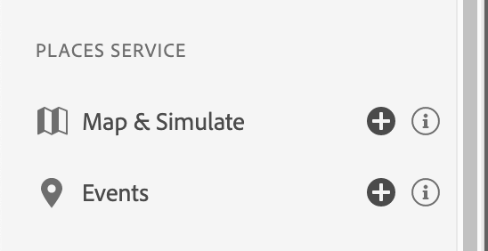

# Vue Places Service dans Assurance

La vue **[!UICONTROL Places]** vous permet d’inspecter les événements d’entrée et de sortie d’emplacement sur l’interface utilisateur web d’Adobe Experience Platform Assurance et offre une vue innovante sur l’appareil. En fonction de vos workflows métier, ces vues pratiques fournissent une interface pratique pour afficher des points de données spécifiques à un emplacement à inspecter sur le web/client pour le débogage contextuel.

Nous savons que l’utilisation du contexte de localisation avec vos expériences d’application peut les rendre plus attrayantes. Cependant, le débogage et la validation des déclencheurs d’emplacement peuvent s’avérer fastidieux. L’utilisation de ces vues et la révision des données que vous collectez sur l’appareil permettent de soulager cette douleur.

## Utilisation d’Assurance avec Places Service

Pour commencer, procédez comme suit :

1. [Configurer Assurance](../tutorials/implement-assurance.md).
2. Pour afficher vos événements, dans le menu de gauche, sélectionnez la **vue Événements** sous la section **Service Places**.

