# Vue Débogage des notifications push

La vue de débogage push dans Adobe Experience Platform Assurance permet de valider la configuration push de votre application et d’envoyer un message de test à votre appareil.

## Clients

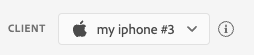

La liste déroulante client comporte une liste de chaque client unique qui s’est connecté à cette session Assurance. Un client est un appareil unique ou une installation d’application unique pour un appareil. Par exemple, si un appareil Android et un appareil iOS ont été connectés à la session, ces clients s’affichent dans la liste déroulante Clients .

Après la réinstallation et la reconnexion de l’application sur un appareil, un autre client s’affiche. Si un appareil portant ce nom existait déjà, la nouvelle liste déroulante ajoute un #2 au nom.

Cette vue n’est activée que pour un seul client. Par conséquent, la sélection d’un autre client modifie les détails à l’écran.

## Validation de la configuration

L’onglet **[!UICONTROL Validate Setup]** valide et fournit des détails supplémentaires sur la configuration push de l’application. Trois panneaux effectuent les validations. Une coche verte s’affiche si toutes les validations réussissent. Si trois coches vertes apparaissent, cela signifie que l’application a été correctement configurée pour la messagerie push, qu’elle écrit des jetons push au profil utilisateur et qu’une configuration de canal associée est configurée.

Si quelque chose ne fonctionne pas comme prévu, une alerte s’affiche avec des détails sur la manière de résoudre ce problème :

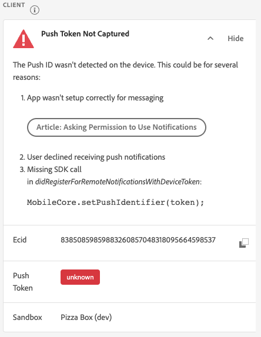

### Détails du client

Ce panneau vérifie si l’appareil est correctement configuré. Cela inclut la configuration de l’extension dans l’interface utilisateur de la collecte de données, l’initialisation de l’extension et de ses conditions préalables dans votre application et la capture du jeton push à partir de l’appareil.

Si elle est valide, le panneau affiche l’ECID de l’appareil, le jeton push ainsi que le nom et le type du sandbox Edge.

### Détails du profil

Une fois que votre client est correctement configuré, ce panneau vérifie si l’appareil écrit dans le profil. Il confirme également que le jeton push du profil correspond à celui de l’appareil.

Si valide, le panneau affiche l’ECID de l’appareil, le jeton push, l’ID de l’application de votre application, la plateforme de messagerie et si le jeton push a été placé sur la liste bloquée. Le jeton peut être placé sur la liste bloquée pour diverses raisons, telles que la désinstallation de l’application par l’utilisateur ou la désactivation de la messagerie push pour l’application.

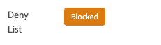

Enfin, au bas du panneau se trouve un lien qui ouvre ce profil spécifique dans un nouvel onglet.

### Informations d’identification et configuration d’AppStore

Ce panneau confirme que l’identifiant de l’application et la plateforme de messagerie qui a été enregistrée dans le profil ont une configuration de canal correspondante créée. Une configuration de canal correspond à l’endroit où les informations d’identification des notifications push de l’application sont chargées.

Si elle est valide, le profil affiche le nom de la configuration du canal, l’identifiant de l’application et le nom du service de messagerie.

## Envoyer la notification push de test

L’onglet **[!UICONTROL Send Test Push]** peut être utilisé pour envoyer un message de test à votre appareil.

Plusieurs volets peuvent être configurés pour tester différentes fonctionnalités des notifications push iOS et Android. Une fois la configuration effectuée, sélectionnez **[!UICONTROL Send Test Push Notification]** pour envoyer votre message.

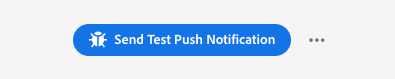

### Message

Dans le volet de **[!UICONTROL Message]**, vous pouvez fournir un titre et un corps pour le message. La fonctionnalité de notification silencieuse peut également être activée ici.

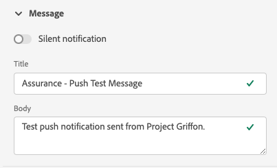

### Ciblage des notifications push

Le volet **[!UICONTROL Push Target]** vous permet de personnaliser le jeton push et la configuration de canal à utiliser lors de l’envoi du message push.

Ces informations sont fournies par défaut si l’onglet **[!UICONTROL Validate Setup]** comporte trois coches vertes. Cependant, vous pouvez fournir votre propre jeton push et votre propre configuration de canal, même si votre application n’est pas entièrement configurée.

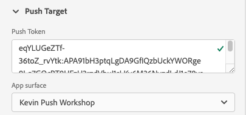

### Comportement en cas de clic

Dans le volet de **[!UICONTROL Click Behavior]**, vous pouvez choisir le comportement à adopter lorsque l’utilisateur clique sur la notification push sur l’appareil. Par défaut, il ouvre l’application, mais il peut aussi ouvrir un lien profond ou une page web.

Si vous choisissez d’utiliser un lien profond, le développeur ou la développeuse de l’application doit en créer un pour vous.

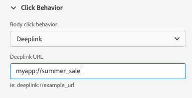

### Média enrichi

Le volet **[!UICONTROL Rich Media]** vous permet d’ajouter des médias supplémentaires à votre message, tels qu’une image, une vidéo ou un GIF. Le développeur ou la développeuse d’applications doit ajouter du code à l’application pour activer cette fonctionnalité.

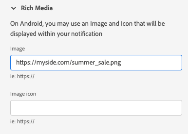

### Boutons

Le volet **[!UICONTROL Buttons]** vous permet d’ajouter des boutons supplémentaires à la notification push. Chaque bouton peut ouvrir l’application, créer un lien profond dans l’application ou ouvrir une page web.

Le développeur ou la développeuse d’applications doit ajouter du code à l’application pour activer cette fonctionnalité.

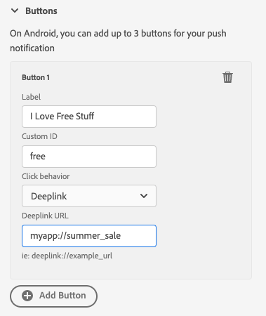

### Données personnalisées

Le volet **[!UICONTROL Custom Data]** vous permet d’ajouter des données personnalisées à la notification push. Chaque paire clé/valeur est envoyée en tant que métadonnées avec le message et peut être utilisée par les développeurs pour créer des expériences puissantes et ajouter un suivi supplémentaire.

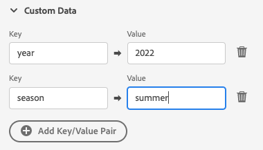

## Résultats du test

Une fois que vous avez envoyé un message, la section **[!UICONTROL Test Results]** reçoit les données des services push pour le message. Vous pouvez voir ici si le message a été envoyé aux services de messagerie Google/iOS :

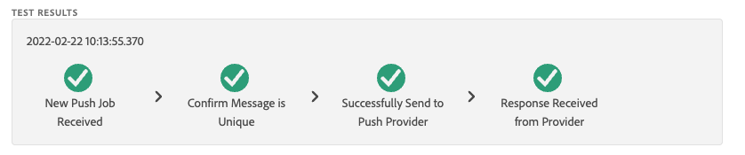

Si des problèmes se sont produits, ils sont affichés ici :

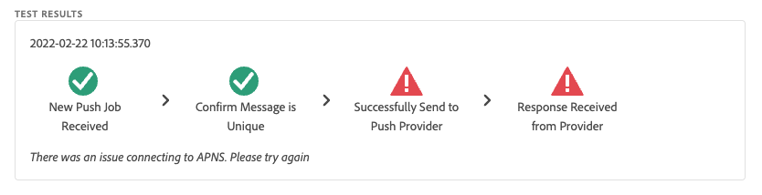

## Advanced

### Afficher la payload du message

À côté du bouton **[!UICONTROL Send Test Push Notification]** se trouve un ensemble de points de suspension avec un menu contextuel. À partir de là, vous pouvez afficher la payload du message. Vous pouvez ainsi voir le message exact qui sera envoyé au service de messagerie distant. Vous pouvez vérifier cette payload ou même la copier et la coller dans un outil de test push de bureau.

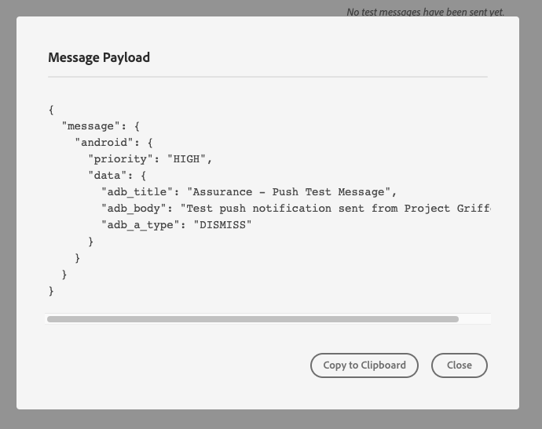
