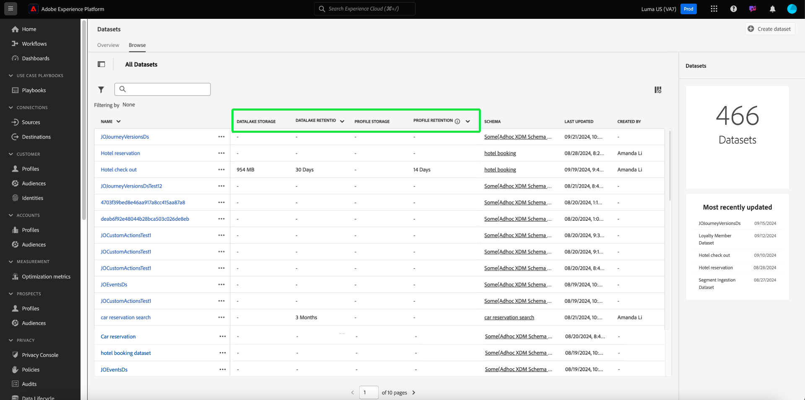

# Guide de l’interface utilisateur des jeux de données

Ce guide d’utilisation fournit des instructions permettant d’exécuter des actions courantes lors de l’utilisation de jeux de données dans l’interface utilisateur d’Adobe Experience Platform.

## Prise en main

Ce guide d’utilisation nécessite une compréhension professionnelle des composants suivants d’Adobe Experience Platform :

* [Jeux de données](overview.md) : structure de stockage et de gestion pour la persistance des données dans [!DNL Experience Platform].
* [[!DNL Experience Data Model (XDM) System]](../../xdm/home.md) : cadre normalisé selon lequel [!DNL Experience Platform] organise les données de l’expérience client.
   * [Principes de base de la composition des schémas](../../xdm/schema/composition.md) : découvrez les blocs de création de base des schémas XDM, y compris les principes clés et les bonnes pratiques en matière de composition de schémas.
   * [Éditeur de schéma](../../xdm/tutorials/create-schema-ui.md) : découvrez comment créer vos propres schémas XDM personnalisés à l’aide de l’[!DNL Schema Editor] dans l’interface utilisateur [!DNL Experience Platform].
* [[!DNL Real-Time Customer Profile]](../../profile/home.md) : fournit un profil de consommateur unifié en temps réel, basé sur des données agrégées provenant de plusieurs sources.
* [[!DNL Adobe Experience Platform Data Governance]](../../data-governance/home.md) : assurez-vous de la conformité aux réglementations, aux restrictions et aux politiques concernant l’utilisation des données client.

## Affichage des jeux de données {#view-datasets}

>[!CONTEXTUALHELP]
>id="platform_datasets_negative_numbers"
>title="Nombres négatifs dans l&#39;activité du jeu de données"
>abstract="Les nombres négatifs dans les enregistrements ingérés signifient qu&#39;un utilisateur a supprimé certains lots au cours d&#39;une période sélectionnée."
>text="Learn more in documentation"

>[!CONTEXTUALHELP]
>id="platform_datasets_browse_daysRemaining"
>title="Expiration du jeu de données"
>abstract="Cette colonne indique le nombre de jours restants au jeu de données cible avant son expiration automatique."

>[!CONTEXTUALHELP]
>id="platform_datasets_browse_datalakeretention"
>title="Conservation des lacs de données"
>abstract="Affiche la politique de conservation actuelle pour chaque jeu de données. Cette valeur peut être modifiée dans les paramètres de conservation de chaque jeu de données. Vous ne pouvez définir le délai de conservation que pour le jeu de données ExperienceEvent."

>[!CONTEXTUALHELP]
>id="platform_datasets_browse_profileretention"
>title="Conservation des profils"
>abstract="Affiche la politique de conservation actuelle pour chaque jeu de données. Cette valeur peut être modifiée dans les paramètres de conservation de chaque jeu de données. Vous ne pouvez définir le délai de conservation que pour le jeu de données ExperienceEvent."

>[!CONTEXTUALHELP]
>id="platform_datasets_datalakesettings_datasetretention"
>title="Conservation des jeux de données"
>abstract="La conservation des lacs de données définit des règles définissant la durée pendant laquelle les données sont stockées, ainsi que le moment où elles doivent être supprimées dans différents services. Cela garantit ainsi la conformité aux réglementations, la gestion des coûts de stockage et la maintenance de la qualité des données."

>[!CONTEXTUALHELP]
>id="platform_datasets_orchestratedCampaigns_toggle"
>title="Campagnes orchestrées"
>abstract="Activez ce bouton pour permettre l’utilisation du jeu de données sélectionné dans les campagnes orchestrées par Adobe Journey Optimizer. Le jeu de données doit utiliser un schéma relationnel et un seul jeu de données peut être créé par schéma."

Dans l’interface utilisateur de [!DNL Experience Platform], sélectionnez **[!UICONTROL Jeux de données]** dans le volet de navigation de gauche pour ouvrir le tableau de bord **[!UICONTROL Jeux de données]**. Le tableau de bord répertorie tous les jeux de données disponibles pour votre organisation. Des détails s’affichent pour chaque jeu de données répertorié, notamment son nom, le schéma auquel le jeu de données adhère et le statut de l’exécution d’ingestion la plus récente.

Sélectionnez le nom d’un jeu de données dans l’onglet [!UICONTROL Parcourir] pour accéder à l’écran **[!UICONTROL Activité du jeu de données]** et consulter les détails du jeu de données que vous avez sélectionné. L’onglet activité contient un graphique qui permet de visualiser le taux de messages consommé ainsi qu’une liste des lots réussis et en échec.

## Actions supplémentaires {#more-actions}

Vous pouvez [!UICONTROL Supprimer] ou [!UICONTROL Activer un jeu de données pour Profil] à partir de la vue des détails [!UICONTROL Jeu de données]. Pour afficher les actions disponibles, sélectionnez **[!UICONTROL ... Plus]** en haut à droite de l’interface utilisateur. Le menu déroulant s’affiche.

![Espace de travail Jeux de données avec le [!UICONTROL ... Plus ] menu déroulant mis en surbrillance.](../images/datasets/user-guide/more-actions.png)

Si vous sélectionnez **[!UICONTROL Activer un jeu de données pour le profil]**, une boîte de dialogue de confirmation s’affiche. Sélectionnez **[!UICONTROL Activer]** pour confirmer votre choix.

>[!NOTE]
>
>Pour activer un jeu de données pour Profil, le schéma auquel le jeu de données adhère doit être compatible pour être utilisé dans le profil client en temps réel. Consultez la section [Activer un jeu de données pour le profil](#enable-profile) pour plus d’informations.

Si vous sélectionnez **[!UICONTROL Supprimer]**, la boîte de dialogue de confirmation [!UICONTROL Supprimer le jeu de données] s’affiche. Sélectionnez **[!UICONTROL Supprimer]** pour confirmer votre choix.

>[!NOTE]
>
>Vous ne pouvez pas supprimer des jeux de données système.

Vous pouvez également supprimer un jeu de données ou en ajouter un pour l’utiliser avec le profil client en temps réel à partir des actions intégrées disponibles dans l’onglet [!UICONTROL Parcourir]. Pour plus d’informations, consultez la section [actions intégrées](#inline-actions).

## Actions de jeu de données intégré {#inline-actions}

L’interface utilisateur des jeux de données propose désormais des collections d’actions intégrées pour chaque jeu de données disponible. Sélectionnez les points de suspension (...) d’un jeu de données que vous souhaitez gérer pour afficher les options disponibles dans un menu pop-up. Les actions disponibles sont les suivantes :

* [[!UICONTROL Aperçu du jeu de données]](#preview)
* [[!UICONTROL Gérer les données et les libellés d’accès]](#manage-and-enforce-data-governance)
* [[!UICONTROL Activer le profil unifié]](#enable-profile)
* [[!UICONTROL Gérer les balises]](#manage-tags)
* [[!UICONTROL Définir une politique de conservation des données]](#data-retention-policy)
* [[!UICONTROL Déplacer vers des dossiers]](#move-to-folders)
* [[!UICONTROL Supprimer]](#delete).

Vous trouverez plus d’informations sur ces actions disponibles dans leurs sections respectives. Pour savoir comment gérer simultanément un grand nombre de jeux de données, consultez la section [actions en bloc](#bulk-actions).

### Prévisualisation d’un jeu de données {#preview}

Vous pouvez prévisualiser les données d’exemple du jeu de données à partir des options intégrées de l’onglet [!UICONTROL Parcourir] et de la vue [!UICONTROL Activité du jeu de données]. Dans l’onglet [!UICONTROL Parcourir], sélectionnez les points de suspension (...) à côté du nom du jeu de données que vous souhaitez prévisualiser. Une liste d’options de menu s’affiche. Sélectionnez ensuite **[!UICONTROL Prévisualiser le jeu de données]** dans la liste des options disponibles. Si le jeu de données est vide, le lien de prévisualisation est désactivé et indique à la place que la prévisualisation n’est pas disponible.

La fenêtre d’aperçu s’ouvre, où la vue hiérarchique du schéma du jeu de données s’affiche à droite.

>[!NOTE]
>
>Le diagramme de schéma sur le côté gauche de la vue affiche uniquement les champs contenant des données. Les champs sans données sont automatiquement masqués afin de rationaliser l’interface utilisateur et de se concentrer sur les informations pertinentes.

Sinon, dans l’écran **[!UICONTROL Activité du jeu de données]**, sélectionnez **[!UICONTROL Prévisualiser le jeu de données]** près du coin supérieur droit de l’écran pour prévisualiser jusqu’à 100 lignes de données.

Pour des méthodes d’accès à vos données plus fiables, [!DNL Experience Platform] fournit des services en aval tels que des [!DNL Query Service] et des [!DNL JupyterLab] pour explorer et analyser les données. Pour plus d’informations, consultez les documents suivants :

* [Présentation de Query Service](../../query-service/home.md)
* [Guide d’utilisation de JupyterLab](../../data-science-workspace/jupyterlab/overview.md)

### Gestion et application de la gouvernance des données sur un jeu de données {#manage-and-enforce-data-governance}

Vous pouvez gérer les étiquettes de gouvernance des données pour un jeu de données en sélectionnant les options intégrées de l’onglet [!UICONTROL Parcourir]. Sélectionnez les points de suspension (...) en regard du nom du jeu de données à gérer, puis **[!UICONTROL Gérer les données et les libellés d’accès]** dans le menu déroulant.

Les libellés d’utilisation des données, appliqués au niveau du schéma, vous permettent de classer les jeux de données et les champs en fonction des politiques d’utilisation qui s’appliquent à ces données. Consultez la [présentation de la gouvernance des données](../../data-governance/home.md) pour en savoir plus sur les libellés, ou reportez-vous au guide d’utilisation des [libellés d’utilisation des données](../../data-governance/labels/overview.md) pour obtenir des instructions sur la manière d’appliquer des libellés aux schémas pour la propagation aux jeux de données.

## Activer un jeu de données pour le profil client en temps réel {#enable-profile}

Chaque jeu de données a la possibilité d’enrichir les profils clients des données qu’ils ingèrent. Pour ce faire, le schéma auquel le jeu de données se conforme doit être compatible pour être utilisé dans [!DNL Real-Time Customer Profile]. Un schéma compatible répond aux critères suivants :

* Le schéma comporte au moins un attribut défini comme propriété d’identité.
* Le schéma comporte au moins une propriété d’identité définie comme identité principale.

Pour plus d’informations sur l’activation d’un schéma pour [!DNL Profile], consultez le guide d’utilisation de l’[éditeur de schémas](../../xdm/tutorials/create-schema-ui.md).

Vous pouvez activer un jeu de données pour Profil à partir des options intégrées de l’onglet [!UICONTROL Parcourir] et de la vue [!UICONTROL Activité du jeu de données]. Dans l’onglet [!UICONTROL Parcourir] de l’espace de travail [!UICONTROL Jeux de données], sélectionnez les points de suspension d’un jeu de données que vous souhaitez activer pour Profil. Une liste d’options de menu s’affiche. Sélectionnez ensuite **[!UICONTROL Activer le profil unifié]** dans la liste des options disponibles.

Vous pouvez également sélectionner le bouton (bascule) **[!UICONTROL Profil]** dans la colonne **[!UICONTROL Propriétés]** de l’écran **[!UICONTROL Activité du jeu de données]**. Une fois activées, les données ingérées dans le jeu de données seront également utilisées pour générer les profils clients.

>[!NOTE]
>
>Si un jeu de données contient déjà des données et est ensuite activé pour [!DNL Profile], les données existantes ne sont pas automatiquement utilisées par [!DNL Profile]. Une fois qu’un jeu de données est activé pour [!DNL Profile], il est recommandé de réingérer toutes les données existantes pour les faire contribuer aux profils clients.

Les jeux de données qui ont été activés pour Profil peuvent également être filtrés selon ce critère. Pour plus d’informations, consultez la section sur la manière de [filtrer les jeux de données activés pour Profil](#filter-profile-enabled-datasets).

### Gérer les balises du jeu de données {#manage-tags}

Ajoutez des balises personnalisées pour organiser les jeux de données et améliorer les fonctionnalités de recherche, de filtrage et de tri. Dans l’onglet [!UICONTROL  Parcourir ] de l’espace de travail [!UICONTROL Jeux de données], sélectionnez les points de suspension d’un jeu de données à gérer, puis **[!UICONTROL Gérer les balises]** dans le menu déroulant.

La boîte de dialogue [!UICONTROL Gérer les balises] s’affiche. Saisissez une brève description pour créer une balise personnalisée ou choisissez à partir d’une balise préexistante pour étiqueter votre jeu de données. Cliquez sur **[!UICONTROL Enregistrer]** pour confirmer les paramètres.

La boîte de dialogue [!UICONTROL Gérer les balises] peut également supprimer des balises existantes d’un jeu de données. Il vous suffit de sélectionner le « x » en regard de la balise à supprimer, puis de sélectionner **[!UICONTROL Enregistrer]**.

Une fois qu’une balise a été ajoutée à un jeu de données, les jeux de données peuvent être filtrés en fonction de la balise correspondante. Pour plus d’informations, consultez la section sur la manière de [filtrer des jeux de données par balises](#enable-profile).

Pour plus d’informations sur la classification d’objets métier pour faciliter la découverte et la catégorisation, consultez le guide sur la [gestion des taxonomies des métadonnées](../../administrative-tags/ui/managing-tags.md). Ce guide explique comment les utilisateurs disposant des autorisations appropriées peuvent créer des balises prédéfinies, les affecter à des catégories et gérer toutes les opérations CRUD associées dans l’interface utilisateur d’Experience Platform.

### Définir la politique de conservation des données {#data-retention-policy}

Gérez les paramètres d’expiration et de rétention des jeux de données à l’aide du menu d’actions intégrées de l’onglet [!UICONTROL  Parcourir ] de l’espace de travail [!UICONTROL Jeux de données]. Vous pouvez utiliser cette fonctionnalité pour configurer la durée de conservation des données dans le lac de données et le magasin de profils. La date d’expiration dépend du moment où les données ont été ingérées dans Experience Platform et de la période de conservation que vous avez configurée.

>[!IMPORTANT]
>
>Pour appliquer ou mettre à jour des règles de conservation pour un jeu de données ExperienceEvent, votre rôle d’utilisateur doit inclure l’autorisation **Gérer les jeux de données**. Ce contrôle d’accès basé sur les rôles garantit que seuls les utilisateurs autorisés peuvent modifier les paramètres de conservation des jeux de données.
>
>Pour plus d’informations sur l’attribution d’autorisations dans Adobe Experience Platform](../../access-control/home.md#platform-permissions) reportez-vous à la [ Présentation du contrôle d’accès .

>[!TIP]
>
>Le lac de données stocke des données brutes non traitées, telles que des journaux d’événements, des données de parcours de navigation et des enregistrements ingérés en bloc, à des fins d’analyse et de traitement. La banque de profils contient des données d’identification du client, y compris des événements d’identité regroupés et des informations d’attribut, pour prendre en charge la personnalisation et l’activation en temps réel.

Pour configurer votre période de conservation, sélectionnez les points de suspension en regard du jeu de données puis **[!UICONTROL Définir la politique de conservation des données]** dans le menu déroulant.

La boîte de dialogue [!UICONTROL Définir la rétention du jeu de données] s’affiche. La boîte de dialogue affiche des mesures d’utilisation de licence au niveau du sandbox, des détails au niveau du jeu de données et les paramètres actuels de conservation des données. Ces mesures montrent votre utilisation par rapport à vos droits et vous aident à évaluer les configurations de stockage et de conservation spécifiques aux jeux de données. Les mesures incluent le nom du jeu de données, le type, le statut d’activation du profil, ainsi que l’utilisation du lac de données et de la banque de profils.

>[!NOTE]
>
>Les mesures de stockage dans le lac de données sous licence au niveau du sandbox sont toujours en développement et peuvent ne pas apparaître. Vous trouverez une répartition complète des mesures d’utilisation de licence dans le tableau de bord Utilisation de la licence . Consultez la documentation pour obtenir une description de ces mesures.
<!-- replace this screenshot with a dataset that enabled unified profile so user can see the Profile TTL settings -->

Configurez la période de conservation souhaitée dans la boîte de dialogue des paramètres de conservation des données. Saisissez un nombre et sélectionnez une unité de temps (jours, mois ou années) dans le menu déroulant. Vous pouvez configurer des paramètres de conservation distincts pour le lac de données et le service de profil.

>[!NOTE]
> 
>La période de conservation minimale pour le lac de données est de 30 jours. La période de conservation minimale pour le service de profil est d’un jour.

Pour prendre en charge la transparence et la surveillance, des horodatages sont fournis pour les exécutions de tâche de conservation de données **dernière** et **suivante**. Les horodatages vous aident à comprendre quand le dernier nettoyage de données a eu lieu et quand le suivant est planifié.

#### Informations sur l’impact du stockage {#storage-impact-insights}

Pour afficher une prévision visuelle de l’impact sur le stockage des différentes politiques de conservation, sélectionnez **[!UICONTROL Afficher la distribution des données d’événement d’expérience]**.

Le graphique affiche la répartition des événements d’expérience sur différentes périodes de conservation pour le jeu de données actuellement sélectionné. Passez la souris sur chaque barre pour afficher le nombre exact d’enregistrements qui seront supprimés si la période de conservation sélectionnée est appliquée.

Vous pouvez utiliser les prévisions visuelles pour évaluer l’impact des différentes périodes de conservation et prendre des décisions commerciales éclairées. Par exemple, si vous sélectionnez une période de conservation de 30 jours et que le graphique indique que 60 % de vos données seront supprimées, vous pouvez choisir d’étendre la conservation afin de conserver davantage de données à analyser.

>[!NOTE]
>
>Le graphique de répartition des événements d’expérience est spécifique au jeu de données sélectionné et reflète uniquement ses données. Elle s’applique exclusivement aux données stockées dans le lac de données.

Lorsque votre configuration vous convient, sélectionnez **[!UICONTROL Enregistrer]** pour confirmer les paramètres.

>[!IMPORTANT]
>
>Une fois les règles de conservation des données appliquées, toutes les données antérieures au nombre de jours défini par la valeur d’expiration sont supprimées définitivement et ne peuvent pas être récupérées.

Après avoir configuré vos paramètres de conservation, utilisez l’interface utilisateur de surveillance pour confirmer que vos modifications ont été exécutées par le système. L’interface utilisateur de surveillance fournit une vue centralisée de l’activité de conservation des données dans tous les jeux de données. À partir de là, vous pouvez effectuer le suivi de l’exécution des tâches, vérifier le volume de données supprimées et vous assurer que vos politiques de conservation fonctionnent comme prévu.

Pour découvrir comment les politiques de rétention s’appliquent à différents services, consultez les guides dédiés sur [la rétention du jeu de données d’événement d’expérience dans le profil](../../profile/event-expirations.md) et [la rétention du jeu de données d’événement d’expérience dans le lac de données](./experience-event-dataset-retention-ttl-guide.md). Cette visibilité soutient la gouvernance, la conformité et une gestion efficace du cycle de vie des données.

Pour savoir comment utiliser le tableau de bord de surveillance pour effectuer le suivi des flux de données sources dans l’interface utilisateur d’Experience Platform, consultez la documentation [Surveiller les flux de données pour les sources dans l’interface utilisateur](../../dataflows/ui/monitor-sources.md).

<!-- Improve the link above. I cannot link to a 100% appropriate document yet. -->

Pour plus d’informations sur les règles qui définissent les périodes d’expiration des jeux de données et les bonnes pratiques pour configurer votre politique de conservation des données, consultez la [page forum aux questions](../catalog-faq.md).

#### Visibilité améliorée des périodes de conservation et des mesures de stockage {#retention-and-storage-metrics}

Quatre nouvelles colonnes offrent une meilleure visibilité sur la gestion de vos données : **[!UICONTROL Data Lake Storage]**, **[!UICONTROL Data Lake Retention]**, **[!UICONTROL Profile Storage]** et **[!UICONTROL Profile Retention]**. Ces mesures indiquent la quantité de stockage consommée par vos données et leur période de conservation dans le lac de données et le service de profil.

Cette visibilité accrue vous permet de prendre des décisions éclairées et de gérer plus efficacement les coûts de stockage. Triez les jeux de données par taille de stockage pour identifier les plus volumineux de votre sandbox actuel. Ces informations prennent en charge les bonnes pratiques de gestion des données et vous aident à garantir la conformité avec vos droits sous licence.

Le tableau suivant présente un aperçu des nouvelles mesures de conservation et de stockage. Il décrit l’objectif de chaque colonne et la manière dont elle prend en charge la gestion de la conservation et du stockage des données.

| Titre de colonne | Description |
|---|---|
| [!UICONTROL Conservation du lac de données] | La période de conservation actuelle pour chaque jeu de données dans le lac de données. Cette valeur est configurable et détermine la durée de conservation des données avant suppression. |
| [!UICONTROL Data Lake Storage] | Utilisation actuelle du stockage pour chaque jeu de données dans le lac de données. Utilisez cette mesure pour gérer les limites de stockage et optimiser l’utilisation. |
| [!UICONTROL Stockage de profil] | L’utilisation actuelle du stockage pour chaque jeu de données dans le service de profil. Permet de surveiller la consommation de stockage et de prendre des décisions de gestion des données. |
| [!UICONTROL Conservation des profils] | La période de conservation actuelle des jeux de données de profil. Vous pouvez mettre à jour cette valeur pour contrôler la durée de conservation des données du profil. |

{style="table-layout:auto"}

Pour agir sur les informations des mesures de stockage et de rétention, reportez-vous au [guide des bonnes pratiques relatives aux droits de licence de gestion des données](../../landing/license-usage-and-guardrails/data-management-best-practices.md). Utilisez-le pour gérer les données que vous ingérez et conservez, appliquer des filtres et des règles d’expiration, et contrôler la croissance des données afin de respecter vos limites d’utilisation sous licence.

### Déplacer vers des dossiers {#move-to-folders}

Vous pouvez placer des jeux de données dans des dossiers pour une meilleure gestion des jeux de données. Pour déplacer un jeu de données dans un dossier, sélectionnez les points de suspension (...) en regard du nom du jeu de données que vous souhaitez gérer, puis **[!UICONTROL Déplacer dans un dossier]** dans le menu déroulant.

![Tableau de bord [!UICONTROL Jeux de données] avec les points de suspension et [!UICONTROL Déplacer vers le dossier] en surbrillance.](../images/datasets/user-guide/move-to-folder.png)

La boîte de dialogue [!UICONTROL Déplacer] du jeu de données vers le dossier s’affiche. Sélectionnez le dossier dans lequel vous souhaitez déplacer l’audience, puis sélectionnez **[!UICONTROL Déplacer]**. Une notification contextuelle vous informe que le déplacement du jeu de données a réussi.

![La boîte de dialogue [!UICONTROL Déplacer] du jeu de données avec [!UICONTROL Déplacer] en surbrillance.](../images/datasets/user-guide/move-dialog.png)

>[!TIP]
>
>Vous pouvez également créer des dossiers directement à partir de la boîte de dialogue Déplacer le jeu de données . Pour créer un dossier, sélectionnez l’icône Créer un dossier () en haut à droite de la boîte de dialogue.
>
>![ La boîte de dialogue [!UICONTROL Déplacer] du jeu de données avec l’icône de création de dossier mise en surbrillance.](/help/catalog/images/datasets/user-guide/create-folder.png)

Une fois que le jeu de données se trouve dans un dossier, vous pouvez choisir d’afficher uniquement les jeux de données appartenant à un dossier spécifique. Pour ouvrir la structure de dossiers, sélectionnez l’icône Afficher les dossiers (). Sélectionnez ensuite le dossier de votre choix pour afficher tous les jeux de données associés.

![Tableaux de bord [!UICONTROL Jeux de données] avec la structure de dossiers des jeux de données affichée, l’icône Afficher les dossiers et un dossier sélectionné en surbrillance.](../images/datasets/user-guide/folder-structure.png)

### Suppression d’un jeu de données {#delete}

Vous pouvez supprimer un jeu de données à partir des actions intégrées du jeu de données dans l’onglet [!UICONTROL Parcourir] ou en haut à droite de la vue [!UICONTROL Activité du jeu de données]. Dans la vue [!UICONTROL Parcourir], sélectionnez les points de suspension (...) à côté du nom du jeu de données que vous souhaitez supprimer. Une liste d’options de menu s’affiche. Sélectionnez ensuite **[!UICONTROL Supprimer]** dans le menu déroulant.

Une boîte de dialogue de confirmation s’affiche. Sélectionnez **[!UICONTROL Supprimer]** pour confirmer.

Vous pouvez également sélectionner **[!UICONTROL Supprimer le jeu de données]** dans l’écran **[!UICONTROL Activité du jeu de données]**.

>[!NOTE]
>
>Les jeux de données créés et utilisés par les applications et services Adobe (tels qu’Adobe Analytics, Adobe Audience Manager ou [!DNL Offer Decisioning]) ne peuvent pas être supprimés.

Une boîte de confirmation s’affiche alors. Sélectionnez **[!UICONTROL Supprimer]** pour confirmer la suppression du jeu de données.

### Suppression d’un jeu de données activé par Profile

Si un jeu de données est activé pour Profil, la suppression de ce jeu de données via l’interface utilisateur le supprimera du lac de données, du service d’identités et de toutes les données de profil associées à ce jeu de données dans la banque de profils.

Vous pouvez supprimer les données de profil associées à un jeu de données du magasin de [!DNL Profile] (en les laissant dans le lac de données) à l’aide de l’API Real-Time Customer Profile. Pour plus d’informations, consultez le [guide relatif au point d’entrée de l’API du système de profils](../../profile/api/profile-system-jobs.md).

## Rechercher et filtrer des jeux de données {#search-and-filter}

Pour rechercher ou filtrer la liste des jeux de données disponibles, sélectionnez l’icône de filtre () en haut à gauche de l’espace de travail. Un ensemble d’options de filtre s’affiche dans le rail de gauche. Il existe plusieurs méthodes pour filtrer les jeux de données disponibles. Il s’agit des éléments suivants : [[!UICONTROL Afficher les jeux de données système]](#show-system-datasets), [[!UICONTROL Inclus dans le profil]](#filter-profile-enabled-datasets), [[!UICONTROL Balises]](#filter-by-tag), [[!UICONTROL Date de création]](#filter-by-creation-date), [[!UICONTROL Date de modification], [!UICONTROL Created by]](#filter-by-creation-date) et [[!UICONTROL Schema]](#filter-by-schema).

La liste des filtres appliqués s’affiche au-dessus des résultats filtrés.

### Afficher les jeux de données système {#show-system-datasets}

Par défaut, seuls les jeux de données dans lesquels vous avez ingéré des données s’affichent. Si vous souhaitez afficher les jeux de données générés par le système, cochez la case **[!UICONTROL Oui]** dans la section [!UICONTROL Afficher les jeux de données système]. Les jeux de données générés par le système ne sont utilisés que pour traiter d’autres composants. Par exemple, le jeu de données d’exportation de profils généré par le système est utilisé pour traiter le tableau de bord des profils.

![Les options de filtre de l’espace de travail Jeux de données avec la section [!UICONTROL Afficher les jeux de données système] mise en surbrillance.](../images/datasets/user-guide/show-system-datasets.png)

### Filtrer les jeux de données activés pour le profil {#filter-profile-enabled-datasets}

Les jeux de données activés pour les données de profil sont utilisés pour renseigner les profils clients une fois les données ingérées. Pour en savoir plus, consultez la section [Activation de jeux de données pour le profil](#enable-profile).

Pour filtrer votre jeu de données en fonction de son activation ou non pour les profils, cochez la case [!UICONTROL Oui] dans les options de filtrage.

![Les options de filtre de l’espace de travail Jeux de données avec la section [!UICONTROL Inclus dans le profil] mise en surbrillance.](../images/datasets/user-guide/included-in-profile.png)

### Filtrer les jeux de données par balise {#filter-by-tag}

Saisissez votre nom de balise personnalisée dans l’entrée [!UICONTROL Balises], puis sélectionnez votre balise dans la liste des options disponibles pour rechercher et filtrer les jeux de données correspondant à cette balise.

![Les options de filtre de l’espace de travail Jeux de données avec l’icône d’entrée et de filtre [!UICONTROL Balises] mise en surbrillance.](../images/datasets/user-guide/filter-tags.png)

### Filtrer les jeux de données par date de création {#filter-by-creation-date}

Les jeux de données peuvent être filtrés par date de création sur une période personnalisée. Vous pouvez l’utiliser pour exclure des données historiques ou pour générer des informations et des rapports sur des données chronologiques spécifiques. Choisissez une [!UICONTROL Date de début] et une [!UICONTROL Date de fin] en sélectionnant l’icône de calendrier pour chaque champ. Ensuite, seuls les jeux de données conformes à ces critères s’affichent dans l’onglet Parcourir .

### Filtrer les jeux de données par date de modification {#filter-by-modified-date}

De la même manière que pour le filtre de date de création, vous pouvez filtrer vos jeux de données en fonction de la date de leur dernière modification. Dans la section [!UICONTROL Date de modification], choisissez une [!UICONTROL Date de début] et une [!UICONTROL Date de fin] en sélectionnant l’icône de calendrier pour chaque champ. Ensuite, seuls les jeux de données qui ont été modifiés au cours de cette période s’affichent dans l’onglet Parcourir .

### Filtrer par schéma {#filter-by-schema}

Vous pouvez filtrer les jeux de données en fonction du schéma qui définit leur structure. Sélectionnez l’icône de liste déroulante ou saisissez le nom du schéma dans le champ de texte. Une liste de correspondances potentielles s’affiche. Sélectionnez le schéma approprié dans la liste.

## Actions en masse {#bulk-actions}

Utilisez des actions en masse pour améliorer votre efficacité opérationnelle et effectuer plusieurs actions simultanément sur de nombreux jeux de données. Vous pouvez gagner du temps et gérer une structure de données organisée avec des actions en masse telles que [Déplacer vers un dossier](#move-to-folders), [Modifier les balises](#manage-tags) et [Supprimer](#delete) les jeux de données.

Pour agir sur plusieurs jeux de données à la fois, sélectionnez des jeux de données individuels avec la case à cocher sur chaque ligne ou sélectionnez une page entière avec la case à cocher d’en-tête de colonne. Une fois sélectionnée, la barre d’actions en masse s’affiche.

Lorsque vous appliquez des actions en masse aux jeux de données, les conditions suivantes s’appliquent :

* Vous pouvez sélectionner des jeux de données dans différentes pages de l’interface utilisateur.
* Si vous sélectionnez un filtre, les jeux de données sélectionnés seront réinitialisés.

## Trier les jeux de données par date de création {#sort}

Les jeux de données de l’onglet [!UICONTROL Parcourir] peuvent être triés par dates croissantes ou décroissantes. Sélectionnez les en-têtes de colonne [!UICONTROL Créé] ou [!UICONTROL Dernière mise à jour] pour alterner entre croissant et décroissant. Une fois sélectionné, la colonne l’indique avec une flèche vers le haut ou vers le bas sur le côté de l’en-tête de colonne.

## Créer un jeu de données {#create}

Pour créer un jeu de données, commencez par sélectionner **[!UICONTROL Créer un jeu de données]** dans le tableau de bord **[!UICONTROL Jeux de données]**.

Sur l’écran suivant, les deux options de création d’un nouveau jeu de données suivantes vous sont proposées :

* [Créer un jeu de données à partir d’un schéma](#schema)
* [Créer un jeu de données à partir d’un fichier CSV](#csv)

### Création d’un jeu de données à partir d’un schéma existant {#schema}

Dans l’écran **[!UICONTROL Créer un jeu de données]**, sélectionnez **[!UICONTROL Créer un jeu de données à partir d’un schéma]** pour créer un jeu de données vide.

L’étape **[!UICONTROL Sélectionner un schéma]** apparaît. Parcourez la liste des schémas et sélectionnez le schéma auquel le jeu de données se conformera avant de sélectionner **[!UICONTROL Suivant]**.

L’étape **[!UICONTROL Configurer le jeu de données]** apparaît. Attribuez un nom et une description facultative au jeu de données, puis sélectionnez **[!UICONTROL Terminer]** pour créer le jeu de données.

Les jeux de données peuvent être filtrés à partir de la liste des jeux de données disponibles dans l’interface utilisateur à l’aide du filtre de schéma. Pour plus d’informations, consultez la section sur la manière de [filtrer des jeux de données par schéma](#filter-by-schema).

### Création d’un jeu de données à partir d’un fichier CSV {#csv}

Lorsque vous créez un jeu de données à l’aide d’un fichier CSV, un schéma ad hoc est créé pour fournir une structure au jeu de données qui correspond au fichier CSV fourni. Dans l’écran **[!UICONTROL Créer un jeu de données]**, sélectionnez **[!UICONTROL Créer un jeu de données à partir d’un fichier CSV]**.

L’étape **[!UICONTROL Configurer]** apparaît. Attribuez un nom et une description facultative au jeu de données, puis sélectionnez **[!UICONTROL Suivant]**.

L’étape **[!UICONTROL Ajouter les données]** apparaît. Chargez le fichier CSV en le faisant glisser et en le déposant au centre de l’écran, ou sélectionnez **[!UICONTROL Parcourir]** pour explorer votre répertoire de fichiers. La taille du fichier peut aller jusqu’à 10 gigaoctets. Une fois le fichier CSV chargé, sélectionnez **[!UICONTROL Enregistrer]** pour créer le jeu de données.

>[!NOTE]
>
>Les noms des colonnes CSV doivent commencer par des caractères alphanumériques et ne peuvent contenir que des lettres, des chiffres et des traits de soulignement.

## Surveiller l’ingestion des données

Dans l’interface utilisateur de [!DNL Experience Platform], sélectionnez **[!UICONTROL Surveillance]** dans le volet de navigation de gauche. Le tableau de bord **[!UICONTROL Surveillance]** vous permet de consulter les états des données entrantes soit depuis le lot soit depuis l’ingestion par flux. Pour afficher les états de lots individuels, sélectionnez **[!UICONTROL Lot de bout en bout]** ou **[!UICONTROL Diffusion en continu de bout en bout]**. Les tableaux de bord répertorient toutes les exécutions d’ingestion par lots ou en flux continu, y compris celles qui ont réussi, échoué ou sont toujours en cours. Chaque liste fournit des détails sur le lot, notamment l’identifiant de lot, le nom du jeu de données cibles et le nombre d’enregistrements ingérés. Si le jeu de données cible est activé pour [!DNL Profile], le nombre d’enregistrements d’identité et de profil ingérés s’affiche également.

Vous pouvez sélectionner sur une personne individuelle **[!UICONTROL Identifiant de lot]** pour accéder au tableau de bord **[!UICONTROL Présentation des lots]** et afficher les détails du lot, y compris les journaux d’erreurs en cas d’échec de l’ingestion du lot.

Si vous souhaitez supprimer le lot, sélectionnez **[!UICONTROL Supprimer le lot]** en haut à droite du tableau de bord. La suppression d’un lot supprime également ses enregistrements du jeu de données dans lequel le lot a été ingéré à l’origine.

>[!NOTE]
>
>Si les données ingérées ont été activées pour le profil et traitées, la suppression d’un lot ne supprime pas ces données de la banque de profils.

## Étapes suivantes

Ce guide d’utilisation fournit des instructions pour effectuer des actions courantes lors de l’utilisation de jeux de données dans l’interface utilisateur [!DNL Experience Platform]. Pour savoir comment exécuter des workflows [!DNL Experience Platform] courants impliquant des jeux de données, reportez-vous aux tutoriels suivants :

* [Création d’un jeu de données à l’aide d’API](create.md)
* [Interroger les données du jeu de données à l’aide de l’API Data Access](../../data-access/home.md)
* [Configurer un jeu de données pour le profil client en temps réel et le service d’identités à l’aide d’API](../../profile/tutorials/dataset-configuration.md)

