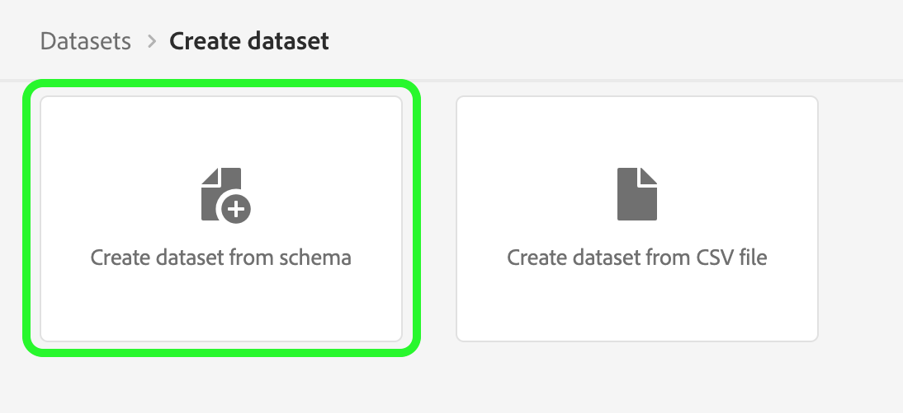

# Guide de l’interface utilisateur des jeux de données

Ce guide d’utilisation fournit des instructions permettant d’exécuter des actions courantes lors de l’utilisation de jeux de données dans l’interface utilisateur d’Adobe Experience Platform.

## Prise en main

Ce guide d’utilisation nécessite une compréhension professionnelle des composants suivants d’Adobe Experience Platform :

* [Jeu de données](overview.md) : la structure de stockage et de gestion pour la persistance des données dans [!DNL Experience Platform].
* [[!DNL Experience Data Model (XDM) System]](../../xdm/home.md) : cadre normalisé selon lequel [!DNL Experience Platform] organise les données de l’expérience client.
   * [Principes de base de la composition des schémas](../../xdm/schema/composition.md) : découvrez les blocs de création de base des schémas XDM, y compris les principes clés et les bonnes pratiques en matière de composition de schémas.
   * [Éditeur de schéma](../../xdm/tutorials/create-schema-ui.md): Découvrez comment créer vos propres schémas XDM personnalisés à l’aide du [!DNL Schema Editor] dans le [!DNL Platform] de l’interface utilisateur.
* [[!DNL Real-time Customer Profile]](../../profile/home.md) : fournit un profil de consommateur unifié en temps réel, basé sur des données agrégées provenant de plusieurs sources.
* [[!DNL Adobe Experience Platform Data Governance]](../../data-governance/home.md): Veillez à la conformité aux réglementations, aux restrictions et aux politiques concernant l’utilisation des données clients.

## Affichage des jeux de données {#view-datasets}

>[!CONTEXTUALHELP]
>id="platform_datasets_negative_numbers"
>title="Numéros négatifs dans l’activité du jeu de données"
>abstract="Les nombres négatifs dans les enregistrements ingérés signifie qu’un utilisateur a supprimé certains lots au cours d’une période sélectionnée."
>text="Learn more in documentation"

Dans le [!DNL Experience Platform] Interface utilisateur, sélectionnez **[!UICONTROL Jeux de données]** dans le volet de navigation de gauche pour ouvrir la **[!UICONTROL Jeux de données]** tableau de bord. Le tableau de bord répertorie tous les jeux de données disponibles pour votre organisation. Des détails s’affichent pour chaque jeu de données répertorié, notamment son nom, le schéma auquel le jeu de données adhère et l’état de l’exécution d’ingestion la plus récente.

Par défaut, seuls les jeux de données que vous avez ingérés s’affichent. Si vous souhaitez afficher les jeux de données générés par le système, activez la variable **[!UICONTROL Affichage des jeux de données système]** bascule. Les jeux de données générés par le système ne sont utilisés que pour traiter d’autres composants. Par exemple, le jeu de données d’exportation de profil généré par le système est utilisé pour traiter le tableau de bord du profil.

Sélectionnez le nom d’un jeu de données pour accéder à son **[!UICONTROL Activité du jeu de données]** et afficher les détails du jeu de données que vous avez sélectionné. L’onglet activité contient un graphique qui permet de visualiser le taux de messages consommé ainsi qu’une liste des lots réussis et en échec.

## Prévisualisation d’un jeu de données

Dans la **[!UICONTROL Activité du jeu de données]** écran, sélectionnez **[!UICONTROL Prévisualisation d’un jeu de données]** près du coin supérieur droit de votre écran pour prévisualiser jusqu’à 100 lignes de données. Si le jeu de données est vide, le lien de prévisualisation est désactivé et indique à la place que l’aperçu n’est pas disponible.

Dans la fenêtre de prévisualisation, l’affichage hiérarchique du schéma pour le jeu de données s’affiche sur la droite.

Pour des méthodes plus robustes d’accès à vos données, [!DNL Experience Platform] fournit des services en aval tels que [!DNL Query Service] et [!DNL JupyterLab] pour explorer et analyser les données. Pour plus d’informations, consultez les documents suivants :

* [Présentation de Query Service](../../query-service/home.md)
* [Guide d’utilisation de JupyterLab](../../data-science-workspace/jupyterlab/overview.md)

## Création d’un jeu de données {#create}

Pour créer un jeu de données, commencez par sélectionner **[!UICONTROL Créer un jeu de données]** dans le tableau de bord Jeux de données.****

Sur l’écran suivant, les deux options de création d’un nouveau jeu de données suivantes vous sont proposées :

* [Créer un jeu de données à partir d’un schéma](#schema)
* [Créer un jeu de données à partir d’un fichier CSV](#csv)

### Création d’un jeu de données à partir d’un schéma existant {#schema}

Dans le **[!UICONTROL Création d’un jeu de données]** écran, sélectionnez **[!UICONTROL Création d’un jeu de données à partir d’un schéma]** pour créer un nouveau jeu de données vide.

L’étape **[!UICONTROL Sélectionner un schéma]** apparaît. Parcourez la liste des schémas et sélectionnez le schéma auquel le jeu de données doit se conformer avant de sélectionner **[!UICONTROL Suivant]**.

L’étape **[!UICONTROL Configurer le jeu de données]** apparaît. Attribuez un nom et une description facultative au jeu de données, puis sélectionnez **[!UICONTROL Terminer]** pour créer le jeu de données.

### Création d’un jeu de données à partir d’un fichier CSV {#csv}

Lorsque vous créez un jeu de données à l’aide d’un fichier CSV, un schéma ad hoc est créé pour fournir une structure au jeu de données qui correspond au fichier CSV fourni. Dans le **[!UICONTROL Création d’un jeu de données]** écran, sélectionnez **[!UICONTROL Création d’un jeu de données à partir d’un fichier CSV]**.

L’étape **[!UICONTROL Configurer]** apparaît. Attribuez un nom et une description facultative au jeu de données, puis sélectionnez **[!UICONTROL Suivant]**.

L’étape **[!UICONTROL Ajouter les données]** apparaît. Téléchargez le fichier CSV en le faisant glisser et en le déposant au centre de votre écran ou sélectionnez **[!UICONTROL Parcourir]** pour explorer votre répertoire de fichiers. La taille du fichier peut aller jusqu’à 10 gigaoctets. Une fois le fichier CSV chargé, sélectionnez **[!UICONTROL Enregistrer]** pour créer le jeu de données.

>[!NOTE]
>
>Les noms de colonne CSV doivent commencer par des caractères alphanumériques et ne peuvent contenir que des lettres, des chiffres et des traits de soulignement.

## Activation d’un jeu de données pour Real-time Customer Profile {#enable-profile}

Chaque jeu de données a la possibilité d’enrichir les profils clients des données qu’ils ingèrent. Pour ce faire, le schéma auquel le jeu de données adhère doit être compatible avec [!DNL Real-time Customer Profile]. Un schéma compatible répond aux critères suivants :

* Le schéma comporte au moins un attribut défini comme propriété d’identité.
* Le schéma comporte au moins une propriété d’identité définie comme identité principale.

Pour plus d’informations sur l’activation d’un schéma pour [!DNL Profile], reportez-vous à la section [Guide d’utilisation de l’éditeur de schémas](../../xdm/tutorials/create-schema-ui.md).

Pour activer un jeu de données pour Profile, accédez à son **[!UICONTROL Activité du jeu de données]** et sélectionnez la variable **[!UICONTROL Profil]** bascule dans la fonction **[!UICONTROL Propriétés]** colonne . Une fois activées, les données ingérées dans le jeu de données seront également utilisées pour générer les profils clients.

>[!NOTE]
>
>Si un jeu de données contient déjà des données et est activé pour [!DNL Profile], les données existantes ne sont pas automatiquement utilisées par [!DNL Profile]. Une fois qu’un jeu de données est activé pour [!DNL Profile], il est recommandé d’ingérer à nouveau toutes les données existantes pour qu’elles contribuent aux profils client.

## Gestion et application de la gouvernance des données sur un jeu de données

Les libellés d’utilisation des données vous permettent de classer les jeux de données et les champs en fonction des stratégies d’utilisation qui s’appliquent à ces données. Pour en savoir plus sur les libellés, consultez la [Présentation de la gouvernance des données](../../data-governance/home.md) ou reportez-vous au [guide d’utilisation des libellés d’utilisation des données](../../data-governance/labels/overview.md) pour savoir comment appliquer des libellés à vos jeux de données.

## Suppression d’un jeu de données

Vous pouvez supprimer un jeu de données en accédant d’abord à son écran **[!UICONTROL Activité du jeu de données]**. Sélectionnez ensuite **[!UICONTROL Suppression d’un jeu de données]** pour le supprimer.

>[!NOTE]
>
>Jeux de données créés et utilisés par les applications et services Adobe (tels qu’Adobe Analytics, Adobe Audience Manager ou [!DNL Offer Decisioning]) ne peut pas être supprimé.

Une boîte de confirmation s’affiche alors. Sélectionner **[!UICONTROL Supprimer]** pour confirmer la suppression du jeu de données.

## Suppression d’un jeu de données activé par Profile

Si un jeu de données est activé pour Profile, la suppression de ce jeu de données via l’interface utilisateur le supprime du lac de données, d’Identity Service et de la banque de données Profile dans Platform.

Vous pouvez supprimer un jeu de données du [!DNL Profile] ne stocker que (en laissant les données dans le lac de données) à l’aide de l’API Real-time Customer Profile. Pour plus d’informations, consultez le [guide relatif au point d’entrée de l’API du système de profils](../../profile/api/profile-system-jobs.md).

## Surveillance de l’ingestion des données

Dans le [!DNL Experience Platform] Interface utilisateur, sélectionnez **[!UICONTROL Surveillance]** dans le volet de navigation de gauche. Le tableau de bord **[!UICONTROL Surveillance]** vous permet de consulter les états des données entrantes soit depuis le lot soit depuis l’ingestion par flux. Pour afficher les états de lots individuels, sélectionnez l’une des options suivantes : **[!UICONTROL Lot de bout en bout]** ou **[!UICONTROL Diffusion en continu de bout en bout]**. Les tableaux de bord répertorient toutes les exécutions d’ingestion par lots ou par flux, y compris celles qui ont réussi, échoué ou qui sont toujours en cours. Chaque liste fournit des détails sur le lot, notamment l’identifiant de lot, le nom du jeu de données cibles et le nombre d’enregistrements ingérés. Si le jeu de données cible est activé pour [!DNL Profile], le nombre d’identités ingérées et d’enregistrements de profil s’affiche également.

Vous pouvez effectuer une sélection sur un seul **[!UICONTROL Identifiant de lot]** pour accéder au **[!UICONTROL Présentation du lot]** tableau de bord et afficher les détails du lot, y compris les journaux d’erreurs en cas d’échec de l’ingestion du lot.

Si vous souhaitez supprimer le lot, vous pouvez le faire en sélectionnant **[!UICONTROL Supprimer le lot]** situé près du coin supérieur droit du tableau de bord. Cette opération supprimera également les enregistrements du jeu de données pour lequel le lot a été ingéré à l’origine.

## Étapes suivantes

Ce guide d’utilisation a fourni des instructions sur l’exécution d’actions courantes lors de l’utilisation de jeux de données dans la variable [!DNL Experience Platform] de l’interface utilisateur. Pour les étapes à suivre [!DNL Platform] workflows impliquant des jeux de données, reportez-vous aux tutoriels suivants :

* [Création d’un jeu de données à l’aide d’API](create.md)
* [Interrogation des données d’un jeu de données à l’aide de l’API Data Access](../../data-access/home.md)
* [Configuration d’un jeu de données pour Real-time Customer Profile et Identity Service à l’aide des API](../../profile/tutorials/dataset-configuration.md)
